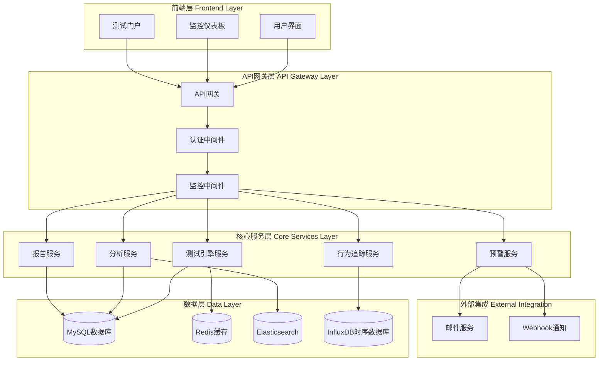
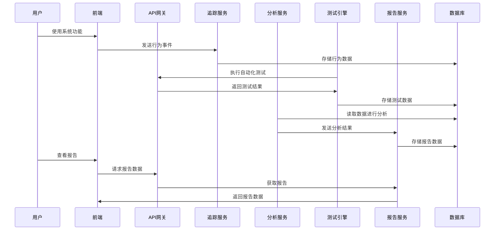

# Design Document

## Architecture Overview

本设计为Law OA Go系统构建一个综合测试和用户体验增强框架，采用微服务架构思想，在现有单体架构基础上嵌入测试、监控、分析功能。系统将包含自动化测试引擎、用户行为追踪、实时监控、智能分析和报告生成五大核心模块，通过事件驱动架构实现模块间的松耦合通信。

## System Architecture

### High-Level Architecture



### Component Diagram

#### 核心组件详细设计

1. **测试引擎 (Test Engine)**
   - API测试模块：基于HTTP请求的自动化测试
   - 前端测试模块：基于Playwright的UI自动化测试
   - 数据库测试模块：数据库连接和性能测试
   - 性能测试模块：负载测试和压力测试

2. **用户行为追踪器 (User Behavior Tracker)**
   - 事件收集器：收集用户交互事件
   - 路径分析器：分析用户操作路径
   - 热力图生成器：生成页面交互热力图
   - 数据聚合器：聚合和预处理行为数据

3. **智能分析引擎 (Analytics Engine)**
   - 异常检测器：基于统计学和机器学习的异常检测
   - 模式识别器：识别用户行为模式和系统使用模式
   - 预测分析器：基于历史数据的趋势预测
   - 建议生成器：生成具体的改进建议

4. **监控预警系统 (Monitoring & Alerting)**
   - 指标收集器：收集系统和业务指标
   - 阈值监控器：监控预设阈值
   - 预警触发器：根据规则触发预警
   - 通知分发器：分发预警通知

5. **报告生成系统 (Reporting System)**
   - 模板引擎：支持自定义报告模板
   - 数据可视化：图表和图形生成
   - 报告调度器：定时生成和发送报告
   - 导出服务：支持多种格式导出

### Data Flow



## Technical Design

### Backend Design

#### Core Components

**1. 测试引擎服务 (Test Engine Service)**

```go
// 测试引擎接口
type TestEngine interface {
    RunAPITests(ctx context.Context, suite TestSuite) (*TestResult, error)
    RunUITests(ctx context.Context, suite TestSuite) (*TestResult, error)
    RunPerformanceTests(ctx context.Context, config PerfTestConfig) (*PerfResult, error)
    ScheduleTest(ctx context.Context, schedule TestSchedule) error
}

// 测试套件定义
type TestSuite struct {
    ID          string            `json:"id"`
    Name        string            `json:"name"`
    Type        TestType          `json:"type"`
    Tests       []TestCase        `json:"tests"`
    Environment string            `json:"environment"`
    Timeout     time.Duration     `json:"timeout"`
    Metadata    map[string]string `json:"metadata"`
}

// 测试用例定义
type TestCase struct {
    ID          string                 `json:"id"`
    Name        string                 `json:"name"`
    Method      string                 `json:"method"`
    URL         string                 `json:"url"`
    Headers     map[string]string      `json:"headers"`
    Body        interface{}            `json:"body"`
    Assertions  []Assertion           `json:"assertions"`
    Setup       []TestStep            `json:"setup"`
    Teardown    []TestStep            `json:"teardown"`
}
```

**2. 用户行为追踪服务 (User Behavior Tracker)**

```go
// 行为追踪接口
type BehaviorTracker interface {
    TrackEvent(ctx context.Context, event UserEvent) error
    TrackPageView(ctx context.Context, pageview PageView) error
    TrackUserJourney(ctx context.Context, journey UserJourney) error
    GetHeatmapData(ctx context.Context, params HeatmapParams) (*HeatmapData, error)
}

// 用户事件定义
type UserEvent struct {
    EventID     string                 `json:"event_id"`
    UserID      string                 `json:"user_id"`
    SessionID   string                 `json:"session_id"`
    EventType   string                 `json:"event_type"`
    Element     string                 `json:"element"`
    Timestamp   time.Time              `json:"timestamp"`
    Metadata    map[string]interface{} `json:"metadata"`
    PageURL     string                 `json:"page_url"`
    Referrer    string                 `json:"referrer"`
}
```

**3. 分析服务 (Analytics Service)**

```go
// 分析引擎接口
type AnalyticsEngine interface {
    AnalyzeUserBehavior(ctx context.Context, params BehaviorAnalysisParams) (*BehaviorAnalysis, error)
    DetectAnomalies(ctx context.Context, params AnomalyDetectionParams) (*AnomalyReport, error)
    GenerateInsights(ctx context.Context, params InsightParams) (*InsightReport, error)
    PredictTrends(ctx context.Context, params TrendParams) (*TrendReport, error)
}

// 异常检测结果
type AnomalyReport struct {
    ReportID    string       `json:"report_id"`
    Timestamp   time.Time    `json:"timestamp"`
    Anomalies   []Anomaly    `json:"anomalies"`
    Severity    Severity     `json:"severity"`
    Affected    []string     `json:"affected_systems"`
    Recommendations []string `json:"recommendations"`
}
```

#### API Design

**测试相关API**

```go
// 测试执行API
POST /api/v1/tests/suites/{suiteId}/execute
{
    "environment": "test",
    "variables": {
        "BASE_URL": "http://localhost:8080",
        "API_KEY": "test-key"
    }
}

// 测试结果查询API
GET /api/v1/tests/results/{resultId}
Response: {
    "id": "result_123",
    "suite_id": "suite_456",
    "status": "completed",
    "passed": 45,
    "failed": 2,
    "duration": "5m23s",
    "results": [...]
}

// 测试报告API
GET /api/v1/tests/reports/{reportId}
Response: {
    "report_id": "report_789",
    "generated_at": "2025-01-01T10:00:00Z",
    "summary": {...},
    "details": [...],
    "recommendations": [...]
}
```

**用户行为API**

```go
// 事件追踪API
POST /api/v1/analytics/events
{
    "user_id": "user_123",
    "session_id": "session_456",
    "event_type": "click",
    "element": "#submit-button",
    "page_url": "/dashboard",
    "metadata": {...}
}

// 用户行为分析API
GET /api/v1/analytics/behavior/{userId}?startDate=2025-01-01&endDate=2025-01-07
Response: {
    "user_id": "user_123",
    "analysis_period": {...},
    "journey_map": [...],
    "most_used_features": [...],
    "pain_points": [...]
}
```

#### Database Design

**测试相关表结构**

```sql
-- 测试套件表
CREATE TABLE test_suites (
    id VARCHAR(36) PRIMARY KEY,
    name VARCHAR(255) NOT NULL,
    type ENUM('api', 'ui', 'performance', 'integration') NOT NULL,
    description TEXT,
    config JSON,
    created_at TIMESTAMP DEFAULT CURRENT_TIMESTAMP,
    updated_at TIMESTAMP DEFAULT CURRENT_TIMESTAMP ON UPDATE CURRENT_TIMESTAMP,
    created_by VARCHAR(36),
    INDEX idx_type (type),
    INDEX idx_created_by (created_by)
);

-- 测试执行记录表
CREATE TABLE test_executions (
    id VARCHAR(36) PRIMARY KEY,
    suite_id VARCHAR(36) NOT NULL,
    status ENUM('pending', 'running', 'completed', 'failed', 'cancelled') NOT NULL,
    started_at TIMESTAMP,
    completed_at TIMESTAMP,
    duration_ms INT,
    environment VARCHAR(50),
    result JSON,
    created_at TIMESTAMP DEFAULT CURRENT_TIMESTAMP,
    FOREIGN KEY (suite_id) REFERENCES test_suites(id),
    INDEX idx_suite_id (suite_id),
    INDEX idx_status (status),
    INDEX idx_started_at (started_at)
);

-- 测试结果详情表
CREATE TABLE test_results (
    id VARCHAR(36) PRIMARY KEY,
    execution_id VARCHAR(36) NOT NULL,
    test_name VARCHAR(255) NOT NULL,
    status ENUM('passed', 'failed', 'skipped') NOT NULL,
    duration_ms INT,
    error_message TEXT,
    assertion_results JSON,
    created_at TIMESTAMP DEFAULT CURRENT_TIMESTAMP,
    FOREIGN KEY (execution_id) REFERENCES test_executions(id),
    INDEX idx_execution_id (execution_id),
    INDEX idx_status (status)
);
```

**用户行为追踪表结构**

```sql
-- 用户事件表
CREATE TABLE user_events (
    id VARCHAR(36) PRIMARY KEY,
    user_id VARCHAR(36),
    session_id VARCHAR(36) NOT NULL,
    event_type VARCHAR(100) NOT NULL,
    element VARCHAR(255),
    page_url VARCHAR(500),
    referrer VARCHAR(500),
    user_agent TEXT,
    ip_address VARCHAR(45),
    timestamp TIMESTAMP(3) NOT NULL,
    metadata JSON,
    created_at TIMESTAMP DEFAULT CURRENT_TIMESTAMP,
    INDEX idx_user_id (user_id),
    INDEX idx_session_id (session_id),
    INDEX idx_event_type (event_type),
    INDEX idx_timestamp (timestamp),
    INDEX idx_page_url (page_url)
);

-- 用户会话表
CREATE TABLE user_sessions (
    id VARCHAR(36) PRIMARY KEY,
    user_id VARCHAR(36),
    started_at TIMESTAMP(3) NOT NULL,
    ended_at TIMESTAMP(3),
    duration_ms INT,
    page_views INT DEFAULT 0,
    events_count INT DEFAULT 0,
    browser VARCHAR(100),
    os VARCHAR(100),
    device_type VARCHAR(50),
    created_at TIMESTAMP DEFAULT CURRENT_TIMESTAMP,
    INDEX idx_user_id (user_id),
    INDEX idx_started_at (started_at)
);
```

#### Service Layer

**测试服务实现**

```go
type TestService struct {
    repo           repositories.TestRepository
    executor       test.Executor
    scheduler      cron.Scheduler
    notifier       notifications.Notifier
    logger         logger.Logger
}

func (s *TestService) ExecuteTestSuite(ctx context.Context, req ExecuteTestRequest) (*ExecuteTestResponse, error) {
    // 1. 验证测试套件存在
    suite, err := s.repo.GetTestSuite(ctx, req.SuiteID)
    if err != nil {
        return nil, fmt.Errorf("failed to get test suite: %w", err)
    }

    // 2. 创建执行记录
    execution := &models.TestExecution{
        ID:          uuid.New().String(),
        SuiteID:     req.SuiteID,
        Status:      models.TestStatusPending,
        Environment: req.Environment,
        StartedAt:   time.Now(),
    }

    if err := s.repo.CreateTestExecution(ctx, execution); err != nil {
        return nil, fmt.Errorf("failed to create test execution: %w", err)
    }

    // 3. 异步执行测试
    go func() {
        if err := s.runTests(context.Background(), suite, execution); err != nil {
            s.logger.Error("Failed to run tests", "error", err, "execution_id", execution.ID)
        }
    }()

    return &ExecuteTestResponse{
        ExecutionID: execution.ID,
        Status:      execution.Status,
        StartedAt:   execution.StartedAt,
    }, nil
}

func (s *TestService) runTests(ctx context.Context, suite *models.TestSuite, execution *models.TestExecution) error {
    // 更新执行状态为运行中
    execution.Status = models.TestStatusRunning
    s.repo.UpdateTestExecution(ctx, execution)

    // 执行测试套件
    result, err := s.executor.Execute(ctx, suite)
    if err != nil {
        execution.Status = models.TestStatusFailed
        execution.ErrorMessage = err.Error()
    } else {
        execution.Status = models.TestStatusCompleted
        execution.Result = result
    }

    execution.CompletedAt = &time.Time{}
    *execution.CompletedAt = time.Now()
    execution.DurationMs = int(execution.CompletedAt.Sub(execution.StartedAt).Milliseconds())

    // 保存结果
    if err := s.repo.UpdateTestExecution(ctx, execution); err != nil {
        return fmt.Errorf("failed to update test execution: %w", err)
    }

    // 发送通知
    if err := s.notifier.SendTestCompletionNotification(ctx, execution); err != nil {
        s.logger.Warn("Failed to send notification", "error", err)
    }

    return nil
}
```

#### Security Model

**认证和授权**

```go
// 基于JWT的认证
type AuthMiddleware struct {
    jwtSecret []byte
    keyStore  keystore.KeyStore
}

func (m *AuthMiddleware) ValidateToken(tokenString string) (*jwt.Claims, error) {
    token, err := jwt.ParseWithClaims(tokenString, &jwt.Claims{}, func(token *jwt.Token) (interface{}, error) {
        return m.jwtSecret, nil
    })

    if err != nil {
        return nil, err
    }

    if claims, ok := token.Claims.(*jwt.Claims); ok && token.Valid {
        return claims, nil
    }

    return nil, fmt.Errorf("invalid token")
}

// 基于RBAC的授权
type AuthorizationService struct {
    roleRepo repositories.RoleRepository
}

func (s *AuthorizationService) CheckPermission(ctx context.Context, userID string, resource string, action string) bool {
    roles, err := s.roleRepo.GetUserRoles(ctx, userID)
    if err != nil {
        return false
    }

    for _, role := range roles {
        permissions, err := s.roleRepo.GetRolePermissions(ctx, role.ID)
        if err != nil {
            continue
        }

        for _, permission := range permissions {
            if permission.Resource == resource && permission.Action == action {
                return true
            }
        }
    }

    return false
}
```

### Frontend Design

#### Component Architecture

**React组件架构**

```typescript
// 主要组件结构
src/
├── components/
│   ├── common/
│   │   ├── Layout/
│   │   ├── Navigation/
│   │   └── Loading/
│   ├── testing/
│   │   ├── TestSuiteList/
│   │   ├── TestExecution/
│   │   ├── TestResults/
│   │   └── TestReports/
│   ├── analytics/
│   │   ├── Dashboard/
│   │   ├── BehaviorAnalysis/
│   │   ├── HeatmapViewer/
│   │   └── TrendCharts/
│   └── monitoring/
│       ├── MetricsDisplay/
│       ├── AlertPanel/
│       └── SystemHealth/
├── pages/
│   ├── TestingDashboard/
│   ├── AnalyticsDashboard/
│   ├── MonitoringDashboard/
│   └── Reports/
├── services/
│   ├── api.ts
│   ├── testing.ts
│   ├── analytics.ts
│   └── monitoring.ts
├── hooks/
│   ├── useTesting.ts
│   ├── useAnalytics.ts
│   └── useMonitoring.ts
└── utils/
    ├── formatters.ts
    ├── validators.ts
    └── constants.ts
```

**核心组件实现**

```typescript
// 测试执行组件
interface TestExecutionProps {
  suiteId: string;
  onExecutionComplete: (result: TestResult) => void;
}

const TestExecution: React.FC<TestExecutionProps> = ({ suiteId, onExecutionComplete }) => {
  const [execution, setExecution] = useState<TestExecution | null>(null);
  const [logs, setLogs] = useState<string[]>([]);
  const { executeTestSuite } = useTesting();

  const handleExecute = async () => {
    try {
      const result = await executeTestSuite(suiteId);
      setExecution(result);
      onExecutionComplete(result);
    } catch (error) {
      console.error('Test execution failed:', error);
    }
  };

  return (
    <Card>
      <CardHeader>
        <CardTitle>测试执行</CardTitle>
      </CardHeader>
      <CardContent>
        <Button onClick={handleExecute} disabled={execution?.status === 'running'}>
          {execution?.status === 'running' ? '执行中...' : '开始测试'}
        </Button>

        {execution && (
          <TestExecutionProgress execution={execution} logs={logs} />
        )}
      </CardContent>
    </Card>
  );
};

// 分析仪表板组件
const AnalyticsDashboard: React.FC = () => {
  const [dateRange, setDateRange] = useState<DateRange>({
    start: subDays(new Date(), 7),
    end: new Date()
  });

  const { data: behaviorData, loading } = useBehaviorAnalysis(dateRange);
  const { data: performanceData } = usePerformanceMetrics(dateRange);

  return (
    <div className="analytics-dashboard">
      <div className="dashboard-header">
        <h1>用户体验分析仪表板</h1>
        <DateRangePicker value={dateRange} onChange={setDateRange} />
      </div>

      <div className="dashboard-grid">
        <div className="metric-cards">
          <MetricCard title="活跃用户" value={behaviorData?.activeUsers} />
          <MetricCard title="平均会话时长" value={behaviorData?.avgSessionDuration} />
          <MetricCard title="页面浏览量" value={behaviorData?.pageViews} />
          <MetricCard title="跳出率" value={behaviorData?.bounceRate} />
        </div>

        <div className="charts-section">
          <UserJourneyChart data={behaviorData?.journeyMap} />
          <FeatureUsageChart data={behaviorData?.featureUsage} />
          <PerformanceChart data={performanceData} />
        </div>

        <div className="insights-section">
          <AIInsightsPanel data={behaviorData?.insights} />
        </div>
      </div>
    </div>
  );
};
```

#### State Management

**Redux Store配置**

```typescript
// Store配置
interface RootState {
  testing: TestingState;
  analytics: AnalyticsState;
  monitoring: MonitoringState;
  user: UserState;
  ui: UIState;
}

// Testing State
interface TestingState {
  suites: TestSuite[];
  executions: TestExecution[];
  currentExecution: TestExecution | null;
  loading: boolean;
  error: string | null;
}

// Analytics State
interface AnalyticsState {
  behaviorData: BehaviorData | null;
  performanceData: PerformanceData | null;
  heatmapData: HeatmapData | null;
  dateRange: DateRange;
  loading: boolean;
  error: string | null;
}

// Actions
export const testingActions = {
  executeTestSuite: createAsyncThunk(
    'testing/executeSuite',
    async (suiteId: string, { rejectWithValue }) => {
      try {
        const response = await testingAPI.executeSuite(suiteId);
        return response.data;
      } catch (error) {
        return rejectWithValue(error.response.data);
      }
    }
  ),

  getTestResults: createAsyncThunk(
    'testing/getResults',
    async (executionId: string) => {
      const response = await testingAPI.getResults(executionId);
      return response.data;
    }
  )
};
```

#### UI/UX Design

**设计原则**

1. **直观性**: 采用清晰的导航结构和信息层次
2. **响应性**: 支持桌面和移动设备的响应式设计
3. **实时性**: 实时显示测试进度和系统状态
4. **可访问性**: 符合WCAG 2.1 AA标准

**主题设计**

```css
/* 主色调定义 */
:root {
  --primary-color: #2563eb;
  --secondary-color: #64748b;
  --success-color: #16a34a;
  --warning-color: #f59e0b;
  --error-color: #dc2626;
  --background-color: #f8fafc;
  --surface-color: #ffffff;
  --text-primary: #1e293b;
  --text-secondary: #64748b;
  --border-color: #e2e8f0;
}

/* 组件样式 */
.dashboard-card {
  background: var(--surface-color);
  border: 1px solid var(--border-color);
  border-radius: 8px;
  padding: 24px;
  box-shadow: 0 1px 3px rgba(0, 0, 0, 0.1);
}

.metric-card {
  text-align: center;
  padding: 20px;
  border-radius: 8px;
  background: linear-gradient(135deg, var(--primary-color), #3b82f6);
  color: white;
}

.metric-value {
  font-size: 2.5rem;
  font-weight: bold;
  margin-bottom: 8px;
}

.metric-label {
  font-size: 0.875rem;
  opacity: 0.9;
}
```

#### Performance Optimization

**前端优化策略**

1. **代码分割**: 使用React.lazy和Suspense进行路由级别的代码分割
2. **组件缓存**: 使用React.memo和useMemo缓存计算结果
3. **虚拟滚动**: 对于大量数据使用虚拟滚动技术
4. **图片优化**: 使用WebP格式和懒加载
5. **Service Worker**: 实现离线缓存和后台同步

```typescript
// 代码分割示例
const TestingDashboard = React.lazy(() => import('./pages/TestingDashboard'));
const AnalyticsDashboard = React.lazy(() => import('./pages/AnalyticsDashboard'));

function App() {
  return (
    <Router>
      <Suspense fallback={<Loading />}>
        <Routes>
          <Route path="/testing" element={<TestingDashboard />} />
          <Route path="/analytics" element={<AnalyticsDashboard />} />
        </Routes>
      </Suspense>
    </Router>
  );
}

// 虚拟滚动组件
const VirtualScrollList: React.FC<VirtualScrollProps> = ({ items, itemHeight, containerHeight }) => {
  const [scrollTop, setScrollTop] = useState(0);

  const visibleStart = Math.floor(scrollTop / itemHeight);
  const visibleEnd = Math.min(visibleStart + Math.ceil(containerHeight / itemHeight) + 1, items.length);
  const visibleItems = items.slice(visibleStart, visibleEnd);

  return (
    <div
      style={{ height: containerHeight, overflow: 'auto' }}
      onScroll={(e) => setScrollTop(e.currentTarget.scrollTop)}
    >
      <div style={{ height: items.length * itemHeight, position: 'relative' }}>
        {visibleItems.map((item, index) => (
          <div
            key={visibleStart + index}
            style={{
              position: 'absolute',
              top: (visibleStart + index) * itemHeight,
              height: itemHeight,
              width: '100%'
            }}
          >
            {item}
          </div>
        ))}
      </div>
    </div>
  );
};
```

## Integration Design

### External Integrations

**邮件通知集成**

```go
type EmailService struct {
    client *smtp.Client
    config EmailConfig
}

func (s *EmailService) SendTestReport(ctx context.Context, report *TestReport, recipients []string) error {
    template := `
    <html>
    <body>
        <h2>测试报告 - {{.ReportName}}</h2>
        <p>执行时间: {{.ExecutedAt}}</p>
        <p>测试结果: 通过 {{.Passed}} / 总计 {{.Total}}</p>

        {{if .Failures}}
        <h3>失败的测试</h3>
        <ul>
        {{range .Failures}}
            <li>{{.TestName}} - {{.ErrorMessage}}</li>
        {{end}}
        </ul>
        {{end}}

        <p>详细报告请查看系统附件。</p>
    </body>
    </html>
    `

    tmpl, err := template.New("report").Parse(template)
    if err != nil {
        return err
    }

    var buf bytes.Buffer
    if err := tmpl.Execute(&buf, report); err != nil {
        return err
    }

    msg := &Message{
        To:      recipients,
        Subject: fmt.Sprintf("测试报告 - %s", report.ReportName),
        Body:    buf.String(),
        IsHTML:  true,
    }

    return s.client.Send(msg)
}
```

**Webhook集成**

```go
type WebhookService struct {
    client   *http.Client
    endpoints map[string]string
}

func (s *WebhookService) SendAlert(ctx context.Context, alert *Alert) error {
    for name, endpoint := range s.endpoints {
        payload := map[string]interface{}{
            "alert_id":     alert.ID,
            "severity":     alert.Severity,
            "title":        alert.Title,
            "description":  alert.Description,
            "timestamp":    alert.Timestamp,
            "source":       "law-oa-monitoring",
        }

        jsonData, err := json.Marshal(payload)
        if err != nil {
            return fmt.Errorf("failed to marshal webhook payload: %w", err)
        }

        req, err := http.NewRequestWithContext(ctx, "POST", endpoint, bytes.NewBuffer(jsonData))
        if err != nil {
            return fmt.Errorf("failed to create webhook request: %w", err)
        }

        req.Header.Set("Content-Type", "application/json")
        req.Header.Set("User-Agent", "Law-OA-Monitoring/1.0")

        resp, err := s.client.Do(req)
        if err != nil {
            return fmt.Errorf("failed to send webhook to %s: %w", name, err)
        }
        defer resp.Body.Close()

        if resp.StatusCode < 200 || resp.StatusCode >= 300 {
            return fmt.Errorf("webhook to %s failed with status %d", name, resp.StatusCode)
        }
    }

    return nil
}
```

### Internal Integrations

**与现有认证系统集成**

```go
// 扩展现有认证中间件
func EnhancedAuthMiddleware() gin.HandlerFunc {
    return func(c *gin.Context) {
        // 1. 执行原有的JWT验证
        userID := c.GetString("user_id")
        if userID == "" {
            c.JSON(401, gin.H{"error": "unauthorized"})
            c.Abort()
            return
        }

        // 2. 记录用户行为（如果是监控的API）
        if shouldTrackEndpoint(c.Request.URL.Path) {
            go func() {
                event := &UserEvent{
                    UserID:    userID,
                    EventType: "api_call",
                    PageURL:   c.Request.URL.Path,
                    Method:    c.Request.Method,
                    Timestamp: time.Now(),
                    Metadata: map[string]interface{}{
                        "user_agent": c.GetHeader("User-Agent"),
                        "ip_address": c.ClientIP(),
                    },
                }

                if err := behaviorTracker.TrackEvent(context.Background(), event); err != nil {
                    logger.Error("Failed to track user event", "error", err)
                }
            }()
        }

        c.Next()
    }
}
```

## Technology Stack

### Backend Technologies

- **语言/框架**: Go 1.23+ + Gin v1.9.1
- **数据库**: MySQL 8.0 (主数据库) + Redis 7+ (缓存)
- **时序数据库**: InfluxDB 2.0 (监控数据存储)
- **搜索引擎**: Elasticsearch 8+ (日志和用户行为搜索)
- **消息队列**: Redis Streams (事件驱动)
- **测试框架**: Testify + Playwright (UI测试) + GoMock (Mock)

### Frontend Technologies

- **框架**: React 18.2.0 + TypeScript 5.9.2
- **状态管理**: Redux Toolkit + RTK Query
- **UI库**: Ant Design 5.16.1
- **图表库**: ECharts 5.6.0 + Recharts 3.1.2
- **构建工具**: Vite 5.1.0
- **测试框架**: Jest + React Testing Library

### Infrastructure

- **容器化**: Docker + Docker Compose
- **监控**: Prometheus + Grafana
- **日志**: Zap + ELK Stack
- **CI/CD**: GitHub Actions
- **通知**: SMTP + Webhooks

## Implementation Strategy

### Development Phases

**阶段1: 核心测试引擎 (2-3小时)**
- API测试框架搭建
- 基础测试执行器实现
- 测试结果存储
- 简单的Web界面

**阶段2: 用户行为追踪 (2-3小时)**
- 前端事件收集器
- 后端数据存储服务
- 基础分析功能
- 简单的统计图表

**阶段3: 监控预警系统 (1-2小时)**
- 系统指标收集
- 阈值监控
- 预警通知机制
- 监控仪表板

**阶段4: 智能分析和报告 (1-2小时)**
- 数据分析算法
- 报告生成器
- AI建议引擎
- 可视化增强

### Testing Strategy

**单元测试**
- 覆盖率要求: ≥ 80%
- 关键业务逻辑: ≥ 90%
- 使用GoMock进行依赖注入测试

**集成测试**
- API端点测试
- 数据库集成测试
- 第三方服务集成测试

**端到端测试**
- 用户流程测试
- 跨浏览器测试
- 性能基准测试

### Deployment Strategy

**开发环境**
- 使用Docker Compose进行本地开发
- 热重载支持
- 调试模式配置

**测试环境**
- 自动化部署
- 集成测试执行
- 性能测试环境

**生产环境**
- 蓝绿部署
- 健康检查
- 自动回滚机制

## Performance Considerations

### Scalability

**水平扩展设计**
- 无状态服务设计
- 数据库读写分离
- 缓存层设计
- 负载均衡配置

**数据库优化**
- 索引策略优化
- 查询性能调优
- 连接池配置
- 分区策略

### Performance Optimization

**后端优化**
- 并发处理优化
- 内存使用优化
- 数据库查询优化
- 缓存策略实现

**前端优化**
- 代码分割和懒加载
- 组件缓存策略
- 图片和资源优化
- 网络请求优化

### Caching Strategy

**多级缓存设计**
1. **浏览器缓存**: 静态资源缓存
2. **CDN缓存**: 全球内容分发
3. **应用缓存**: Redis分布式缓存
4. **数据库缓存**: 查询结果缓存

### Load Balancing

**负载均衡策略**
- API网关负载均衡
- 数据库读写分离
- 微服务负载分配
- 容器编排负载管理

## Security Considerations

### Authentication & Authorization

**JWT令牌管理**
- 令牌自动刷新机制
- 多设备登录管理
- 令牌黑名单机制

**RBAC权限控制**
- 细粒度权限定义
- 动态权限分配
- 权限审计日志

### Data Protection

**数据加密**
- 传输层加密 (TLS 1.3)
- 存储数据加密
- 敏感信息脱敏

**隐私保护**
- 用户数据匿名化
- 数据收集最小化原则
- GDPR合规性

### Security Monitoring

**安全事件监控**
- 异常登录检测
- API调用监控
- 数据访问审计

**入侵检测**
- 实时威胁检测
- 异常行为分析
- 自动响应机制

## Monitoring & Observability

### Logging Strategy

**结构化日志**
```go
// 结构化日志示例
logger.Info("Test execution completed",
    "execution_id", execution.ID,
    "suite_id", execution.SuiteID,
    "status", execution.Status,
    "duration_ms", execution.DurationMs,
    "passed", result.Passed,
    "failed", result.Failed,
)
```

**日志级别管理**
- DEBUG: 详细调试信息
- INFO: 一般信息记录
- WARN: 警告信息
- ERROR: 错误信息

### Metrics Collection

**关键指标定义**
```go
// Prometheus指标定义
var (
    testExecutionTotal = prometheus.NewCounterVec(
        prometheus.CounterOpts{
            Name: "test_executions_total",
            Help: "Total number of test executions",
        },
        []string{"suite", "status"},
    )

    testDuration = prometheus.NewHistogramVec(
        prometheus.HistogramOpts{
            Name: "test_execution_duration_seconds",
            Help: "Test execution duration in seconds",
        },
        []string{"suite"},
    )

    userEventsTotal = prometheus.NewCounterVec(
        prometheus.CounterOpts{
            Name: "user_events_total",
            Help: "Total number of user events",
        },
        []string{"event_type", "user_id"},
    )
)
```

### Alerting

**预警规则定义**
```yaml
# Prometheus预警规则
groups:
- name: law-oa-monitoring
  rules:
  - alert: HighErrorRate
    expr: rate(http_requests_total{status=~"5.."}[5m]) > 0.1
    for: 5m
    labels:
      severity: critical
    annotations:
      summary: "High error rate detected"
      description: "Error rate is {{ $value }} errors per second"

  - alert: TestSuiteFailure
    expr: test_executions_total{status="failed"} > 0
    for: 1m
    labels:
      severity: warning
    annotations:
      summary: "Test suite failed"
      description: "Test suite {{ $labels.suite }} has failed"
```

### Health Checks

**健康检查端点**
```go
func (h *HealthHandler) CheckHealth(c *gin.Context) {
    checks := map[string]HealthCheck{
        "database": h.checkDatabase(),
        "redis":    h.checkRedis(),
        "elasticsearch": h.checkElasticsearch(),
        "external_services": h.checkExternalServices(),
    }

    allHealthy := true
    for name, check := range checks {
        if check.Status != "healthy" {
            allHealthy = false
            logger.Warn("Health check failed", "component", name, "error", check.Message)
        }
    }

    status := http.StatusOK
    if !allHealthy {
        status = http.StatusServiceUnavailable
    }

    c.JSON(status, gin.H{
        "status":    map[bool]string{true: "healthy", false: "unhealthy"}[allHealthy],
        "timestamp": time.Now(),
        "checks":    checks,
    })
}
```

## Error Handling

### Error Scenarios

**系统错误分类**
1. **用户错误**: 输入验证错误、权限不足
2. **业务错误**: 业务逻辑异常、数据冲突
3. **系统错误**: 数据库连接失败、网络超时
4. **第三方错误**: 外部服务不可用

### Error Recovery

**自动恢复机制**
```go
// 重试机制配置
type RetryConfig struct {
    MaxRetries    int
    InitialDelay  time.Duration
    MaxDelay      time.Duration
    BackoffFactor float64
}

func WithRetry(fn func() error, config RetryConfig) error {
    var lastErr error
    delay := config.InitialDelay

    for i := 0; i < config.MaxRetries; i++ {
        if err := fn(); err == nil {
            return nil
        } else {
            lastErr = err
            if i < config.MaxRetries-1 {
                time.Sleep(delay)
                delay = time.Duration(float64(delay) * config.BackoffFactor)
                if delay > config.MaxDelay {
                    delay = config.MaxDelay
                }
            }
        }
    }

    return fmt.Errorf("after %d retries, last error: %w", config.MaxRetries, lastErr)
}
```

### User Experience

**错误处理UI设计**
- 友好的错误提示信息
- 错误恢复建议
- 错误报告功能
- 离线状态处理

## Quality Assurance

### Code Quality

**代码质量标准**
- Go代码遵循golangci-lint规范
- TypeScript代码遵循ESLint规范
- 代码覆盖率 ≥ 80%
- 代码复杂度控制

### Testing Coverage

**测试策略**
- 单元测试: 覆盖所有业务逻辑
- 集成测试: 覆盖API接口
- 端到端测试: 覆盖核心用户流程
- 性能测试: 验证性能指标

### Code Review Process

**代码审查流程**
1. 开发者提交Pull Request
2. 自动化测试执行
3. 代码质量检查
4. 同行代码审查
5. 安全性审查
6. 合并到主分支

## Risk Mitigation

### Technical Risks

**风险缓解策略**
1. **数据丢失风险**: 实施定期备份和灾难恢复
2. **性能下降风险**: 实施性能监控和自动扩缩容
3. **安全漏洞风险**: 定期安全扫描和及时更新
4. **第三方依赖风险**: 依赖版本锁定和备选方案

### Operational Risks

**运维风险控制**
1. **服务中断风险**: 高可用架构和故障转移
2. **人为错误风险**: 自动化部署和操作审计
3. **容量不足风险**: 容量规划和自动扩容
4. **监控盲区风险**: 全方位监控和告警机制

### Business Risks

**业务风险缓解**
1. **需求变更风险**: 敏捷开发和快速迭代
2. **用户接受度风险**: 用户测试和反馈收集
3. **合规风险**: 法律法规跟踪和合规检查
4. **竞争风险**: 持续创新和功能优化

## Future Considerations

### Extensibility

**系统扩展性设计**
- 插件化架构支持
- API版本管理
- 微服务拆分准备
- 配置驱动功能

### Maintenance

**系统维护策略**
- 自动化运维工具
- 预防性维护
- 知识库建设
- 团队能力建设

### Upgrade Path

**系统升级规划**
- 数据库升级策略
- 依赖库更新策略
- 框架升级计划
- 兼容性保证