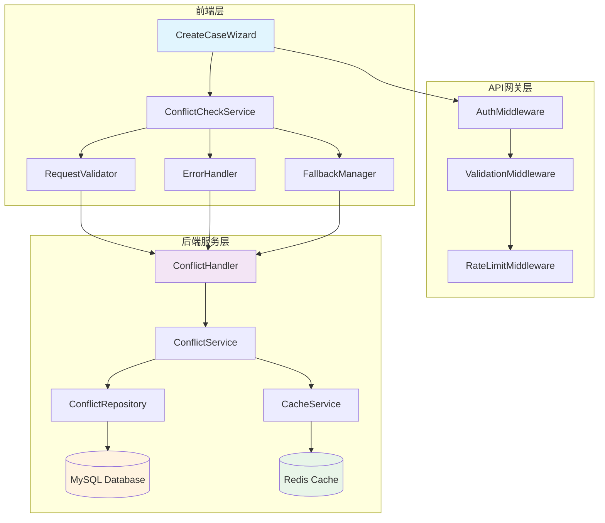
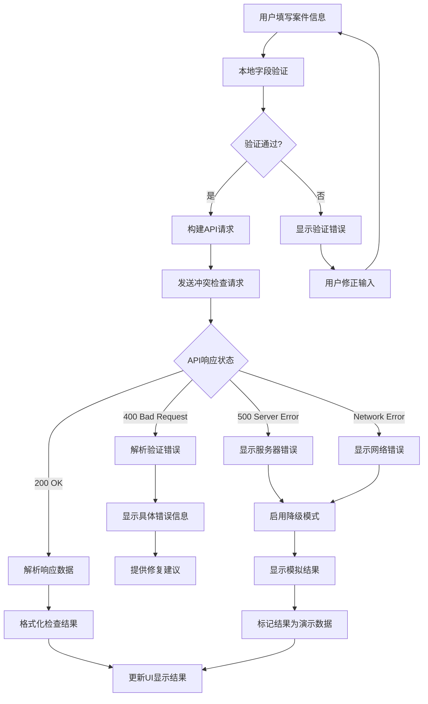
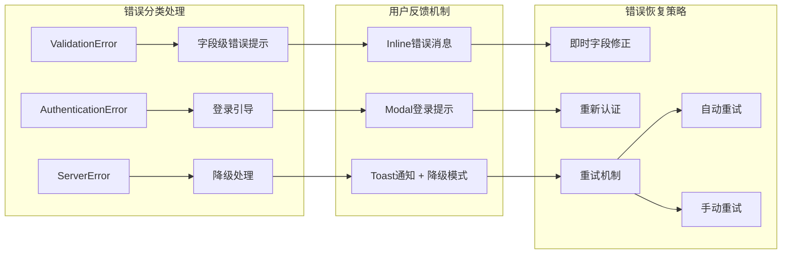
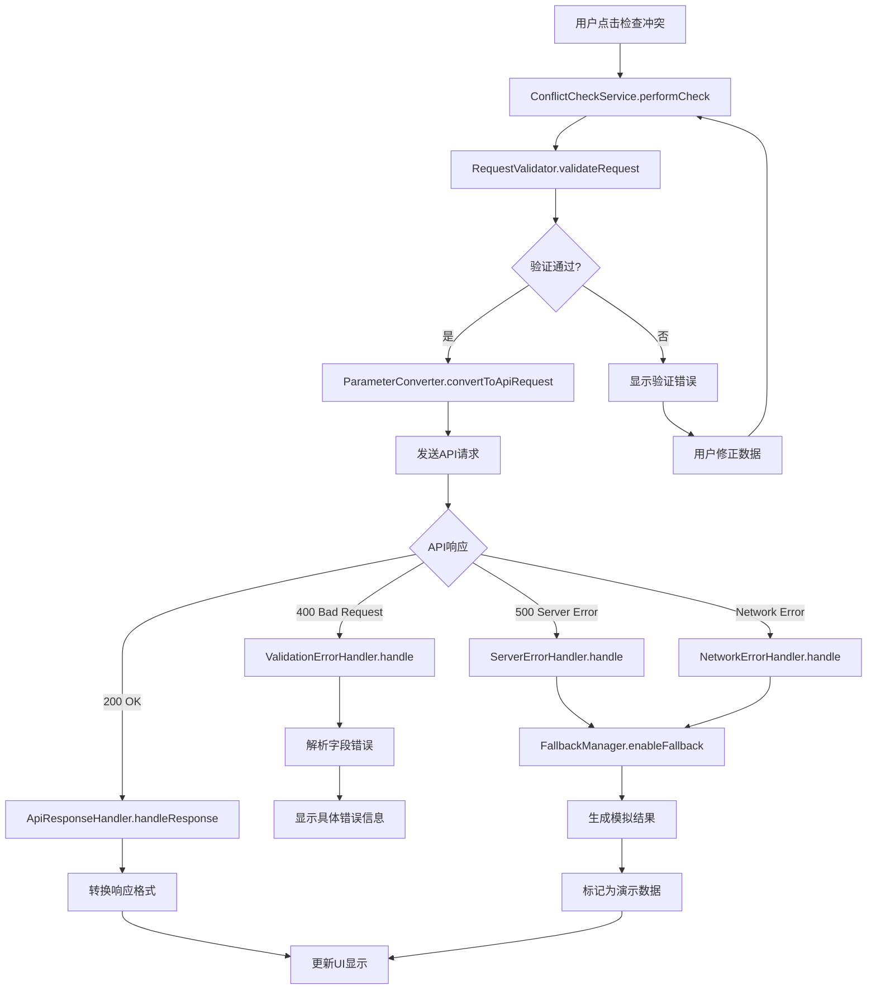
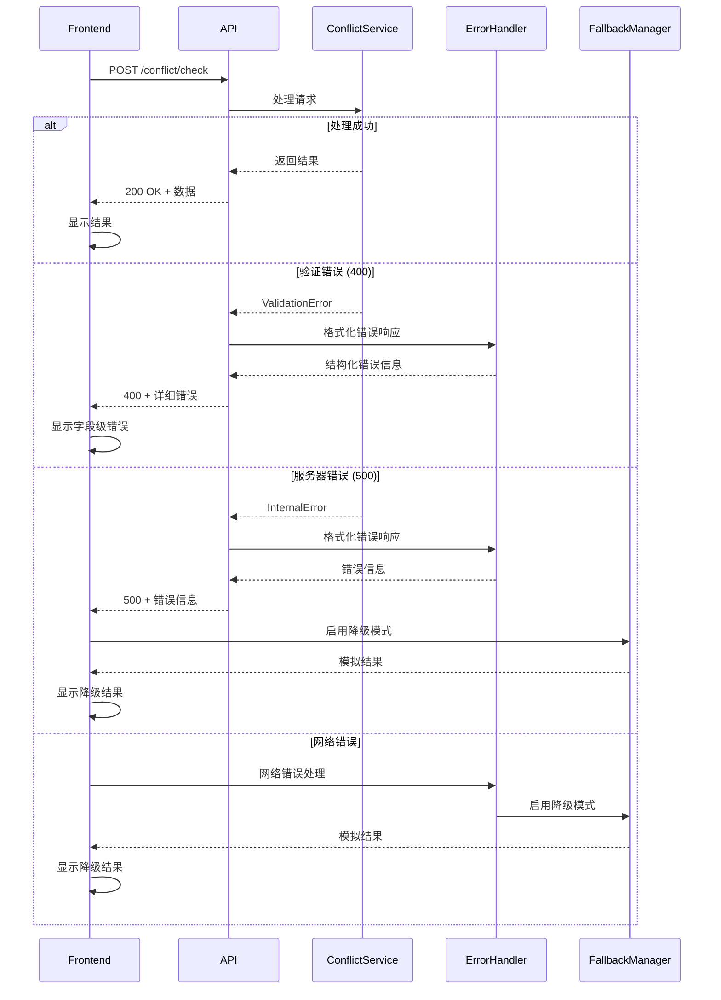
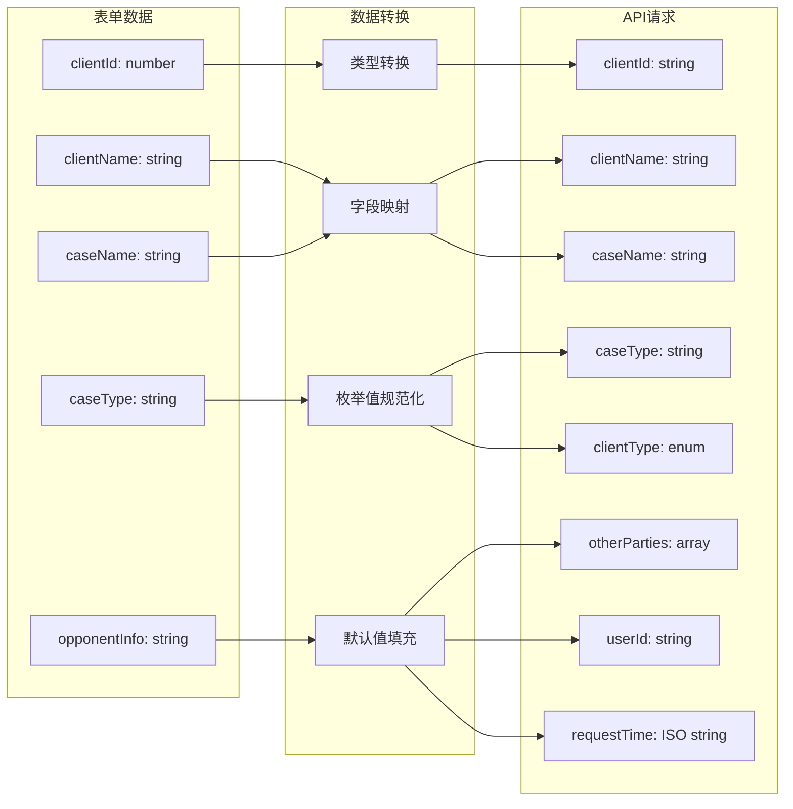

# 利益冲突检查功能修复技术设计文档

## 概述

本文档详细描述了律师事务所办公自动化系统中利益冲突检查功能的完整技术修复方案。当前系统在新增案件时执行利益冲突检查出现400错误，根本原因是前后端API参数格式不匹配、字段验证不严格以及错误处理机制不完善。

本设计从架构、接口、组件、数据模型、安全性和性能等多个维度提供全面的解决方案，确保功能稳定可靠的同时提供优秀的用户体验。

## 架构设计

### 系统架构图



### 数据流图



### 错误处理架构



## 组件设计

### 前端组件架构

#### 1. ConflictCheckService (服务层)

```typescript
interface ConflictCheckService {
  // 核心冲突检查方法
  performCheck(request: ConflictCheckRequest): Promise<ConflictCheckResult>;

  // 请求验证方法
  validateRequest(request: ConflictCheckRequest): ValidationResult;

  // 请求格式转换
  transformRequest(formData: CaseFormData): CheckConflictRequest;

  // 响应数据转换
  transformResponse(apiResponse: CheckConflictResponse): ConflictCheckResult;

  // 错误处理
  handleError(error: APIError): FallbackResult;
}
```

#### 2. RequestValidator (验证组件)

```typescript
interface RequestValidator {
  // 验证必需字段
  validateRequiredFields(data: any): FieldValidationResult[];

  // 验证字段格式
  validateFieldFormats(data: any): FormatValidationResult[];

  // 验证枚举值
  validateEnums(data: any): EnumValidationResult[];

  // 获取综合验证结果
  getValidationSummary(data: any): ValidationSummary;
}
```

#### 3. FallbackManager (降级管理器)

```typescript
interface FallbackManager {
  // 判断是否启用降级
  shouldEnableFallback(error: APIError): boolean;

  // 生成模拟数据
  generateMockResult(request: ConflictCheckRequest): MockConflictResult;

  // 缓存失败请求
  cacheFailedRequest(request: ConflictCheckRequest): void;

  // 重试失败的请求
  retryFailedRequests(): Promise<void>;
}
```

### 后端组件架构

#### 1. EnhancedConflictHandler (增强冲突处理器)

```go
type EnhancedConflictHandler struct {
    conflictService     services.ConflictService
    validator          *RequestValidator
    logger             *logrus.Logger
    metrics            *prometheus.Registry
    rateLimiter        *rate.Limiter
}

// 增强的请求验证
func (h *EnhancedConflictHandler) validateRequestEnhanced(req *CheckConflictRequest) *ValidationResult {
    validator := NewRequestValidator()
    return validator.ValidateAll(req)
}

// 结构化错误响应
func (h *EnhancedConflictHandler) createErrorResponse(errorType ErrorType, details map[string]interface{}) CheckConflictResponse {
    return CheckConflictResponse{
        Success:     false,
        ErrorCode:   errorType.Code,
        Message:     errorType.Message,
        Details:     details,
        RequestID:   generateRequestID(),
        Timestamp:   time.Now(),
    }
}
```

#### 2. RequestValidator (请求验证器)

```go
type RequestValidator struct {
    allowedCaseTypes    []string
    allowedClientTypes  []string
    allowedSearchDepths []string
}

func (v *RequestValidator) ValidateClientID(clientID string) *FieldError {
    if strings.TrimSpace(clientID) == "" {
        return &FieldError{
            Field:   "clientId",
            Message: "客户ID不能为空",
            Code:    "REQUIRED_FIELD_MISSING",
        }
    }

    if _, err := strconv.ParseUint(clientID, 10, 32); err != nil {
        return &FieldError{
            Field:   "clientId",
            Message: "客户ID格式无效，必须为数字字符串",
            Code:    "INVALID_FORMAT",
        }
    }

    return nil
}

func (v *RequestValidator) ValidateCaseType(caseType string) *FieldError {
    if !contains(v.allowedCaseTypes, caseType) {
        return &FieldError{
            Field:   "caseType",
            Message: fmt.Sprintf("案件类型无效，支持的类型: %s", strings.Join(v.allowedCaseTypes, ", ")),
            Code:    "INVALID_ENUM_VALUE",
        }
    }
    return nil
}
```

## 接口设计

### 前端接口重构

#### 1. 标准化请求接口

```typescript
// 后端API期望的请求格式
interface CheckConflictRequest {
  clientId: string;                    // 必需：客户ID字符串
  clientName: string;                  // 必需：客户名称
  caseName: string;                    // 必需：案件名称
  caseType: string;                    // 必需：案件类型
  clientType: 'PERSON' | 'COMPANY';    // 必需：客户类型枚举
  otherParties?: string[];             // 可选：对方当事人列表
  searchYears?: number;                // 可选：搜索年限，默认5
  includeCorporateRelations?: boolean; // 可选：是否包含企业关系，默认true
  searchDepth?: 'BASIC' | 'STANDARD' | 'DEEP'; // 可选：搜索深度，默认DEEP
  userId: string;                      // 必需：用户ID
  requestTime: string;                 // 必需：请求时间戳
}

// 前端表单数据接口
interface CaseFormData {
  clientId?: number;
  clientName?: string;
  caseName?: string;
  caseType?: string;
  opponentInfo?: string;
  lawyerId?: number;
  causeOfAction?: string;
  searchYears?: number;
  searchDepth?: string;
  includeCorporateRelations?: boolean;
}

// 数据转换器
class ConflictRequestTransformer {
  static transform(formData: CaseFormData, clients: ClientInfo[], userId: string): CheckConflictRequest {
    const client = clients.find(c => c.clientId === formData.clientId);

    return {
      clientId: formData.clientId?.toString() || '',
      clientName: client?.clientName || formData.clientName || '',
      caseName: formData.caseName || '',
      caseType: formData.caseType || 'civil',
      clientType: client?.clientType === '企业' ? 'COMPANY' : 'PERSON',
      otherParties: formData.opponentInfo ? [formData.opponentInfo] : [],
      searchYears: formData.searchYears || 5,
      includeCorporateRelations: formData.includeCorporateRelations ?? true,
      searchDepth: this.mapSearchDepth(formData.searchDepth) || 'DEEP',
      userId: userId,
      requestTime: new Date().toISOString()
    };
  }

  private static mapSearchDepth(depth?: string): 'BASIC' | 'STANDARD' | 'DEEP' {
    const depthMap: Record<string, 'BASIC' | 'STANDARD' | 'DEEP'> = {
      'basic': 'BASIC',
      'standard': 'STANDARD',
      'deep': 'DEEP'
    };
    return depthMap[depth || ''] || 'DEEP';
  }
}
```

#### 2. 响应接口标准化

```typescript
// 后端API响应格式
interface CheckConflictResponse {
  success: boolean;
  message: string;
  data?: ConflictCheckResponseData;
  error?: string;
  details?: ValidationErrorDetails;
  requestId: string;
  timestamp: string;
}

interface ConflictCheckResponseData {
  checkId: string;
  hasConflict: boolean;
  conflictCases: ConflictCase[];
  checkStatistics: CheckStatistics;
  riskAssessment: RiskAssessment;
  recommendations: string[];
  checkTime: string;
}

interface ValidationErrorDetails {
  fieldErrors: FieldError[];
  validationErrors: string[];
  rawError: string;
}

interface FieldError {
  field: string;
  message: string;
  code: string;
  value?: any;
}

// 前端显示格式
interface ConflictCheckResult {
  checkId: string;
  hasConflict: boolean;
  status: 'passed' | 'warning' | 'failed';
  score: number;
  conflicts: ConflictDetail[];
  summary: string;
  checkTime: string;
  checker: string;
  totalChecked: number;
  riskFactors: RiskFactor[];
  recommendations: Recommendation[];
  relatedCases: RelatedCase[];
  complianceNotes: string;
}
```

### 参数转换逻辑优化

```typescript
class ParameterConverter {
  private static readonly DEFAULT_VALUES = {
    searchYears: 5,
    searchDepth: 'DEEP' as const,
    includeCorporateRelations: true,
    clientType: 'PERSON' as const
  };

  static convertToApiRequest(
    formData: Partial<CaseFormData>,
    context: RequestContext
  ): CheckConflictRequest {
    const request: Partial<CheckConflictRequest> = {};

    // 必需字段转换
    request.clientId = this.convertClientId(formData.clientId);
    request.clientName = this.getClientName(formData, context.clients);
    request.caseName = this.getCaseName(formData);
    request.caseType = this.normalizeCaseType(formData.caseType);
    request.clientType = this.determineClientType(formData, context.clients);

    // 可选字段处理
    request.otherParties = this.parseOtherParties(formData.opponentInfo);
    request.searchYears = formData.searchYears ?? this.DEFAULT_VALUES.searchYears;
    request.searchDepth = this.normalizeSearchDepth(formData.searchDepth);
    request.includeCorporateRelations = formData.includeCorporateRelations ?? this.DEFAULT_VALUES.includeCorporateRelations;

    // 系统字段
    request.userId = context.userId;
    request.requestTime = new Date().toISOString();

    return request as CheckConflictRequest;
  }

  private static convertClientId(clientId?: number): string {
    if (!clientId) {
      throw new ValidationError('clientId', '客户ID是必需的');
    }
    return clientId.toString();
  }

  private static getClientName(formData: Partial<CaseFormData>, clients: ClientInfo[]): string {
    if (formData.clientName) {
      return formData.clientName;
    }

    const client = clients.find(c => c.clientId === formData.clientId);
    if (!client) {
      throw new ValidationError('clientName', '无法找到对应的客户信息');
    }

    return client.clientName;
  }

  private static parseOtherParties(opponentInfo?: string): string[] {
    if (!opponentInfo || opponentInfo.trim() === '') {
      return [];
    }

    // 按换行符或分号分割多个对方当事人
    return opponentInfo
      .split(/[,;，；\n]+/)
      .map(party => party.trim())
      .filter(party => party.length > 0);
  }
}
```

### API响应格式统一

```typescript
class ApiResponseHandler {
  static handleConflictCheckResponse(response: CheckConflictResponse): ConflictCheckResult {
    if (!response.success) {
      throw new APIError(response.error || '未知错误', response.details);
    }

    if (!response.data) {
      throw new APIError('响应数据为空');
    }

    return this.convertToDisplayFormat(response.data);
  }

  private static convertToDisplayFormat(data: ConflictCheckResponseData): ConflictCheckResult {
    return {
      checkId: data.checkId,
      hasConflict: data.hasConflict,
      status: this.determineStatus(data),
      score: this.calculateScore(data.riskAssessment),
      conflicts: this.convertConflicts(data.conflictCases),
      summary: this.generateSummary(data),
      checkTime: data.checkTime,
      checker: "智能冲突检查系统",
      totalChecked: data.checkStatistics.totalCasesChecked,
      riskFactors: this.convertRiskFactors(data.riskAssessment),
      recommendations: this.convertRecommendations(data.recommendations),
      relatedCases: this.convertRelatedCases(data.conflictCases),
      complianceNotes: "根据《律师执业管理办法》相关规定进行检查"
    };
  }

  private static determineStatus(data: ConflictCheckResponseData): 'passed' | 'warning' | 'failed' {
    if (!data.hasConflict) return 'passed';

    const hasHighRisk = data.conflictCases.some(c => c.riskLevel === 'HIGH');
    return hasHighRisk ? 'failed' : 'warning';
  }

  private static calculateScore(riskAssessment: RiskAssessment): number {
    return Math.round(riskAssessment.riskScore * 100);
  }
}
```

## 数据模型

### 核心数据结构定义

#### 1. 请求模型

```typescript
// 完整的冲突检查请求模型
class ConflictCheckRequestModel {
  constructor(
    public readonly clientId: string,
    public readonly clientName: string,
    public readonly caseName: string,
    public readonly caseType: CaseType,
    public readonly clientType: ClientType,
    public readonly otherParties: string[] = [],
    public readonly searchYears: number = 5,
    public readonly includeCorporateRelations: boolean = true,
    public readonly searchDepth: SearchDepth = SearchDepth.DEEP,
    public readonly userId: string,
    public readonly requestTime: Date = new Date()
  ) {}

  // 验证请求有效性
  validate(): ValidationResult {
    const errors: ValidationError[] = [];

    if (!this.clientId || this.clientId.trim() === '') {
      errors.push(new ValidationError('clientId', '客户ID不能为空'));
    }

    if (!this.clientName || this.clientName.trim() === '') {
      errors.push(new ValidationError('clientName', '客户名称不能为空'));
    }

    if (!this.caseName || this.caseName.trim() === '') {
      errors.push(new ValidationError('caseName', '案件名称不能为空'));
    }

    if (!Object.values(CaseType).includes(this.caseType)) {
      errors.push(new ValidationError('caseType', `无效的案件类型: ${this.caseType}`));
    }

    return new ValidationResult(errors.length === 0, errors);
  }

  // 转换为JSON对象
  toJSON(): CheckConflictRequest {
    return {
      clientId: this.clientId,
      clientName: this.clientName,
      caseName: this.caseName,
      caseType: this.caseType,
      clientType: this.clientType,
      otherParties: this.otherParties,
      searchYears: this.searchYears,
      includeCorporateRelations: this.includeCorporateRelations,
      searchDepth: this.searchDepth,
      userId: this.userId,
      requestTime: this.requestTime.toISOString()
    };
  }
}

// 枚举定义
enum CaseType {
  CIVIL = 'civil',
  COMMERCIAL = 'commercial',
  CRIMINAL = 'criminal',
  ADMINISTRATIVE = 'administrative',
  ARBITRATION = 'arbitration',
  CONSULTATION = 'consultation',
  OTHER = 'other'
}

enum ClientType {
  PERSON = 'PERSON',
  COMPANY = 'COMPANY'
}

enum SearchDepth {
  BASIC = 'BASIC',
  STANDARD = 'STANDARD',
  DEEP = 'DEEP'
}
```

#### 2. 响应模型

```typescript
// 冲突检查响应模型
class ConflictCheckResponseModel {
  constructor(
    public readonly checkId: string,
    public readonly hasConflict: boolean,
    public readonly conflictCases: ConflictCase[],
    public readonly checkStatistics: CheckStatistics,
    public readonly riskAssessment: RiskAssessment,
    public readonly recommendations: string[],
    public readonly checkTime: Date
  ) {}

  // 获取风险等级
  get riskLevel(): RiskLevel {
    if (!this.hasConflict) return RiskLevel.NONE;

    const hasHighRisk = this.conflictCases.some(c => c.riskLevel === RiskLevel.HIGH);
    return hasHighRisk ? RiskLevel.HIGH : RiskLevel.MEDIUM;
  }

  // 获取综合评分
  get score(): number {
    return Math.round(this.riskAssessment.riskScore * 100);
  }

  // 生成摘要
  get summary(): string {
    if (!this.hasConflict) {
      return '未发现明显的利益冲突风险';
    }

    const highRiskCount = this.conflictCases.filter(c => c.riskLevel === RiskLevel.HIGH).length;
    const mediumRiskCount = this.conflictCases.filter(c => c.riskLevel === RiskLevel.MEDIUM).length;

    if (highRiskCount > 0) {
      return `发现${highRiskCount}项高风险冲突，建议拒绝委托`;
    } else if (mediumRiskCount > 0) {
      return `发现${mediumRiskCount}项潜在冲突，建议在充分披露后谨慎接受委托`;
    }

    return '发现轻微风险，建议持续监控';
  }
}

// 冲突案件模型
class ConflictCase {
  constructor(
    public readonly caseId: string,
    public readonly caseName: string,
    public readonly clientName: string,
    public readonly status: string,
    public readonly conflictType: ConflictType,
    public readonly riskLevel: RiskLevel,
    public readonly description: string,
    public readonly createdAt: Date
  ) {}
}

// 风险评估模型
class RiskAssessment {
  constructor(
    public readonly overallRisk: string,
    public readonly riskScore: number,
    public readonly riskReason: string,
    public readonly requiresApproval: boolean,
    public readonly riskFactors: string[],
    public readonly mitigation: string[]
  ) {}
}

// 检查统计模型
class CheckStatistics {
  constructor(
    public readonly totalCasesChecked: number,
    public readonly clientHistoryCases: number,
    public readonly relatedPartiesChecked: number,
    public readonly corporateRelationsChecked: number,
    public readonly timeRange: string,
    public readonly searchScope: string,
    public readonly startTime: Date,
    public readonly endTime: Date
  ) {}
}
```

### 数据模型图

```mermaid
classDiagram
    class ConflictCheckRequestModel {
        +string clientId
        +string clientName
        +string caseName
        +CaseType caseType
        +ClientType clientType
        +string[] otherParties
        +number searchYears
        +boolean includeCorporateRelations
        +SearchDepth searchDepth
        +string userId
        +Date requestTime
        +validate() ValidationResult
        +toJSON() object
    }

    class ConflictCheckResponseModel {
        +string checkId
        +boolean hasConflict
        +ConflictCase[] conflictCases
        +CheckStatistics checkStatistics
        +RiskAssessment riskAssessment
        +string[] recommendations
        +Date checkTime
        +getRiskLevel() RiskLevel
        +getScore() number
        +getSummary() string
    }

    class ConflictCase {
        +string caseId
        +string caseName
        +string clientName
        +string status
        +ConflictType conflictType
        +RiskLevel riskLevel
        +string description
        +Date createdAt
    }

    class RiskAssessment {
        +string overallRisk
        +number riskScore
        +string riskReason
        +boolean requiresApproval
        +string[] riskFactors
        +string[] mitigation
    }

    class CheckStatistics {
        +number totalCasesChecked
        +number clientHistoryCases
        +number relatedPartiesChecked
        +number corporateRelationsChecked
        +string timeRange
        +string searchScope
        +Date startTime
        +Date endTime
    }

    ConflictCheckRequestModel --> ConflictCheckResponseModel : creates
    ConflictCheckResponseModel --> ConflictCase : contains
    ConflictCheckResponseModel --> RiskAssessment : has
    ConflictCheckResponseModel --> CheckStatistics : includes

    enum CaseType {
        CIVIL
        COMMERCIAL
        CRIMINAL
        ADMINISTRATIVE
        ARBITRATION
        CONSULTATION
        OTHER
    }

    enum ClientType {
        PERSON
        COMPANY
    }

    enum SearchDepth {
        BASIC
        STANDARD
        DEEP
    }

    enum RiskLevel {
        NONE
        LOW
        MEDIUM
        HIGH
    }

    enum ConflictType {
        CLIENT_CONFLICT
        OPPONENT_CONFLICT
        LAWYER_CONFLICT
        CASE_CONFLICT
    }
```

## 业务流程

### 利益冲突检查流程



### 错误处理流程



### 数据转换流程



## 错误处理策略

### 错误分类体系

```typescript
// 错误类型枚举
enum ErrorType {
  VALIDATION_ERROR = 'VALIDATION_ERROR',
  AUTHENTICATION_ERROR = 'AUTHENTICATION_ERROR',
  AUTHORIZATION_ERROR = 'AUTHORIZATION_ERROR',
  NETWORK_ERROR = 'NETWORK_ERROR',
  SERVER_ERROR = 'SERVER_ERROR',
  TIMEOUT_ERROR = 'TIMEOUT_ERROR',
  UNKNOWN_ERROR = 'UNKNOWN_ERROR'
}

// 错误严重程度
enum ErrorSeverity {
  LOW = 'LOW',        // 不影响核心功能
  MEDIUM = 'MEDIUM',  // 影响部分功能
  HIGH = 'HIGH',      // 影响核心功能
  CRITICAL = 'CRITICAL' // 系统不可用
}

// 错误处理策略
interface ErrorHandlingStrategy {
  showError: boolean;           // 是否向用户显示错误
  enableFallback: boolean;      // 是否启用降级模式
  allowRetry: boolean;          // 是否允许重试
  retryDelay: number;           // 重试延迟（毫秒）
  maxRetries: number;           // 最大重试次数
  logLevel: LogLevel;           // 日志级别
  notifyAdmin: boolean;         // 是否通知管理员
}
```

### 错误处理组件

```typescript
class ConflictCheckErrorHandler {
  private static readonly ERROR_STRATEGIES: Map<ErrorType, ErrorHandlingStrategy> = new Map([
    [ErrorType.VALIDATION_ERROR, {
      showError: true,
      enableFallback: false,
      allowRetry: false,
      retryDelay: 0,
      maxRetries: 0,
      logLevel: LogLevel.WARN,
      notifyAdmin: false
    }],
    [ErrorType.NETWORK_ERROR, {
      showError: true,
      enableFallback: true,
      allowRetry: true,
      retryDelay: 2000,
      maxRetries: 3,
      logLevel: LogLevel.ERROR,
      notifyAdmin: false
    }],
    [ErrorType.SERVER_ERROR, {
      showError: true,
      enableFallback: true,
      allowRetry: true,
      retryDelay: 5000,
      maxRetries: 2,
      logLevel: LogLevel.ERROR,
      notifyAdmin: true
    }],
    [ErrorType.TIMEOUT_ERROR, {
      showError: true,
      enableFallback: true,
      allowRetry: true,
      retryDelay: 3000,
      maxRetries: 2,
      logLevel: LogLevel.WARN,
      notifyAdmin: false
    }]
  ]);

  static handleError(error: APIError, context: ErrorContext): ErrorHandlingResult {
    const errorType = this.classifyError(error);
    const strategy = this.ERROR_STRATEGIES.get(errorType) || this.getDefaultStrategy();

    // 记录错误日志
    this.logError(error, context, strategy.logLevel);

    // 构建错误消息
    const userMessage = this.buildUserMessage(error, errorType);

    // 决定是否启用降级模式
    const shouldFallback = strategy.enableFallback && this.shouldEnableFallback(error);

    // 构建处理结果
    return {
      errorType,
      userMessage,
      shouldFallback,
      allowRetry: strategy.allowRetry,
      retryDelay: strategy.retryDelay,
      maxRetries: strategy.maxRetries
    };
  }

  private static classifyError(error: APIError): ErrorType {
    if (error.status === 400) return ErrorType.VALIDATION_ERROR;
    if (error.status === 401) return ErrorType.AUTHENTICATION_ERROR;
    if (error.status === 403) return ErrorType.AUTHORIZATION_ERROR;
    if (error.status >= 500) return ErrorType.SERVER_ERROR;
    if (error.code === 'NETWORK_ERROR') return ErrorType.NETWORK_ERROR;
    if (error.code === 'TIMEOUT') return ErrorType.TIMEOUT_ERROR;
    return ErrorType.UNKNOWN_ERROR;
  }

  private static buildUserMessage(error: APIError, errorType: ErrorType): string {
    const messages: Record<ErrorType, string> = {
      [ErrorType.VALIDATION_ERROR]: '输入数据有误，请检查表单填写是否正确',
      [ErrorType.AUTHENTICATION_ERROR]: '身份验证失败，请重新登录',
      [ErrorType.AUTHORIZATION_ERROR]: '权限不足，无法执行此操作',
      [ErrorType.NETWORK_ERROR]: '网络连接失败，请检查网络后重试',
      [ErrorType.SERVER_ERROR]: '服务器暂时不可用，请稍后重试',
      [ErrorType.TIMEOUT_ERROR]: '请求超时，请稍后重试',
      [ErrorType.UNKNOWN_ERROR]: '发生未知错误，请联系技术支持'
    };

    let message = messages[errorType];

    // 对于验证错误，添加具体字段信息
    if (errorType === ErrorType.VALIDATION_ERROR && error.details?.fieldErrors) {
      const fieldErrors = error.details.fieldErrors.map((fe: any) => fe.message).join('；');
      message += `：${fieldErrors}`;
    }

    return message;
  }
}
```

### 降级策略实现

```typescript
class FallbackStrategy {
  private static readonly MOCK_DATA_CACHE = new Map<string, MockConflictResult>();

  static async executeFallback(
    originalRequest: ConflictCheckRequest,
    error: APIError
  ): Promise<ConflictCheckResult> {
    // 生成缓存键
    const cacheKey = this.generateCacheKey(originalRequest);

    // 尝试从缓存获取
    if (this.MOCK_DATA_CACHE.has(cacheKey)) {
      const cachedResult = this.MOCK_DATA_CACHE.get(cacheKey)!;
      console.info(`使用缓存的降级数据: ${cacheKey}`);
      return cachedResult.toDisplayFormat();
    }

    // 生成新的模拟数据
    const mockResult = this.generateMockResult(originalRequest, error);

    // 缓存结果
    this.MOCK_DATA_CACHE.set(cacheKey, mockResult);

    // 限制缓存大小
    if (this.MOCK_DATA_CACHE.size > 100) {
      const firstKey = this.MOCK_DATA_CACHE.keys().next().value;
      this.MOCK_DATA_CACHE.delete(firstKey);
    }

    return mockResult.toDisplayFormat();
  }

  private static generateMockResult(
    request: ConflictCheckRequest,
    error: APIError
  ): MockConflictResult {
    const baseResult = {
      checkId: `MOCK_${Date.now()}`,
      checkTime: new Date().toISOString(),
      checker: "冲突检查演示系统",
      originalError: error.message,
      isDemoData: true
    };

    // 根据客户类型和案件类型生成合理的模拟结果
    const riskLevel = this.calculateMockRiskLevel(request);
    const conflictCount = this.calculateMockConflictCount(riskLevel);

    return new MockConflictResult({
      ...baseResult,
      hasConflict: conflictCount > 0,
      status: this.determineMockStatus(riskLevel),
      score: this.calculateMockScore(riskLevel),
      conflicts: this.generateMockConflicts(conflictCount, request),
      summary: this.generateMockSummary(conflictCount, riskLevel),
      totalChecked: Math.floor(Math.random() * 50) + 10,
      riskFactors: this.generateMockRiskFactors(request),
      recommendations: this.generateMockRecommendations(riskLevel),
      relatedCases: this.generateMockRelatedCases(conflictCount),
      complianceNotes: "此为演示数据，实际结果需要系统正常运行后获取"
    });
  }

  private static calculateMockRiskLevel(request: ConflictCheckRequest): RiskLevel {
    // 简单的风险计算逻辑
    let riskScore = 0;

    // 企业客户风险稍高
    if (request.clientType === ClientType.COMPANY) {
      riskScore += 20;
    }

    // 某些案件类型风险较高
    const highRiskTypes = [CaseType.CRIMINAL, CaseType.ADMINISTRATIVE];
    if (highRiskTypes.includes(request.caseType as CaseType)) {
      riskScore += 15;
    }

    // 对方当事人数量
    riskScore += Math.min(request.otherParties.length * 10, 30);

    if (riskScore >= 70) return RiskLevel.HIGH;
    if (riskScore >= 40) return RiskLevel.MEDIUM;
    return RiskLevel.LOW;
  }
}
```

## 安全性设计

### 输入验证策略

```typescript
class SecurityValidator {
  private static readonly MAX_STRING_LENGTH = 1000;
  private static readonly MAX_ARRAY_SIZE = 100;
  private static readonly FORBIDDEN_PATTERNS = [
    /<script\b[^<]*(?:(?!<\/script>)<[^<]*)*<\/script>/gi,
    /javascript:/gi,
    /on\w+\s*=/gi
  ];

  static validateInput(data: any, schema: ValidationSchema): SecurityValidationResult {
    const result = new SecurityValidationResult();

    // 检查数据大小
    if (JSON.stringify(data).length > 1024 * 1024) { // 1MB limit
      result.addError('DATA_TOO_LARGE', '数据大小超出限制');
    }

    // 递归验证每个字段
    this.validateObject(data, schema, '', result);

    // XSS检查
    this.checkForXSS(data, result);

    // SQL注入检查
    this.checkForSQLInjection(data, result);

    return result;
  }

  private static validateObject(
    obj: any,
    schema: ValidationSchema,
    path: string,
    result: SecurityValidationResult
  ): void {
    for (const [key, value] of Object.entries(obj)) {
      const currentPath = path ? `${path}.${key}` : key;
      const fieldSchema = schema[key];

      if (!fieldSchema) {
        result.addWarning('UNKNOWN_FIELD', `未知字段: ${currentPath}`);
        continue;
      }

      // 类型验证
      if (!this.validateType(value, fieldSchema.type)) {
        result.addError('INVALID_TYPE', `字段 ${currentPath} 类型错误`);
      }

      // 长度验证
      if (typeof value === 'string') {
        if (value.length > (fieldSchema.maxLength || this.MAX_STRING_LENGTH)) {
          result.addError('STRING_TOO_LONG', `字段 ${currentPath} 长度超出限制`);
        }
      }

      // 数组大小验证
      if (Array.isArray(value) && value.length > (fieldSchema.maxItems || this.MAX_ARRAY_SIZE)) {
        result.addError('ARRAY_TOO_LARGE', `字段 ${currentPath} 数组大小超出限制`);
      }

      // 递归验证嵌套对象
      if (typeof value === 'object' && value !== null && !Array.isArray(value)) {
        this.validateObject(value, fieldSchema.properties || {}, currentPath, result);
      }
    }
  }

  private static checkForXSS(data: any, result: SecurityValidationResult): void {
    const dataString = JSON.stringify(data);

    for (const pattern of this.FORBIDDEN_PATTERNS) {
      if (pattern.test(dataString)) {
        result.addError('XSS_DETECTED', '检测到潜在的XSS攻击代码');
        break;
      }
    }
  }

  private static checkForSQLInjection(data: any, result: SecurityValidationResult): void {
    const sqlPatterns = [
      /(\b(SELECT|INSERT|UPDATE|DELETE|DROP|CREATE|ALTER|EXEC|UNION)\b)/gi,
      /(\'|\'\';|\'\|\\|;\s*drop|\s*union)/gi,
      /(--|\/\*|\*\/)/g
    ];

    const dataString = JSON.stringify(data);

    for (const pattern of sqlPatterns) {
      if (pattern.test(dataString)) {
        result.addError('SQL_INJECTION_DETECTED', '检测到潜在的SQL注入攻击');
        break;
      }
    }
  }
}
```

### 敏感信息保护

```typescript
class SensitiveDataProtection {
  private static readonly SENSITIVE_FIELDS = [
    'idCard', 'phone', 'email', 'address', 'bankAccount'
  ];

  private static readonly MASK_PATTERNS: Record<string, RegExp> = {
    idCard: /(\d{6})\d{8}(\d{4})/,
    phone: /(\d{3})\d{4}(\d{4})/,
    email: /(.{2}).*(@.*)/,
    bankAccount: /(\d{4})\d+(\d{4})/
  };

  static maskSensitiveData(data: any): any {
    if (typeof data !== 'object' || data === null) {
      return data;
    }

    if (Array.isArray(data)) {
      return data.map(item => this.maskSensitiveData(item));
    }

    const masked: any = {};
    for (const [key, value] of Object.entries(data)) {
      if (typeof value === 'string' && this.isSensitiveField(key)) {
        masked[key] = this.maskValue(key, value);
      } else if (typeof value === 'object') {
        masked[key] = this.maskSensitiveData(value);
      } else {
        masked[key] = value;
      }
    }

    return masked;
  }

  private static isSensitiveField(fieldName: string): boolean {
    return this.SENSITIVE_FIELDS.some(sensitive =>
      fieldName.toLowerCase().includes(sensitive.toLowerCase())
    );
  }

  private static maskValue(fieldName: string, value: string): string {
    for (const [fieldType, pattern] of Object.entries(this.MASK_PATTERNS)) {
      if (fieldName.toLowerCase().includes(fieldType)) {
        return value.replace(pattern, '$1****$2');
      }
    }

    // 默认遮罩策略
    if (value.length <= 4) {
      return '****';
    }
    return value.substring(0, 2) + '****' + value.substring(value.length - 2);
  }

  static sanitizeLogData(data: any): any {
    const cloned = JSON.parse(JSON.stringify(data));
    return this.maskSensitiveData(cloned);
  }
}
```

### 错误信息安全

```typescript
class SecureErrorHandling {
  private static readonly INTERNAL_ERROR_FIELDS = [
    'stackTrace', 'internalCode', 'databaseError', 'filePath'
  ];

  static sanitizeErrorResponse(error: any, isProduction: boolean): any {
    const sanitized: any = {
      success: false,
      message: this.getSafeErrorMessage(error, isProduction),
      timestamp: new Date().toISOString(),
      requestId: error.requestId || generateRequestId()
    };

    // 开发环境可以显示更多错误信息
    if (!isProduction) {
      sanitized.error = error.message;
      sanitized.details = error.details;
    } else {
      // 生产环境只显示安全的错误信息
      if (this.isClientError(error)) {
        sanitized.error = error.message;
        sanitized.details = this.sanitizeDetails(error.details);
      } else {
        sanitized.error = '服务器内部错误';
        sanitized.details = {};
      }
    }

    return sanitized;
  }

  private static getSafeErrorMessage(error: any, isProduction: boolean): string {
    if (this.isClientError(error)) {
      return error.message || '请求参数错误';
    }

    return isProduction ? '服务暂时不可用，请稍后重试' : error.message || '未知错误';
  }

  private static isClientError(error: any): boolean {
    return error.status >= 400 && error.status < 500;
  }

  private static sanitizeDetails(details: any): any {
    if (!details || typeof details !== 'object') {
      return {};
    }

    const sanitized: any = {};
    for (const [key, value] of Object.entries(details)) {
      // 过滤敏感字段
      if (!this.INTERNAL_ERROR_FIELDS.includes(key)) {
        sanitized[key] = value;
      }
    }

    return sanitized;
  }
}
```

## 性能优化策略

### 请求优化

```typescript
class ConflictCheckOptimizer {
  private static readonly REQUEST_CACHE = new Map<string, CachedResponse>();
  private static readonly CACHE_DURATION = 5 * 60 * 1000; // 5分钟

  static async performOptimizedCheck(
    request: ConflictCheckRequest,
    options: OptimizationOptions = {}
  ): Promise<ConflictCheckResult> {
    // 生成缓存键
    const cacheKey = this.generateCacheKey(request);

    // 检查缓存
    if (!options.skipCache) {
      const cached = this.getFromCache(cacheKey);
      if (cached) {
        console.info(`使用缓存结果: ${cacheKey}`);
        return cached;
      }
    }

    // 防抖处理
    if (options.debounce) {
      return this.debounceRequest(request, cacheKey);
    }

    // 执行请求
    const result = await this.executeRequestWithRetry(request, options);

    // 缓存结果
    if (!options.skipCache) {
      this.cacheResponse(cacheKey, result);
    }

    return result;
  }

  private static generateCacheKey(request: ConflictCheckRequest): string {
    const keyData = {
      clientId: request.clientId,
      caseName: request.caseName,
      caseType: request.caseType,
      otherParties: request.otherParties.sort(),
      searchYears: request.searchYears
    };

    return btoa(JSON.stringify(keyData)).substring(0, 32);
  }

  private static getFromCache(key: string): ConflictCheckResult | null {
    const cached = this.REQUEST_CACHE.get(key);
    if (!cached) return null;

    // 检查缓存是否过期
    if (Date.now() - cached.timestamp > this.CACHE_DURATION) {
      this.REQUEST_CACHE.delete(key);
      return null;
    }

    return cached.data;
  }

  private static async executeRequestWithRetry(
    request: ConflictCheckRequest,
    options: OptimizationOptions
  ): Promise<ConflictCheckResult> {
    const maxRetries = options.maxRetries || 2;
    const retryDelay = options.retryDelay || 1000;

    for (let attempt = 0; attempt <= maxRetries; attempt++) {
      try {
        return await ConflictCheckService.performCheck(request);
      } catch (error) {
        if (attempt === maxRetries || !this.isRetryableError(error)) {
          throw error;
        }

        console.warn(`请求失败，${retryDelay}ms后重试 (${attempt + 1}/${maxRetries}):`, error);
        await this.delay(retryDelay * Math.pow(2, attempt)); // 指数退避
      }
    }

    throw new Error('请求失败，已达到最大重试次数');
  }

  private static isRetryableError(error: any): boolean {
    // 网络错误和5xx服务器错误可以重试
    return error.code === 'NETWORK_ERROR' ||
           error.code === 'TIMEOUT' ||
           (error.status >= 500 && error.status < 600);
  }

  private static delay(ms: number): Promise<void> {
    return new Promise(resolve => setTimeout(resolve, ms));
  }
}

interface OptimizationOptions {
  skipCache?: boolean;
  debounce?: boolean;
  maxRetries?: number;
  retryDelay?: number;
}

interface CachedResponse {
  data: ConflictCheckResult;
  timestamp: number;
}
```

### UI性能优化

```typescript
class ConflictCheckUIOptimizer {
  // 防抖用户输入
  static createDebouncedValidator(delay: number = 300) {
    let timeoutId: NodeJS.Timeout;

    return (value: any, callback: (result: ValidationResult) => void) => {
      clearTimeout(timeoutId);
      timeoutId = setTimeout(() => {
        const result = RequestValidator.validateRequest(value);
        callback(result);
      }, delay);
    };
  }

  // 虚拟滚动大量冲突结果
  static createVirtualizedConflictList(conflicts: ConflictCase[]) {
    return {
      itemCount: conflicts.length,
      getItemData: (index: number) => conflicts[index],
      renderRow: ({ index, style }: { index: number, style: React.CSSProperties }) => (
        <div style={style}>
          <ConflictCaseItem conflict={conflicts[index]} />
        </div>
      )
    };
  }

  // 懒加载检查详情
  static createLazyDetailsLoader(checkId: string) {
    return {
      loadDetails: async () => {
        // 延迟加载详细信息
        const details = await conflictAPI.getDetails(checkId);
        return details;
      },
      preload: () => {
        // 预加载关键数据
        setTimeout(() => {
          conflictAPI.getDetails(checkId).catch(() => {
            // 忽略预加载错误
          });
        }, 2000);
      }
    };
  }
}
```

## 测试策略

### 单元测试设计

```typescript
// ConflictCheckService 测试
describe('ConflictCheckService', () => {
  let service: ConflictCheckService;
  let mockHttpClient: jest.Mocked<HttpClient>;

  beforeEach(() => {
    mockHttpClient = createMockHttpClient();
    service = new ConflictCheckService(mockHttpClient);
  });

  describe('performCheck', () => {
    it('should successfully perform conflict check with valid request', async () => {
      // Arrange
      const request = createValidConflictCheckRequest();
      const expectedResponse = createMockConflictCheckResponse();
      mockHttpClient.post.mockResolvedValue(expectedResponse);

      // Act
      const result = await service.performCheck(request);

      // Assert
      expect(result).toBeDefined();
      expect(result.checkId).toBe(expectedResponse.data.checkId);
      expect(mockHttpClient.post).toHaveBeenCalledWith('/conflict/check', expect.any(Object));
    });

    it('should handle validation errors properly', async () => {
      // Arrange
      const invalidRequest = createInvalidConflictCheckRequest();

      // Act & Assert
      await expect(service.performCheck(invalidRequest))
        .rejects.toThrow(ValidationError);
    });

    it('should use fallback data when API fails', async () => {
      // Arrange
      const request = createValidConflictCheckRequest();
      mockHttpClient.post.mockRejectedValue(new NetworkError('Connection failed'));

      // Act
      const result = await service.performCheck(request);

      // Assert
      expect(result).toBeDefined();
      expect(result.isDemoData).toBe(true);
      expect(result.checkId).toMatch(/^MOCK_/);
    });
  });

  describe('validateRequest', () => {
    it('should pass validation for complete valid request', () => {
      // Arrange
      const request = createValidConflictCheckRequest();

      // Act
      const result = service.validateRequest(request);

      // Assert
      expect(result.isValid).toBe(true);
      expect(result.errors).toHaveLength(0);
    });

    it('should fail validation for missing required fields', () => {
      // Arrange
      const request = { ...createValidConflictCheckRequest(), clientId: '' };

      // Act
      const result = service.validateRequest(request);

      // Assert
      expect(result.isValid).toBe(false);
      expect(result.errors).toContainEqual(
        expect.objectContaining({ field: 'clientId', code: 'REQUIRED_FIELD_MISSING' })
      );
    });
  });
});

// RequestValidator 测试
describe('RequestValidator', () => {
  describe('validateRequiredFields', () => {
    it('should validate all required fields are present', () => {
      const data = {
        clientId: '123',
        clientName: 'Test Client',
        caseName: 'Test Case',
        caseType: 'civil',
        clientType: 'PERSON'
      };

      const result = RequestValidator.validateRequiredFields(data);

      expect(result.isValid).toBe(true);
    });

    it('should detect missing required fields', () => {
      const data = {
        clientId: '123',
        clientName: 'Test Client'
        // missing caseName, caseType, clientType
      };

      const result = RequestValidator.validateRequiredFields(data);

      expect(result.isValid).toBe(false);
      expect(result.errors).toHaveLength(3);
    });
  });

  describe('validateFieldFormats', () => {
    it('should validate correct field formats', () => {
      const data = {
        clientId: '123',
        searchYears: 5,
        searchDepth: 'DEEP',
        requestTime: '2024-01-01T00:00:00.000Z'
      };

      const result = RequestValidator.validateFieldFormats(data);

      expect(result.isValid).toBe(true);
    });

    it('should detect invalid field formats', () => {
      const data = {
        clientId: 'abc', // should be numeric
        searchYears: -1, // should be positive
        searchDepth: 'INVALID', // should be enum value
        requestTime: 'invalid-date' // should be ISO date
      };

      const result = RequestValidator.validateFieldFormats(data);

      expect(result.isValid).toBe(false);
      expect(result.errors.length).toBeGreaterThan(0);
    });
  });
});
```

### 集成测试设计

```typescript
// API集成测试
describe('Conflict Check API Integration', () => {
  let testServer: TestServer;
  let apiClient: ConflictAPIClient;

  beforeAll(async () => {
    testServer = await startTestServer();
    apiClient = new ConflictAPIClient(testServer.url);
  });

  afterAll(async () => {
    await testServer.close();
  });

  describe('Complete conflict check workflow', () => {
    it('should perform end-to-end conflict check successfully', async () => {
      // Arrange
      const testClient = await createTestClient();
      const testUser = await createTestUser();
      const request = createConflictCheckRequest({
        clientId: testClient.id,
        clientName: testClient.name,
        caseName: 'Integration Test Case',
        caseType: 'civil',
        clientType: 'PERSON',
        userId: testUser.id
      });

      // Act
      const response = await apiClient.performConflictCheck(request);

      // Assert
      expect(response.success).toBe(true);
      expect(response.data).toBeDefined();
      expect(response.data.checkId).toBeDefined();
      expect(response.data.hasConflict).toBeDefined();
      expect(response.data.checkStatistics).toBeDefined();
      expect(response.data.riskAssessment).toBeDefined();
    });

    it('should handle validation errors with detailed messages', async () => {
      // Arrange
      const invalidRequest = createConflictCheckRequest({
        clientId: '', // empty client ID
        clientName: '',
        caseName: '',
        caseType: 'invalid-type',
        clientType: 'INVALID'
      });

      // Act
      const response = await apiClient.performConflictCheck(invalidRequest);

      // Assert
      expect(response.success).toBe(false);
      expect(response.details?.fieldErrors).toBeDefined();
      expect(response.details?.fieldErrors.length).toBeGreaterThan(0);

      // 验证具体的字段错误
      const fieldErrors = response.details.fieldErrors;
      expect(fieldErrors.some((e: any) => e.field === 'clientId')).toBe(true);
      expect(fieldErrors.some((e: any) => e.field === 'caseType')).toBe(true);
      expect(fieldErrors.some((e: any) => e.field === 'clientType')).toBe(true);
    });

    it('should handle server errors gracefully', async () => {
      // Arrange - 模拟服务器错误
      testServer.mockError('/conflict/check', 500, 'Internal server error');

      const request = createValidConflictCheckRequest();

      // Act
      const response = await apiClient.performConflictCheck(request);

      // Assert
      expect(response.success).toBe(false);
      expect(response.error).toBeDefined();
      expect(response.timestamp).toBeDefined();
      expect(response.requestId).toBeDefined();
    });
  });

  describe('Performance tests', () => {
    it('should handle concurrent requests efficiently', async () => {
      // Arrange
      const concurrentRequests = 10;
      const requests = Array.from({ length: concurrentRequests }, (_, i) =>
        createConflictCheckRequest({
          caseName: `Concurrent Test Case ${i + 1}`
        })
      );

      // Act
      const startTime = Date.now();
      const responses = await Promise.all(
        requests.map(request => apiClient.performConflictCheck(request))
      );
      const duration = Date.now() - startTime;

      // Assert
      expect(responses).toHaveLength(concurrentRequests);
      expect(responses.every(r => r.success)).toBe(true);
      expect(duration).toBeLessThan(5000); // 应该在5秒内完成
    });

    it('should implement rate limiting properly', async () => {
      // Arrange - 发送大量快速请求
      const rapidRequests = Array.from({ length: 20 }, (_, i) =>
        apiClient.performConflictCheck(createConflictCheckRequest({
          caseName: `Rate Limit Test ${i + 1}`
        }))
      );

      // Act
      const responses = await Promise.allSettled(rapidRequests);

      // Assert
      const successful = responses.filter(r => r.status === 'fulfilled');
      const rateLimited = responses.filter(r =>
        r.status === 'rejected' ||
        (r.status === 'fulfilled' && !r.value.success && r.value.error?.includes('rate limit'))
      );

      // 应该有一些请求被速率限制
      expect(rateLimited.length).toBeGreaterThan(0);
      expect(successful.length).toBeGreaterThan(0);
    });
  });
});
```

### 端到端测试设计

```typescript
// E2E测试使用Playwright
describe('Conflict Check E2E Tests', () => {
  let page: Page;

  beforeEach(async () => {
    page = await browser.newPage();
    await login(page);
  });

  afterEach(async () => {
    await page.close();
  });

  describe('Conflict check in case creation workflow', () => {
    it('should perform successful conflict check and display results', async () => {
      // Navigate to case creation page
      await page.goto('/cases/create');

      // Fill in basic information
      await page.fill('[data-testid="case-name"]', 'E2E Test Case');
      await page.selectOption('[data-testid="case-type"]', 'civil');

      // Fill in party information
      await page.selectOption('[data-testid="client-select"]', 'Test Client');
      await page.fill('[data-testid="opponent-info"]', 'Test Opponent Info');

      // Assign team
      await page.selectOption('[data-testid="lawyer-select"]', 'Test Lawyer');

      // Proceed to conflict check
      await page.click('[data-testid="next-button"]');
      await page.click('[data-testid="check-conflict-button"]');

      // Wait for conflict check to complete
      await page.waitForSelector('[data-testid="conflict-check-results"]');

      // Verify results are displayed
      const resultsVisible = await page.isVisible('[data-testid="conflict-check-results"]');
      expect(resultsVisible).toBe(true);

      // Check for result elements
      const checkTime = await page.textContent('[data-testid="check-time"]');
      const riskScore = await page.textContent('[data-testid="risk-score"]');

      expect(checkTime).toBeDefined();
      expect(riskScore).toBeDefined();

      // Proceed to next step
      await page.click('[data-testid="confirm-conflict-button"]');

      // Verify can proceed to final confirmation
      await page.waitForSelector('[data-testid="confirmation-step"]');
      const confirmationVisible = await page.isVisible('[data-testid="confirmation-step"]');
      expect(confirmationVisible).toBe(true);
    });

    it('should handle validation errors gracefully', async () => {
      // Navigate to case creation page
      await page.goto('/cases/create');

      // Try to proceed without filling required fields
      await page.click('[data-testid="next-button"]');

      // Should show validation errors
      const errorMessage = await page.textContent('[data-testid="validation-error"]');
      expect(errorMessage).toContain('必填字段');

      // Fill with invalid data
      await page.fill('[data-testid="case-name"]', '');
      await page.fill('[data-testid="opponent-info"]', 'a'); // too short

      // Try to proceed to conflict check
      await page.selectOption('[data-testid="client-select"]', 'Test Client');
      await page.selectOption('[data-testid="lawyer-select"]', 'Test Lawyer');
      await page.click('[data-testid="next-button"]'); // skip to team
      await page.click('[data-testid="next-button"]'); // try to check conflicts

      // Should show field-specific errors
      const fieldErrors = await page.textContent('[data-testid="field-errors"]');
      expect(fieldErrors).toBeDefined();
    });

    it('should handle API errors with fallback mode', async () => {
      // Mock API failure
      await page.route('/api/conflict/check', route => {
        route.fulfill({
          status: 500,
          contentType: 'application/json',
          body: JSON.stringify({
            success: false,
            message: 'Internal server error'
          })
        });
      });

      // Navigate through form to conflict check
      await page.goto('/cases/create');
      await fillValidCaseForm(page);
      await proceedToConflictCheck(page);

      // Wait for fallback handling
      await page.waitForSelector('[data-testid="fallback-results"]');

      // Verify fallback mode is indicated
      const fallbackIndicator = await page.textContent('[data-testid="demo-indicator"]');
      expect(fallbackIndicator).toContain('演示数据');

      // Verify user can still proceed
      const proceedButton = await page.isVisible('[data-testid="proceed-with-fallback"]');
      expect(proceedButton).toBe(true);
    });

    it('should provide good UX during conflict check processing', async () => {
      // Navigate to conflict check
      await page.goto('/cases/create');
      await fillValidCaseForm(page);
      await proceedToConflictCheck(page);

      // Start conflict check
      await page.click('[data-testid="check-conflict-button"]');

      // Verify loading states
      const loadingVisible = await page.isVisible('[data-testid="conflict-check-loading"]');
      expect(loadingVisible).toBe(true);

      // Check for progress indicators
      const progressSteps = await page.locator('[data-testid="progress-step"]').count();
      expect(progressSteps).toBeGreaterThan(0);

      // Wait for completion
      await page.waitForSelector('[data-testid="conflict-check-results"]');

      // Verify loading is hidden and results are shown
      const loadingHidden = await page.isHidden('[data-testid="conflict-check-loading"]');
      const resultsVisible = await page.isVisible('[data-testid="conflict-check-results"]');

      expect(loadingHidden).toBe(true);
      expect(resultsVisible).toBe(true);
    });
  });
});

async function fillValidCaseForm(page: Page) {
  await page.fill('[data-testid="case-name"]', 'Valid Test Case');
  await page.selectOption('[data-testid="case-type"]', 'civil');
  await page.selectOption('[data-testid="client-select"]', 'Test Client');
  await page.fill('[data-testid="opponent-info"]', 'Valid Opponent Information for Testing');
  await page.selectOption('[data-testid="lawyer-select"]', 'Test Lawyer');
}

async function proceedToConflictCheck(page: Page) {
  await page.click('[data-testid="next-button"]'); // to party info
  await page.click('[data-testid="next-button"]'); // to team assignment
  // now on conflict check step
}
```

## 部署和监控

### 部署配置

```yaml
# docker-compose.yml for conflict check service
version: '3.8'

services:
  conflict-check-api:
    build: .
    ports:
      - "8080:8080"
    environment:
      - DATABASE_URL=mysql://user:password@db:3306/law_oa
      - REDIS_URL=redis://redis:6379
      - LOG_LEVEL=info
      - RATE_LIMIT_REQUESTS_PER_MINUTE=60
    depends_on:
      - db
      - redis
    restart: unless-stopped

  db:
    image: mysql:8.0
    environment:
      - MYSQL_DATABASE=law_oa
      - MYSQL_USER=user
      - MYSQL_PASSWORD=password
      - MYSQL_ROOT_PASSWORD=rootpassword
    volumes:
      - mysql_data:/var/lib/mysql
    restart: unless-stopped

  redis:
    image: redis:7-alpine
    volumes:
      - redis_data:/data
    restart: unless-stopped

  nginx:
    image: nginx:alpine
    ports:
      - "80:80"
      - "443:443"
    volumes:
      - ./nginx.conf:/etc/nginx/nginx.conf
      - ./ssl:/etc/nginx/ssl
    depends_on:
      - conflict-check-api
    restart: unless-stopped

volumes:
  mysql_data:
  redis_data:
```

### 监控配置

```typescript
// 监控指标收集
class ConflictCheckMetrics {
  private static readonly REQUEST_COUNTER = new prometheus.Counter({
    name: 'conflict_check_requests_total',
    help: 'Total number of conflict check requests',
    labelNames: ['status', 'error_type']
  });

  private static readonly REQUEST_DURATION = new prometheus.Histogram({
    name: 'conflict_check_request_duration_seconds',
    help: 'Duration of conflict check requests',
    buckets: [0.1, 0.5, 1, 2, 5, 10]
  });

  private static readonly CACHE_HIT_RATIO = new prometheus.Gauge({
    name: 'conflict_check_cache_hit_ratio',
    help: 'Cache hit ratio for conflict checks'
  });

  static recordRequest(status: string, errorType?: string, duration?: number) {
    this.REQUEST_COUNTER.inc({ status, error_type: errorType || 'none' });

    if (duration) {
      this.REQUEST_DURATION.observe(duration / 1000);
    }
  }

  static updateCacheHitRatio(hits: number, total: number) {
    this.CACHE_HIT_RATIO.set(total > 0 ? hits / total : 0);
  }
}

// 健康检查端点
app.get('/health/conflict-check', (req, res) => {
  const health = {
    status: 'healthy',
    timestamp: new Date().toISOString(),
    checks: {
      database: checkDatabaseConnection(),
      redis: checkRedisConnection(),
      conflict_service: checkConflictService()
    },
    metrics: {
      requests_total: ConflictCheckMetrics.REQUEST_COUNTER.get(),
      average_duration: ConflictCheckMetrics.REQUEST_DURATION.get(),
      cache_hit_ratio: ConflictCheckMetrics.CACHE_HIT_RATIO.get()
    }
  };

  const isHealthy = Object.values(health.checks).every(check => check.status === 'ok');
  const statusCode = isHealthy ? 200 : 503;

  res.status(statusCode).json(health);
});
```

### 日志配置

```typescript
// 结构化日志记录
class ConflictCheckLogger {
  private static logger = winston.createLogger({
    level: process.env.LOG_LEVEL || 'info',
    format: winston.format.combine(
      winston.format.timestamp(),
      winston.format.errors({ stack: true }),
      winston.format.json()
    ),
    defaultMeta: { service: 'conflict-check' },
    transports: [
      new winston.transports.File({ filename: 'error.log', level: 'error' }),
      new winston.transports.File({ filename: 'combined.log' })
    ]
  });

  static logRequest(request: CheckConflictRequest, requestId: string) {
    this.logger.info('Conflict check request received', {
      requestId,
      clientId: request.clientId,
      caseName: request.caseName,
      caseType: request.caseType,
      clientType: request.clientType,
      searchYears: request.searchYears,
      searchDepth: request.searchDepth,
      timestamp: new Date().toISOString()
    });
  }

  static logResponse(response: CheckConflictResponse, requestId: string, duration: number) {
    this.logger.info('Conflict check request completed', {
      requestId,
      success: response.success,
      hasConflict: response.data?.hasConflict,
      conflictCount: response.data?.conflictCases?.length || 0,
      riskScore: response.data?.riskAssessment?.riskScore,
      duration,
      timestamp: new Date().toISOString()
    });
  }

  static logError(error: Error, requestId: string, request?: CheckConflictRequest) {
    this.logger.error('Conflict check request failed', {
      requestId,
      error: {
        message: error.message,
        stack: error.stack,
        name: error.name
      },
      request: request ? SensitiveDataProtection.sanitizeLogData(request) : undefined,
      timestamp: new Date().toISOString()
    });
  }

  static logCacheHit(requestId: string, cacheKey: string) {
    this.logger.info('Cache hit for conflict check', {
      requestId,
      cacheKey,
      timestamp: new Date().toISOString()
    });
  }

  static logFallbackEnabled(requestId: string, originalError: string) {
    this.logger.warn('Fallback mode enabled for conflict check', {
      requestId,
      originalError,
      timestamp: new Date().toISOString()
    });
  }
}
```

这个完整的技术设计文档提供了：

1. **详细的架构设计** - 系统架构图、数据流图、错误处理架构
2. **完整的接口设计** - 标准化的请求/响应格式、参数转换逻辑
3. **组件设计** - 前端和后端组件的详细设计
4. **数据模型** - 核心数据结构定义和关系图
5. **业务流程** - 完整的业务流程图和错误处理流程
6. **安全性设计** - 输入验证、敏感信息保护、错误信息安全
7. **性能优化** - 缓存策略、请求优化、UI优化
8. **测试策略** - 单元测试、集成测试、E2E测试
9. **部署和监控** - 部署配置、监控指标、日志记录

该设计确保了利益冲突检查功能的稳定性、安全性和性能，同时提供了优秀的用户体验。
