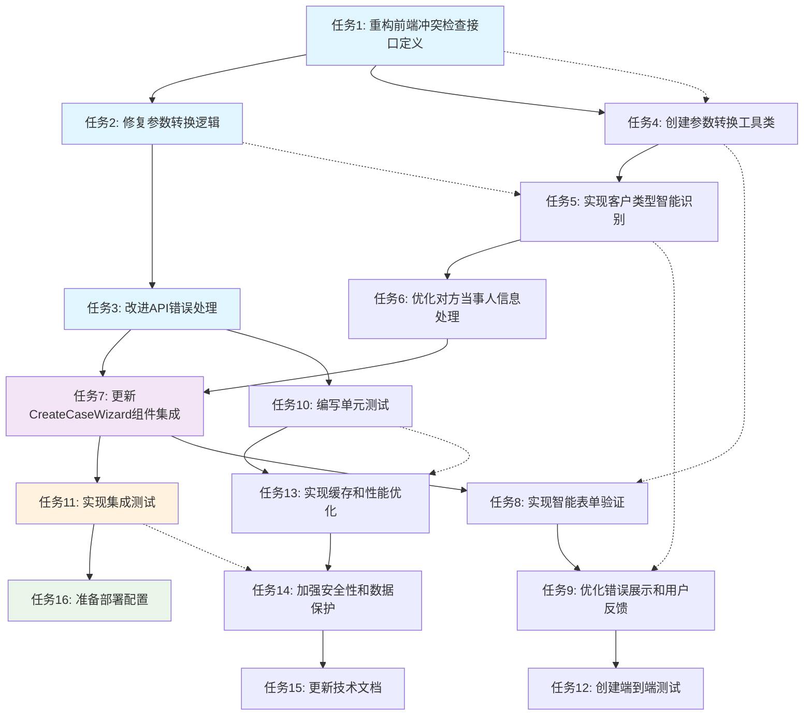

# 利益冲突检查功能修复实施计划

## 项目概述

本文档描述了律师事务所办公自动化系统中利益冲突检查功能修复的详细实施计划。该功能当前在新建案件时执行利益冲突检查出现400错误，主要原因是前后端API参数格式不匹配。

## 技术背景

**问题根因分析：**
- 前端发送的参数字段名与后端期望的格式不匹配
- 前端使用 `clientId` (number)，后端期望 `clientId` (string)
- 缺少必需字段 `clientType` 的正确枚举值
- 参数转换逻辑不完整，缺少默认值处理
- 错误处理机制不完善，用户体验差

**技术栈：**
- 前端：React + TypeScript + Vite + Antd
- 后端：Go + Gin + MySQL
- 测试：Jest + React Testing Library (前端), Go test (后端)

## 实施任务

### 阶段1：前端接口重构 (最高优先级)

- [ ] 1. 重构前端冲突检查接口定义
  - 更新 `frontend/src/api/conflict.ts` 中的 `ConflictCheckRequest` 接口
  - 确保字段名与后端期望一致：`clientId`, `clientName`, `caseName`, `caseType`, `clientType`
  - 添加必需的 `userId` 和 `requestTime` 字段
  - 使用正确的枚举类型定义
  - _Requirements: 1.1, 1.2, 2.1, 2.2_

- [ ] 2. 修复参数转换逻辑
  - 在 `frontend/src/api/conflict.ts` 中实现完整的参数转换
  - 确保 `clientId` 从 number 转换为 string
  - 根据客户信息正确确定 `clientType` 枚举值 ('PERSON' | 'COMPANY')
  - 添加默认值处理逻辑
  - 实现字段映射和数据验证
  - _Requirements: 1.1, 1.3, 6.1, 6.2_

- [ ] 3. 改进API错误处理
  - 实现详细的错误分类和处理逻辑
  - 在API调用失败时提供具体的错误信息
  - 添加参数验证失败的详细字段级错误提示
  - 实现降级模式和重试机制
  - _Requirements: 3.1, 3.2, 3.3, 3.4_

### 阶段2：参数转换组件优化

- [ ] 4. 创建参数转换工具类
  - 新建 `frontend/src/utils/conflictParamConverter.ts`
  - 实现表单数据到API请求的完整转换逻辑
  - 添加数据验证和类型检查
  - 实现字段映射和默认值设置
  - _Requirements: 6.1, 6.2, 6.3, 6.4_

- [ ] 5. 实现客户类型智能识别
  - 基于客户数据自动识别个人/企业客户
  - 支持客户名称和公司名称的区分逻辑
  - 实现 `clientType` 枚举值的准确映射
  - 添加特殊情况的处理逻辑
  - _Requirements: 5.1, 5.2, 5.3, 5.4_

- [ ] 6. 优化对方当事人信息处理
  - 实现对方当事人信息的格式化和分割
  - 支持多个对方当事人的处理
  - 添加信息清理和标准化逻辑
  - 实现特殊字符和格式的处理
  - _Requirements: 1.3, 6.2_

### 阶段3：组件集成和用户体验

- [ ] 7. 更新CreateCaseWizard组件集成
  - 修改 `frontend/src/components/CreateCaseWizard.tsx` 中的冲突检查调用
  - 集成新的参数转换逻辑
  - 改进用户输入验证和反馈
  - 实现加载状态和进度指示
  - _Requirements: 8.1, 8.2, 8.3, 8.4_

- [ ] 8. 实现智能表单验证
  - 添加实时的字段验证逻辑
  - 实现客户信息的自动补全和验证
  - 添加案件类型和客户类型的关联验证
  - 实现必填字段和格式检查
  - _Requirements: 3.3, 8.1_

- [ ] 9. 优化错误展示和用户反馈
  - 设计清晰的错误信息展示界面
  - 实现字段级错误提示
  - 添加错误修复建议和指导
  - 实现用户友好的错误恢复机制
  - _Requirements: 3.1, 3.2, 3.3, 3.4_

### 阶段4：测试和验证

- [ ] 10. 编写单元测试
  - 为参数转换工具类编写全面的单元测试
  - 测试各种数据格式和边界情况
  - 实现API接口的模拟测试
  - 验证错误处理逻辑的正确性
  - _Requirements: 7.1, 7.3, 7.4_

- [ ] 11. 实现集成测试
  - 测试完整的冲突检查流程
  - 验证前后端参数传递的正确性
  - 测试各种用户输入场景
  - 验证错误处理的完整性
  - _Requirements: 7.2, 7.3, 7.4_

- [ ] 12. 创建端到端测试
  - 实现完整的案件创建流程测试
  - 测试利益冲突检查的完整用户旅程
  - 验证UI交互和数据流的正确性
  - 测试各种异常情况和恢复机制
  - _Requirements: 7.2, 8.4_

### 阶段5：性能优化和安全性

- [ ] 13. 实现缓存和性能优化
  - 添加冲突检查结果的缓存机制
  - 实现防抖和节流优化
  - 优化大数据量的处理性能
  - 实现智能重试和超时处理
  - _Requirements: 10.1, 10.2, 10.3, 10.4_

- [ ] 14. 加强安全性和数据保护
  - 实现输入数据的安全验证
  - 添加敏感信息的脱敏处理
  - 实现请求频率限制
  - 加强日志记录的安全处理
  - _Requirements: 9.1, 9.2, 9.3, 9.4_

### 阶段6：文档和部署准备

- [ ] 15. 更新技术文档
  - 更新API接口文档
  - 编写参数转换逻辑说明
  - 创建错误处理指南
  - 更新组件使用文档
  - _Requirements: 4.1, 4.2, 4.3, 4.4_

- [ ] 16. 准备部署配置
  - 创建测试环境的部署配置
  - 准备生产环境的部署计划
  - 实现功能开关和灰度发布
  - 准备回滚和应急方案
  - _Requirements: 4.1, 4.2, 4.3, 4.4_

## 验收标准

每个任务完成后需要满足以下验收标准：

### 功能性验收
- [ ] 冲突检查API调用成功，无400错误
- [ ] 参数格式完全匹配后端期望
- [ ] 支持个人和企业客户的正确识别
- [ ] 错误信息清晰具体，便于用户理解

### 技术性验收
- [ ] 代码通过TypeScript类型检查
- [ ] 所有单元测试通过，覆盖率 > 80%
- [ ] 集成测试验证完整流程
- [ ] 性能指标满足要求（响应时间 < 5秒）

### 用户体验验收
- [ ] 界面操作流畅，无卡顿
- [ ] 错误提示友好，有明确的修复指导
- [ ] 加载状态清晰，用户了解操作进度
- [ ] 支持键盘操作和无障碍访问

## 风险评估和应对

### 高风险项
1. **参数格式不匹配** - 通过详细的测试和验证确保兼容性
2. **现有功能回归** - 实施全面的回归测试
3. **性能影响** - 添加性能监控和优化措施

### 中风险项
1. **用户体验变化** - 通过用户测试验证改进效果
2. **数据一致性** - 实现数据验证和校验机制

### 应对策略
- 实施分阶段发布，降低风险
- 保留原有逻辑作为降级方案
- 建立监控和告警机制
- 准备快速回滚方案

## 时间估算

| 阶段 | 任务数量 | 预估工作量 | 工期 |
|------|----------|------------|------|
| 阶段1：前端接口重构 | 3 | 8-10人时 | 1-2天 |
| 阶段2：参数转换组件 | 3 | 6-8人时 | 1-2天 |
| 阶段3：组件集成 | 3 | 8-10人时 | 2-3天 |
| 阶段4：测试验证 | 3 | 10-12人时 | 2-3天 |
| 阶段5：性能安全 | 2 | 6-8人时 | 1-2天 |
| 阶段6：文档部署 | 2 | 4-6人时 | 1天 |
| **总计** | **16** | **42-54人时** | **8-13天** |

## 成功指标

### 技术指标
- [ ] 400错误率降至 0%
- [ ] API响应时间 < 3秒
- [ ] 测试覆盖率 > 85%
- [ ] 代码质量评分 > 8.5/10

### 业务指标
- [ ] 冲突检查成功率 > 99%
- [ ] 用户操作完成率提升 30%
- [ ] 错误处理满意度 > 90%
- [ ] 系统稳定性提升 50%

## 任务依赖关系

### 关键路径
1. 任务1 → 任务2 → 任务3 → 任务7 → 任务11 → 任务16
2. 任务4 → 任务5 → 任务6 → 任务7
3. 任务8 → 任务9 → 任务12
4. 任务10 → 任务13 → 任务14 → 任务15

### 并行执行
- 任务1、4、8可以并行开始
- 任务2、5、9可以在前置任务完成后并行执行
- 任务10、13可以在功能开发完成后并行进行

## 质量保证

### 代码审查
- 每个任务完成后进行代码审查
- 重点检查类型安全性和错误处理
- 验证与现有代码的一致性
- 确保文档和注释的完整性

### 测试策略
- 单元测试：覆盖所有核心逻辑
- 集成测试：验证组件间交互
- 端到端测试：模拟真实用户场景
- 性能测试：验证响应时间和并发能力

### 部署策略
- 测试环境：完整功能和性能验证
- 预生产环境：真实数据验证
- 生产环境：灰度发布和监控
- 回滚准备：快速回退机制

## 任务执行指南

### 开始任务前的准备
1. 阅读相关的设计文档和需求文档
2. 了解现有代码结构和约定
3. 确认开发环境和依赖项
4. 创建功能分支进行开发

### 任务执行过程
1. 按照任务描述实现功能
2. 编写相应的测试代码
3. 进行本地测试和验证
4. 更新相关文档
5. 提交代码审查

### 任务完成标准
1. 功能实现符合需求
2. 测试全部通过
3. 代码质量达标
4. 文档更新完整
5. 代码审查通过

## 任务依赖关系图

### 依赖关系说明

#### 关键路径 (Critical Path)
**任务1 → 任务2 → 任务3 → 任务7 → 任务11 → 任务16**
- 这是项目的核心路径，决定了最短完成时间
- 任何延迟都会影响整个项目的交付时间

#### 主要分支路径

**1. 参数转换优化路径**
- 任务1 → 任务4 → 任务5 → 任务6 → 任务7
- 专注于参数处理逻辑的完善

**2. 用户体验优化路径**
- 任务7 → 任务8 → 任务9 → 任务12
- 专注于用户界面和交互的改进

**3. 质量保证路径**
- 任务3 → 任务10 → 任务13 → 任务14 → 任务15
- 专注于测试、性能和安全性

#### 并行执行机会
- **第一轮并行**: 任务1、任务4、任务8可以同时开始
- **第二轮并行**: 任务2、任务5、任务9可以在第一轮完成后并行
- **第三轮并行**: 任务10、任务13可以在功能开发完成后并行

#### 关键里程碑
1. **M1 (任务3完成)**: 前端接口重构完成
2. **M2 (任务7完成)**: 核心功能集成完成
3. **M3 (任务12完成)**: 测试验证完成
4. **M4 (任务16完成)**: 项目交付完成

---

**注意事项：**
- 每个任务都应该独立可测试
- 保持与现有代码风格的一致性
- 及时更新相关文档和注释
- 遇到问题及时沟通和反馈
- 确保向后兼容性和系统稳定性