# 文档管理功能增强设计文档

## 概述

本文档详细描述律师事务所办公自动化系统文档管理功能的全面增强设计。该设计基于现代微服务架构原则，集成文档版本控制、智能搜索、安全权限控制、在线预览编辑以及批量处理等核心能力，满足法律行业对文档管理的特殊合规和安全要求。

### 设计目标
- **可扩展性**: 支持大规模用户和文档处理
- **安全性**: 符合法律行业的数据保护和隐私要求
- **性能**: 快速搜索响应、低延迟操作
- **可维护性**: 清晰的代码结构和完整的文档
- **集成性**: 与现有系统的无缝对接
- **合规性**: 满足相关法律法规要求

### 技术栈选择
- **后端框架**: Go 1.23+ + Gin
- **搜索引擎**: Elasticsearch 8+
- **权限控制**: Casbin ABAC
- **缓存**: Redis 7+
- **数据库**: MySQL 8.0+
- **消息队列**: Redis/RabbitMQ
- **OCR服务**: Tesseract + AI增强
- **文档处理**: LibreOffice/Apache POI

## 系统架构设计

### 系统架构图

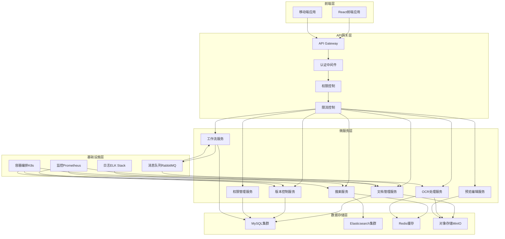

### 数据流图

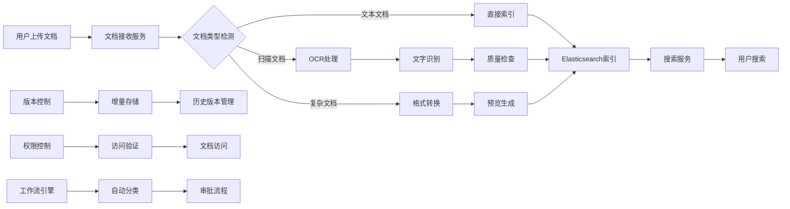

## 组件设计

### 文档管理核心组件

#### DocumentService
- **职责**: 文档CRUD操作、元数据管理、文件存储协调
- **接口**:
  - `UploadDocument(ctx context.Context, file *multipart.FileHeader, metadata *DocumentMetadata) (*Document, error)`
  - `GetDocument(ctx context.Context, id string) (*Document, error)`
  - `UpdateDocument(ctx context.Context, id string, metadata *DocumentMetadata) (*Document, error)`
  - `DeleteDocument(ctx context.Context, id string) error`
  - `SearchDocuments(ctx context.Context, query *SearchQuery) (*SearchResult, error)`
- **依赖**: DocumentRepository, StorageService, PermissionService

#### VersionControlService
- **职责**: 文档版本管理、差异对比、历史追踪
- **接口**:
  - `CreateVersion(ctx context.Context, documentID string, content []byte) (*Version, error)`
  - `GetVersionHistory(ctx context.Context, documentID string) ([]*Version, error)`
  - `CompareVersions(ctx context.Context, v1ID, v2ID string) (*VersionDiff, error)`
  - `RestoreVersion(ctx context.Context, documentID, versionID string) error`
- **依赖**: VersionRepository, DiffEngine, StorageService

#### SearchService
- **职责**: 全文搜索、智能推荐、搜索分析
- **接口**:
  - `IndexDocument(ctx context.Context, document *Document) error`
  - `Search(ctx context.Context, query *SearchRequest) (*SearchResponse, error)`
  - `Suggest(ctx context.Context, partial string) ([]*Suggestion, error)`
  - `AdvancedSearch(ctx context.Context, criteria *AdvancedSearchCriteria) (*SearchResponse, error)`
- **依赖**: ElasticsearchClient, OCRService, PermissionService

#### OCRProcessingService
- **职责**: 文字识别、质量检查、结果优化
- **接口**:
  - `ProcessDocument(ctx context.Context, documentID string) (*OCRResult, error)`
  - `ValidateOCRResult(ctx context.Context, result *OCRResult) (*ValidationResult, error)`
  - `EnhanceOCRResult(ctx context.Context, result *OCRResult) (*OCRResult, error)`
- **依赖**: TesseractClient, AIEnhancementService, QualityValidator

### 支持组件

#### StorageService
- **职责**: 文件存储、访问控制、生命周期管理
- **接口**:
  - `Store(ctx context.Context, key string, data []byte) error`
  - `Retrieve(ctx context.Context, key string) ([]byte, error)`
  - `Delete(ctx context.Context, key string) error`
  - `GetPresignedURL(ctx context.Context, key string, expiry time.Duration) (string, error)`
- **依赖**: MinIOClient, EncryptionService

#### PermissionService
- **职责**: ABAC权限控制、权限验证、权限审计
- **接口**:
  - `CheckPermission(ctx context.Context, subject, object, action string) (bool, error)`
  - `GrantPermission(ctx context.Context, policy *Policy) error`
  - `RevokePermission(ctx context.Context, policyID string) error`
  - `GetAccessibleDocuments(ctx context.Context, userID string) ([]string, error)`
- **依赖**: CasbinEnforcer, PolicyRepository

#### WorkflowService
- **职责**: 工作流编排、任务调度、状态管理
- **接口**:
  - `StartWorkflow(ctx context.Context, workflowID string, input *WorkflowInput) (*WorkflowInstance, error)`
  - `ProcessTask(ctx context.Context, taskID string, action *TaskAction) error`
  - `GetWorkflowStatus(ctx context.Context, instanceID string) (*WorkflowStatus, error)`
- **依赖**: WorkflowEngine, TaskQueue, StateRepository

## 数据模型设计

### 核心数据结构定义

```typescript
// 文档基础模型
interface Document {
  id: string;
  title: string;
  description?: string;
  fileName: string;
  fileSize: number;
  mimeType: string;
  checksum: string;
  category: DocumentCategory;
  classification: SecurityClassification;
  ownerId: string;
  caseId?: string;
  clientId?: string;
  tags: string[];
  metadata: DocumentMetadata;
  createdAt: Date;
  updatedAt: Date;
  version: number;
  status: DocumentStatus;
}

// 文档版本模型
interface DocumentVersion {
  id: string;
  documentId: string;
  versionNumber: number;
  title: string;
  description?: string;
  contentHash: string;
  diffWithPrevious?: string;
  changeDescription?: string;
  authorId: string;
  createdAt: Date;
  isCurrent: boolean;
  storageLocation: string;
}

// 文档元数据
interface DocumentMetadata {
  language: string;
  pageCount?: number;
  wordCount?: number;
  hasOCR: boolean;
  ocrConfidence?: number;
  extractedEntities?: Entity[];
  keywords: string[];
  summary?: string;
  customFields: Record<string, any>;
}

// 权限策略
interface PermissionPolicy {
  id: string;
  name: string;
  description?: string;
  subject: Subject;
  resource: Resource;
  actions: Action[];
  conditions: Condition[];
  effect: 'allow' | 'deny';
  priority: number;
  createdAt: Date;
  updatedAt: Date;
}

// 搜索索引
interface SearchIndex {
  documentId: string;
  title: string;
  content: string;
  metadata: Record<string, any>;
  permissions: string[];
  indexedAt: Date;
  lastModified: Date;
}
```

### 数据库表结构设计

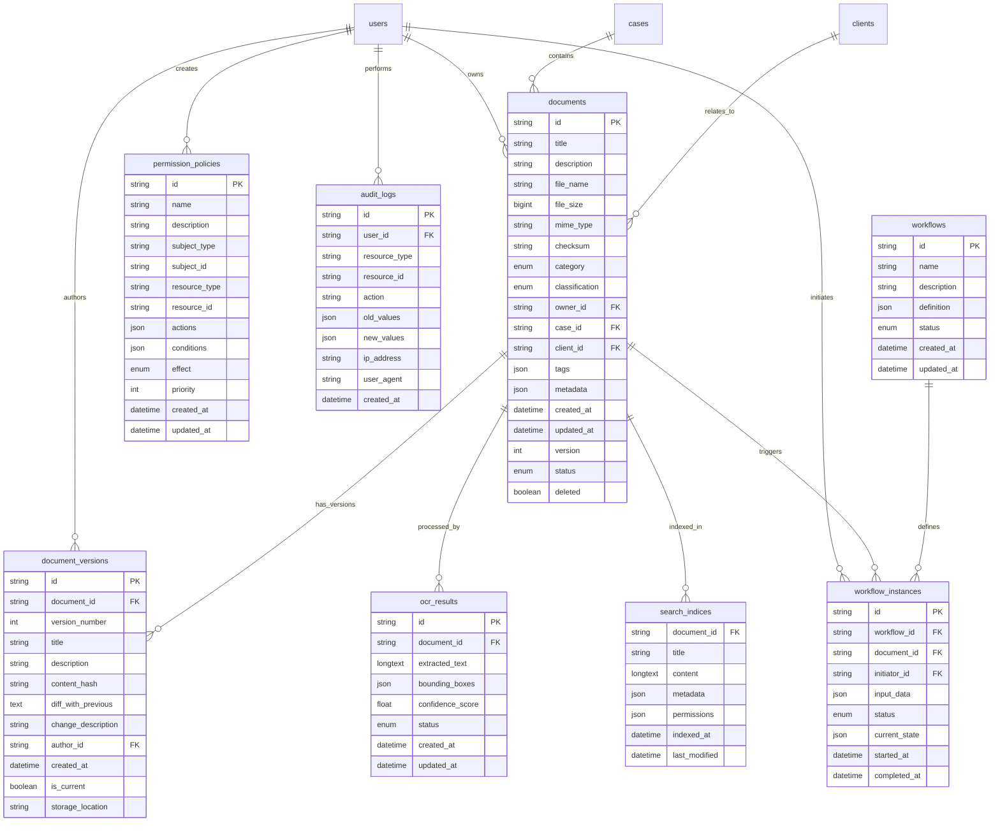

## 业务流程设计

### 文档上传处理流程

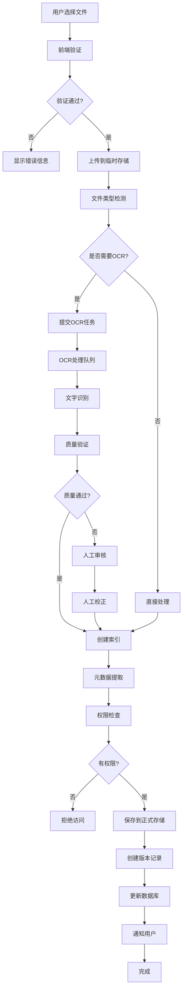

### 文档搜索流程

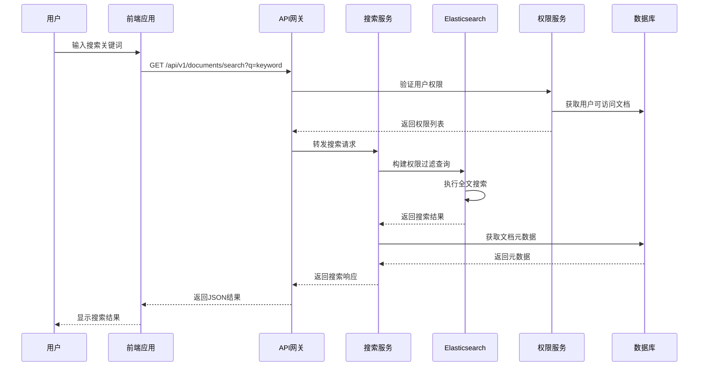

### 版本控制流程

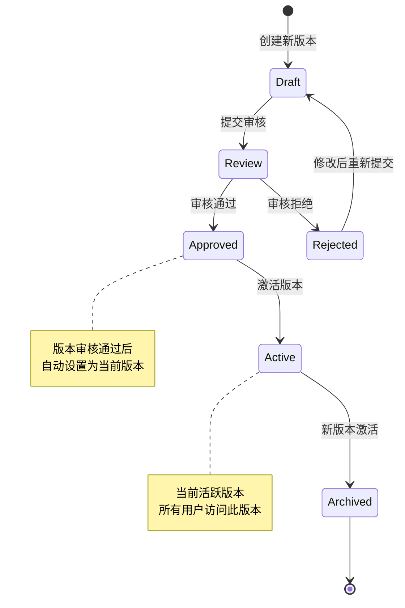

### 权限控制流程

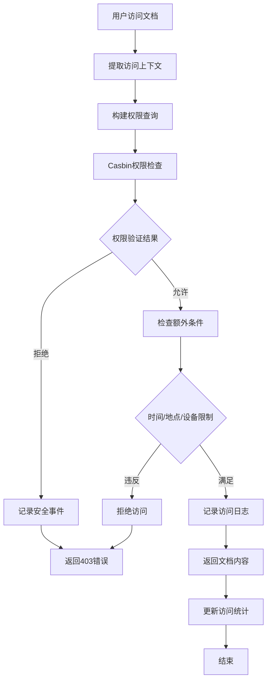

## 错误处理策略

### 分层错误处理

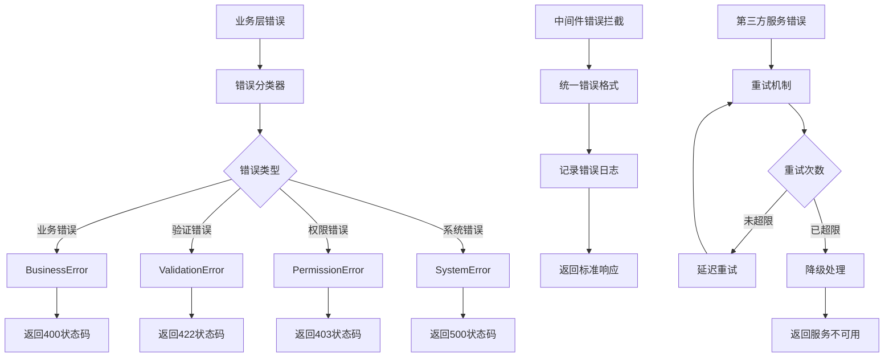

### 错误恢复机制

1. **文档上传失败恢复**
   - 本地缓存上传队列
   - 自动重试机制
   - 断点续传支持

2. **搜索服务故障恢复**
   - 缓存热点搜索结果
   - 降级到数据库搜索
   - 服务熔断机制

3. **OCR处理错误恢复**
   - 任务队列重试
   - 人工审核入口
   - 多OCR引擎备选

4. **权限服务故障恢复**
   - 缓存权限规则
   - 默认拒绝策略
   - 降级到基础权限

### 监控和告警

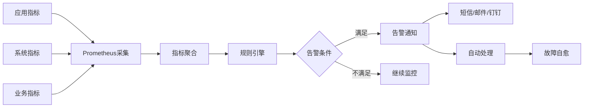

## 测试策略

### 单元测试
- **覆盖率要求**: ≥ 80%
- **测试框架**: testify
- **Mock工具**: go-sqlmock, testify/mock
- **重点测试**:
  - 核心业务逻辑
  - 数据处理函数
  - 权限验证逻辑

### 集成测试
- **API测试**: HTTP接口完整流程
- **数据库测试**: 事务和一致性
- **第三方服务**: Elasticsearch、Redis集成
- **测试环境**: docker-compose测试环境

### 性能测试
- **负载测试**: 并发用户访问
- **压力测试**: 系统极限容量
- **搜索性能**: 大数据量搜索响应
- **文件处理**: 大文件上传处理

### 安全测试
- **渗透测试**: 权限绕过尝试
- **数据安全**: 敏感信息泄露
- **注入攻击**: SQL注入、XSS防护
- **访问控制**: 越权访问检测

## 部署架构设计

### 容器化部署

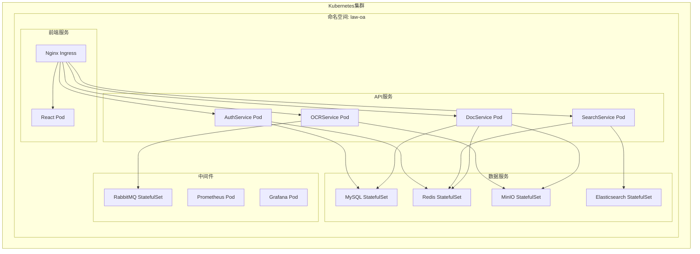

### 环境配置

#### 开发环境
```yaml
# docker-compose.dev.yml
version: '3.8'
services:
  law-oa-api:
    build: .
    ports:
      - "8080:8080"
    environment:
      - GO_ENV=development
      - DB_HOST=mysql-dev
      - ES_HOST=es-dev
    volumes:
      - ./internal:/app/internal
      - ./logs:/app/logs

  mysql-dev:
    image: mysql:8.0
    environment:
      - MYSQL_ROOT_PASSWORD=dev123
      - MYSQL_DATABASE=law_oa_dev
    volumes:
      - mysql_dev_data:/var/lib/mysql

  es-dev:
    image: elasticsearch:8.8.0
    environment:
      - discovery.type=single-node
      - xpack.security.enabled=false
    volumes:
      - es_dev_data:/usr/share/elasticsearch/data

volumes:
  mysql_dev_data:
  es_dev_data:
```

#### 生产环境
```yaml
# k8s/production/deployment.yaml
apiVersion: apps/v1
kind: Deployment
metadata:
  name: law-oa-document-service
spec:
  replicas: 3
  selector:
    matchLabels:
      app: law-oa-document-service
  template:
    metadata:
      labels:
        app: law-oa-document-service
    spec:
      containers:
      - name: document-service
        image: law-oa/document-service:v2.1.0
        ports:
        - containerPort: 8080
        env:
        - name: GO_ENV
          value: "production"
        - name: DB_HOST
          valueFrom:
            secretKeyRef:
              name: db-credentials
              key: host
        resources:
          requests:
            memory: "256Mi"
            cpu: "250m"
          limits:
            memory: "512Mi"
            cpu: "500m"
        livenessProbe:
          httpGet:
            path: /health
            port: 8080
          initialDelaySeconds: 30
          periodSeconds: 10
```

### CI/CD流水线

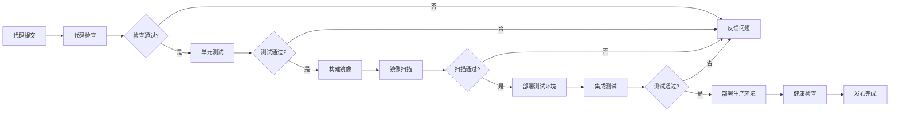

## 性能优化策略

### 搜索性能优化

1. **索引优化**
   - 合理设计分片策略
   - 使用合适的数据类型
   - 定期索引优化

2. **查询优化**
   - 缓存热点查询
   - 使用过滤器而非查询
   - 分页限制结果数量

3. **缓存策略**
   - Redis缓存搜索结果
   - 本地缓存热门文档
   - CDN缓存静态资源

### 文件处理优化

1. **异步处理**
   - 大文件分块上传
   - 后台OCR处理
   - 任务队列管理

2. **存储优化**
   - 分布式文件存储
   - 数据压缩算法
   - 生命周期管理

### 数据库优化

1. **查询优化**
   - 合理使用索引
   - 分页查询优化
   - 连接池配置

2. **读写分离**
   - 主从复制架构
   - 读请求分发
   - 写请求集中

## 安全架构设计

### 数据安全

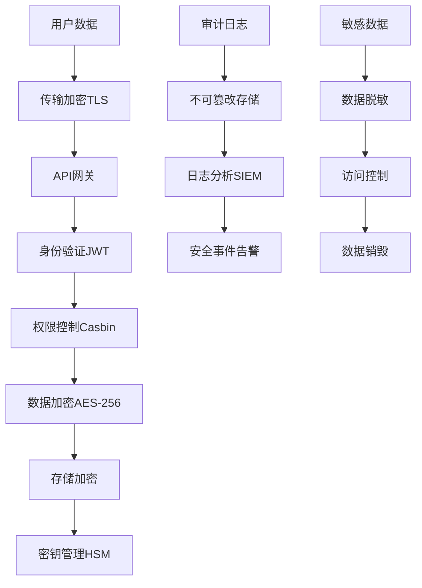

### 权限控制架构

```typescript
// ABAC权限模型
interface ABACPolicy {
  subject: {
    userId: string;
    roles: string[];
    department: string;
    clearance: SecurityLevel;
  };
  resource: {
    type: ResourceType;
    id: string;
    classification: SecurityClassification;
    owner: string;
    attributes: Record<string, any>;
  };
  action: ActionType;
  environment: {
    time: DateRange;
    location: GeoLocation;
    device: DeviceInfo;
    network: NetworkInfo;
  };
  conditions: PolicyCondition[];
  effect: 'allow' | 'deny';
}

// 权限决策过程
const accessDecision = await casbinEnforcer.enforce({
  subject: userContext,
  resource: documentContext,
  action: requestedAction,
  environment: environmentContext
});
```

### 合规性设计

1. **数据保护合规**
   - GDPR数据保护要求
   - 个人信息最小化原则
   - 数据保留期限管理

2. **法律行业合规**
   - 证据链完整性
   - 审计追踪完整性
   - 电子签名合法性

3. **安全认证**
   - ISO 27001信息安全
   - 等保三级要求
   - 行业安全标准

## 技术选型说明

### 核心技术选择

| 技术领域 | 选择方案 | 理由 | 备选方案 |
|---------|---------|------|---------|
| 后端框架 | Go 1.23 + Gin | 高性能、并发友好、易于部署 | Node.js + Express, Java + Spring Boot |
| 搜索引擎 | Elasticsearch 8+ | 成熟稳定、功能丰富、社区活跃 | Solr, Algolia |
| 权限控制 | Casbin ABAC | 灵活策略、支持多语言、易于集成 | OPA, Keycloak |
| 缓存系统 | Redis 7+ | 高性能、数据结构丰富、持久化 | Memcached, Hazelcast |
| 数据库 | MySQL 8.0+ | 成熟稳定、ACID支持、事务处理 | PostgreSQL, MongoDB |
| 消息队列 | RabbitMQ | 可靠性高、功能丰富、易于管理 | Apache Kafka, Redis Pub/Sub |
| OCR服务 | Tesseract + AI增强 | 开源免费、识别率高、可扩展 | Google Cloud Vision, Azure OCR |
| 容器编排 | Kubernetes | 行业标准、功能强大、生态完善 | Docker Swarm, OpenShift |

### 架构决策记录 (ADR)

#### ADR-001: 选择微服务架构
- **状态**: 已接受
- **决策**: 采用微服务架构而非单体架构
- **理由**:
  - 独立部署和扩展
  - 技术栈灵活性
  - 故障隔离能力
  - 团队并行开发
- **后果**:
  - 运维复杂度增加
  - 分布式事务挑战
  - 服务间通信开销

#### ADR-002: 选择Elasticsearch作为搜索引擎
- **状态**: 已接受
- **决策**: 使用Elasticsearch而非数据库全文搜索
- **理由**:
  - 专业的搜索功能
  - 高性能查询能力
  - 丰富的查询语法
  - 实时索引更新
- **后果**:
  - 增加系统组件
  - 学习曲线成本
  - 数据同步复杂性

#### ADR-003: 选择Casbin进行权限控制
- **状态**: 已接受
- **决策**: 使用Casbin实现ABAC权限模型
- **理由**:
  - 灵活的策略表达
  - 高性能策略决策
  - 易于集成和测试
  - 多语言支持
- **后果**:
  - 策略管理复杂性
  - 学习曲线较陡
  - 调试困难

## 监控和运维

### 监控指标体系

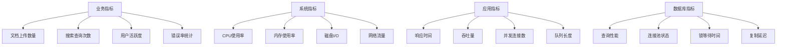

### 日志管理策略

1. **结构化日志**
   ```json
   {
     "timestamp": "2024-10-21T10:30:00Z",
     "level": "INFO",
     "service": "document-service",
     "trace_id": "abc123",
     "user_id": "user456",
     "action": "document_upload",
     "document_id": "doc789",
     "duration_ms": 1250,
     "metadata": {
       "file_size": 1048576,
       "mime_type": "application/pdf"
     }
   }
   ```

2. **日志聚合**
   - ELK Stack集中日志收集
   - 按服务和模块分类
   - 实时日志分析

3. **告警规则**
   - 错误率超过阈值
   - 响应时间过长
   - 资源使用率过高
   - 服务不可用

### 备份和恢复

1. **数据备份策略**
   - 数据库定期全量备份
   - 增量备份日志
   - 文档存储异地备份
   - 配置文件版本控制

2. **灾难恢复**
   - RTO (恢复时间目标): < 4小时
   - RPO (恢复点目标): < 1小时
   - 多可用区部署
   - 自动故障切换

## 项目实施计划

### 开发阶段划分

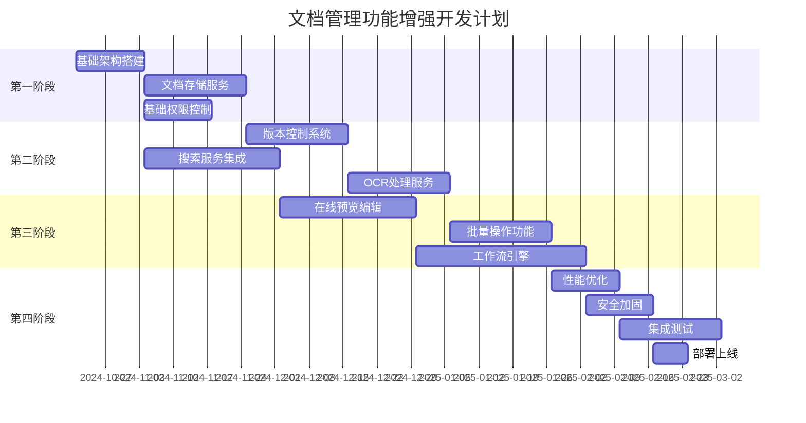

### 里程碑定义

1. **第一阶段完成 (MVP)**
   - 基础文档上传下载
   - 简单权限控制
   - 基础搜索功能

2. **第二阶段完成 (核心功能)**
   - 完整版本管理
   - 智能搜索集成
   - OCR文字识别

3. **第三阶段完成 (高级功能)**
   - 在线协作编辑
   - 批量操作支持
   - 自动化工作流

4. **第四阶段完成 (生产就绪)**
   - 性能优化达标
   - 安全加固完成
   - 全面测试验证

## 总结

本设计文档提供了文档管理功能增强的完整技术方案，涵盖了系统架构、数据模型、业务流程、安全策略等各个方面。设计遵循现代软件架构最佳实践，充分考虑了法律行业的特殊需求，确保系统的可扩展性、安全性和可维护性。

通过采用微服务架构、Elasticsearch搜索引擎、Casbin权限控制等成熟技术，能够构建一个功能强大、性能优秀的文档管理系统。同时，完善的监控、日志和备份策略保证了系统的稳定运行和数据安全。

该设计为后续的开发实施提供了清晰的指导，能够有效支撑律师事务所的数字化转型需求。