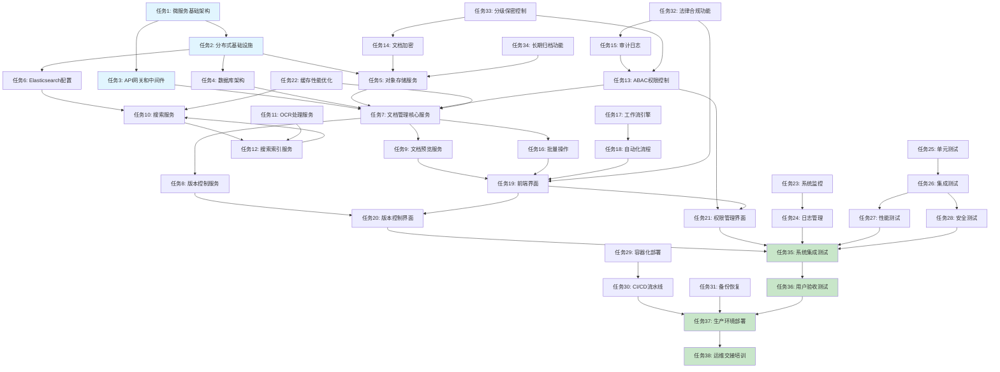

# 文档管理功能增强实施任务列表

## 实施计划概述

基于需求文档和设计文档，本文档将功能增强分解为具体的可执行任务。每个任务都包含明确的验收标准、技术指导、依赖关系和安全考虑。

## 核心架构和基础设施任务

- [ ] 1. 搭建微服务基础架构
  - 创建独立的微服务目录结构和通用组件
  - 实现服务注册发现机制和负载均衡配置
  - 设置统一的日志、监控和配置管理
  - _要求: 集成要求1.1, 集成要求1.4, 技术要求1.1_

- [ ] 2. 配置分布式基础设施
  - 部署Elasticsearch集群并配置分片策略
  - 配置Redis缓存集群和持久化设置
  - 设置MinIO对象存储服务和访问控制
  - 配置RabbitMQ消息队列集群
  - _要求: 技术要求1.2, 技术要求2.1, 技术要求2.2_

- [ ] 3. 实现API网关和中间件
  - 创建统一的API网关入口和路由规则
  - 实现JWT身份验证中间件
  - 集成Casbin ABAC权限控制中间件
  - 添加限流、熔断和监控中间件
  - _要求: 集成要求1.2, 权限要求1.1, 安全要求1.2_

## 数据存储和管理任务

- [ ] 4. 设计和实现数据库架构
  - 创建文档管理相关的MySQL数据表结构
  - 实现数据库迁移脚本和回滚机制
  - 配置数据库索引优化和查询性能调优
  - 设置数据库备份和恢复策略
  - _要求: 集成要求2.1, 集成要求2.3, 集成要求2.4_

- [ ] 5. 实现对象存储服务
  - 创建MinIO存储客户端和工具函数
  - 实现文件上传下载的加密和解密功能
  - 配置预签名URL生成和访问控制
  - 实现文件生命周期管理和自动清理
  - _要求: 安全要求1.1, 安全要求1.2, 版本管理要求2.1_

- [ ] 6. 配置Elasticsearch搜索引擎
  - 设计文档索引结构和字段映射
  - 实现文档内容索引的创建和更新机制
  - 配置中文分词器和分析器设置
  - 设置搜索结果高亮和排序规则
  - _要求: 搜索要求1.1, 搜索要求1.2, 搜索要求2.2_

## 文档管理核心服务任务

- [ ] 7. 实现文档管理核心服务
  - 创建DocumentService接口和基础实现
  - 实现文档上传、下载、更新、删除的CRUD操作
  - 添加文档元数据管理和自动提取功能
  - 实现文档分类和标签管理
  - _要求: 集成要求1.3, 工作流要求1.1_

- [ ] 8. 实现文档版本控制服务
  - 创建VersionControlService和版本数据模型
  - 实现文档版本的创建、查询和比较功能
  - 添加版本差异计算和显示功能
  - 实现版本恢复和历史回溯机制
  - _要求: 版本管理要求1.1, 版本管理要求1.2, 版本管理要求3.1_

- [ ] 9. 实现文档预览服务
  - 创建多种文档格式的预览转换器
  - 实现PDF、Office文档的在线预览功能
  - 添加图片格式转换和WebP优化支持
  - 实现预览内容缓存和性能优化
  - _要求: 预览要求1.1, 预览要求2.1, 预览要求2.2_

## 搜索和OCR处理任务

- [ ] 10. 实现全文搜索服务
  - 创建SearchService接口和Elasticsearch集成
  - 实现基础关键词搜索和高级搜索功能
  - 添加搜索结果排序、过滤和分页支持
  - 实现搜索建议和相关推荐功能
  - _要求: 搜索要求1.1, 搜索要求1.3, 搜索要求2.1_

- [ ] 11. 实现OCR文字识别服务
  - 集成Tesseract OCR引擎和配置多语言支持
  - 实现文档和图片的批量OCR处理
  - 添加OCR结果质量评估和置信度计算
  - 实现OCR结果的人工校正和优化接口
  - _要求: OCR要求1.1, OCR要求1.2, OCR要求2.1_

- [ ] 12. 实现搜索结果索引服务
  - 创建文档内容的实时索引更新机制
  - 实现OCR结果到搜索索引的自动同步
  - 添加索引重建和优化管理功能
  - 实现搜索权限过滤和访问控制
  - _要求: 搜索要求1.2, 权限要求1.1, 搜索要求2.3_

## 权限控制和安全任务

- [ ] 13. 实现ABAC权限控制系统
  - 集成Casbin权限框架和策略管理
  - 创建权限策略模型和规则引擎
  - 实现基于角色的权限分配和管理
  - 添加权限验证中间件和API保护
  - _要求: 权限要求1.1, 权限要求1.2, 权限要求2.1_

- [ ] 14. 实现文档加密和安全存储
  - 创建文档内容加密和解密服务
  - 实现AES-256加密算法和密钥管理
  - 添加传输层安全和HTTPS强制配置
  - 实现密钥轮换和重新加密机制
  - _要求: 安全要求1.1, 安全要求1.2, 安全要求1.4_

- [ ] 15. 实现审计日志和合规追踪
  - 创建完整的操作审计日志记录系统
  - 实现用户行为追踪和访问记录
  - 添加安全事件检测和告警机制
  - 实现合规报告生成和导出功能
  - _要求: 权限要求2.1, 合规要求1.1, 合规要求1.3_

## 批量操作和自动化任务

- [ ] 16. 实现批量操作功能
  - 创建批量文档上传和处理接口
  - 实现批量权限分配和管理功能
  - 添加批量操作进度跟踪和状态反馈
  - 实现批量操作结果汇总和错误处理
  - _要求: 批量操作要求1.1, 批量操作要求2.1, 批量操作要求2.3_

- [ ] 17. 实现工作流引擎
  - 创建工作流定义和执行引擎
  - 实现可视化工作流设计器和配置界面
  - 添加工作流实例管理和状态跟踪
  - 实现工作流任务分配和通知机制
  - _要求: 工作流要求1.1, 工作流要求1.2, 工作流要求2.1_

- [ ] 18. 实现自动化处理流程
  - 创建文档自动分类和标记规则引擎
  - 实现基于条件的自动化审批流程
  - 添加定时任务和批处理调度器
  - 实现异常处理和人工干预机制
  - _要求: 工作流要求1.1, 工作流要求1.3, 工作流要求1.4_

## 前端界面和用户体验任务

- [ ] 19. 实现文档管理前端界面
  - 创建文档列表、上传、详情页面组件
  - 实现文档预览和基础编辑功能界面
  - 添加文档搜索和高级搜索界面
  - 实现响应式设计和移动端适配
  - _要求: 可用性要求1.1, 可用性要求1.2, 可用性要求1.4_

- [ ] 20. 实现版本控制用户界面
  - 创建版本历史查看和比较界面
  - 实现版本恢复和回退操作界面
  - 添加版本差异显示和冲突解决界面
  - 实现版本审批流程的用户交互
  - _要求: 版本管理要求1.1, 版本管理要求1.3, 版本管理要求1.4_

- [ ] 21. 实现权限管理界面
  - 创建用户角色和权限分配界面
  - 实现权限策略配置和管理界面
  - 添加权限审计日志查看界面
  - 实现批量权限设置和管理界面
  - _要求: 权限要求1.2, 权限要求2.1, 权限要求2.2_

## 性能优化和监控任务

- [ ] 22. 实现缓存和性能优化
  - 配置Redis缓存策略和数据缓存管理
  - 实现搜索结果缓存和预加载机制
  - 添加文件预览缓存和CDN集成
  - 实现数据库查询优化和连接池管理
  - _要求: 性能要求1.1, 性能要求1.2, 性能要求1.4_

- [ ] 23. 实现系统监控和告警
  - 集成Prometheus监控和指标收集
  - 创建Grafana仪表盘和可视化监控
  - 实现业务指标监控和告警规则
  - 添加系统健康检查和自动恢复机制
  - _要求: 性能要求2.1, 性能要求2.2, 性能要求2.4_

- [ ] 24. 实现日志管理和分析
  - 配置结构化日志记录和格式标准化
  - 实现ELK日志聚合和分析系统
  - 添加日志查询和报表功能
  - 实现安全事件日志分析
  - _要求: 性能要求2.1, 可靠性要求1.2, 可靠性要求1.3_

## 测试和质量保证任务

- [ ] 25. 实现单元测试框架
  - 创建单元测试用例覆盖核心业务逻辑
  - 实现Mock测试和依赖注入
  - 添加测试数据生成和清理工具
  - 实现测试报告生成和覆盖率检查
  - _要求: 技术要求1.1, 技术要求1.2, 技术要求1.3_

- [ ] 26. 实现集成测试
  - 创建API接口集成测试用例
  - 实现数据库集成和事务测试
  - 添加第三方服务集成测试
  - 实现端到端业务流程测试
  - _要求: 技术要求1.1, 技术要求1.2, 技术要求1.3_

- [ ] 27. 实现性能测试
  - 创建负载测试和压力测试用例
  - 实现并发用户访问性能测试
  - 添加大文件处理性能测试
  - 实现搜索性能和响应时间测试
  - _要求: 性能要求1.1, 性能要求1.3, 性能要求1.4_

- [ ] 28. 实现安全测试
  - 创建权限绕过和越权访问测试
  - 实现数据安全和敏感信息泄露测试
  - 添加SQL注入和XSS攻击防护测试
  - 实现传输安全和数据加密测试
  - _要求: 安全要求1.1, 安全要求1.2, 权限要求1.4_

## 部署和运维任务

- [ ] 29. 实现容器化部署
  - 创建Docker镜像和Dockerfile配置
  - 实现docker-compose开发和测试环境
  - 添加Kubernetes部署配置文件
  - 实现多环境部署和配置管理
  - _要求: 技术要求2.1, 技术要求2.2, 技术要求2.3_

- [ ] 30. 实现CI/CD流水线
  - 创建自动化构建和测试流水线
  - 实现代码质量检查和安全扫描
  - 添加自动化部署和回滚机制
  - 实现环境变量管理和密钥保护
  - _要求: 技术要求2.1, 技术要求2.2, 技术要求2.4_

- [ ] 31. 实现备份和灾难恢复
  - 创建数据库和文件存储备份策略
  - 实现异地备份和冗余存储
  - 添加灾难恢复演练和测试
  - 实现数据完整性验证和恢复测试
  - _要求: 可靠性要求1.1, 可靠性要求1.3, 可靠性要求1.4_

## 法律行业特殊功能任务

- [ ] 32. 实现法律合规功能
  - 创建电子签名集成和验证功能
  - 实现证据链完整性保护机制
  - 添加文档归档和保留期管理
  - 实现合规报告和法律审计功能
  - _要求: 合规要求1.1, 合规要求1.2, 合规要求1.4_

- [ ] 33. 实现分级保密控制
  - 创建多级保密分类和管理机制
  - 实现敏感信息脱敏和访问控制
  - 添加保密违规检测和自动阻止
  - 实现保密审计和合规追踪
  - _要求: 保密要求1.1, 保密要求1.2, 保密要求1.3_

- [ ] 34. 实现长期归档功能
  - 创建文档格式长期保存策略
  - 实现归档存储和检索优化
  - 添加归档期满处理和销毁机制
  - 实现归档数据完整性和可读性验证
  - _要求: 归档要求1.1, 归档要求1.2, 归档要求1.3_

## 最终集成和验收任务

- [ ] 35. 实现系统集成测试
  - 执行完整的系统集成和端到端测试
  - 验证所有功能模块的协同工作
  - 测试系统性能和稳定性指标
  - 验证安全控制和合规要求
  - _要求: 集成要求1.1, 集成要求1.4, 可靠性要求1.1_

- [ ] 36. 实现用户验收测试
  - 创建用户场景测试用例和验收标准
  - 执行用户友好性和易用性测试
  - 验证业务流程的完整性和正确性
  - 收集用户反馈和改进建议
  - _要求: 可用性要求1.1, 可用性要求1.2, 可用性要求1.3_

- [ ] 37. 实现生产环境部署
  - 执行生产环境部署和配置
  - 进行生产环境性能调优和优化
  - 实现生产监控和告警配置
  - 执行生产数据迁移和验证
  - _要求: 技术要求2.1, 技术要求2.2, 可靠性要求1.1_

- [ ] 38. 实现运维交接和培训
  - 创建运维手册和故障处理指南
  - 进行系统运维培训和技术交接
  - 实现用户使用手册和培训材料
  - 建立技术支持和问题处理流程
  - _要求: 可用性要求1.2, 可靠性要求1.2, 可维护性要求_

## 任务依赖关系图

## 验收标准汇总

### 功能性验收标准
- 所有文档管理功能正常运行且满足业务需求
- 版本控制、搜索、权限控制等核心功能完整可用
- 用户界面友好易用，响应时间满足性能要求
- 系统稳定性和安全性达到设计指标

### 性能验收标准
- 文档上传处理：50MB以下文档10秒内完成
- 搜索响应时间：3秒内返回搜索结果
- 文档预览加载：5秒内完成文档加载
- 系统可用性：99.9%服务可用性
- 并发支持：支持设计并发用户数同时使用

### 安全性验收标准
- 通过安全渗透测试和漏洞扫描
- 满足法律行业数据保护和合规要求
- 审计日志完整且不可篡改
- 权限控制有效且粒度足够细

### 可维护性验收标准
- 代码覆盖率≥80%
- 文档完整且更新及时
- 监控和告警机制有效
- 运维流程规范且可操作