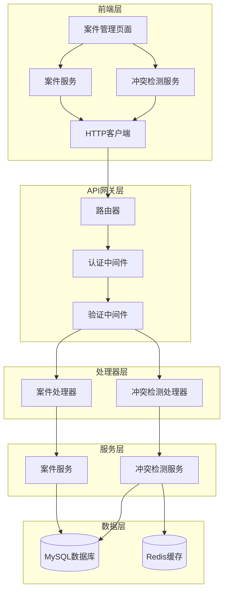
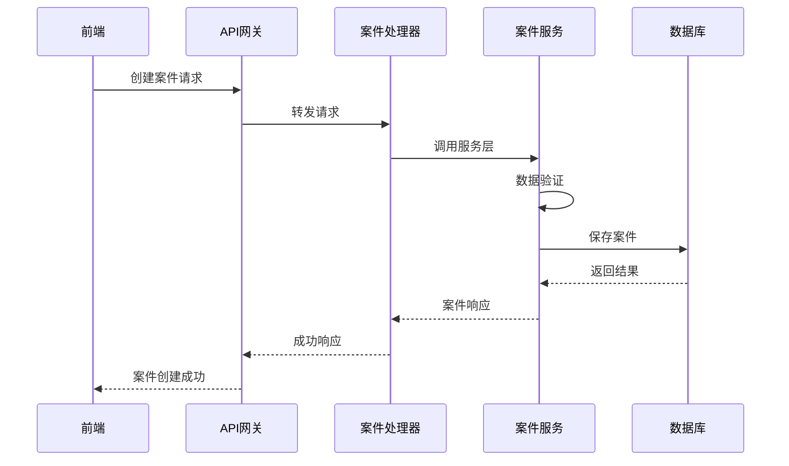

# Design Document

## Overview

本设计文档针对案件管理和利益冲突检测功能的问题提供全面的技术解决方案。通过分析测试报告和现有代码，识别出以下核心问题：

1. **案件添加失败 (422错误)**: 前后端数据格式不匹配，请求验证失败
2. **案件筛选功能异常**: 筛选参数映射和处理逻辑存在问题
3. **利益冲突检测失败 (404错误)**: API路由配置缺失或服务层错误
4. **冲突检测历史获取失败**: 历史记录查询接口问题

## Architecture

### 系统架构图



### 数据流架构



## Components and Interfaces

### 1. 案件管理组件修复

#### 1.1 前端案件服务优化
```typescript
// 修复后的案件服务接口
interface CaseServiceFix {
  // 标准化请求格式
  createCase(request: CreateCaseRequest): Promise<CaseResponse>;
  updateCase(id: number, request: UpdateCaseRequest): Promise<CaseResponse>;
  listCases(params: CaseListRequest): Promise<CaseListResponse>;

  // 增强筛选功能
  filterCases(filters: CaseFilters): Promise<CaseListResponse>;
}
```

#### 1.2 后端验证增强
```go
// 修复后的请求验证结构
type CreateCaseRequest struct {
    Title             string `json:"title" binding:"required,min=1,max=200"`
    Description       string `json:"description" binding:"max=2000"`
    ClientID          uint   `json:"client_id" binding:"required"`
    LawyerID          uint   `json:"lawyer_id" binding:"required"`
    CaseType          string `json:"case_type" binding:"required,oneof=civil criminal commercial administrative"`
    Priority          string `json:"priority" binding:"required,oneof=low medium high urgent"`
    Status            string `json:"status" binding:"omitempty,oneof=pending active closed suspended"`
}
```

### 2. 利益冲突检测组件重构

#### 2.1 API路由配置
```go
// 冲突检测路由组
conflictGroup := v1.Group("/conflict")
conflictGroup.POST("/check", conflictHandler.CheckConflict)
conflictGroup.GET("/history/:clientId", conflictHandler.GetCheckHistory)
conflictGroup.GET("/details/:checkId", conflictHandler.GetCheckDetails)
conflictGroup.GET("/health", conflictHandler.HealthCheck)
```

#### 2.2 服务层接口标准化
```go
type ConflictService interface {
    CheckConflict(ctx context.Context, req *ConflictCheckRequest) (*ConflictCheckResponse, error)
    GetCheckHistory(ctx context.Context, clientID string, limit int) ([]*ConflictCheckRecord, error)
    GetCheckDetails(ctx context.Context, checkID string) (*ConflictCheckRecord, error)
}
```

### 3. 错误处理和日志系统

#### 3.1 统一错误响应格式
```go
type APIResponse struct {
    Success bool        `json:"success"`
    Data    interface{} `json:"data,omitempty"`
    Error   *ErrorInfo  `json:"error,omitempty"`
    Meta    *MetaInfo   `json:"meta,omitempty"`
}

type ErrorInfo struct {
    Code        string   `json:"code"`
    Message     string   `json:"message"`
    Details     string   `json:"details,omitempty"`
    Suggestions []string `json:"suggestions,omitempty"`
}
```

#### 3.2 请求验证中间件增强
```go
func EnhancedValidationMiddleware() gin.HandlerFunc {
    return func(c *gin.Context) {
        // 详细的请求验证逻辑
        // 记录验证失败的具体原因
        // 返回用户友好的错误信息
    }
}
```

## Data Models

### 1. 案件数据模型优化

```go
type Case struct {
    ID          uint      `json:"id" gorm:"primaryKey"`
    CaseNumber  string    `json:"case_number" gorm:"uniqueIndex;not null"`
    Title       string    `json:"title" gorm:"not null;size:200"`
    Description string    `json:"description" gorm:"type:text"`
    ClientID    uint      `json:"client_id" gorm:"not null;index"`
    LawyerID    uint      `json:"lawyer_id" gorm:"index"`
    CaseType    string    `json:"case_type" gorm:"not null;size:50"`
    Priority    string    `json:"priority" gorm:"not null;size:20;default:'medium'"`
    Status      string    `json:"status" gorm:"not null;size:20;default:'pending'"`
    StartDate   *time.Time `json:"start_date"`
    EndDate     *time.Time `json:"end_date"`
    CreatedAt   time.Time `json:"created_at"`
    UpdatedAt   time.Time `json:"updated_at"`

    // 关联关系
    Client      *Client     `json:"client,omitempty" gorm:"foreignKey:ClientID"`
    Lawyer      *User       `json:"lawyer,omitempty" gorm:"foreignKey:LawyerID"`
    Conflicts   []Conflict  `json:"conflicts,omitempty" gorm:"many2many:case_conflicts;"`
}
```

### 2. 冲突检测数据模型

```go
type ConflictCheckRecord struct {
    ID            uint                   `json:"id" gorm:"primaryKey"`
    CheckID       string                 `json:"check_id" gorm:"uniqueIndex;not null"`
    ClientID      string                 `json:"client_id" gorm:"not null;index"`
    ClientName    string                 `json:"client_name" gorm:"not null"`
    CaseName      string                 `json:"case_name" gorm:"not null"`
    CaseType      string                 `json:"case_type" gorm:"not null"`
    HasConflict   bool                   `json:"has_conflict" gorm:"not null;default:false"`
    RiskLevel     string                 `json:"risk_level" gorm:"size:20"`
    CheckResult   JSON                   `json:"check_result" gorm:"type:json"`
    RequestParams JSON                   `json:"request_params" gorm:"type:json"`
    Duration      int                    `json:"duration" gorm:"default:0"` // 毫秒
    CreatedAt     time.Time              `json:"created_at"`
    UpdatedAt     time.Time              `json:"updated_at"`

    // 关联关系
    User          *User                  `json:"user,omitempty" gorm:"foreignKey:UserID"`
    UserID        uint                   `json:"user_id" gorm:"index"`
}
```

## Error Handling

### 1. 分层错误处理策略

#### 1.1 验证层错误
```go
type ValidationError struct {
    Field   string `json:"field"`
    Rule    string `json:"rule"`
    Message string `json:"message"`
    Value   interface{} `json:"value,omitempty"`
}

func (e ValidationError) Error() string {
    return fmt.Sprintf("验证失败: 字段'%s'不满足规则'%s': %s", e.Field, e.Rule, e.Message)
}
```

#### 1.2 业务逻辑层错误
```go
type BusinessError struct {
    Code    string `json:"code"`
    Message string `json:"message"`
    Details string `json:"details,omitempty"`
}

func (e BusinessError) Error() string {
    return fmt.Sprintf("业务错误[%s]: %s", e.Code, e.Message)
}
```

### 2. 错误响应标准化

```go
func HandleError(c *gin.Context, err error) {
    var response APIResponse

    switch e := err.(type) {
    case ValidationError:
        response = APIResponse{
            Success: false,
            Error: &ErrorInfo{
                Code:        "VALIDATION_ERROR",
                Message:     "请求参数验证失败",
                Details:     e.Error(),
                Suggestions: []string{"检查请求参数格式和必填字段"},
            },
        }
    case BusinessError:
        response = APIResponse{
            Success: false,
            Error: &ErrorInfo{
                Code:        e.Code,
                Message:     e.Message,
                Details:     e.Details,
                Suggestions: getBusinessErrorSuggestions(e.Code),
            },
        }
    default:
        response = APIResponse{
            Success: false,
            Error: &ErrorInfo{
                Code:        "INTERNAL_ERROR",
                Message:     "服务器内部错误",
                Details:     err.Error(),
                Suggestions: []string{"请稍后重试或联系技术支持"},
            },
        }
    }

    c.JSON(getHTTPStatusFromError(err), response)
}
```

## Testing Strategy

### 1. 单元测试策略

#### 1.1 案件服务测试
```go
func TestCaseService_CreateCase(t *testing.T) {
    tests := []struct {
        name    string
        request *CreateCaseRequest
        want    *CaseResponse
        wantErr bool
    }{
        {
            name: "成功创建案件",
            request: &CreateCaseRequest{
                Title:    "测试案件",
                ClientID: 1,
                LawyerID: 1,
                CaseType: "civil",
                Priority: "medium",
            },
            wantErr: false,
        },
        {
            name: "验证失败 - 缺少必填字段",
            request: &CreateCaseRequest{
                Title: "", // 空标题
            },
            wantErr: true,
        },
    }

    for _, tt := range tests {
        t.Run(tt.name, func(t *testing.T) {
            got, err := caseService.CreateCase(context.Background(), tt.request)
            if (err != nil) != tt.wantErr {
                t.Errorf("CreateCase() error = %v, wantErr %v", err, tt.wantErr)
                return
            }
            // 更多断言...
        })
    }
}
```

#### 1.2 冲突检测服务测试
```go
func TestConflictService_CheckConflict(t *testing.T) {
    service := NewConflictService(db, redis, true)

    req := &ConflictCheckRequest{
        ClientID:   "1",
        ClientName: "测试客户",
        CaseName:   "测试案件",
        CaseType:   "civil",
    }

    result, err := service.CheckConflict(context.Background(), req)
    assert.NoError(t, err)
    assert.NotNil(t, result)
    assert.IsType(t, &ConflictCheckResponse{}, result)
}
```

### 2. 集成测试策略

#### 2.1 API端点测试
```go
func TestCaseAPI_CreateCase(t *testing.T) {
    router := setupTestRouter()

    tests := []struct {
        name           string
        body           gin.H
        expectedStatus int
        expectedError  string
    }{
        {
            name: "成功创建案件",
            body: gin.H{
                "title":      "测试案件",
                "client_id":  1,
                "lawyer_id":  1,
                "case_type":  "civil",
                "priority":   "medium",
            },
            expectedStatus: http.StatusOK,
        },
        {
            name: "验证失败",
            body: gin.H{
                "title": "", // 空标题应该导致验证失败
            },
            expectedStatus: http.StatusBadRequest,
            expectedError:  "VALIDATION_ERROR",
        },
    }

    for _, tt := range tests {
        t.Run(tt.name, func(t *testing.T) {
            body, _ := json.Marshal(tt.body)
            req := httptest.NewRequest("POST", "/api/v1/cases", bytes.NewBuffer(body))
            req.Header.Set("Content-Type", "application/json")
            req.Header.Set("Authorization", "Bearer "+testToken)

            w := httptest.NewRecorder()
            router.ServeHTTP(w, req)

            assert.Equal(t, tt.expectedStatus, w.Code)

            var response APIResponse
            err := json.Unmarshal(w.Body.Bytes(), &response)
            assert.NoError(t, err)

            if tt.expectedError != "" {
                assert.False(t, response.Success)
                assert.Equal(t, tt.expectedError, response.Error.Code)
            }
        })
    }
}
```

### 3. 端到端测试策略

#### 3.1 前端集成测试
```typescript
describe('案件管理功能', () => {
  test('应该成功创建案件', async () => {
    const caseData = {
      caseName: '测试案件',
      clientId: 1,
      lawyerId: 1,
      caseType: 'civil',
      priority: 'medium'
    };

    const response = await caseService.addCase(caseData);
    expect(response).toBeDefined();
    expect(response.id).toBeDefined();
  });

  test('应该正确处理验证错误', async () => {
    const invalidCaseData = {
      caseName: '', // 无效数据
    };

    await expect(caseService.addCase(invalidCaseData))
      .rejects.toThrow('验证失败');
  });
});
```

## Implementation Priorities

### 第一阶段：紧急修复 (P0)
1. **修复案件创建422错误**
   - 统一前后端数据格式
   - 增强请求验证逻辑
   - 改进错误响应处理

2. **修复冲突检测404错误**
   - 检查并修复API路由配置
   - 确保服务层正确初始化
   - 修复数据库连接问题

### 第二阶段：功能增强 (P1)
1. **改进案件筛选功能**
   - 修复筛选参数映射
   - 优化筛选性能
   - 增加筛选条件验证

2. **完善冲突检测历史功能**
   - 实现历史记录查询
   - 添加分页支持
   - 优化数据展示

### 第三阶段：优化提升 (P2)
1. **性能优化**
   - 添加缓存机制
   - 优化数据库查询
   - 实现请求去重

2. **用户体验改进**
   - 添加加载状态
   - 改进错误提示
   - 优化响应时间

## Security Considerations

### 1. 输入验证
- 严格验证所有输入参数
- 防止SQL注入和XSS攻击
- 实施参数长度限制

### 2. 权限控制
- 基于角色的访问控制
- API接口权限验证
- 敏感操作审计日志

### 3. 数据保护
- 敏感数据加密存储
- 传输过程SSL加密
- 定期数据备份

## Monitoring and Logging

### 1. 应用监控
- API响应时间监控
- 错误率统计
- 系统资源使用监控

### 2. 业务监控
- 案件创建成功率
- 冲突检测执行次数
- 用户操作行为分析

### 3. 日志策略
- 结构化日志格式
- 关键操作审计日志
- 错误详细记录