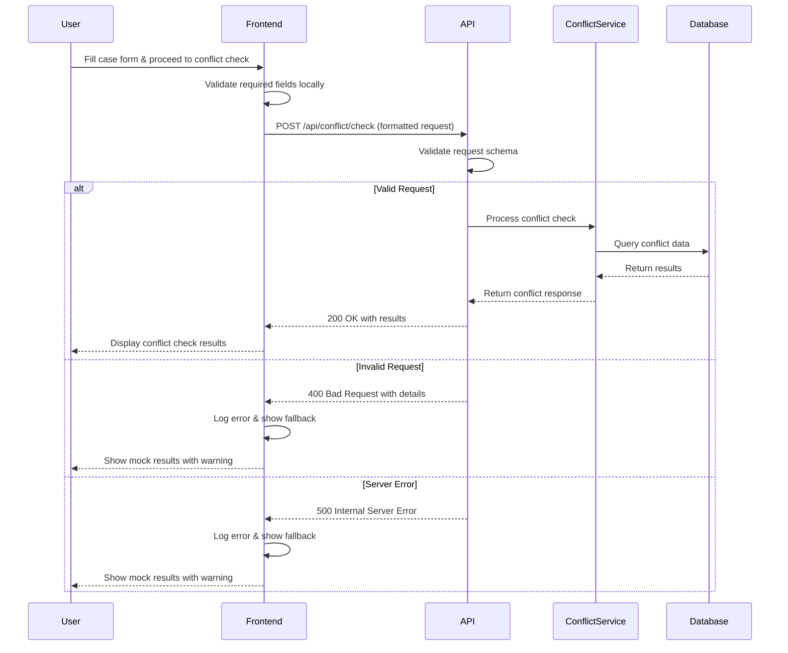

# Design Document

## Overview

The conflict check functionality is failing due to a mismatch between the frontend request format and the backend API expectations. The issue manifests as a 400 Bad Request error when users attempt to perform conflict checks during case creation. This design addresses the root cause by aligning the data formats, improving error handling, and ensuring robust fallback mechanisms.

## Architecture

### Current Issue Analysis

1. **Data Format Mismatch**: The frontend is sending data in a format that doesn't match the backend's expected schema
2. **Missing Field Validation**: Some required fields may be missing or incorrectly formatted
3. **Type Conversion Issues**: String/integer conversions are causing validation failures
4. **Poor Error Handling**: 400 errors don't provide sufficient detail for debugging

### Solution Architecture



## Components and Interfaces

### Frontend Components

#### 1. CreateCaseWizard Component Updates
- **Request Formatting**: Ensure all data types match backend expectations
- **Field Validation**: Validate required fields before sending requests
- **Error Handling**: Implement comprehensive error handling with fallback options
- **User Feedback**: Provide clear status indicators and error messages

#### 2. Conflict Check Request Builder
```typescript
interface ConflictCheckRequest {
  clientId: string;           // Required: Client ID as string
  clientName: string;         // Required: Client name
  clientType: 'PERSON' | 'COMPANY'; // Required: Enum value
  caseName: string;           // Required: Case title
  caseType: string;           // Required: Case type
  otherParties?: string[];    // Optional: Array of opposing parties
  searchYears?: number;       // Optional: Default to 5
  includeCorporateRelations?: boolean; // Optional: Default to true
  searchDepth?: 'BASIC' | 'STANDARD' | 'DEEP'; // Optional: Default to 'DEEP'
  userId: string;             // Required: Current user ID as string
  requestTime: string;        // Required: ISO timestamp
}
```

### Backend Components

#### 1. Request Validation Enhancement
- **Schema Validation**: Strict validation of all incoming fields
- **Type Conversion**: Safe conversion of string IDs to appropriate types
- **Default Values**: Apply sensible defaults for optional fields
- **Error Messages**: Detailed validation error responses

#### 2. Error Response Format
```go
type ValidationErrorResponse struct {
    Success   bool                    `json:"success"`
    Message   string                  `json:"message"`
    Error     string                  `json:"error"`
    Details   map[string]interface{}  `json:"details,omitempty"`
    Timestamp time.Time               `json:"timestamp"`
}
```

## Data Models

### Request Data Flow

1. **Frontend Form Data**:
   ```typescript
   {
     clientId: number,        // Form field value
     lawyerId: number,        // Form field value  
     title: string,           // Case title
     caseType: string,        // Case type selection
     opponentInfo?: string    // Optional text area
   }
   ```

2. **Transformed Request**:
   ```typescript
   {
     clientId: string,                    // Convert number to string
     clientName: string,                  // Lookup from clients array
     clientType: 'PERSON' | 'COMPANY',   // Map from client data
     caseName: string,                    // Use title field
     caseType: string,                    // Pass through
     otherParties: string[],              // Parse opponentInfo
     searchYears: 5,                      // Default value
     includeCorporateRelations: true,     // Default value
     searchDepth: 'DEEP',                 // Default value
     userId: string,                      // Current user ID
     requestTime: string                  // Current timestamp
   }
   ```

3. **Backend Processing**:
   ```go
   type CheckConflictRequest struct {
       ClientID                 string   `json:"clientId" binding:"required"`
       ClientName               string   `json:"clientName" binding:"required"`
       CaseName                 string   `json:"caseName" binding:"required"`
       CaseType                 string   `json:"caseType" binding:"required"`
       ClientType               string   `json:"clientType" binding:"required"`
       OtherParties             []string `json:"otherParties"`
       SearchYears              int      `json:"searchYears"`
       IncludeCorporateRelations bool     `json:"includeCorporateRelations"`
       SearchDepth              string   `json:"searchDepth"`
       UserID                   string   `json:"userId"`
       RequestTime              time.Time `json:"requestTime"`
   }
   ```

## Error Handling

### Error Categories

1. **Validation Errors (400)**:
   - Missing required fields
   - Invalid field formats
   - Invalid enum values
   - Type conversion failures

2. **Authentication Errors (401)**:
   - Missing or invalid JWT token
   - Expired authentication

3. **Server Errors (500)**:
   - Database connection issues
   - Service unavailability
   - Internal processing errors

### Fallback Strategy

When the conflict check API fails, the frontend will:
1. Log the error details for debugging
2. Display a user-friendly error message
3. Show mock conflict check results
4. Clearly indicate the results are simulated
5. Allow the user to continue with the case creation process

### Mock Fallback Data
```typescript
const mockConflictResult = {
  status: "passed",
  score: 85,
  checkTime: new Date().toLocaleString(),
  checker: "智能冲突检查系统",
  totalChecked: 10,
  conflicts: [],
  summary: "未发现明显冲突",
  riskFactors: [],
  recommendations: ["可以正常处理该案件"],
  relatedCases: [],
  complianceNotes: "检查完成"
};
```

## Testing Strategy

### Unit Tests

1. **Frontend Tests**:
   - Request formatting validation
   - Error handling scenarios
   - Mock data fallback behavior
   - Form validation logic

2. **Backend Tests**:
   - Request schema validation
   - Type conversion handling
   - Error response formatting
   - Service integration

### Integration Tests

1. **API Contract Tests**:
   - Verify request/response formats
   - Test all error scenarios
   - Validate authentication flows
   - Check timeout handling

2. **End-to-End Tests**:
   - Complete conflict check workflow
   - Error recovery scenarios
   - User experience validation
   - Performance under load

### Test Scenarios

1. **Happy Path**:
   - Valid request with all required fields
   - Successful conflict check completion
   - Proper result display

2. **Error Scenarios**:
   - Missing required fields
   - Invalid field formats
   - Authentication failures
   - Server unavailability
   - Network timeouts

3. **Edge Cases**:
   - Empty opponent information
   - Special characters in names
   - Very long case descriptions
   - Concurrent requests

## Implementation Approach

### Phase 1: Data Format Alignment
1. Update frontend request formatting
2. Enhance backend validation
3. Improve error responses
4. Add comprehensive logging

### Phase 2: Error Handling Enhancement
1. Implement fallback mechanisms
2. Add user-friendly error messages
3. Create mock data responses
4. Enhance debugging capabilities

### Phase 3: Testing and Validation
1. Create comprehensive test suite
2. Perform integration testing
3. Validate user experience
4. Monitor production behavior

This design ensures that the conflict check functionality will work reliably while providing excellent user experience even when issues occur.