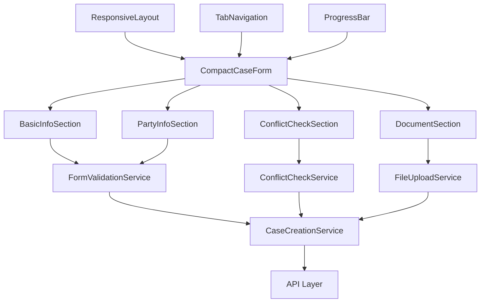

# Design Document

## Overview

本设计文档详细描述了 Law OA Go 新建案件功能的UI优化方案。当前系统包含多个相关组件：CreateCaseWizard、CreateCaseModal、CreateCase页面等，这些组件在不同场景下提供案件创建功能。优化方案将通过重构组件架构、改进布局设计、简化用户流程等方式，实现更紧凑、更适合1080p显示器的界面设计。

核心设计理念是将现有的多步骤向导模式转换为紧凑的单页或多标签页模式，通过智能布局和动态字段管理，在保持功能完整性的同时显著提升空间利用率和用户操作效率。

## Steering Document Alignment

### Technical Standards (tech.md)

本设计严格遵循项目的技术标准和架构模式：

- **React 18.2.0 + TypeScript 5.0.2**: 使用现代React特性和严格类型检查
- **Ant Design 5.16.1**: 利用最新版本的紧凑布局组件和响应式栅格系统
- **分层架构**: 遵循 handlers/services/models 的分层设计模式
- **组件化设计**: 创建可复用的紧凑表单组件和布局组件
- **状态管理**: 使用React Hooks和Context API进行状态管理

### Project Structure (structure.md)

实现方案将遵循项目的文件组织规范：

- **组件位置**: `frontend/src/components/case/` 目录下
- **页面位置**: `frontend/src/pages/case/` 目录下
- **服务层**: `frontend/src/services/` 目录下的案件相关服务
- **样式文件**: 采用CSS Modules和Less进行组件级样式管理
- **工具函数**: `frontend/src/utils/` 目录下的表单验证和布局工具

## Code Reuse Analysis

### Existing Components to Leverage

- **CreateCaseWizard**: 现有的复杂向导组件，可拆分为更小的功能模块
- **CreateCaseModal**: 现有的模态框组件，可作为紧凑布局的参考
- **StandardForm**: 项目中的标准表单组件，提供统一的表单样式和验证
- **StandardTable**: 标准表格组件，可用于案件预览和数据展示
- **ConflictCheckResult**: 冲突检测结果组件，可集成到紧凑布局中

### Existing Services to Extend

- **CaseCreationService**: 案件创建服务，可扩展支持分步保存和验证
- **CaseValidationService**: 表单验证服务，可增强实时验证功能
- **ConflictCheckService**: 冲突检测服务，可优化为异步后台检测
- **get API**: 通用API调用函数，用于数据获取和提交

### Integration Points

- **案件管理API**: `/api/v1/cases` 端点，支持案件创建和更新
- **用户管理API**: `/api/v1/users` 端点，获取律师和助理信息
- **客户管理API**: `/api/v1/clients` 端点，获取客户信息
- **冲突检测API**: `/api/v1/conflict/check` 端点，实时冲突检测
- **文件上传API**: `/api/v1/files/upload` 端点，支持拖拽上传

## Architecture

### 整体架构设计

采用模块化的组件架构，将现有的单体向导拆分为多个可独立使用的紧凑组件：



### Modular Design Principles

- **Single File Responsibility**: 每个组件文件专注于特定的表单部分或功能
- **Component Isolation**: 创建独立的表单区块组件，支持单独使用和组合
- **Service Layer Separation**: 数据访问、业务逻辑和UI组件完全分离
- **Utility Modularity**: 将布局工具、验证函数、格式化工具分离为独立模块

### 响应式布局架构

使用Ant Design的栅格系统和CSS Grid实现1080p优化布局：

- **主布局**: 24列栅格系统，侧边栏占用6列，主内容区18列
- **表单布局**: 两列表单布局，大屏幕时三列显示
- **移动适配**: 小屏幕时自动转换为单列布局
- **高度优化**: 固定头部高度，内容区可滚动，充分利用屏幕高度

## Components and Interfaces

### Component 1: CompactCaseForm
- **Purpose**: 主要的紧凑案件创建表单组件
- **Interfaces:**
  ```typescript
  interface CompactCaseFormProps {
    onSuccess?: (caseId: string) => void;
    onCancel?: () => void;
    initialData?: Partial<CaseInfo>;
    mode?: 'create' | 'edit';
    compact?: boolean;
  }
  ```
- **Dependencies:** Form, Input, Select, DatePicker等Ant Design组件
- **Reuses:** StandardForm, FormValidationService, CaseCreationService

### Component 2: ResponsiveFormLayout
- **Purpose:** 响应式表单布局容器，自动适配不同屏幕尺寸
- **Interfaces:**
  ```typescript
  interface ResponsiveFormLayoutProps {
    children: React.ReactNode;
    columns?: 1 | 2 | 3;
    spacing?: 'small' | 'medium' | 'large';
    breakpoint?: 'xs' | 'sm' | 'md' | 'lg' | 'xl' | 'xxl';
  }
  ```
- **Dependencies:** Row, Col, useBreakpoint Hook
- **Reuses:** Ant Design栅格系统

### Component 3: SmartFieldGroup
- **Purpose:** 智能字段分组，支持条件显示和折叠
- **Interfaces:**
  ```typescript
  interface SmartFieldGroupProps {
    title: string;
    fields: FormField[];
    defaultExpanded?: boolean;
    collapsible?: boolean;
    dependencies?: string[];
  }
  ```
- **Dependencies:** Collapse, Card, Form.Item
- **Reuses:** FormValidationService

### Component 4: ProgressIndicator
- **Purpose:** 显示表单完成进度和当前步骤
- **Interfaces:**
  ```typescript
  interface ProgressIndicatorProps {
    steps: StepInfo[];
    current: number;
    completed: number[];
    onStepClick?: (step: number) => void;
  }
  ```
- **Dependencies:** Steps, Progress, Badge
- **Reuses:** 无，独立组件

### Component 5: ConflictCheckInline
- **Purpose:** 内联冲突检测组件，不阻塞表单填写
- **Interfaces:**
  ```typescript
  interface ConflictCheckInlineProps {
    partyA: string;
    partyB: string;
    onResult?: (result: ConflictResult) => void;
    autoTrigger?: boolean;
  }
  ```
- **Dependencies:** Alert, Spin, Tag
- **Reuses:** ConflictCheckService, ConflictCheckResultProcessor

## Data Models

### CaseInfo (优化版)
```typescript
interface CaseInfo {
  // 基本信息 (必填)
  caseName: string;
  caseType: string;
  caseStatus: 'draft' | 'active' | 'completed' | 'archived';
  priority: 'low' | 'medium' | 'high' | 'urgent';

  // 当事人信息 (必填)
  plaintiff: PartyInfo;
  defendant: PartyInfo;

  // 案件详情 (必填)
  caseAmount?: number;
  caseAmountCurrency?: string;
  filingDate?: Date;
  court?: string;

  // 律师信息 (必填)
  responsibleLawyerId: string;
  assistingLawyerIds?: string[];

  // 扩展信息 (可选)
  description?: string;
  tags?: string[];
  documents?: DocumentInfo[];

  // 系统字段
  id?: string;
  createdAt?: Date;
  updatedAt?: Date;
  createdBy?: string;
}

interface PartyInfo {
  name: string;
  type: 'individual' | 'company';
  contactInfo?: ContactInfo;
  representative?: string;
}

interface DocumentInfo {
  id: string;
  name: string;
  type: string;
  size: number;
  uploadedAt: Date;
  uploadedBy: string;
}
```

### FormField
```typescript
interface FormField {
  name: string;
  label: string;
  type: 'input' | 'select' | 'date' | 'number' | 'textarea' | 'upload';
  required?: boolean;
  placeholder?: string;
  options?: SelectOption[];
  validation?: ValidationRule[];
  dependencies?: string[];
  visible?: boolean;
  defaultValue?: any;
}
```

## Error Handling

### Error Scenarios

1. **表单验证错误**
   - **Handling:** 实时字段验证，友好的错误提示
   - **User Impact:** 红色边框和错误信息，字段高亮

2. **网络请求失败**
   - **Handling:** 自动重试机制，离线数据缓存
   - **User Impact:** 网络状态提示，数据恢复选项

3. **冲突检测失败**
   - **Handling:** 后台静默检测，失败时不阻止提交
   - **User Impact:** 警告提示，建议手动检测

4. **文件上传失败**
   - **Handling:** 分片上传，断点续传
   - **User Impact:** 上传进度条，失败重试按钮

5. **数据提交失败**
   - **Handling:** 本地数据备份，手动重试选项
   - **User Impact:** 失败提示，数据恢复确认

## Testing Strategy

### Unit Testing

- **组件测试**: 每个表单组件的渲染和交互测试
- **服务测试**: CaseCreationService, ConflictCheckService 的功能测试
- **工具函数测试**: 表单验证、格式化函数的单元测试
- **Hooks测试**: 自定义React Hooks的测试

### Integration Testing

- **表单流程测试**: 完整的案件创建流程测试
- **API集成测试**: 与后端API的集成测试
- **冲突检测集成**: 冲突检测功能的端到端测试
- **文件上传测试**: 文件上传功能的集成测试

### End-to-End Testing

- **用户场景测试**: 不同角色用户的完整操作流程
- **响应式测试**: 不同屏幕尺寸和设备的适配测试
- **性能测试**: 大数据量情况下的性能测试
- **可访问性测试**: 键盘导航和屏幕阅读器测试

### 性能基准

- **首屏渲染时间**: < 500ms
- **表单交互响应**: < 100ms
- **文件上传速度**: 支持大文件分片上传
- **内存使用**: 组件内存占用 < 50MB