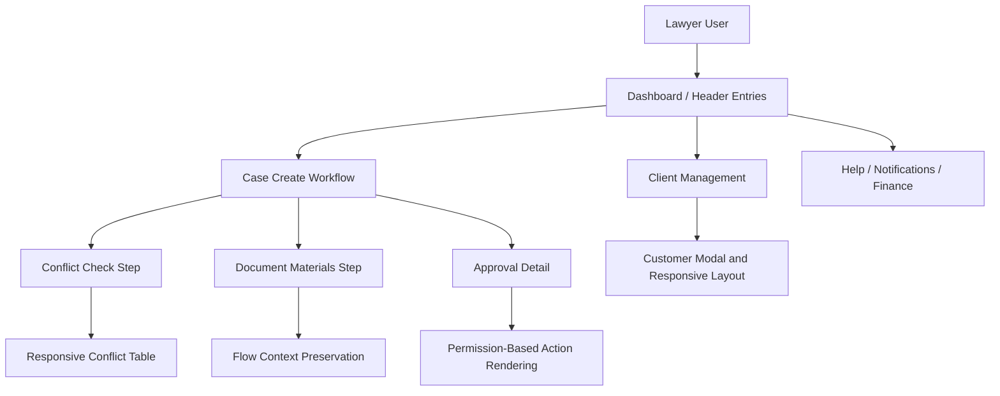

# Design Document

## Overview

This design remediates the lawyer-facing QA findings captured in `reports/frontend-lawyer-qa-2026-05-25.md`. The implementation will focus on route correctness, form initialization, flow continuity, frontend permission rendering, visible feedback for actions, and layout containment.

The affected frontend is a React/Vite application using Ant Design, React Router, CSS/Less modules, and Playwright E2E tests. Backend changes are not expected for most items, but approval permission rendering may need to consume existing backend fields or add a minimal frontend fallback.

## Steering Document Alignment

### Technical Standards

No steering docs were present under `.spec-workflow/steering/` at creation time. This design follows the project notes from `AGENTS.md` and existing frontend patterns:

- Frontend package lives in `frontend/`.
- Verification commands include `npm run build`, `npm run type-check`, `npm run lint`, and Playwright E2E tests.
- Existing tests must not be skipped, weakened, or rewritten merely to pass.
- Existing Ant Design page patterns should be reused.

### Project Structure

The implementation should stay inside existing frontend directories:

- Pages: `frontend/src/pages/**`
- Layout/header: `frontend/src/layouts/**`, `frontend/src/components/layout/**`
- Services: `frontend/src/services/**`
- Hooks: `frontend/src/hooks/**`
- Styles: page-level `.less`, `.module.css`, or existing shared style files
- E2E: `frontend/e2e/**`

Do not move unrelated pages or rename broad route structure as part of this remediation.

## Code Reuse Analysis

### Existing Components and Files to Leverage

- `frontend/src/pages/dashboard/Dashboard.tsx`
  - Contains dashboard quick actions and likely global search UI.
  - `MVP_DASHBOARD_QUICK_ACTIONS` already includes `{ label: '新建立案', path: '/case/create' }`, so implementation should verify which visible button caused QA-001 before changing behavior.

- `frontend/src/pages/case/CreateCase.tsx`
  - Contains the new case workflow page and document/materials step.
  - Must be audited for demo defaults, state initialization, and navigation to `/file`.

- `frontend/src/components/case/CompactCaseForm.tsx`
- `frontend/src/components/case/CompactCaseFormWrapper.tsx`
- `frontend/src/components/CreateCaseWizard.tsx`
  - Existing case form/workflow components. Use them instead of creating a parallel workflow.

- `frontend/src/pages/approval/ApprovalDetail.tsx`
  - Approval action visibility should be corrected here or in a small helper used by this page.

- `frontend/src/pages/client/ClientManagement.tsx`
  - Already has modal state and `handleAdd`. QA-008 may be caused by layout/visibility, modal mount condition, z-index, or route mismatch, so inspect behavior before rewriting.

- `frontend/src/pages/conflict/ConflictWorkbench.tsx`
- `frontend/src/pages/conflict/ConflictCheck.tsx`
- `frontend/src/pages/conflict/*.less`
  - Layout containment should reuse existing table and page structure.

- `frontend/src/pages/profile/Profile.tsx`
  - Change-password modal validation should use existing Ant Design `Form.Item` rules.

- `frontend/src/components/layout/Header.tsx`
- `frontend/src/hooks/useNotifications.ts`
  - Help menu and notification popover behavior should be corrected here.

- `frontend/src/pages/finance/FinanceManagement.tsx`
  - No-permission copy should be improved without exposing finance navigation to lawyer users.

- `frontend/e2e/*.spec.ts`
- `frontend/e2e/utils/test-helpers.ts`
  - Existing E2E utilities seed `lawyer / Demo@2026`. Extend these helpers rather than duplicating login/session setup.

### Integration Points

- **Routing:** React Router routes for `/`, `/case`, `/case/create`, `/approval/:id`, `/client`, `/conflict`, `/finance`.
- **Authentication State:** Existing seeded authenticated user in `frontend/e2e/utils/test-helpers.ts`.
- **Approval Data:** Existing approval service and page data. Preferred design is to render from `availableActions` or equivalent server response when present.
- **Client Service:** `frontend/src/services/client.ts` for create/update/list.
- **Notification Hook:** `frontend/src/hooks/useNotifications.ts` for unread state and mark-all-read behavior.

## Architecture

The remediation is organized into four layers:

1. **Navigation and Entry Layer**
   - Dashboard quick actions.
   - Header user menu.
   - Notification entry.
   - Finance direct access state.

2. **Workflow Layer**
   - `/case/create` initialization.
   - Step persistence and document/materials action.
   - Submission to approval.

3. **Permission and Feedback Layer**
   - Approval detail action visibility.
   - Customer creation feedback.
   - Password form validation.
   - Empty/no-permission states.

4. **Layout and Test Layer**
   - Conflict and client page containment.
   - E2E assertions for workflows and layout.



## Components and Interfaces

### Dashboard Entry Handling

- **Purpose:** Ensure quick actions and global search are explicit and testable.
- **Files:** `frontend/src/pages/dashboard/Dashboard.tsx`, `frontend/src/pages/dashboard/Dashboard.module.css`, dashboard tests.
- **Interface:** Existing `navigate(path)` behavior and search state.
- **Design Notes:**
  - Confirm all visible “新建立案” buttons use `/case/create`.
  - Add search feedback state: idle, loading, results, empty, error.
  - If a full search API does not exist, provide a minimal Enter-to-search route to relevant list pages or inline empty state.

### Case Create Initialization

- **Purpose:** Prevent demo data from appearing in formal create flow.
- **Files:** `frontend/src/pages/case/CreateCase.tsx`, case components under `frontend/src/components/case/`, E2E helpers.
- **Interface:** Existing form state, case creation service, stepper state.
- **Design Notes:**
  - Separate `emptyInitialCaseForm` from demo fixtures.
  - Keep list/approval seed data in E2E fixtures only.
  - Search for hard-coded demo values such as “红杉资本” in production pages and remove from formal `/case/create`.
  - Do not remove demo content from prototype/gallery pages unless those pages are actually routed as production workflow.

### Document Materials Flow Guard

- **Purpose:** Keep the lawyer in the current case creation workflow.
- **Files:** `frontend/src/pages/case/CreateCase.tsx`, possibly `frontend/src/components/case/CompactCaseForm.tsx`.
- **Interface:** Button currently labeled “打开文件材料归档”; navigation currently may go to `/file`.
- **Design Options:**
  - Preferred for MVP: disable the button with tooltip or show modal explaining the feature is unavailable.
  - Acceptable: open `/file?returnTo=/case/create&draftId=...` and show “返回本次立案”.
  - Do not navigate without return path.

### Approval Action Visibility

- **Purpose:** Hide or disable approval decisions for non-approver lawyer accounts.
- **Files:** `frontend/src/pages/approval/ApprovalDetail.tsx`, `frontend/src/services/approval.ts`, `frontend/e2e/approval.spec.ts`.
- **Interface Candidate:**

```ts
type ApprovalAction = 'approve' | 'reject' | 'return'

interface ApprovalActionContext {
  currentUserId?: number | string
  currentUserRole?: string
  currentApproverId?: number | string
  availableActions?: ApprovalAction[]
  status?: string
}
```

- **Design Notes:**
  - Preferred logic: render exactly what backend says in `availableActions`.
  - Fallback logic: if user is not the current approver, hide decision actions.
  - Show status explanation where buttons were previously located.
  - Backend authorization must remain unchanged and authoritative.

### Customer Creation Feedback

- **Purpose:** Make “新增客户” visibly open a customer creation experience or explicit unsupported state.
- **Files:** `frontend/src/pages/client/ClientManagement.tsx`, `frontend/src/pages/client/ClientManagement.less`, `frontend/src/services/client.ts`, `frontend/e2e`.
- **Design Notes:**
  - Existing `handleAdd` appears to set modal state. Verify modal rendering, CSS visibility, and button wiring before adding new abstractions.
  - Ensure required fields are visible and accessible.
  - On success, refresh client list and stats.

### Layout Containment

- **Purpose:** Prevent conflict/client pages from expanding beyond viewport.
- **Files:** `frontend/src/pages/conflict/*.tsx`, `frontend/src/pages/conflict/*.less`, `frontend/src/pages/client/ClientManagement.tsx`, `frontend/src/pages/client/ClientManagement.less`.
- **Design Notes:**
  - Wrap wide Ant Design tables with bounded containers.
  - Use `scroll={{ x: ... }}` on tables rather than allowing page-level horizontal overflow.
  - Add CSS rules such as `min-width: 0`, controlled `max-width`, wrapping button groups, and text truncation.
  - Keep cards and sections inside the current design system.

### Header Help and Notifications

- **Purpose:** Ensure menu and empty states are not dead ends.
- **Files:** `frontend/src/components/layout/Header.tsx`, `frontend/src/hooks/useNotifications.ts`.
- **Design Notes:**
  - Help center can be a modal/drawer with concise MVP help content.
  - If using a route, ensure route exists and does not redirect to dashboard.
  - Hide or disable “全部已读” when there are no unread notifications.

### Profile Password Validation

- **Purpose:** Provide field-level validation and avoid console errors.
- **Files:** `frontend/src/pages/profile/Profile.tsx`, auth service/hook if needed.
- **Design Notes:**
  - Use Ant Design form validation rules.
  - Validate old password, new password, confirm password.
  - Validate confirm password matches new password.
  - Catch API errors and display user-visible message.

### Finance No-Permission State

- **Purpose:** Explain permission requirement without exposing finance nav to lawyers.
- **Files:** `frontend/src/pages/finance/FinanceManagement.tsx`, route guard or layout if no-permission page is shared.
- **Design Notes:**
  - Keep lawyer sidebar finance entry hidden.
  - Direct route should render clear no-permission copy and safe return action.

## Data Models

No new backend data model is required for this remediation.

Frontend-only helper models may be added where useful:

```ts
interface VisibleActionResult {
  canApprove: boolean
  actions: Array<'approve' | 'reject' | 'return'>
  reason?: string
}

interface SearchFeedbackState {
  query: string
  status: 'idle' | 'loading' | 'results' | 'empty' | 'error'
  results?: Array<{
    id: string | number
    type: 'case' | 'client' | 'approval' | 'document'
    title: string
    subtitle?: string
    path?: string
  }>
  errorMessage?: string
}
```

## Error Handling

1. **Dashboard Search Fails**
   - Handling: show visible error message and keep the query in the input.
   - User Impact: lawyer understands the search did not complete and can retry.

2. **Document Center Unavailable**
   - Handling: show modal/inline message and keep user in `/case/create`.
   - User Impact: lawyer does not lose the current intake context.

3. **Approval Actions Not Allowed**
   - Handling: hide/disable decision buttons and show status/approver explanation.
   - User Impact: lawyer understands the approval is waiting for another role/user.

4. **Customer Creation API Fails**
   - Handling: keep modal open, show message, do not clear entered values.
   - User Impact: lawyer can correct or retry without re-entering all data.

5. **Password Validation Fails**
   - Handling: field-level messages, no API call for client-side validation failures.
   - User Impact: lawyer sees exactly which field needs correction.

6. **No Permission for Finance**
   - Handling: show clear permission requirement and return action.
   - User Impact: lawyer can go back instead of treating it as a broken page.

## Testing Strategy

### Unit and Component Testing

- Add or update focused component tests where existing test infrastructure is present.
- Candidate tests:
  - Dashboard quick actions route to `/case/create`.
  - Approval detail action helper hides approver-only buttons for non-approver lawyer.
  - Password modal validates required fields and mismatch.
  - Notification empty state disables/hides mark-all-read.

### Integration Testing

- Verify customer creation modal uses `clientService` and refreshes list on success.
- Verify case creation workflow keeps state when document/materials action is unavailable.

### End-to-End Testing

Use Playwright under `frontend/e2e`.

Required E2E coverage:

- Lawyer login and dashboard quick action to `/case/create`.
- `/case/create` initial form does not contain hard-coded demo case title.
- Document/materials action does not strand the user on `/file` without return.
- Lawyer account cannot see approver-only decision buttons in approval detail.
- Customer “新增客户” opens visible modal/drawer or explicit unsupported message.
- Conflict page has no page-level horizontal overflow at 1366px.
- Client page has no page-level horizontal overflow at 1366px.
- Password empty submit shows field-level validation.
- Finance direct access shows permission explanation.
- Notification empty state avoids active no-op “全部已读”.

### Verification Commands

Run from repository root unless otherwise noted:

```bash
go build ./...
```

Run from `frontend/`:

```bash
npm run build
npm run type-check
npm run lint
npm run test:e2e
```

Notes:

- If `npm run type-check` fails from known pre-existing TypeScript debt, document the failure and confirm no new errors are introduced by touched files.
- Do not skip or weaken tests to pass.

## Rollout Plan

1. Complete P1 blocker fixes first: QA-003, QA-004, QA-005, QA-008.
2. Update E2E tests immediately after each blocker fix.
3. Complete P2 layout and validation fixes: QA-001, QA-002, QA-006, QA-007, QA-010.
4. Complete P3 empty/no-permission/help polish: QA-009, QA-011, QA-012.
5. Run full verification and update the QA report with fixed/deferred status.

## Risk and Mitigation

- **Risk:** Existing E2E tests currently assert old approval behavior where lawyer sees decision buttons.
  - **Mitigation:** Update tests to reflect corrected permission behavior and add an approver-role test only if an approver fixture exists.

- **Risk:** Demo data may be shared between prototype pages and production route.
  - **Mitigation:** Isolate demo fixtures and verify `/case/create` does not import prototype defaults.

- **Risk:** Layout fixes can hide important columns.
  - **Mitigation:** Use detail drawers/tooltips for long fields and keep action columns reachable.

- **Risk:** Backend lacks explicit approval action allowlist.
  - **Mitigation:** Add conservative frontend fallback first; create backend enhancement task only if required.

