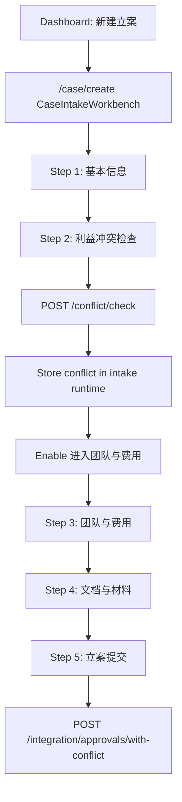

# Design Document

## Overview

This design remediates six lawyer-front-end recheck findings from `reports/frontend-lawyer-qa-recheck-2026-05-26.md`. The implementation should remain conservative and focused on the current MVP surfaces, which are primarily implemented in `frontend/src/pages/batch01/Batch01Prototype.tsx` and `frontend/src/pages/batch01/Batch01Prototype.less`.

The design has four workstreams:

1. **Case Intake Continuity**: keep `/case/create` active through conflict detection and allow the lawyer to continue into team/fee/material/submission steps.
2. **Action Feedback**: ensure dashboard and client-profile buttons produce visible results.
3. **Approval Usability and Permission Consistency**: fix approval table layout and normalize current-approver decision logic.
4. **Accessible Selectors and Regression Tests**: disambiguate repeated controls and add Playwright coverage for every recheck finding.

## Steering Document Alignment

No `.spec-workflow/steering/*.md` files exist in this repository at the time of writing. This design follows the available project guidance from `AGENTS.md` and existing project notes:

- Frontend lives in `frontend/`.
- Useful frontend commands are `npm run dev`, `npm run build`, `npm run type-check`, `npm run lint`, and `npm run test:e2e`.
- Existing E2E helpers live in `frontend/e2e/utils/test-helpers.ts`.
- Do not weaken or skip tests to make changes pass.

## Code Reuse Analysis

### Existing Components and Utilities to Leverage

- **`Batch01Prototype.tsx`**
  - Contains `DashboardCommandCenter`, `ClientMasterProfile`, `CaseIntakeWorkbench`, `ConflictResultWorkbench`, `ApprovalWorkbench`, and `ApprovalDecisionFlow`.
  - Most recheck issues can be fixed inside this file without broad route rewrites.

- **`Batch01Prototype.less`**
  - Contains page, table, conflict, client, and responsive styles.
  - Use it for approval table containment, fixed action column behavior, and responsive client/approval layout.

- **`apiRequest` helper in `Batch01Prototype.tsx`**
  - Use existing API request patterns for conflict check, approval creation, and client profile actions.

- **E2E helper functions**
  - Use `seedAuthenticatedUser`, `waitForAppShell`, `waitForPageLoad`, and existing route fixtures in `frontend/e2e/utils/test-helpers.ts`.

- **Existing Playwright config**
  - Use `frontend/playwright.config.ts` and keep stable role/name selectors.

### Integration Points

- **Conflict check API**
  - Existing intake function calls `/conflict/check`.
  - The frontend must keep the returned conflict result in intake runtime state instead of navigating away to `/conflict`.

- **Approval integration API**
  - Existing submission flow calls `/integration/approvals/with-conflict`.
  - It must receive the conflict result from the current intake runtime.

- **Approval list/detail data**
  - Workbench rows and detail views should normalize current approver fields and available actions.

- **Client profile quick actions**
  - If backend endpoints are available, use them.
  - If endpoints are not available for contacts/upload/export, show explicit MVP unavailable modal/message.

## Architecture



### Design Principle 1: Keep Workflow State Local and Explicit

The case-intake workflow already uses `runtime` state. Conflict detection should update:

```ts
runtime = {
  ...runtime,
  intake,
  conflict,
  approval?,
}
```

It must not navigate to `/conflict` as part of the in-flow conflict check. The standalone `/conflict` route remains available for conflict workbench review.

### Design Principle 2: Separate Workflow Actions From Navigation Actions

Use two distinct actions:

- `runConflictCheckForIntake`: runs `/conflict/check`, updates current intake workflow, stays on `/case/create`.
- `openConflictWorkbench`: navigates to `/conflict` from dashboard/client explicit review contexts.

This prevents a button in the case-intake flow from acting like a global conflict workbench shortcut.

### Design Principle 3: Normalize Approval Permission State

Add or refine a local normalization helper:

```ts
type NormalizedApprovalAccess = {
  currentApproverLabel: string
  currentApproverIds: string[]
  currentApproverEmails: string[]
  availableActions: string[]
  canDecide: boolean
  readonlyReason?: string
}
```

Primary source order:

1. Backend `available_actions` / `availableActions`.
2. Current approver IDs.
3. Current approver email/login/name fallback.
4. Conservative read-only fallback.

The header, workflow current node, and bottom action area should all use the normalized result or clearly label different concepts.

### Design Principle 4: Every Button Produces a State Change

Buttons in this spec must do one of:

- navigate to a route,
- open a modal/drawer,
- trigger a download,
- show a toast/message,
- expand/filter content,
- show an explicit unavailable state.

Silent no-ops are defects.

## Components and Interfaces

### CaseIntakeWorkbench

- **Purpose:** Main formal case creation workflow for lawyers.
- **Key changes:**
  - Remove navigation to `/conflict` from the in-flow conflict check.
  - Keep conflict result in runtime state.
  - Enable `进入团队与费用` after success.
  - Make bottom fixed action bar reflect the current workflow state.
- **Dependencies:** `apiRequest`, `message`, `Modal`, existing runtime state.
- **Requirements:** R1, R2.

### DashboardCommandCenter

- **Purpose:** Lawyer command center.
- **Key changes:**
  - Wire `查看全部待办` and conflict `查看全部` to navigation or visible feedback.
  - Keep `新建立案` routed to `/case/create`.
- **Dependencies:** `navigate`, Ant Design `message`/`Modal`.
- **Requirements:** R3.

### ApprovalWorkbench

- **Purpose:** Approval list and approval workbench.
- **Key changes:**
  - Approval table gets stable layout and visible action column.
  - Row action accessible names include request number/title.
  - Filter buttons get disambiguated accessible labels where needed.
- **Dependencies:** table markup in `Batch01Prototype.tsx`, styles in `.less`.
- **Requirements:** R4, R7.

### ApprovalDecisionFlow

- **Purpose:** Approval detail and decision UI.
- **Key changes:**
  - Normalize current approver and action permissions.
  - Align header, workflow node copy, and bottom decision area.
  - Keep non-current approver lawyer read-only.
- **Dependencies:** approval detail API data, current user data.
- **Requirements:** R5, R7.

### ClientMasterProfile

- **Purpose:** Customer master profile and quick actions.
- **Key changes:**
  - `新增联系人` opens a contact modal/drawer or explicit MVP message.
  - `上传附件` opens upload UI or explicit unavailable message.
  - `导出客户档案` triggers file export or visible fallback.
  - Quick-action buttons get distinct accessible names.
- **Dependencies:** existing selected client state, Ant Design modal/message.
- **Requirements:** R6, R7.

## Data Models

### Intake Runtime State

```ts
type IntakeRuntime = {
  intake?: any
  conflict?: any
  approval?: any
  loading?: boolean
  lastAction?: string
  error?: string
}
```

Expected conflict fields to support defensively:

```ts
type ConflictResultLike = {
  checkId?: string
  record?: {
    check_id?: string
    case_name?: string
    client_name?: string
    risk_level?: string
    status?: string
  }
  riskAssessment?: {
    overallRisk?: string
    riskScore?: number
  }
  conflictCases?: Array<Record<string, unknown>>
}
```

### Approval Access State

```ts
type NormalizedApprovalAccess = {
  currentApproverLabel: string
  currentApproverIds: string[]
  currentApproverEmails: string[]
  workflowCurrentNodeLabel?: string
  availableActions: string[]
  canApprove: boolean
  canReject: boolean
  canReturn: boolean
  canDecide: boolean
  readonlyReason?: string
}
```

### Client Quick Action

```ts
type ClientQuickActionKind = 'new-contact' | 'upload-attachment' | 'export-profile' | 'start-case' | 'start-conflict-check'
```

## Error Handling

### Conflict Check Fails

- **Handling:** Keep active step on conflict check, keep all form values, show message/modal with backend error.
- **User impact:** Lawyer can correct inputs or retry without retyping.

### Conflict API Returns Historical/Unexpected Shape

- **Handling:** Normalize response defensively. If response lacks current draft identifiers, display current draft summary separately and mark conflict result as returned by API.
- **User impact:** Lawyer can see what was checked and whether backend data seems mismatched.

### Approval Permission Data Is Incomplete

- **Handling:** Read-only fallback unless user is clearly the current approver.
- **User impact:** Prevents accidental decision UI exposure.

### Client Quick Action Backend Missing

- **Handling:** Show `该功能当前版本暂未开放，可先在客户备注或案件材料中维护。`
- **User impact:** No silent click.

### Export Fails

- **Handling:** Show error toast with retry suggestion. Do not claim download success.

## Testing Strategy

### Unit/Component-Level Checks

Because this repo currently leans on E2E coverage for the MVP batch surface, add component-level tests only if there is an existing test harness for the modified component. Otherwise prioritize Playwright regression tests.

Suggested helpers:

- `normalizeApprovalAccess(...)`
- `getConflictCheckId(...)`
- `buildIntakeConflictSummary(...)`

### End-to-End Testing

Add or update Playwright specs:

- `frontend/e2e/case-create-full-workflow.spec.ts`
  - Lawyer starts from dashboard.
  - Fills required intake fields.
  - Runs conflict check.
  - Asserts URL remains `/case/create`.
  - Asserts conflict status complete.
  - Clicks `进入团队与费用`.

- `frontend/e2e/dashboard-actions.spec.ts`
  - Checks dashboard `查看全部待办` and conflict `查看全部`.
  - Each must navigate or show visible feedback.

- `frontend/e2e/approval-layout.spec.ts`
  - At 1366px and 1200px, approval action column must be visible or reachable inside table wrapper without page-level overflow.

- `frontend/e2e/approval-permission-consistency.spec.ts`
  - Non-current approver lawyer sees read-only copy and no decision buttons.
  - Current approver fixture sees decision buttons only when available actions allow them.
  - Header and workflow node do not contradict each other.

- `frontend/e2e/client-profile-actions.spec.ts`
  - Client quick actions produce modal/drawer/toast/download/unavailable feedback.

### Verification Commands

Run and document:

```bash
cd frontend && npm run test:e2e
cd frontend && npm run build
cd frontend && npm run lint
cd frontend && npm run type-check
go build ./...
```

If `npm run type-check` still fails due historical TypeScript debt, record the failure summary and confirm whether any new errors are in files changed by this spec.

## Rollout and Risk

- This is a frontend remediation and should not change backend permission behavior.
- Highest regression risk is case-intake conflict detection because it touches the main workflow transition.
- Approval permission changes must be conservative: when uncertain, show read-only.
- Client quick-action unavailable messages are acceptable for MVP if real backend workflows do not exist.
