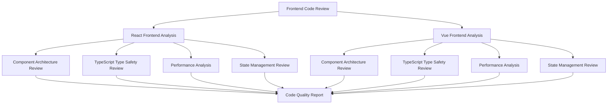

# Frontend Code Review Design Document

## Overview

本设计文档描述了对Law OA Go项目两个前端版本进行全面代码审查的架构和方法。前端代码审查将分析React + TypeScript (Bootstrap)和Vue 3 + TypeScript (Ant Design)两个版本的代码质量、性能特征、类型安全性和架构模式，提供具体的优化建议和最佳实践指导。

## Steering Document Alignment

### Technical Standards (tech.md)
前端代码审查将遵循项目文档中的TypeScript标准、组件设计原则和性能优化要求，确保代码符合React和Vue的最佳实践。

### Project Structure (structure.md)
审查将分析两个前端版本的目录组织、组件分层、模块化设计和文件命名约定，评估其与项目结构标准的一致性。

## Code Reuse Analysis

### Existing Components to Leverage
- **React前端UI组件**: 25+个可重用组件（Card、Pagination、LoadingSpinner等）
- **Vue前端组件系统**: 基于Ant Design的企业级组件库
- **TypeScript类型定义**: 完整的类型系统和接口定义
- **API服务层**: 统一的HTTP客户端和API封装

### Integration Points
- **共享类型定义**: 两个前端版本可能共享的TypeScript接口
- **API兼容性**: 后端API接口的前端适配层分析
- **构建工具**: Create React App vs Vite的构建优化对比

## Architecture

### 前端版本1: React + TypeScript + Bootstrap
- **技术栈**: React 18 + TypeScript + Tailwind CSS + Bootstrap
- **状态管理**: React Context API + Hooks
- **路由系统**: React Router v6
- **HTTP客户端**: Axios
- **构建工具**: Create React App (CRACO配置)

### 前端版本2: Vue 3 + TypeScript + Ant Design
- **技术栈**: Vue 3 + TypeScript + Ant Design Vue
- **状态管理**: Pinia
- **路由系统**: Vue Router 4
- **HTTP客户端**: Axios
- **构建工具**: Vite



## Components and Interfaces

### Code Review Analysis Components

#### React Frontend Analyzer
- **Purpose:** 分析React前端代码质量、组件设计和性能
- **Interfaces:**
  - `ReactComponentReview`: 组件结构和设计模式分析
  - `TypeScriptReview`: 类型安全性检查
  - `PerformanceReview`: 性能瓶颈识别
- **Dependencies:** React开发工具、TypeScript编译器、ESLint配置
- **Reuses:** 现有的ESLint规则、TypeScript配置、组件文件结构

#### Vue Frontend Analyzer
- **Purpose:** 分析Vue前端代码质量、组合式API使用和响应式设计
- **Interfaces:**
  - `VueComponentReview`: 组件结构和Composition API分析
  - `ReactivityReview`: 响应式系统使用评估
  - `AntDesignReview**: UI组件库使用规范检查
- **Dependencies:** Vue开发工具、TypeScript编译器、Vue CLI配置
- **Reuses:** 现有的Vue组件结构、Pinia store模式、路由配置

#### Comparative Analysis Engine
- **Purpose:** 对比两个前端版本的架构决策和实现质量
- **Interfaces:**
  - `ArchitectureComparison`: 架构模式对比分析
  - `PerformanceComparison`: 性能特征对比
  - `MaintainabilityAssessment`: 可维护性评估
- **Dependencies:** 两个前端版本的代码库和配置文件
- **Reuses:** 共享的分析指标和评估标准

## Data Models

### Frontend Code Review Metrics
```typescript
interface CodeQualityMetrics {
  // TypeScript 相关指标
  typeCoverage: number;           // 类型覆盖率
  typeErrors: number;             // 类型错误数量
  interfaceConsistency: number;   // 接口一致性评分

  // React/Vue 组件指标
  componentComplexity: number;    // 组件复杂度
  propTypeSafety: number;         // Props类型安全性
  stateManagementQuality: number; // 状态管理质量

  // 性能指标
  bundleSize: number;             // 打包体积
  renderPerformance: number;      // 渲染性能
  memoryUsage: number;            // 内存使用

  // 代码质量指标
  codeDuplication: number;        // 代码重复率
  testCoverage: number;           // 测试覆盖率
  maintainabilityIndex: number;   // 可维护性指数
}

interface FrontendReviewReport {
  version: 'react' | 'vue';
  analysisDate: string;
  metrics: CodeQualityMetrics;
  findings: CodeFinding[];
  recommendations: Recommendation[];
  bestPractices: BestPractice[];
}
```

## Error Handling

### Error Scenarios

1. **TypeScript编译错误**
   - **Handling:** 记录类型错误详情，提供修复建议
   - **User Impact:** 影响开发体验和运行时类型安全

2. **性能分析失败**
   - **Handling:** 提供替代分析方法，手动检查关键性能指标
   - **User Impact:** 可能遗漏性能优化机会

3. **组件结构分析错误**
   - **Handling:** 跳过问题组件，继续分析其他部分
   - **User Impact:** 部分组件无法完成深入分析

## Testing Strategy

### Unit Testing
- **TypeScript类型检查**: 使用tsc --noEmit验证类型安全性
- **组件单元测试**: 分析现有测试覆盖率和质量
- **工具函数测试**: 检查utils和helpers的测试完整性

### Integration Testing
- **API集成测试**: 验证前端与后端API的集成质量
- **状态管理测试**: 分析Context API和Pinia store的测试覆盖
- **路由集成测试**: 检查路由配置和导航逻辑

### Performance Testing
- **Bundle分析**: 使用webpack-bundle-analyzer分析打包体积
- **渲染性能**: 使用React DevTools Profiler分析组件性能
- **内存泄漏检查**: 分析组件卸载和事件监听器清理

## Review Categories

### 1. TypeScript类型安全审查 (R5.1)
- 接口定义的完整性和一致性
- 类型推导和泛型使用
- 严格模式配置和类型检查
- 第三方库的类型定义质量

### 2. React/Vue组件设计审查 (R5.2)
- 组件职责单一性
- Props设计和默认值处理
- 组件复用性和可测试性
- 生命周期/Hooks使用规范

### 3. 性能优化机会识别 (R5.3)
- 组件重渲染优化
- 懒加载和代码分割
- 状态更新优化
- 内存管理最佳实践

### 4. 开发者体验改进 (R5.4)
- 错误边界和错误处理
- 开发工具集成
- 代码可读性和文档
- 构建和部署配置优化