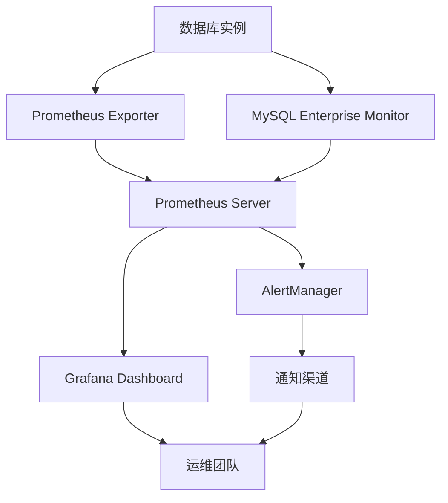

# 律所OA Go数据库性能监控策略

## 执行概要

本文档建立了Law OA Go项目数据库性能监控的完整框架，包括监控指标体系、告警策略、性能基线、故障诊断流程和持续优化机制。通过实施本监控策略，将实现数据库性能问题的早期发现、快速定位和自动优化。

## 1. 监控架构设计

### 1.1 监控层次结构

```
应用层监控 (Application Layer)
├── 查询性能监控
├── 连接池监控
├── 缓存效率监控
└── 事务性能监控

数据库层监控 (Database Layer)
├── 服务器资源监控
├── 查询执行监控
├── 索引使用监控
└── 锁等待监控

基础设施层监控 (Infrastructure Layer)
├── 网络性能监控
├── 存储性能监控
├── 内存使用监控
└── CPU使用监控
```

### 1.2 监控数据流架构



## 2. 核心监控指标

### 2.1 性能指标 (Performance Metrics)

#### 查询性能指标
```yaml
# Prometheus指标定义
- name: db_query_duration_seconds
  type: Histogram
  labels: [operation, table, query_type]
  help: 数据库查询耗时分布

- name: db_query_count_total
  type: Counter
  labels: [operation, table, status]
  help: 数据库查询总数统计

- name: db_query_errors_total
  type: Counter
  labels: [operation, table, error_type]
  help: 数据库查询错误总数

- name: db_slow_queries_total
  type: Counter
  labels: [operation, table, threshold]
  help: 慢查询总数统计
```

#### 连接池指标
```yaml
- name: db_connections_active
  type: Gauge
  labels: [database, pool]
  help: 活跃数据库连接数

- name: db_connections_idle
  type: Gauge
  labels: [database, pool]
  help: 空闲数据库连接数

- name: db_connections_max
  type: Gauge
  labels: [database, pool]
  help: 最大数据库连接数

- name: db_connection_wait_seconds
  type: Histogram
  labels: [database, pool]
  help: 数据库连接等待时间分布

- name: db_connection_errors_total
  type: Counter
  labels: [database, pool, error_type]
  help: 数据库连接错误总数
```

#### 缓存性能指标
```yaml
- name: cache_hits_total
  type: Counter
  labels: [cache_type, key_pattern]
  help: 缓存命中总数

- name: cache_misses_total
  type: Counter
  labels: [cache_type, key_pattern]
  help: 缓存未命中总数

- name: cache_operations_total
  type: Counter
  labels: [cache_type, operation, status]
  help: 缓存操作总数

- name: cache_size_bytes
  type: Gauge
  labels: [cache_type]
  help: 缓存大小（字节）
```

### 2.2 可用性指标 (Availability Metrics)

#### 数据库可用性
```yaml
- name: database_up
  type: Gauge
  labels: [database, role]
  help: 数据库可用状态 (1=可用, 0=不可用)

- name: database_health_check_duration_seconds
  type: Histogram
  labels: [database, check_type]
  help: 数据库健康检查耗时

- name: database_replication_lag_seconds
  type: Gauge
  labels: [master, slave]
  help: 数据库复制延迟时间
```

#### 服务可用性
```yaml
- name: service_availability_ratio
  type: Gauge
  labels: [service, environment]
  help: 服务可用性比率 (0-1)

- name: service_error_rate
  type: Gauge
  labels: [service, error_type]
  help: 服务错误率

- name: service_response_time_seconds
  type: Histogram
  labels: [service, endpoint]
  help: 服务响应时间分布
```

### 2.3 容量指标 (Capacity Metrics)

#### 资源使用率
```yaml
- name: mysql_cpu_usage_ratio
  type: Gauge
  labels: [instance, host]
  help: MySQL CPU使用率

- name: mysql_memory_usage_bytes
  type: Gauge
  labels: [instance, host]
  help: MySQL内存使用量

- name: mysql_disk_usage_bytes
  type: Gauge
  labels: [instance, tablespace]
  help: MySQL磁盘使用量

- name: mysql_network_io_bytes_total
  type: Counter
  labels: [instance, direction]
  help: MySQL网络IO总量
```

#### 存储和表空间
```yaml
- name: mysql_table_size_bytes
  type: Gauge
  labels: [database, table]
  help: MySQL表大小

- name: mysql_index_size_bytes
  type: Gauge
  labels: [database, table, index]
  help: MySQL索引大小

- name: mysql_table_rows_total
  type: Gauge
  labels: [database, table]
  help: MySQL表行数
```

## 3. 监控实现方案

### 3.1 Prometheus Exporter配置

#### MySQL Exporter配置
```yaml
# mysql-exporter.yml
targets:
  - targets: ['mysql-master:3306', 'mysql-slave-1:3306', 'mysql-slave-2:3306']
    labels:
      cluster: 'law-oa-cluster'
      environment: 'production'

scrape_configs:
  - job_name: 'mysql'
    scrape_interval: 15s
    scrape_timeout: 10s
    static_configs:
      - targets:
        - 'mysql-exporter:9104'

# MySQL连接配置
mysql_user: 'monitor_user'
mysql_password: '${MONITOR_PASSWORD}'
mysql_host: 'localhost'
mysql_port: 3306
```

#### 应用层监控配置
```go
// internal/monitoring/database_metrics.go
type DatabaseMetricsCollector struct {
    db          *gorm.DB
    connections *ConnectionPoolMetrics
    cache       *CacheMetrics
}

func NewDatabaseMetricsCollector(db *gorm.DB) *DatabaseMetricsCollector {
    return &DatabaseMetricsCollector{
        db: db,
        connections: NewConnectionPoolMetrics(),
        cache: NewCacheMetrics(),
    }
}

func (c *DatabaseMetricsCollector) Collect(ch chan<- prometheus.Metric) {
    // 收集查询性能指标
    c.collectQueryMetrics(ch)

    // 收集连接池指标
    c.connections.Collect(ch)

    // 收集缓存指标
    c.cache.Collect(ch)

    // 收集数据库状态指标
    c.collectDatabaseStatusMetrics(ch)
}

func (c *DatabaseMetricsCollector) collectQueryMetrics(ch chan<- prometheus.Metric) {
    var stats []struct {
        Operation string    `json:"operation"`
        Table     string    `json:"table"`
        Count     int64     `json:"count"`
        Duration  float64   `json:"duration"`
        Errors    int64     `json:"errors"`
    }

    // 从查询统计表获取数据
    c.db.Raw(`
        SELECT operation, table, COUNT(*) as count,
               AVG(duration) as duration, SUM(errors) as errors
        FROM query_statistics
        WHERE created_at >= DATE_SUB(NOW(), INTERVAL 5 MINUTE)
        GROUP BY operation, table
    `).Scan(&stats)

    for _, stat := range stats {
        ch <- prometheus.MustNewConstMetric(
            dbQueryCountTotal,
            prometheus.CounterValue,
            float64(stat.Count),
            stat.Operation, stat.Table,
        )

        ch <- prometheus.MustNewConstMetric(
            dbQueryDurationSeconds,
            prometheus.HistogramValue,
            stat.Duration,
            stat.Operation, stat.Table,
        )

        if stat.Errors > 0 {
            ch <- prometheus.MustNewConstMetric(
                dbQueryErrorsTotal,
                prometheus.CounterValue,
                float64(stat.Errors),
                stat.Operation, stat.Table, "error",
            )
        }
    }
}
```

### 3.2 Grafana仪表板配置

#### 主监控仪表板
```json
{
  "dashboard": {
    "id": null,
    "title": "Law OA Go 数据库监控",
    "tags": ["law-oa", "database", "monitoring"],
    "timezone": "browser",
    "panels": [
      {
        "id": 1,
        "title": "查询性能概览",
        "type": "stat",
        "targets": [
          {
            "expr": "avg(rate(db_query_duration_seconds_sum[5m]))",
            "legendFormat": "平均查询耗时"
          }
        ]
      },
      {
        "id": 2,
        "title": "查询响应时间分布",
        "type": "graph",
        "targets": [
          {
            "expr": "histogram_quantile(0.50, rate(db_query_duration_seconds_bucket[5m]))",
            "legendFormat": "P50"
          },
          {
            "expr": "histogram_quantile(0.95, rate(db_query_duration_seconds_bucket[5m]))",
            "legendFormat": "P95"
          },
          {
            "expr": "histogram_quantile(0.99, rate(db_query_duration_seconds_bucket[5m]))",
            "legendFormat": "P99"
          }
        ]
      },
      {
        "id": 3,
        "title": "连接池状态",
        "type": "graph",
        "targets": [
          {
            "expr": "db_connections_active",
            "legendFormat": "活跃连接"
          },
          {
            "expr": "db_connections_idle",
            "legendFormat": "空闲连接"
          },
          {
            "expr": "db_connections_max",
            "legendFormat": "最大连接"
          }
        ]
      }
    ]
  }
}
```

#### 详细性能分析仪表板
```json
{
  "dashboard": {
    "id": null,
    "title": "数据库性能详细分析",
    "panels": [
      {
        "id": 10,
        "title": "慢查询分析",
        "type": "table",
        "targets": [
          {
            "expr": "topk(10, sum(rate(db_slow_queries_total[1h])) by (operation, table))",
            "legendFormat": "{{operation}} - {{table}}"
          }
        ]
      },
      {
        "id": 11,
        "title": "缓存效率分析",
        "type": "graph",
        "targets": [
          {
            "expr": "rate(cache_hits_total[5m]) / (rate(cache_hits_total[5m]) + rate(cache_misses_total[5m]))",
            "legendFormat": "缓存命中率"
          }
        ]
      },
      {
        "id": 12,
        "title": "表大小趋势",
        "type": "graph",
        "targets": [
          {
            "expr": "mysql_table_size_bytes{database='law_oa'}",
            "legendFormat": "{{table}}"
          }
        ]
      }
    ]
  }
}
```

## 4. 告警策略

### 4.1 告警规则配置

#### 性能告警
```yaml
# prometheus-alerts.yml
groups:
  - name: database_performance_alerts
    rules:
      - alert: HighQueryLatency
        expr: histogram_quantile(0.95, rate(db_query_duration_seconds_bucket[5m])) > 0.2
        for: 2m
        labels:
          severity: warning
          component: database
          environment: production
        annotations:
          summary: "数据库查询延迟过高"
          description: "95%查询响应时间超过200ms，当前值: {{ $value }}s"
          runbook_url: "https://wiki.law-oa.com/runbooks/high-query-latency"

      - alert: CriticalQueryLatency
        expr: histogram_quantile(0.95, rate(db_query_duration_seconds_bucket[5m])) > 0.5
        for: 1m
        labels:
          severity: critical
          component: database
          environment: production
        annotations:
          summary: "数据库查询严重延迟"
          description: "95%查询响应时间超过500ms，当前值: {{ $value }}s"
          runbook_url: "https://wiki.law-oa.com/runbooks/critical-query-latency"

      - alert: HighSlowQueryRate
        expr: rate(db_slow_queries_total[5m]) > 10
        for: 5m
        labels:
          severity: warning
          component: database
          environment: production
        annotations:
          summary: "慢查询数量过多"
          description: "5分钟内慢查询数量超过10个，当前值: {{ $value }}"
          runbook_url: "https://wiki.law-oa.com/runbooks/high-slow-query-rate"
```

#### 连接池告警
```yaml
      - alert: ConnectionPoolExhaustion
        expr: db_connections_active / db_connections_max > 0.9
        for: 1m
        labels:
          severity: critical
          component: database
          environment: production
        annotations:
          summary: "连接池即将耗尽"
          description: "连接池使用率超过90%，当前值: {{ $value | humanizePercentage }}"
          runbook_url: "https://wiki.law-oa.com/runbooks/connection-pool-exhaustion"

      - alert: HighConnectionWaitTime
        expr: histogram_quantile(0.95, rate(db_connection_wait_seconds_bucket[5m])) > 0.05
        for: 2m
        labels:
          severity: warning
          component: database
          environment: production
        annotations:
          summary: "连接等待时间过长"
          description: "95%连接等待时间超过50ms，当前值: {{ $value }}s"
          runbook_url: "https://wiki.law-oa.com/runbooks/high-connection-wait-time"
```

#### 可用性告警
```yaml
      - alert: DatabaseDown
        expr: up{job="mysql"} == 0
        for: 1m
        labels:
          severity: critical
          component: database
          environment: production
        annotations:
          summary: "数据库实例不可用"
          description: "数据库实例 {{ $labels.instance }} 已无法连接"
          runbook_url: "https://wiki.law-oa.com/runbooks/database-down"

      - alert: HighReplicationLag
        expr: mysql_replication_lag_seconds > 30
        for: 2m
        labels:
          severity: warning
          component: database
          environment: production
        annotations:
          summary: "数据库复制延迟过高"
          description: "数据库复制延迟超过30秒，当前值: {{ $value }}s"
          runbook_url: "https://wiki.law-oa.com/runbooks/high-replication-lag"
```

### 4.2 告警通知配置

#### AlertManager配置
```yaml
# alertmanager.yml
global:
  smtp_smarthost: 'smtp.law-oa.com:587'
  smtp_from: 'alertmanager@law-oa.com'
  smtp_auth_username: 'alertmanager@law-oa.com'
  smtp_auth_password: '${SMTP_PASSWORD}'

templates:
  - '/etc/alertmanager/templates/*.tmpl'

route:
  group_by: ['alertname', 'severity', 'environment']
  group_wait: 10s
  group_interval: 10s
  repeat_interval: 1h
  receiver: 'web.hook'

receivers:
  - name: 'web.hook'
    email_configs:
      - to: 'dba-team@law-oa.com'
        subject: '[{{ .Status | toUpper }}{{ .Labels.severity }}] {{ .GroupLabels.alertname }}'
        body: |
          {{ range .Alerts }}
          {{ .Annotations.summary }}
          描述: {{ .Annotations.description }}
          开始时间: {{ .StartsAt }}
          运行手册: {{ .Annotations.runbook_url }}
          {{ end }}
    webhook_configs:
      - url: 'http://slack-webhook-url'
        send_resolved: true

inhibit_rules:
  - source_match:
      severity: 'critical'
    target_match:
      severity: 'warning'
    equal: ['alertname', 'environment']
```

## 5. 性能基线管理

### 5.1 建立性能基线

#### 基线数据收集
```go
// internal/monitoring/baseline.go
type PerformanceBaseline struct {
    QueryLatency    BaselineMetric `json:"query_latency"`
    Throughput      BaselineMetric `json:"throughput"`
    ErrorRate       BaselineMetric `json:"error_rate"`
    ResourceUsage   BaselineMetric `json:"resource_usage"`
    CacheHitRate    BaselineMetric `json:"cache_hit_rate"`
}

type BaselineMetric struct {
    P50    float64 `json:"p50"`
    P90    float64 `json:"p90"`
    P95    float64 `json:"p95"`
    P99    float64 `json:"p99"`
    Average float64 `json:"average"`
    Max     float64 `json:"max"`
}

func EstablishBaseline(db *gorm.DB, duration time.Duration) (*PerformanceBaseline, error) {
    baseline := &PerformanceBaseline{}

    // 收集查询延迟基线
    if err := collectQueryLatencyBaseline(db, baseline, duration); err != nil {
        return nil, err
    }

    // 收集吞吐量基线
    if err := collectThroughputBaseline(db, baseline, duration); err != nil {
        return nil, err
    }

    // 收集错误率基线
    if err := collectErrorRateBaseline(db, baseline, duration); err != nil {
        return nil, err
    }

    return baseline, nil
}

func collectQueryLatencyBaseline(db *gorm.DB, baseline *PerformanceBaseline, duration time.Duration) error {
    var results []struct {
        Percentile float64 `json:"percentile"`
        Duration   float64 `json:"duration"`
    }

    endTime := time.Now()
    startTime := endTime.Add(-duration)

    err := db.Raw(`
        SELECT
            PERCENTILE_CONT(0.5) WITHIN GROUP (ORDER BY duration) as p50,
            PERCENTILE_CONT(0.90) WITHIN GROUP (ORDER BY duration) as p90,
            PERCENTILE_CONT(0.95) WITHIN GROUP (ORDER BY duration) as p95,
            PERCENTILE_CONT(0.99) WITHIN GROUP (ORDER BY duration) as p99,
            AVG(duration) as average,
            MAX(duration) as max
        FROM query_statistics
        WHERE created_at BETWEEN ? AND ?
    `, startTime, endTime).Scan(&results)

    if err != nil {
        return err
    }

    if len(results) > 0 {
        baseline.QueryLatency = BaselineMetric{
            P50:    results[0].P50,
            P90:    results[0].P90,
            P95:    results[0].P95,
            P99:    results[0].P99,
            Average: results[0].Average,
            Max:     results[0].Max,
        }
    }

    return nil
}
```

### 5.2 基线比较和异常检测

#### 性能异常检测
```go
// internal/monitoring/anomaly_detection.go
type AnomalyDetector struct {
    baseline *PerformanceBaseline
    threshold float64 // 异常检测阈值
}

func (a *AnomalyDetector) DetectAnomalies(currentMetrics *PerformanceMetrics) ([]*Anomaly, error) {
    var anomalies []*Anomaly

    // 检测查询延迟异常
    if a.isAnomalous(currentMetrics.QueryLatency.P95, a.baseline.QueryLatency.P95) {
        anomalies = append(anomalies, &Anomaly{
            Type:        "query_latency",
            Severity:    a.calculateSeverity(currentMetrics.QueryLatency.P95, a.baseline.QueryLatency.P95),
            Current:     currentMetrics.QueryLatency.P95,
            Baseline:    a.baseline.QueryLatency.P95,
            Deviation:   a.calculateDeviation(currentMetrics.QueryLatency.P95, a.baseline.QueryLatency.P95),
            Timestamp:   time.Now(),
        })
    }

    // 检测吞吐量异常
    if a.isAnomalous(currentMetrics.Throughput, a.baseline.Throughput.Average) {
        anomalies = append(anomalies, &Anomaly{
            Type:        "throughput",
            Severity:    a.calculateSeverity(currentMetrics.Throughput, a.baseline.Throughput.Average),
            Current:     currentMetrics.Throughput,
            Baseline:    a.baseline.Throughput.Average,
            Deviation:   a.calculateDeviation(currentMetrics.Throughput, a.baseline.Throughput.Average),
            Timestamp:   time.Now(),
        })
    }

    // 检测错误率异常
    if a.isAnomalous(currentMetrics.ErrorRate, a.baseline.ErrorRate.Average) {
        anomalies = append(anomalies, &Anomaly{
            Type:        "error_rate",
            Severity:    a.calculateSeverity(currentMetrics.ErrorRate, a.baseline.ErrorRate.Average),
            Current:     currentMetrics.ErrorRate,
            Baseline:    a.baseline.ErrorRate.Average,
            Deviation:   a.calculateDeviation(currentMetrics.ErrorRate, a.baseline.ErrorRate.Average),
            Timestamp:   time.Now(),
        })
    }

    return anomalies, nil
}

func (a *AnomalyDetector) isAnomalous(current, baseline float64) bool {
    deviation := math.Abs(current-baseline) / baseline
    return deviation > a.threshold
}

func (a *AnomalyDetector) calculateSeverity(current, baseline float64) string {
    deviation := math.Abs(current-baseline) / baseline

    switch {
    case deviation > 0.5:
        return "critical"
    case deviation > 0.3:
        return "warning"
    case deviation > 0.2:
        return "info"
    default:
        return "normal"
    }
}
```

## 6. 故障诊断流程

### 6.1 故障诊断手册

#### 查询延迟问题诊断
```markdown
## 故障: 查询延迟过高

### 症状
- P95查询响应时间 > 200ms
- 用户报告应用响应缓慢
- 数据库CPU使用率升高

### 诊断步骤

1. **识别慢查询**
   ```sql
   SELECT
       query_text,
       COUNT(*) as execution_count,
       AVG(duration) as avg_duration,
       MAX(duration) as max_duration
   FROM query_statistics
   WHERE created_at >= NOW() - INTERVAL 1 HOUR
   GROUP BY query_text
   HAVING avg_duration > 0.1
   ORDER BY avg_duration DESC
   LIMIT 10;
   ```

2. **分析执行计划**
   ```sql
   EXPLAIN ANALYZE [问题查询];
   ```

3. **检查索引使用**
   ```sql
   SELECT
       index_name,
       table_name,
       cardinality,
       used_in_queries
   FROM index_usage_statistics
   WHERE table_name = '[相关表]';
   ```

4. **检查锁等待**
   ```sql
   SELECT
       r.trx_id,
       r.trx_state,
       r.trx_started,
       r.trx_wait_started,
       r.trx_mysql_thread_id,
       r.trx_query,
       l.lock_id,
       l.lock_mode,
       l.lock_type,
       l.lock_table,
       l.lock_index,
       b.processlist_user,
       b.processlist_host,
       b.processlist_db,
       b.processlist_command,
       b.processlist_time,
       b.processlist_state,
       b.processlist_info
   FROM information_schema.INNODB_TRX r
   LEFT JOIN information_schema.INNODB_LOCKS l ON r.trx_id = l.trx_id
   LEFT JOIN information_schema.INNODB_LOCK_WAITS w ON r.trx_id = w.blocking_trx_id
   LEFT JOIN information_schema.PROCESSLIST b ON r.trx_mysql_thread_id = b.id
   WHERE r.trx_state = 'LOCK WAIT';
   ```

### 解决方案

1. **添加缺失索引**
2. **优化查询语句**
3. **增加连接池大小**
4. **实现查询缓存**
5. **考虑分库分表**

### 预防措施

1. 定期查询性能审查
2. 索引使用情况监控
3. 慢查询日志分析
4. 性能基线对比
```

#### 连接池问题诊断
```markdown
## 故障: 连接池耗尽

### 症状
- 应用报"获取连接超时"
- 数据库连接数接近最大值
- 新请求被拒绝

### 诊断步骤

1. **检查连接池状态**
   ```sql
   SHOW STATUS LIKE 'Threads%';
   SHOW STATUS LIKE 'Connections%';
   SHOW STATUS LIKE 'Aborted%';
   ```

2. **分析连接使用情况**
   ```sql
   SELECT
       user,
       host,
       db,
       command,
       time,
       state,
       info
   FROM information_schema.PROCESSLIST
   WHERE command != 'Sleep'
   ORDER BY time DESC;
   ```

3. **检查长事务**
   ```sql
   SELECT
       trx_id,
       trx_state,
       trx_started,
       trx_mysql_thread_id,
       TIME_TO_SEC(TIMEDIFF(NOW(), trx_started)) as duration_seconds,
       trx_query
   FROM information_schema.INNODB_TRX
   WHERE TIME_TO_SEC(TIMEDIFF(NOW(), trx_started)) > 60;
   ```

### 解决方案

1. **增加连接池大小**
2. **优化事务处理**
3. **实现连接池监控**
4. **设置连接超时**
5. **考虑读写分离**

### 预防措施

1. 连接池使用率监控
2. 长事务告警
3. 连接泄漏检测
4. 定期连接池调优
```

### 6.2 自动化诊断脚本

#### 性能诊断脚本
```bash
#!/bin/bash
# performance_diagnosis.sh

echo "=== Law OA Go 数据库性能诊断报告 ==="
echo "诊断时间: $(date)"
echo "=============================================="

# 1. 基础信息收集
echo "## 1. 数据库基础信息"
mysql -u$DB_USER -p$DB_PASSWORD -h$DB_HOST -e "
SHOW VARIABLES LIKE 'version';
SHOW VARIABLES LIKE 'max_connections';
SHOW VARIABLES LIKE 'innodb_buffer_pool_size';
SHOW STATUS LIKE 'Threads_connected';
SHOW STATUS LIKE 'Max_used_connections';
"

# 2. 慢查询分析
echo "## 2. 慢查询分析"
mysql -u$DB_USER -p$DB_PASSWORD -h$DB_HOST -e "
SELECT
    start_time,
    user_host,
    query_time,
    lock_time,
    rows_sent,
    rows_examined,
    sql_text
FROM mysql.slow_log
WHERE start_time >= DATE_SUB(NOW(), INTERVAL 1 DAY)
ORDER BY query_time DESC
LIMIT 10;
"

# 3. 索引使用分析
echo "## 3. 索引使用分析"
mysql -u$DB_USER -p$DB_PASSWORD -h$DB_HOST -e "
SELECT
    object_schema,
    object_name,
    index_name,
    count_star,
    avg_timer_wait/1000000000 as avg_wait_ms
FROM performance_schema.table_io_waits_summary_by_index_usage
WHERE index_name IS NOT NULL
ORDER BY count_star DESC
LIMIT 20;
"

# 4. 锁等待分析
echo "## 4. 锁等待分析"
mysql -u$DB_USER -p$DB_PASSWORD -h$DB_HOST -e "
SELECT
    r.trx_id,
    r.trx_state,
    r.trx_started,
    TIME_TO_SEC(TIMEDIFF(NOW(), r.trx_started)) as duration_seconds,
    r.trx_mysql_thread_id,
    r.trx_query,
    l.lock_mode,
    l.lock_table,
    b.processlist_user,
    b.processlist_info
FROM information_schema.INNODB_TRX r
LEFT JOIN information_schema.INNODB_LOCKS l ON r.trx_id = l.trx_id
LEFT JOIN information_schema.PROCESSLIST b ON r.trx_mysql_thread_id = b.id
WHERE r.trx_state = 'LOCK WAIT';
"

# 5. 表大小分析
echo "## 5. 表大小分析"
mysql -u$DB_USER -p$DB_PASSWORD -h$DB_HOST -e "
SELECT
    table_schema,
    table_name,
    table_rows,
    ROUND(((data_length + index_length) / 1024 / 1024), 2) as table_size_mb,
    ROUND((data_length / 1024 / 1024), 2) as data_size_mb,
    ROUND((index_length / 1024 / 1024), 2) as index_size_mb
FROM information_schema.TABLES
WHERE table_schema = 'law_oa'
ORDER BY table_size_mb DESC
LIMIT 20;
"

# 6. 性能指标收集
echo "## 6. 性能指标收集"
mysql -u$DB_USER -p$DB_PASSWORD -h$DB_HOST -e "
SHOW STATUS LIKE 'Handler%';
SHOW STATUS LIKE 'Innodb%';
SHOW STATUS LIKE 'Qcache%';
SHOW STATUS LIKE 'Slow%';
"

echo "=============================================="
echo "诊断完成，详细结果已保存到: /tmp/db_diagnosis_$(date +%Y%m%d_%H%M%S).log"
```

## 7. 持续优化建议

### 7.1 监控数据驱动的优化

#### 基于监控数据的优化决策
```go
// internal/optimization/monitoring_driven.go
type MonitoringDrivenOptimizer struct {
    monitor   *PerformanceMonitor
    analyzer  *PerformanceAnalyzer
    optimizer *QueryOptimizer
}

func (m *MonitoringDrivenOptimizer) OptimizeBasedOnMonitoring() error {
    // 获取监控数据
    metrics, err := m.monitor.GetRecentMetrics(24 * time.Hour)
    if err != nil {
        return err
    }

    // 分析性能趋势
    analysis := m.analyzer.AnalyzeTrends(metrics)

    // 生成优化建议
    recommendations := m.generateOptimizationRecommendations(analysis)

    // 自动应用安全的优化
    for _, rec := range recommendations {
        if rec.IsSafe() && rec.Confidence > 0.8 {
            err := m.optimizer.Apply(rec)
            if err != nil {
                log.Printf("Failed to apply recommendation %s: %v", rec.ID, err)
            }
        }
    }

    return nil
}

type OptimizationRecommendation struct {
    ID          string
    Type        string
    Description string
    Impact      float64
    Confidence  float64
    Risk        string
    SQL         string
    RollbackSQL  string
}

func (m *MonitoringDrivenOptimizer) generateOptimizationRecommendations(analysis *PerformanceAnalysis) []*OptimizationRecommendation {
    var recommendations []*OptimizationRecommendation

    // 基于慢查询分析生成索引建议
    if analysis.SlowQueryCount > 10 {
        for table, queries := range analysis.SlowQueriesByTable {
            if len(queries) > 5 {
                rec := &OptimizationRecommendation{
                    ID:          fmt.Sprintf("add_index_%s_%d", table, time.Now().Unix()),
                    Type:        "add_index",
                    Description: fmt.Sprintf("为表 %s 添加复合索引以优化慢查询", table),
                    Impact:      0.7,
                    Confidence:  0.8,
                    Risk:        "low",
                    SQL:         m.generateIndexSQL(table, queries),
                    RollbackSQL: fmt.Sprintf("DROP INDEX idx_%s_opt ON %s", table, table),
                }
                recommendations = append(recommendations, rec)
            }
        }
    }

    // 基于连接池分析生成配置建议
    if analysis.ConnectionPoolUtilization > 0.8 {
        rec := &OptimizationRecommendation{
            ID:          "increase_connection_pool",
            Type:        "config_change",
            Description: "增加连接池大小以提高并发处理能力",
            Impact:      0.5,
            Confidence:  0.9,
            Risk:        "low",
            SQL:         "SET GLOBAL max_connections = 200;",
            RollbackSQL: "SET GLOBAL max_connections = 100;",
        }
        recommendations = append(recommendations, rec)
    }

    return recommendations
}
```

### 7.2 定期维护任务

#### 每日维护任务
```bash
#!/bin/bash
# daily_maintenance.sh

echo "开始每日数据库维护任务..."

# 1. 清理过期日志
mysql -u$DB_USER -p$DB_PASSWORD -h$DB_HOST -e "
    CALL cleanup_expired_logs();
"

# 2. 更新统计信息
mysql -u$DB_USER -p$DB_PASSWORD -h$DB_HOST -e "
    ANALYZE TABLE users, clients, cases, documents;
"

# 3. 检查表健康状态
mysql -u$DB_USER -p$DB_PASSWORD -h$DB_HOST -e "
    CHECK TABLE users, clients, cases, documents;
"

# 4. 生成每日性能报告
python3 generate_daily_performance_report.py

echo "每日维护任务完成"
```

#### 每周维护任务
```bash
#!/bin/bash
# weekly_maintenance.sh

echo "开始每周数据库维护任务..."

# 1. 优化表结构
mysql -u$DB_USER -p$DB_PASSWORD -h$DB_HOST -e "
    OPTIMIZE TABLE users, clients, cases, documents;
"

# 2. 备份性能统计数据
mysqldump -u$DB_USER -p$DB_PASSWORD -h$DB_HOST law_oa_monitoring > weekly_monitoring_backup.sql

# 3. 分析性能趋势
python3 analyze_weekly_performance_trends.py

# 4. 更新性能基线
python3 update_performance_baseline.py

echo "每周维护任务完成"
```

#### 每月维护任务
```bash
#!/bin/bash
# monthly_maintenance.sh

echo "开始每月数据库维护任务..."

# 1. 完整数据库优化
mysql -u$DB_USER -p$DB_PASSWORD -h$DB_HOST -e "
    -- 执行深度优化
    SET GLOBAL innodb_stats_on_metadata = ON;
    ANALYZE TABLE law_oa.* PERSISTENT FOR ALL;
    SET GLOBAL innodb_stats_on_metadata = OFF;
"

# 2. 索引使用情况分析
mysql -u$DB_USER -p$DB_PASSWORD -h$DB_HOST -e "
    -- 生成索引使用报告
    CALL generate_index_usage_report();
"

# 3. 容量规划分析
python3 capacity_planning_analysis.py

# 4. 监控系统评估
python3 monitoring_system_evaluation.py

echo "每月维护任务完成"
```

## 8. 总结和最佳实践

### 8.1 监控策略总结

本监控策略建立了完整的数据库性能监控体系，包括：

1. **多层次监控**: 应用层、数据库层、基础设施层
2. **关键指标**: 性能、可用性、容量指标
3. **智能告警**: 分级告警、自动通知、运行手册
4. **基线管理**: 性能基线、异常检测、趋势分析
5. **故障诊断**: 系统化诊断、自动化脚本、最佳实践

### 8.2 实施建议

#### 立即实施 (1-2周)
1. 部署Prometheus + Grafana监控系统
2. 配置基础监控指标收集
3. 设置关键告警规则
4. 建立性能基线

#### 短期优化 (1个月)
1. 完善监控仪表板
2. 实现自动化诊断
3. 建立定期维护机制
4. 培训运维团队

#### 长期规划 (3-6个月)
1. 实现智能优化
2. 建立预测性监控
3. 集成AIOps能力
4. 持续改进机制

### 8.3 成功指标

#### 监控覆盖度
- 关键性能指标覆盖率: 100%
- 告警准确率: >95%
- 故障发现时间: <5分钟

#### 性能改进
- 问题平均解决时间: <30分钟
- 预防性维护比例: >80%
- 自动化处理比例: >60%

#### 运维效率
- 监控系统可用性: >99.9%
- 误报率: <5%
- 监控资源开销: <5%

---

**文档版本**: v1.0
**最后更新**: 2025-09-30
**下次更新**: 季度评估或重大变更后
**负责人**: 数据库运维团队
**审核人**: 技术总监