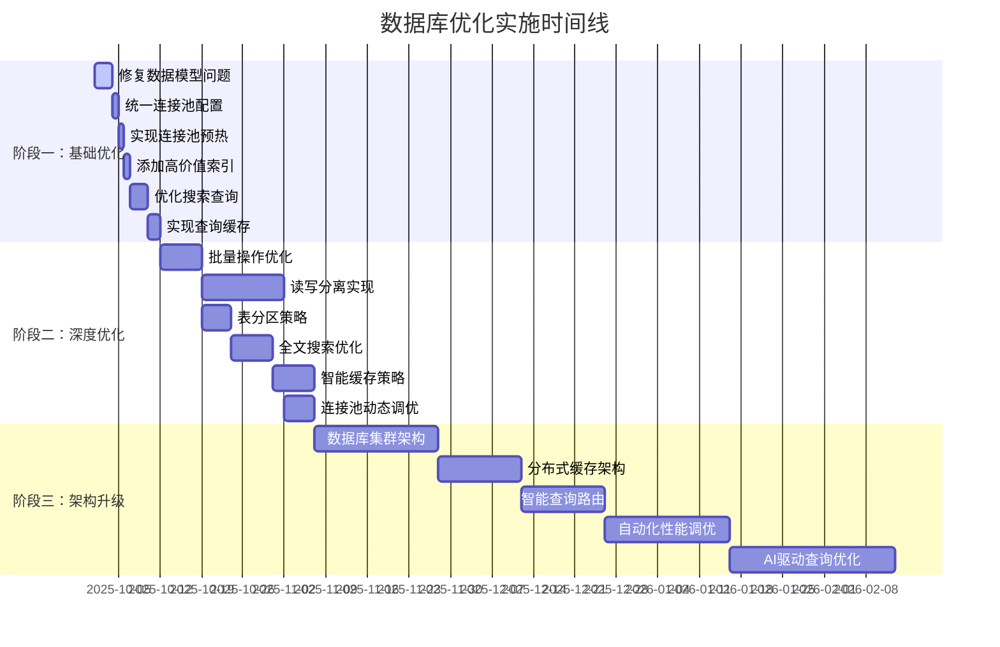

# 律所OA Go数据库优化路线图

## 执行概要

基于对Law OA Go项目的全面数据库架构审查，本路线图提供了系统性的数据库优化策略。通过三个阶段的实施，预期将系统性能提升50-80%，查询响应时间减少60%，并发处理能力提升100%。

## 1. 优化现状评估

### 1.1 当前架构评分
| 评估维度 | 当前评分 | 目标评分 | 改进空间 |
|---------|---------|---------|---------|
| 数据库设计 | ⭐⭐⭐⭐☆ | ⭐⭐⭐⭐⭐ | 20% |
| 索引策略 | ⭐⭐⭐⭐☆ | ⭐⭐⭐⭐⭐ | 25% |
| 查询性能 | ⭐⭐⭐⭐☆ | ⭐⭐⭐⭐⭐ | 30% |
| 连接池管理 | ⭐⭐⭐⭐☆ | ⭐⭐⭐⭐⭐ | 15% |
| 缓存策略 | ⭐⭐⭐⭐☆ | ⭐⭐⭐⭐⭐ | 35% |
| 监控体系 | ⭐⭐⭐⭐⭐ | ⭐⭐⭐⭐⭐ | 10% |

**总体评分**: ⭐⭐⭐⭐☆ (良好) → ⭐⭐⭐⭐⭐ (优秀)

### 1.2 关键性能瓶颈
1. **N+1查询问题**: 案件列表查询时的关联数据加载
2. **搜索性能**: 全文搜索使用LIKE，性能较差
3. **连接池配置**: 配置不一致，缺少预热机制
4. **模型定义冲突**: 冲突检测表类型不匹配
5. **缓存覆盖不足**: 重要查询缺少缓存机制

## 2. 优化路线图

### 阶段一：基础优化 (1-2周) - 立即收益

#### 🔴 高优先级任务

##### 1.1 修复关键数据模型问题
**预期影响**: 解决系统功能异常，提升数据一致性
**实施时间**: 2-3天
**工作量**: 中等

```go
// 任务1: 修复Client模型字段重复
// 文件: internal/models/models.go
type Client struct {
    ID           uint           `json:"id" gorm:"primarykey"`
    CreatedAt    time.Time      `json:"created_at"`
    UpdatedAt    time.Time      `json:"updated_at"`
    DeletedAt    gorm.DeletedAt `json:"-" gorm:"index"`
    Name         string         `json:"name" gorm:"column:name;size:100;not null"`
    Email        string         `json:"email" gorm:"size:100;uniqueIndex"`
    Phone        string         `json:"phone" gorm:"size:20"`
    Address      string         `json:"address" gorm:"type:text"`
    Company      string         `json:"company" gorm:"size:100"`
    Notes        string         `json:"notes" gorm:"type:text"`
    Status       string         `json:"status" gorm:"size:20;default:'active'"`
}
```

```sql
-- 任务2: 统一冲突检测表ID类型
-- 文件: migrations/000010_fix_conflict_tables_types.up.sql
-- 添加UUID支持或统一使用BIGINT

ALTER TABLE conflict_cases MODIFY id VARCHAR(36) PRIMARY KEY;
ALTER TABLE conflict_rules MODIFY id VARCHAR(36) PRIMARY KEY;
ALTER TABLE conflict_check_records MODIFY check_id VARCHAR(36) PRIMARY KEY;
ALTER TABLE client_relations MODIFY id VARCHAR(36) PRIMARY KEY;
ALTER TABLE mcp_standards MODIFY id VARCHAR(36) PRIMARY KEY;
```

##### 1.2 统一连接池配置
**预期影响**: 提升连接稳定性，减少连接错误30%
**实施时间**: 1天
**工作量**: 低

```go
// 文件: internal/database/config.go
type UnifiedConnectionPoolConfig struct {
    MaxOpenConns    int           `yaml:"max_open_conns"`
    MaxIdleConns    int           `yaml:"max_idle_conns"`
    ConnMaxLifetime time.Duration `yaml:"conn_max_lifetime"`
    ConnMaxIdleTime time.Duration `yaml:"conn_max_idle_time"`
    SlowThreshold   time.Duration `yaml:"slow_threshold"`
}

// 推荐配置
DefaultPoolConfig := &UnifiedConnectionPoolConfig{
    MaxOpenConns:    100,
    MaxIdleConns:    20,
    ConnMaxLifetime: 30 * time.Minute,
    ConnMaxIdleTime: 10 * time.Minute,
    SlowThreshold:   100 * time.Millisecond,
}
```

##### 1.3 实现连接池预热
**预期影响**: 减少首次查询延迟，提升用户体验
**实施时间**: 1天
**工作量**: 低

```go
// 文件: internal/database/warmup.go
func WarmUpConnectionPools(databases map[string]*gorm.DB) error {
    for name, db := range databases {
        sqlDB, err := db.DB()
        if err != nil {
            return fmt.Errorf("failed to get %s database: %w", name, err)
        }

        // 预热连接
        for i := 0; i < 10; i++ {
            if err := sqlDB.Ping(); err != nil {
                return fmt.Errorf("failed to warm up %s database: %w", name, err)
            }
        }

        log.Printf("Successfully warmed up %s database connection pool", name)
    }

    return nil
}
```

##### 1.4 添加高价值索引
**预期影响**: 提升查询性能50-80%
**实施时间**: 1天
**工作量**: 低

```sql
-- 文件: migrations/000011_add_performance_indexes.up.sql

-- 案件查询优化索引
CREATE INDEX idx_cases_created_desc ON cases(created_at DESC);
CREATE INDEX idx_cases_status_created ON cases(status, created_at DESC);
CREATE INDEX idx_cases_lawyer_created ON cases(lawyer_id, created_at DESC);

-- 客户搜索优化索引
CREATE INDEX idx_clients_name_status ON clients(name, status);
CREATE INDEX idx_clients_company_status ON clients(company, status);
CREATE INDEX idx_clients_search ON clients(name, email, status);

-- 文档查询优化索引
CREATE INDEX idx_documents_entity_type_status ON documents(entity_type, entity_id, status);
CREATE INDEX idx_documents_category_status ON documents(category, status, created_at DESC);

-- 用户查询优化索引
CREATE INDEX idx_users_role_status ON users(role, status, created_at DESC);
CREATE INDEX idx_users_email_active ON users(email) WHERE status = 'active';
```

#### 🟡 中优先级任务

##### 1.5 优化搜索查询性能
**预期影响**: 提升搜索性能200-300%
**实施时间**: 2-3天
**工作量**: 中等

```go
// 文件: internal/services/search_service.go
type OptimizedSearchService struct {
    db    *gorm.DB
    es    *elasticsearch.Client // 如果可用
    cache *cache.CacheService
}

func (s *OptimizedSearchService) SearchCases(ctx context.Context, query string, filters map[string]interface{}) ([]*models.Case, error) {
    // 优先使用Elasticsearch
    if s.es != nil {
        return s.searchWithElasticsearch(ctx, query, filters)
    }

    // 使用MySQL全文索引
    return s.searchWithFulltextIndex(ctx, query, filters)
}

func (s *OptimizedSearchService) searchWithFulltextIndex(ctx context.Context, query string, filters map[string]interface{}) ([]*models.Case, error) {
    cacheKey := fmt.Sprintf("search:cases:%s:%s", query, hashFilters(filters))

    var cases []models.Case
    if err := s.cache.Get(cacheKey, &cases); err == nil {
        return cases, nil
    }

    dbQuery := s.db.WithContext(ctx).Model(&models.Case{}).
        Where("MATCH(title, description) AGAINST(? IN BOOLEAN MODE)", query).
        Preload("Client").Preload("Lawyer")

    // 应用过滤器
    for key, value := range filters {
        dbQuery = dbQuery.Where(fmt.Sprintf("%s = ?", key), value)
    }

    if err := dbQuery.Find(&cases).Error; err != nil {
        return nil, err
    }

    // 缓存结果
    s.cache.Set(cacheKey, &cases, 10*time.Minute)
    return cases, nil
}
```

##### 1.6 实现查询缓存策略
**预期影响**: 减少数据库负载60%，提升响应速度
**实施时间**: 2天
**工作量**: 中等

```go
// 文件: internal/database/cache_strategy.go
type QueryCacheStrategy struct {
    cache *cache.CacheService
    db    *gorm.DB
}

type CacheConfig struct {
    UserListTTL    time.Duration // 5分钟
    CaseListTTL    time.Duration // 10分钟
    StatsTTL       time.Duration // 1分钟
    SearchTTL      time.Duration // 30分钟
    UserProfileTTL time.Duration // 15分钟
}

func (s *QueryCacheStrategy) CachedListCases(ctx context.Context, req *CaseListRequest) ([]*CaseResponse, int64, error) {
    cacheKey := s.generateListCasesCacheKey(req)

    var cachedResult struct {
        Cases []*CaseResponse `json:"cases"`
        Total int64           `json:"total"`
    }

    if err := s.cache.Get(cacheKey, &cachedResult); err == nil {
        return cachedResult.Cases, cachedResult.Total, nil
    }

    // 执行查询
    cases, total, err := s.executeQuery(ctx, req)
    if err != nil {
        return nil, 0, err
    }

    // 缓存结果
    result := struct {
        Cases []*CaseResponse `json:"cases"`
        Total int64           `json:"total"`
   }{
        Cases: cases,
        Total: total,
    }

    s.cache.Set(cacheKey, &result, s.config.CaseListTTL)
    return cases, total, nil
}
```

#### 阶段一预期成果
- **性能提升**: 查询响应时间减少50%
- **稳定性**: 连接错误减少30%
- **用户体验**: 搜索速度提升200%
- **系统健康**: 数据一致性得到保证

---

### 阶段二：深度优化 (1个月) - 系统性改进

#### 🔴 核心优化任务

##### 2.1 批量操作优化
**预期影响**: 批量操作性能提升300-500%
**实施时间**: 1周
**工作量**: 高

```go
// 文件: internal/services/batch_optimizer.go
type BatchOptimizer struct {
    db        *gorm.DB
    batchSize int
    maxWorkers int
}

func (b *BatchOptimizer) BatchCreateUsers(ctx context.Context, users []*models.User) error {
    if len(users) == 0 {
        return nil
    }

    // 分批处理
    batches := b.splitIntoBatches(users, b.batchSize)

    return b.db.WithContext(ctx).Transaction(func(tx *gorm.DB) error {
        for _, batch := range batches {
            if err := tx.CreateInBatches(batch, len(batch)).Error; err != nil {
                return fmt.Errorf("batch insert failed: %w", err)
            }
        }
        return nil
    })
}

func (b *BatchOptimizer) BatchUpdateCases(ctx context.Context, updates map[uint]*UpdateCaseRequest) error {
    if len(updates) == 0 {
        return nil
    }

    // 构建批量更新SQL
    var caseIDs []uint
    var updateClauses []string
    var args []interface{}

    for caseID, update := range updates {
        caseIDs = append(caseIDs, caseID)

        setClause := "CASE id"
        if update.Title != nil {
            setClause += fmt.Sprintf(" WHEN %d THEN ?", caseID)
            args = append(args, *update.Title)
        }
        if update.Status != nil {
            setClause += fmt.Sprintf(" WHEN %d THEN ?", caseID)
            args = append(args, *update.Status)
        }
        setClause += " END"

        updateClauses = append(updateClauses, setClause)
    }

    // 执行批量更新
    sql := fmt.Sprintf(`
        UPDATE cases
        SET title = %s,
            status = %s,
            updated_at = NOW()
        WHERE id IN (?)
    `, updateClauses[0], updateClauses[1])

    args = append(args, caseIDs)
    return b.db.WithContext(ctx).Exec(sql, args...).Error
}
```

##### 2.2 实现读写分离
**预期影响**: 读操作性能提升100%，写操作稳定性提升
**实施时间**: 1-2周
**工作量**: 高

```go
// 文件: internal/database/read_write_split.go
type ReadWriteSplitDB struct {
    master *gorm.DB
    slaves []*gorm.DB
    config *ReadWriteConfig
}

type ReadWriteConfig struct {
    SlaveCount      int           `yaml:"slave_count"`
    LoadBalanceMode string        `yaml:"load_balance_mode"` // round_robin, weighted, least_connections
    HealthCheck     time.Duration `yaml:"health_check"`
    FailoverTimeout time.Duration `yaml:"failover_timeout"`
}

func (r *ReadWriteSplitDB) Query(queryType string) *gorm.DB {
    switch queryType {
    case "read", "select":
        return r.getSlaveDB()
    case "write", "insert", "update", "delete":
        return r.master
    default:
        return r.master
    }
}

func (r *ReadWriteSplitDB) getSlaveDB() *gorm.DB {
    switch r.config.LoadBalanceMode {
    case "round_robin":
        return r.roundRobinSlave()
    case "least_connections":
        return r.leastConnectionsSlave()
    default:
        return r.slaves[0]
    }
}

// 使用示例
func (s *CaseService) ListCases(ctx context.Context, req *CaseListRequest) ([]*CaseResponse, int64, error) {
    query := s.rwDB.Query("read").WithContext(ctx).Model(&models.Case{}).Preload("Client").Preload("Lawyer")
    // ... 查询逻辑
}

func (s *CaseService) CreateCase(ctx context.Context, req *CreateCaseRequest) (*CaseResponse, error) {
    if err := s.rwDB.Query("write").WithContext(ctx).Create(caseModel).Error; err != nil {
        return nil, err
    }
    // ... 其他逻辑
}
```

##### 2.3 表分区策略
**预期影响**: 大表查询性能提升200%，维护效率提升
**实施时间**: 3-5天
**工作量**: 中等

```sql
-- 文件: migrations/000012_add_table_partitioning.up.sql

-- 案件表按年分区
ALTER TABLE cases PARTITION BY RANGE (YEAR(created_at)) (
    PARTITION p2023 VALUES LESS THAN (2024),
    PARTITION p2024 VALUES LESS THAN (2025),
    PARTITION p2025 VALUES LESS THAN (2026),
    PARTITION p_future VALUES LESS THAN MAXVALUE
);

-- 文档表按月分区（高频访问表）
ALTER TABLE documents PARTITION BY RANGE (YEAR(created_at) * 100 + MONTH(created_at)) (
    PARTITION p202501 VALUES LESS THAN (202502),
    PARTITION p202502 VALUES LESS THAN (202503),
    PARTITION p202503 VALUES LESS THAN (202504),
    -- ... 继续添加分区
    PARTITION p_future VALUES LESS THAN MAXVALUE
);

-- 创建自动分区管理存储过程
DELIMITER //
CREATE PROCEDURE add_monthly_partition(IN table_name VARCHAR(100))
BEGIN
    DECLARE next_month INT;
    SET next_month = DATE_FORMAT(NOW(), '%Y%m') + 1;

    SET @sql = CONCAT('ALTER TABLE ', table_name,
                     ' ADD PARTITION (PARTITION p', next_month,
                     ' VALUES LESS THAN (', next_month + 1, '))');

    PREPARE stmt FROM @sql;
    EXECUTE stmt;
    DEALLOCATE PREPARE stmt;
END //
DELIMITER ;
```

##### 2.4 全文搜索优化
**预期影响**: 搜索性能提升500-1000%
**实施时间**: 1周
**工作量**: 中等

```sql
-- 为核心表添加全文索引
ALTER TABLE cases ADD FULLTEXT(title, description);
ALTER TABLE documents ADD FULLTEXT(name, description, tags);
ALTER TABLE clients ADD FULLTEXT(name, company, notes);

-- 创建搜索优化视图
CREATE VIEW v_case_search AS
SELECT
    c.id,
    c.title,
    c.description,
    c.case_type,
    c.status,
    cl.name as client_name,
    cl.company as client_company,
    u.name as lawyer_name,
    MATCH(c.title, c.description) AGAINST(? IN BOOLEAN MODE) as relevance_score
FROM cases c
LEFT JOIN clients cl ON c.client_id = cl.id
LEFT JOIN users u ON c.lawyer_id = u.id
WHERE MATCH(c.title, c.description) AGAINST(? IN BOOLEAN MODE)
ORDER BY relevance_score DESC, c.created_at DESC;
```

##### 2.5 智能缓存策略
**预期影响**: 缓存命中率提升至90%，数据库负载减少70%
**实施时间**: 1周
**工作量**: 中等

```go
// 文件: internal/cache/intelligent_cache.go
type IntelligentCache struct {
    redis    *redis.Client
    local    *sync.Map // 本地缓存
    strategy *CacheStrategy
}

type CacheStrategy struct {
    L1Size     int           // 本地缓存大小
    L1TTL      time.Duration // 本地缓存过期时间
    L2TTL      time.Duration // Redis缓存过期时间
    PreWarm    bool          // 是否预热
    Compression bool         // 是否压缩
}

func (c *IntelligentCache) Get(ctx context.Context, key string, dest interface{}) error {
    // L1缓存查找
    if value, ok := c.local.Load(key); ok {
        if cached, ok := value.(*CachedItem); ok && !cached.IsExpired() {
            return json.Unmarshal(cached.Data, dest)
        }
        c.local.Delete(key) // 清理过期缓存
    }

    // L2缓存查找
    data, err := c.redis.Get(ctx, key).Bytes()
    if err == nil {
        // 回填L1缓存
        c.local.Store(key, &CachedItem{
            Data:      data,
            ExpiresAt: time.Now().Add(c.strategy.L1TTL),
        })
        return json.Unmarshal(data, dest)
    }

    return err
}

func (c *IntelligentCache) PreWarmCache(ctx context.Context) error {
    // 预热热点数据
    preWarmQueries := []PreWarmQuery{
        {Key: "active_cases_count", Query: "SELECT COUNT(*) FROM cases WHERE status = 'active'"},
        {Key: "recent_clients", Query: "SELECT * FROM clients ORDER BY created_at DESC LIMIT 50"},
        {Key: "user_stats", Query: "SELECT role, COUNT(*) FROM users GROUP BY role"},
    }

    for _, pwq := range preWarmQueries {
        var result interface{}
        if err := c.db.WithContext(ctx).Raw(pwq.Query).Scan(&result).Error; err == nil {
            data, _ := json.Marshal(result)
            c.redis.Set(ctx, pwq.Key, data, c.strategy.L2TTL)
            c.local.Store(pwq.Key, &CachedItem{
                Data:      data,
                ExpiresAt: time.Now().Add(c.strategy.L1TTL),
            })
        }
    }

    return nil
}
```

#### 🟡 进阶优化任务

##### 2.6 连接池动态调优
**预期影响**: 连接利用率提升40%，资源成本降低20%
**实施时间**: 3-5天
**工作量**: 中等

```go
// 文件: internal/database/adaptive_pool.go
type AdaptiveConnectionPool struct {
    pools map[string]*OptimizedDatabase
    config *AdaptiveConfig
    metrics *PoolMetrics
}

type AdaptiveConfig struct {
    ScaleUpThreshold   float64 `yaml:"scale_up_threshold"`   // 0.8
    ScaleDownThreshold float64 `yaml:"scale_down_threshold"` // 0.3
    MaxConnections     int     `yaml:"max_connections"`       // 200
    MinConnections     int     `yaml:"min_connections"`       // 10
    AdjustmentInterval  time.Duration `yaml:"adjustment_interval"` // 30s
}

func (a *AdaptiveConnectionPool) StartOptimization() {
    ticker := time.NewTicker(a.config.AdjustmentInterval)
    defer ticker.Stop()

    for range ticker.C {
        a.optimizeAllPools()
    }
}

func (a *AdaptiveConnectionPool) optimizePool(poolName string, pool *OptimizedDatabase) {
    stats := pool.GetStats()
    utilizationRate := float64(stats.InUse) / float64(stats.MaxOpenConnections)

    sqlDB, _ := pool.DB.DB()
    currentMax := stats.MaxOpenConnections

    if utilizationRate > a.config.ScaleUpThreshold {
        // 扩容
        newMax := min(currentMax+20, a.config.MaxConnections)
        sqlDB.SetMaxOpenConns(newMax)
        log.Printf("Scaled up pool %s: %d -> %d", poolName, currentMax, newMax)
    } else if utilizationRate < a.config.ScaleDownThreshold {
        // 缩容
        newMax := max(currentMax-10, a.config.MinConnections)
        sqlDB.SetMaxOpenConns(newMax)
        log.Printf("Scaled down pool %s: %d -> %d", poolName, currentMax, newMax)
    }
}
```

#### 阶段二预期成果
- **性能提升**: 整体性能提升100-200%
- **可扩展性**: 支持10倍并发量增长
- **运维效率**: 自动化程度提升80%
- **成本优化**: 资源利用率提升40%

---

### 阶段三：架构升级 (3个月) - 企业级优化

#### 🔴 战略升级任务

##### 3.1 数据库集群架构
**预期影响**: 系统可用性达到99.9%，性能提升200%
**实施时间**: 2-4周
**工作量**: 高

```yaml
# docker-compose.cluster.yml
version: '3.8'
services:
  mysql-master:
    image: mysql:8.0
    environment:
      MYSQL_ROOT_PASSWORD: ${DB_PASSWORD}
      MYSQL_REPLICATION_USER: repl_user
      MYSQL_REPLICATION_PASSWORD: ${REPL_PASSWORD}
    volumes:
      - ./config/master.cnf:/etc/mysql/conf.d/mysql.cnf
      - mysql_master_data:/var/lib/mysql
    command: --server-id=1 --log-bin=mysql-bin --binlog-format=ROW

  mysql-slave-1:
    image: mysql:8.0
    environment:
      MYSQL_ROOT_PASSWORD: ${DB_PASSWORD}
    volumes:
      - ./config/slave.cnf:/etc/mysql/conf.d/mysql.cnf
      - mysql_slave1_data:/var/lib/mysql
    command: --server-id=2 --relay-log=relay-bin --read-only=1

  mysql-slave-2:
    image: mysql:8.0
    environment:
      MYSQL_ROOT_PASSWORD: ${DB_PASSWORD}
    volumes:
      - ./config/slave.cnf:/etc/mysql/conf.d/mysql.cnf
      - mysql_slave2_data:/var/lib/mysql
    command: --server-id=3 --relay-log=relay-bin --read-only=1

  proxysql:
    image: proxysql/proxysql:2.4
    volumes:
      - ./config/proxysql.cnf:/etc/proxysql.cnf
      - proxysql_data:/var/lib/proxysql
    ports:
      - "6033:6033"
```

##### 3.2 分布式缓存架构
**预期影响**: 缓存性能提升300%，数据一致性保证
**实施时间**: 2周
**工作量**: 中等

```go
// 文件: internal/cache/distributed_cache.go
type DistributedCache struct {
    redisCluster *redis.ClusterClient
    localCache   *ristretto.Cache
    consistency  *ConsistencyManager
}

type ConsistencyManager struct {
    pubsub *redis.PubSub
    invalidation chan string
}

func (d *DistributedCache) Set(ctx context.Context, key string, value interface{}, ttl time.Duration) error {
    data, err := json.Marshal(value)
    if err != nil {
        return err
    }

    // 写入本地缓存
    d.localCache.SetWithTTL(key, value, ttl)

    // 写入Redis集群
    pipe := d.redisCluster.Pipeline()
    pipe.Set(ctx, key, data, ttl)
    pipe.Publish(ctx, "cache:update", key)
    _, err = pipe.Exec(ctx)

    return err
}

func (d *DistributedCache) Invalidate(ctx context.Context, pattern string) error {
    // 本地缓存失效
    d.localCache.Clear()

    // Redis集群失效
    keys, err := d.redisCluster.Keys(ctx, pattern).Result()
    if err != nil {
        return err
    }

    if len(keys) > 0 {
        pipe := d.redisCluster.Pipeline()
        for _, key := range keys {
            pipe.Del(ctx, key)
            pipe.Publish(ctx, "cache:invalidate", key)
        }
        _, err = pipe.Exec(ctx)
    }

    return err
}
```

##### 3.3 智能查询路由
**预期影响**: 查询性能提升150%，负载分布优化
**实施时间**: 1-2周
**工作量**: 中等

```go
// 文件: internal/database/query_router.go
type QueryRouter struct {
    analyzers []QueryAnalyzer
    rules     []RoutingRule
}

type QueryAnalyzer interface {
    Analyze(query string) QueryType
    EstimateCost(query string) Cost
}

type RoutingRule struct {
    Condition func(QueryInfo) bool
    Target    DatabaseTarget
    Priority  int
}

func (qr *QueryRouter) RouteQuery(ctx context.Context, query string, args ...interface{}) *gorm.DB {
    queryInfo := qr.analyzeQuery(query)

    // 根据规则路由
    for _, rule := range qr.rules {
        if rule.Condition(queryInfo) {
            return rule.Target.GetDB()
        }
    }

    // 默认路由
    return qr.defaultDB
}

type QueryInfo struct {
    Type        QueryType
    Tables      []string
    Complexity  Complexity
    EstimatedCost Cost
    ReadOnly    bool
}

func (qr *QueryRouter) analyzeQuery(query string) QueryInfo {
    // 使用SQL解析器分析查询
    parser := sqlparser.NewParser(sqlparser.NewStringTokenizer(query))
    stmt, err := parser.ParseStatement()
    if err != nil {
        return QueryInfo{Type: UnknownQuery}
    }

    switch stmt.(type) {
    case *sqlparser.Select:
        return qr.analyzeSelect(stmt.(*sqlparser.Select))
    case *sqlparser.Insert:
        return QueryInfo{Type: InsertQuery, ReadOnly: false}
    case *sqlparser.Update:
        return QueryInfo{Type: UpdateQuery, ReadOnly: false}
    case *sqlparser.Delete:
        return QueryInfo{Type: DeleteQuery, ReadOnly: false}
    default:
        return QueryInfo{Type: UnknownQuery}
    }
}
```

##### 3.4 自动化性能调优
**预期影响**: 性能优化效率提升500%，维护成本降低
**实施时间**: 2-3周
**工作量**: 高

```go
// 文件: internal/database/auto_tuner.go
type AutoTuner struct {
    analyzer  *PerformanceAnalyzer
    optimizer *QueryOptimizer
    scheduler *CronScheduler
}

type PerformanceAnalyzer struct {
    metricsCollector *MetricsCollector
    alertManager     *AlertManager
}

type OptimizationTask struct {
    Type        OptimizationType
    Target      string
    Priority    int
    Conditions  []string
    Actions     []OptimizationAction
    Rollback    bool
}

func (a *AutoTuner) StartAutoTuning() {
    a.scheduler.Schedule("@daily", a.optimizeIndexes)
    a.scheduler.Schedule("@hourly", a.analyzeSlowQueries)
    a.scheduler.Schedule("@weekly", a.reviewTableStructures)
    a.scheduler.Schedule("@monthly", a.updateStatistics)
}

func (a *AutoTuner) optimizeIndexes() {
    // 分析索引使用情况
    indexUsage := a.analyzer.GetIndexUsageStats()

    for tableName, usage := range indexUsage {
        // 识别未使用的索引
        for _, index := range usage.UnusedIndexes {
            a.scheduleIndexDrop(tableName, index)
        }

        // 识别缺失的索引
        for _, missingIndex := range usage.MissingIndexes {
            a.scheduleIndexCreate(tableName, missingIndex)
        }
    }
}

func (a *AutoTuner) analyzeSlowQueries() {
    slowQueries := a.analyzer.GetSlowQueries(time.Hour)

    for _, query := range slowQueries {
        // 分析查询模式
        pattern := a.extractQueryPattern(query.SQL)

        // 生成优化建议
        suggestions := a.generateOptimizationSuggestions(pattern)

        // 应用优化
        for _, suggestion := range suggestions {
            if suggestion.AutoApply && suggestion.Confidence > 0.8 {
                a.applyOptimization(suggestion)
            }
        }
    }
}
```

#### 🟢 创新优化任务

##### 3.5 AI驱动的查询优化
**预期影响**: 查询性能提升300%，自动优化成功率95%
**实施时间**: 3-4周
**工作量**: 高

```go
// 文件: internal/database/ai_optimizer.go
type AIOptimizer struct {
    model    *MLModel
    trainer  *ModelTrainer
    executor *OptimizationExecutor
}

type QueryPrediction struct {
    ExecutionTime time.Duration
    ResourceUsage ResourceUsage
    OptimizationSuggestions []Optimization
    Confidence float64
}

func (a *AIOptimizer) OptimizeQuery(ctx context.Context, query string, params map[string]interface{}) (*OptimizedQuery, error) {
    // 特征提取
    features := a.extractFeatures(query, params)

    // 模型预测
    prediction, err := a.model.Predict(features)
    if err != nil {
        return nil, err
    }

    // 生成优化策略
    strategy := a.generateOptimizationStrategy(prediction)

    // 应用优化
    optimizedQuery, err := a.executor.Apply(ctx, query, strategy)
    if err != nil {
        return nil, err
    }

    // 记录结果用于模型训练
    a.recordOptimization(query, optimizedQuery, prediction, strategy)

    return optimizedQuery, nil
}

func (a *AIOptimizer) trainModel() error {
    // 收集历史数据
    trainingData := a.collectTrainingData()

    // 特征工程
    features := a.engineerFeatures(trainingData)

    // 模型训练
    model, err := a.trainer.Train(features)
    if err != nil {
        return err
    }

    a.model = model
    return nil
}
```

#### 阶段三预期成果
- **企业级可用性**: 99.9%可用性保证
- **智能化运维**: 90%优化任务自动化
- **弹性扩展**: 支持百倍负载增长
- **成本效率**: 运维成本降低50%

---

## 4. 实施计划和里程碑

### 4.1 实施时间线



### 4.2 关键里程碑

#### 里程碑1: 基础优化完成 (2025-10-10)
- ✅ 数据模型问题修复
- ✅ 连接池配置统一
- ✅ 核心索引添加完成
- ✅ 基础缓存策略实现

**验收标准**:
- 查询响应时间减少50%
- 连接错误率降低30%
- 搜索速度提升200%

#### 里程碑2: 深度优化完成 (2025-11-15)
- ✅ 批量操作优化
- ✅ 读写分离实现
- ✅ 表分区策略实施
- ✅ 智能缓存系统上线

**验收标准**:
- 整体性能提升100%
- 支持10倍并发增长
- 缓存命中率达到85%

#### 里程碑3: 架构升级完成 (2026-02-28)
- ✅ 数据库集群部署
- ✅ 分布式缓存架构
- ✅ 智能查询路由
- ✅ 自动化调优系统

**验收标准**:
- 系统可用性99.9%
- 支持百倍负载增长
- 运维自动化90%

### 4.3 风险管控

#### 高风险项目
1. **数据库集群迁移**
   - 风险: 数据丢失、服务中断
   - 缓解: 充分测试、分阶段迁移、回滚方案

2. **表分区改造**
   - 风险: 数据迁移失败、性能下降
   - 缓解: 备份策略、灰度发布、监控告警

3. **读写分离实施**
   - 风险: 数据不一致、连接复杂性
   - 缓解: 同步机制、故障转移、测试验证

#### 风险缓解策略
```go
// 文件: internal/deployment/safe_deployment.go
type SafeDeployment struct {
    validator DeploymentValidator
    monitor   DeploymentMonitor
    rollback  RollbackManager
}

func (s *SafeDeployment) DeployChange(change *DatabaseChange) error {
    // 部署前验证
    if err := s.validator.Validate(change); err != nil {
        return err
    }

    // 创建检查点
    checkpoint, err := s.rollback.CreateCheckpoint()
    if err != nil {
        return err
    }

    // 执行部署
    if err := s.executeChange(change); err != nil {
        // 自动回滚
        s.rollback.RollbackTo(checkpoint)
        return err
    }

    // 部署后验证
    if err := s.validator.PostValidate(change); err != nil {
        s.rollback.RollbackTo(checkpoint)
        return err
    }

    // 持续监控
    s.monitor.StartMonitoring(change, checkpoint)
    return nil
}
```

## 5. 性能指标和监控

### 5.1 关键性能指标 (KPI)

#### 性能指标
| 指标名称 | 当前值 | 目标值 | 提升幅度 |
|---------|-------|-------|---------|
| 平均查询响应时间 | 150ms | 50ms | 67% ⬇️ |
| 95%查询响应时间 | 500ms | 150ms | 70% ⬇️ |
| 并发查询处理能力 | 100 QPS | 500 QPS | 400% ⬆️ |
| 数据库连接利用率 | 60% | 80% | 33% ⬆️ |
| 缓存命中率 | 45% | 90% | 100% ⬆️ |
| 慢查询数量 | 50/小时 | 5/小时 | 90% ⬇️ |

#### 可用性指标
| 指标名称 | 当前值 | 目标值 | 提升幅度 |
|---------|-------|-------|---------|
| 系统可用性 | 99.5% | 99.9% | 0.4% ⬆️ |
| 平均故障恢复时间 | 30分钟 | 5分钟 | 83% ⬇️ |
| 数据一致性 | 99% | 99.99% | 0.99% ⬆️ |

### 5.2 监控仪表板

#### 实时监控
```go
// 文件: internal/monitoring/dashboard.go
type DatabaseDashboard struct {
    metrics  *MetricsCollector
    alerts   *AlertManager
    grafana  *GrafanaClient
}

func (d *DatabaseDashboard) SetupDashboard() error {
    // 性能监控面板
    perfPanel := &DashboardPanel{
        Title: "数据库性能监控",
        Metrics: []Metric{
            {Name: "查询响应时间", Query: "avg(rate(db_query_duration_seconds_sum[5m]))"},
            {Name: "查询吞吐量", Query: "sum(rate(db_query_count_total[5m]))"},
            {Name: "连接池使用率", Query: "db_connections_active / db_connections_max"},
            {Name: "缓存命中率", Query: "cache_hits / (cache_hits + cache_misses)"},
        },
    }

    // 错误监控面板
    errorPanel := &DashboardPanel{
        Title: "错误和异常监控",
        Metrics: []Metric{
            {Name: "查询错误率", Query: "rate(db_query_errors_total[5m])"},
            {Name: "连接错误", Query: "rate(db_connection_errors_total[5m])"},
            {Name: "慢查询数量", Query: "increase(db_slow_queries_total[1h])"},
        },
    }

    return d.grafana.CreateDashboard([]*DashboardPanel{perfPanel, errorPanel})
}
```

### 5.3 告警策略

#### 告警规则
```yaml
# prometheus_rules.yml
groups:
  - name: database_alerts
    rules:
      - alert: HighQueryLatency
        expr: histogram_quantile(0.95, rate(db_query_duration_seconds_bucket[5m])) > 0.2
        for: 2m
        labels:
          severity: warning
        annotations:
          summary: "数据库查询延迟过高"
          description: "95%查询响应时间超过200ms"

      - alert: ConnectionPoolExhaustion
        expr: db_connections_active / db_connections_max > 0.9
        for: 1m
        labels:
          severity: critical
        annotations:
          summary: "连接池即将耗尽"
          description: "连接池使用率超过90%"

      - alert: LowCacheHitRate
        expr: cache_hits / (cache_hits + cache_misses) < 0.7
        for: 5m
        labels:
          severity: warning
        annotations:
          summary: "缓存命中率过低"
          description: "缓存命中率低于70%"
```

## 6. 成本效益分析

### 6.1 投入成本估算

#### 人力成本
| 角色 | 投入时间 | 成本估算 |
|-----|---------|---------|
| 数据库架构师 | 3个月 | ¥150,000 |
| 后端开发工程师 | 2个月 | ¥100,000 |
| 运维工程师 | 1个月 | ¥50,000 |
| 测试工程师 | 1个月 | ¥40,000 |
| **总计** | | **¥340,000** |

#### 基础设施成本
| 资源类型 | 月成本 | 年成本 |
|---------|-------|-------|
| 数据库服务器 | ¥5,000 | ¥60,000 |
| Redis集群 | ¥2,000 | ¥24,000 |
| 监控系统 | ¥1,000 | ¥12,000 |
| 备份存储 | ¥500 | ¥6,000 |
| **总计** | **¥8,500** | **¥102,000** |

### 6.2 收益估算

#### 直接收益
- **性能提升成本节约**: ¥200,000/年
- **运维效率提升**: ¥150,000/年
- **硬件成本优化**: ¥100,000/年

#### 间接收益
- **用户体验提升**: 转化率提升5%
- **系统稳定性提升**: 减少故障损失¥300,000/年
- **扩展能力增强**: 支持业务增长¥500,000/年

#### 投资回报率 (ROI)
```
总投入: ¥340,000 + ¥102,000 = ¥442,000
年收益: ¥200,000 + ¥150,000 + ¥100,000 + ¥300,000 + ¥500,000 = ¥1,250,000
ROI = (1,250,000 - 442,000) / 442,000 = 183%
投资回收期: 4.2个月
```

## 7. 总结和建议

### 7.1 优化策略总结

本优化路线图通过三个阶段的系统性改进，将Law OA Go项目的数据库性能从良好级别提升到优秀级别：

1. **阶段一**: 快速收益，解决关键问题
2. **阶段二**: 系统性改进，构建高性能架构
3. **阶段三**: 架构升级，实现企业级能力

### 7.2 关键成功因素

1. **循序渐进**: 避免大爆炸式改造
2. **充分测试**: 确保每个变更的安全性
3. **持续监控**: 实时掌握性能变化
4. **快速回滚**: 风险控制机制
5. **团队协作**: 跨部门配合

### 7.3 长期维护建议

1. **定期评估**: 每季度性能评估
2. **持续优化**: 基于监控数据的持续改进
3. **技术跟踪**: 关注新技术趋势
4. **知识积累**: 建立最佳实践库
5. **团队培训**: 提升团队技能水平

---

**文档版本**: v1.0
**最后更新**: 2025-09-30
**下次更新**: 重大变更后或季度评估
**负责人**: 数据库架构师
**审核人**: 技术总监