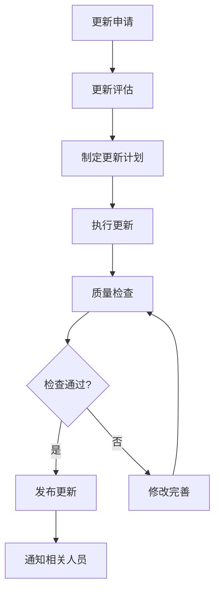
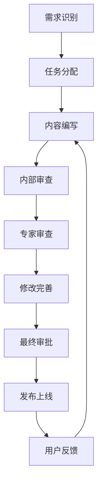

# Law OA Go 文档管理指南

**版本**: v2.1.0
**更新日期**: 2025-09-30
**维护团队**: 知识管理团队

---

## 📋 概述

本文档为Law OA Go项目团队提供完整的文档管理指南，包括文档创建、维护、发布、质量控制和版本管理等全流程管理规范。确保文档质量的一致性和可持续性。

---

## 🎯 文档管理目标

### 核心目标
- **质量保证**: 确保所有文档达到高质量标准
- **一致性维护**: 保持文档风格和格式的一致性
- **时效性保证**: 确保文档内容及时更新
- **可访问性**: 确保文档易于查找和访问
- **知识传承**: 确保知识得到有效传承

### 成功指标
- **文档质量**: 平均质量评分 ≥ 4.5/5.0
- **更新及时性**: 重要文档更新延迟 < 7天
- **用户满意度**: 文档用户满意度 ≥ 90%
- **访问便利性**: 文档查找时间 < 30秒
- **知识覆盖**: 核心知识覆盖率 ≥ 95%

---

## 📚 文档分类管理

### 1. 文档分类体系

#### 1.1 按功能分类
```
📋 项目文档
├── 📖 技术文档
│   ├── API文档
│   ├── 架构文档
│   ├── 部署文档
│   └── 安全文档
├── 🛠️ 开发文档
│   ├── 开发规范
│   ├── 最佳实践
│   ├── 代码示例
│   └── 工具配置
├── 📚 知识库
│   ├── 技术决策
│   ├── 经验总结
│   ├── 故障案例
│   └── 创新实践
├── 👥 用户文档
│   ├── 用户手册
│   操作指南
│   ├── FAQ
│   └── 培训材料
└── 📊 管理文档
    ├── 项目管理
    ├── 流程规范
    ├── 质量标准
    └── 汇报材料
```

#### 1.2 按重要性分类
- **P0 - 核心文档**: API文档、架构文档、部署指南
- **P1 - 重要文档**: 开发规范、最佳实践、安全指南
- **P2 - 一般文档**: 知识库文章、用户指南、培训材料
- **P3 - 参考文档**: FAQ、案例研究、历史文档

#### 1.3 按生命周期分类
- **规划阶段**: 需求文档、设计文档、技术选型
- **开发阶段**: API文档、开发规范、最佳实践
- **测试阶段**: 测试计划、测试用例、测试报告
- **部署阶段**: 部署指南、运维手册、监控配置
- **维护阶段**: 故障手册、优化指南、更新日志

### 2. 文档命名规范

#### 2.1 文件命名规则
```
格式: [类别]-[子类别]-[主题]-[版本].[扩展名]

示例:
- technical-api-user-endpoints-v2.1.md
- practice-go-performance-optimization-v1.0.md
- knowledge-decision-microservices-v1.2.md
- guide-deployment-docker-production-v3.0.md
```

#### 2.2 版本命名规则
- **主版本号**: 重大更新，不兼容变更 (1.0.0 → 2.0.0)
- **次版本号**: 功能更新，向后兼容 (1.0.0 → 1.1.0)
- **修订版本号**: 错误修复，完全兼容 (1.0.0 → 1.0.1)

#### 2.3 文档状态标识
- **DRAFT**: 草稿状态，内容可能变更
- **REVIEW**: 审查状态，等待审查反馈
- **PUBLISHED**: 发布状态，内容稳定
- **DEPRECATED**: 废弃状态，不再维护
- **ARCHIVED**: 归档状态，仅作参考

---

## 📝 文档创建规范

### 1. 文档模板

#### 1.1 技术文档模板
```markdown
---
title: "文档标题"
category: "文档分类"
subcategory: "子分类"
version: "1.0.0"
status: "DRAFT|REVIEW|PUBLISHED"
author: "作者姓名"
created: "YYYY-MM-DD"
updated: "YYYY-MM-DD"
reviewers: ["审查者1", "审查者2"]
tags: ["标签1", "标签2", "标签3"]
related: ["相关文档1.md", "相关文档2.md"]
---

## 概述
[简要描述文档内容和目的]

## 背景
[描述文档的背景和上下文]

## 详细内容
[文档的主要内容，分章节详细描述]

### 章节1
[具体内容]

### 章节2
[具体内容]

## 示例和代码
[提供相关示例和代码]

## 注意事项
[特殊注意事项和提醒]

## 相关资源
[相关文档和资源链接]

## 更新历史
| 版本 | 日期 | 作者 | 变更内容 |
|------|------|------|----------|
| 1.0.0 | 2025-09-30 | 张三 | 初始版本 |

---
**文档维护**: [维护团队]
**联系方式**: [联系邮箱]
**最后更新**: [更新日期]
```

#### 1.2 API文档模板
```markdown
---
title: "API文档标题"
category: "technical"
subcategory: "api"
version: "1.0.0"
---

# API名称

## 概述
[API功能描述]

## 基础信息
- **基础URL**: `https://api.law-oa.com/v1`
- **认证方式**: JWT Bearer Token
- **数据格式**: JSON
- **字符编码**: UTF-8

## 认证机制
[详细的认证说明]

## 接口列表

### 接口名称
**请求方式**: `GET|POST|PUT|DELETE`
**接口路径**: `/api/v1/resource`

#### 请求参数
| 参数名 | 类型 | 必填 | 描述 |
|--------|------|------|------|
| param1 | string | 是 | 参数描述 |
| param2 | number | 否 | 参数描述 |

#### 请求示例
```json
{
  "param1": "value1",
  "param2": 123
}
```

#### 响应格式
```json
{
  "data": {},
  "error": null,
  "timestamp": "2025-09-30T12:00:00Z"
}
```

#### 错误码
| 错误码 | 说明 | 解决方案 |
|--------|------|----------|
| 400 | 请求参数错误 | 检查参数格式 |
| 401 | 未授权 | 检查认证信息 |
```

### 2. 内容编写规范

#### 2.1 标题层级
```markdown
# 一级标题 (文档标题)
## 二级标题 (主要章节)
### 三级标题 (子章节)
#### 四级标题 (详细内容)
##### 五级标题 (补充说明)
```

#### 2.2 列表格式
```markdown
### 无序列表
- 项目1
- 项目2
  - 子项目2.1
  - 子项目2.2

### 有序列表
1. 步骤1
2. 步骤2
   1. 子步骤2.1
   2. 子步骤2.2
```

#### 2.3 代码块格式
```markdown
### 行内代码
使用 `var name string` 声明变量

### 代码块
```go
func main() {
    fmt.Println("Hello, World!")
}
```

### 带行号的代码块
```go {lineNumbers=true}
func main() {  // 1
    fmt.Println("Hello, World!")  // 2
}  // 3
```
```

#### 2.4 表格格式
```markdown
| 列1 | 列2 | 列3 |
|-----|-----|-----|
| 内容1 | 内容2 | 内容3 |
| 内容4 | 内容5 | 内容6 |
```

#### 2.5 链接格式
```markdown
### 内部链接
[文档标题](./path/to/document.md)

### 外部链接
[Google](https://www.google.com)

### 锚点链接
[跳转到章节](#章节名称)
```

---

## 🔍 文档质量控制

### 1. 质量标准

#### 1.1 内容质量标准
- **准确性**: 内容必须准确无误
- **完整性**: 内容必须完整全面
- **实用性**: 内容必须具有实际指导意义
- **时效性**: 内容必须保持最新状态
- **清晰性**: 表达必须清楚易懂

#### 1.2 格式质量标准
- **结构规范**: 必须遵循文档结构规范
- **格式统一**: 必须使用统一的格式规范
- **语法正确**: 必须使用正确的语法和拼写
- **链接有效**: 内外链接必须有效可访问
- **代码可执行**: 代码示例必须可执行

#### 1.3 可读性标准
- **语言简洁**: 使用简洁明了的语言
- **逻辑清晰**: 内容逻辑清晰，层次分明
- **术语统一**: 专业术语使用统一
- **示例丰富**: 提供丰富的示例和案例
- **图表清晰**: 图表清晰易懂，标注完整

### 2. 质量检查流程

#### 2.1 自动化检查
```bash
#!/bin/bash
# 文档质量检查脚本

echo "开始文档质量检查..."

# 1. Markdown格式检查
echo "检查Markdown格式..."
find docs/ -name "*.md" -exec markdownlint {} \;

# 2. 链接有效性检查
echo "检查链接有效性..."
find docs/ -name "*.md" -exec markdown-link-check {} \;

# 3. 拼写检查
echo "检查拼写错误..."
find docs/ -name "*.md" -exec aspell check {} \;

# 4. 代码语法检查
echo "检查代码示例..."
find docs/ -name "*.md" -exec grep -n "```" {} \; | while read line; do
    echo "检查代码块: $line"
done

echo "文档质量检查完成"
```

#### 2.2 人工审查清单
```markdown
## 内容审查
- [ ] 内容是否准确无误
- [ ] 内容是否完整全面
- [ ] 内容是否具有实用性
- [ ] 内容是否保持最新

## 格式审查
- [ ] 标题层级是否正确
- [ ] 列表格式是否规范
- [ ] 代码块格式是否正确
- [ ] 表格格式是否规范
- [ ] 链接是否有效

## 语言审查
- [ ] 语言是否简洁明了
- [ ] 逻辑是否清晰
- [ ] 术语是否统一
- [ ] 语法是否正确
- [ ] 拼写是否正确

## 可读性审查
- [ ] 结构是否清晰
- [ ] 示例是否丰富
- [ ] 图表是否清晰
- [ ] 导航是否便捷
- [ ] 索引是否完整
```

### 3. 质量评估指标

#### 3.1 定量指标
```markdown
## 基础指标
- **文档数量**: 当前文档总数
- **分类覆盖率**: 各分类文档覆盖情况
- **更新频率**: 文档更新频率统计
- **访问量**: 文档访问次数统计

## 质量指标
- **准确性评分**: 内容准确性评分 (1-5分)
- **完整性评分**: 内容完整性评分 (1-5分)
- **实用性评分**: 内容实用性评分 (1-5分)
- **可读性评分**: 内容可读性评分 (1-5分)

## 用户指标
- **用户满意度**: 用户满意度评分
- **使用频率**: 文档使用频率统计
- **反馈数量**: 用户反馈数量统计
- **问题报告**: 问题报告数量统计
```

#### 3.2 定性评估
- **专家评审**: 邀请领域专家进行评审
- **用户调研**: 通过问卷和访谈收集用户反馈
- **同行评议**: 组织同行进行评议
- **使用测试**: 实际使用场景测试

---

## 🔄 文档更新维护

### 1. 更新触发条件

#### 1.1 定期更新
- **月度检查**: 每月检查文档时效性
- **季度审查**: 每季度进行深度审查
- **年度评估**: 每年进行全面评估和优化

#### 1.2 事件驱动更新
- **代码变更**: 相关代码变更后更新文档
- **功能更新**: 新功能发布后更新文档
- **问题发现**: 发现文档错误后立即更新
- **用户反馈**: 根据用户反馈进行更新

#### 1.3 版本发布更新
- **主版本发布**: 主版本发布时更新相关文档
- **次版本发布**: 次版本发布时检查更新需求
- **补丁版本发布**: 补丁版本发布时检查影响范围

### 2. 更新流程

#### 2.1 更新申请
```markdown
## 更新申请模板

### 基本信息
- **文档名称**: [文档标题]
- **文档路径**: [文档路径]
- **当前版本**: [当前版本号]
- **目标版本**: [目标版本号]

### 更新原因
- [ ] 内容不准确
- [ ] 内容不完整
- [ ] 内容过时
- [ ] 格式问题
- [ ] 用户反馈
- [ ] 其他原因

### 更新内容
[详细描述需要更新的内容]

### 影响范围
[描述更新对其他文档或系统的影响]

### 优先级
- [ ] 高 - 紧急更新
- [ ] 中 - 计划更新
- [ ] 低 - 优化更新
```

#### 2.2 更新执行流程


#### 2.3 更新通知
```markdown
## 更新通知模板

### 文档更新通知

**文档名称**: [文档标题]
**更新版本**: [v1.0.0 → v1.1.0]
**更新日期**: [2025-09-30]
**更新人员**: [更新人员]

### 更新内容
[简要描述更新内容]

### 主要变更
- [ ] 新增内容
- [ ] 修改内容
- [ ] 删除内容
- [ ] 格式调整

### 影响范围
[描述更新影响范围]

### 相关链接
- [文档链接](./path/to/document.md)
- [变更日志](./CHANGELOG.md)
```

### 3. 版本管理

#### 3.1 版本控制策略
```bash
# Git分支策略
main                    # 主分支，稳定版本
develop                 # 开发分支，最新版本
feature/doc-update      # 功能分支，文档更新
hotfix/doc-emergency    # 热修复分支，紧急修复
release/v1.1.0         # 发布分支，版本发布

# 版本标签
git tag -a v1.1.0 -m "Release version 1.1.0"
git push origin v1.1.0
```

#### 3.2 变更日志
```markdown
# 变更日志模板

## [v1.1.0] - 2025-09-30

### 新增
- 新增API文档更新指南
- 新增性能优化经验文档
- 新增安全漏洞案例分析

### 改进
- 改进API文档的结构和格式
- 优化文档导航和搜索功能
- 增强代码示例的实用性

### 修复
- 修复部署指南中的配置错误
- 修正API文档中的参数描述
- 更新过时的工具版本信息

### 废弃
- 废弃旧版本的API文档
- 移除过时的配置示例

### 安全
- 更新安全配置建议
- 增强敏感信息保护措施
```

---

## 🚀 文档发布管理

### 1. 发布流程

#### 1.1 发布准备
```markdown
## 发布前检查清单

### 内容检查
- [ ] 所有内容审查完成
- [ ] 链接有效性验证通过
- [ ] 代码示例测试通过
- [ ] 格式规范检查通过

### 技术检查
- [ ] 文档构建成功
- [ ] 搜索索引更新
- [ ] 导航链接正确
- [ ] 权限设置正确

### 审批检查
- [ ] 技术审查通过
- [ ] 业务审查通过
- [ ] 质量审查通过
- [ ] 管理审批通过
```

#### 1.2 发布执行
```bash
#!/bin/bash
# 文档发布脚本

echo "开始发布文档..."

# 1. 构建文档
echo "构建文档..."
npm run build

# 2. 运行测试
echo "运行测试..."
npm run test

# 3. 生成搜索索引
echo "生成搜索索引..."
npm run build-search

# 4. 部署到服务器
echo "部署到服务器..."
rsync -avz dist/ user@server:/var/www/docs/

# 5. 更新版本信息
echo "更新版本信息..."
./scripts/update-version.sh

# 6. 发送通知
echo "发送发布通知..."
./scripts/send-notification.sh

echo "文档发布完成"
```

### 2. 发布环境

#### 2.1 环境分类
- **开发环境**: 用于文档开发和测试
- **测试环境**: 用于文档验证和用户测试
- **预生产环境**: 用于发布前最终验证
- **生产环境**: 用于正式发布和用户访问

#### 2.2 环境配置
```yaml
# 开发环境配置
development:
  base_url: "http://dev-docs.law-oa.com"
  search_enabled: true
  analytics_enabled: false
  debug_mode: true

# 生产环境配置
production:
  base_url: "https://docs.law-oa.com"
  search_enabled: true
  analytics_enabled: true
  debug_mode: false
  cache_enabled: true
```

### 3. 发布监控

#### 3.1 监控指标
```markdown
## 可用性监控
- **网站可用性**: 99.9%+
- **页面加载时间**: < 3秒
- **搜索响应时间**: < 1秒
- **错误率**: < 0.1%

## 使用监控
- **访问量**: 每日访问量统计
- **用户行为**: 页面停留时间、跳出率
- **搜索统计**: 搜索关键词、搜索结果点击率
- **反馈统计**: 用户反馈数量和质量

## 质量监控
- **链接健康**: 死链检测和修复
- **内容质量**: 用户评分和反馈
- **更新及时性**: 内容更新频率
- **准确性**: 错误报告和修正
```

#### 3.2 告警机制
```yaml
# 告警配置
alerts:
  website_down:
    condition: "availability < 99%"
    channels: ["email", "slack"]
    recipients: ["admin@law-oa.com"]

  slow_loading:
    condition: "load_time > 5s"
    channels: ["slack"]
    recipients: ["ops@law-oa.com"]

  broken_links:
    condition: "broken_links > 10"
    channels: ["email"]
    recipients: ["docs@law-oa.com"]
```

---

## 👥 团队协作管理

### 1. 角色和权限

#### 1.1 角色定义
```markdown
## 角色权限矩阵

| 角色 | 创建 | 编辑 | 删除 | 发布 | 管理 |
|------|------|------|------|------|------|
| 文档管理员 | ✅ | ✅ | ✅ | ✅ | ✅ |
| 技术写作者 | ✅ | ✅ | ❌ | ❌ | ❌ |
| 开发人员 | ✅ | ✅ | ❌ | ❌ | ❌ |
| 审查者 | ❌ | ✅ | ❌ | ❌ | ❌ |
| 只读用户 | ❌ | ❌ | ❌ | ❌ | ❌ |
```

#### 1.2 权限配置
```yaml
# 权限配置示例
permissions:
  document_admin:
    - "document:*"
    - "category:*"
    - "user:*"

  technical_writer:
    - "document:create"
    - "document:edit"
    - "document:read"
    - "category:read"

  developer:
    - "document:create"
    - "document:edit:own"
    - "document:read"

  reviewer:
    - "document:read"
    - "document:review"
    - "document:comment"

  reader:
    - "document:read"
    - "category:read"
```

### 2. 协作流程

#### 2.1 文档协作


#### 2.2 审查流程
```markdown
## 审查角色和职责

### 内容审查者
- **技术准确性**: 验证技术内容准确性
- **逻辑一致性**: 检查内容逻辑一致性
- **完整性检查**: 确保内容完整全面

### 格式审查者
- **格式规范**: 检查格式规范一致性
- **语言表达**: 检查语言表达准确性
- **可读性**: 评估内容可读性

### 业务审查者
- **业务需求**: 验证是否满足业务需求
- **用户价值**: 评估用户价值
- **合规性**: 检查合规性要求
```

### 3. 沟通机制

#### 3.1 会议安排
```markdown
## 定期会议

### 文档周会 (每周一 14:00-15:00)
- 上周工作总结
- 本周工作计划
- 问题讨论和解决
- 经验分享

### 文档月会 (每月最后一周周三 14:00-16:00)
- 月度工作总结
- 质量指标回顾
- 改进计划制定
- 团队培训

### 季度回顾会 (每季度最后一周)
- 季度目标回顾
- 成果展示
- 问题分析
- 下季度规划
```

#### 3.2 沟通工具
- **即时通讯**: Slack、钉钉、微信
- **邮件通知**: 重要通知和公告
- **项目管理**: Jira、Trello、Asana
- **文档协作**: Google Docs、Notion、Confluence

---

## 📊 性能和优化

### 1. 性能指标

#### 1.1 技术性能
```markdown
## 网站性能
- **页面加载时间**: 首屏加载 < 2秒
- **搜索响应时间**: 搜索响应 < 1秒
- **图片加载时间**: 图片加载 < 3秒
- **移动端性能**: 移动端评分 > 90

## 搜索性能
- **搜索准确率**: 搜索结果准确率 > 95%
- **搜索覆盖率**: 内容覆盖率 > 90%
- **搜索速度**: 搜索响应时间 < 1秒
- **搜索相关性**: 搜索相关性评分 > 4.5/5

## 用户体验
- **页面浏览量**: 每日页面浏览量
- **用户停留时间**: 平均停留时间 > 3分钟
- **跳出率**: 跳出率 < 30%
- **用户满意度**: 用户满意度 > 90%
```

#### 1.2 业务指标
```markdown
## 使用指标
- **活跃用户数**: 每月活跃用户数
- **文档访问量**: 每日文档访问量
- **搜索使用率**: 搜索功能使用率
- **反馈提交率**: 用户反馈提交率

## 质量指标
- **文档质量评分**: 平均质量评分
- **内容准确性**: 内容准确性评分
- **用户满意度**: 用户满意度评分
- **问题解决率**: 用户问题解决率
```

### 2. 优化策略

#### 2.1 性能优化
```markdown
## 前端优化
- **代码压缩**: 压缩HTML、CSS、JavaScript
- **图片优化**: 压缩图片，使用WebP格式
- **懒加载**: 图片和内容懒加载
- **缓存策略**: 合理的缓存策略

## 搜索优化
- **索引优化**: 优化搜索索引结构
- **算法优化**: 优化搜索排序算法
- **分词优化**: 优化中文分词效果
- **语义搜索**: 引入语义搜索功能

## 内容优化
- **结构优化**: 优化文档结构层次
- **导航优化**: 优化导航和菜单结构
- **标签优化**: 优化标签分类和关联
- **推荐优化**: 优化相关内容推荐
```

#### 2.2 SEO优化
```markdown
## 页面优化
- **标题优化**: 优化页面标题和描述
- **关键词优化**: 优化关键词布局
- **结构化数据**: 添加结构化数据标记
- **URL优化**: 优化URL结构

## 内容优化
- **原创内容**: 确保内容原创性
- **内容质量**: 提高内容质量和价值
- **更新频率**: 保持定期更新
- **内链建设**: 建立合理的内链结构

## 技术优化
- **移动端适配**: 优化移动端体验
- **网站速度**: 提高网站加载速度
- **HTTPS支持**: 启用HTTPS安全协议
- **XML地图**: 提交XML站点地图
```

---

## 🔧 工具和平台

### 1. 文档编辑工具

#### 1.1 编辑器推荐
- **VS Code**: 轻量级，插件丰富
- **Typora**: 所见即所得，体验优秀
- **Obsidian**: 知识管理，链接功能强大
- **Notion**: 团队协作，功能全面

#### 1.2 编辑器配置
```json
{
  "editor.fontSize": 14,
  "editor.wordWrap": "on",
  "editor.minimap.enabled": true,
  "markdown.preview.fontSize": 14,
  "markdown.preview.lineHeight": 1.6,
  "files.autoSave": "afterDelay",
  "files.autoSaveDelay": 1000
}
```

### 2. 文档管理平台

#### 2.1 平台选择
- **GitBook**: 专注于文档发布
- **ReadTheDocs**: 开源项目文档平台
- **Confluence**: 企业知识管理平台
- **DokuWiki**: 轻量级Wiki系统

#### 2.2 平台配置
```yaml
# GitBook配置
gitbook:
  title: "Law OA Go 文档"
  description: "律师事务所OA系统文档"
  author: "技术团队"
  language: "zh-hans"
  gitbook: "3.2.3"

  plugins:
    - "search-pro"
    - "theme-code"
    - "back-to-top-button"
    - "splitter"

  structure:
    "README.md": "介绍"
    "SUMMARY.md": "目录"
    "technical/": "技术文档"
    "practices/": "最佳实践"
    "handbook/": "开发者手册"
```

### 3. 自动化工具

#### 3.1 构建工具
```bash
# 使用Node.js构建工具
npm install -g gitbook-cli

# 构建文档
gitbook build

# 启动本地服务
gitbook serve

# 部署到GitHub Pages
gitbook build
git checkout gh-pages
cp -r _book/* ./
git add .
git commit -m "Update docs"
git push origin gh-pages
```

#### 3.2 CI/CD集成
```yaml
# GitHub Actions配置
name: Build and Deploy Docs

on:
  push:
    branches: [ main ]
  pull_request:
    branches: [ main ]

jobs:
  build-and-deploy:
    runs-on: ubuntu-latest

    steps:
    - uses: actions/checkout@v2

    - name: Setup Node.js
      uses: actions/setup-node@v2
      with:
        node-version: '16'

    - name: Install dependencies
      run: npm install

    - name: Build docs
      run: npm run build

    - name: Deploy to GitHub Pages
      uses: peaceiris/actions-gh-pages@v3
      with:
        github_token: ${{ secrets.GITHUB_TOKEN }}
        publish_dir: ./_book
```

---

## 📞 支持和帮助

### 1. 技术支持

#### 1.1 支持渠道
- **邮件支持**: docs@law-oa.com
- **即时通讯**: Slack频道 #docs-support
- **电话支持**: +86-xxx-xxxx-xxxx
- **工单系统**: https://support.law-oa.com

#### 1.2 支持时间
- **工作时间**: 周一至周五 9:00-18:00
- **紧急支持**: 7x24小时
- **响应时间**: 2小时内响应
- **解决时间**: 24小时内解决

### 2. 培训和指导

#### 2.1 培训计划
```markdown
## 新员工培训
- **文档管理系统使用**: 2小时
- **文档编写规范**: 4小时
- **文档审查流程**: 2小时
- **实际操作练习**: 2小时

## 定期培训
- **文档质量提升**: 每季度1次
- **新功能培训**: 功能发布后1周内
- **最佳实践分享**: 每月1次
- **工具使用培训**: 按需安排
```

#### 2.2 指导资源
- **在线帮助**: 系统内置帮助文档
- **视频教程**: 录制操作视频教程
- **FAQ文档**: 常见问题解答
- **用户手册**: 详细用户操作手册

### 3. 反馈和改进

#### 3.1 反馈渠道
- **在线表单**: 网站反馈表单
- **邮件反馈**: feedback@law-oa.com
- **用户调研**: 定期用户调研
- **用户访谈**: 深度用户访谈

#### 3.2 改进机制
```markdown
## 反馈处理流程
1. 收集用户反馈
2. 分类和优先级排序
3. 分析反馈内容
4. 制定改进计划
5. 实施改进措施
6. 验证改进效果
7. 通知用户改进结果

## 持续改进
- **月度回顾**: 每月回顾改进效果
- **季度评估**: 每季度评估整体效果
- **年度规划**: 每年制定改进计划
- **用户沟通**: 保持与用户持续沟通
```

---

**文档版本**: v2.1.0
**最后更新**: 2025-09-30
**下次审查**: 2025-12-30
**维护团队**: 知识管理团队
**联系方式**: docs@law-oa.com