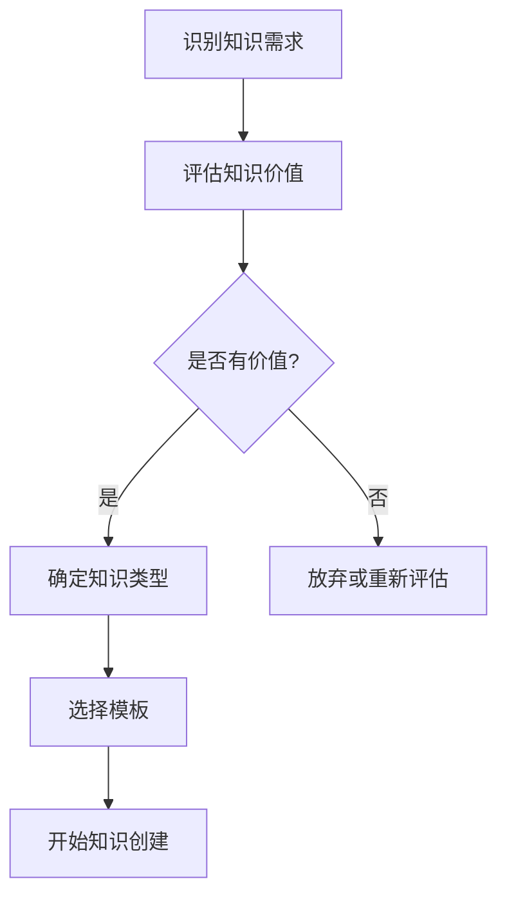
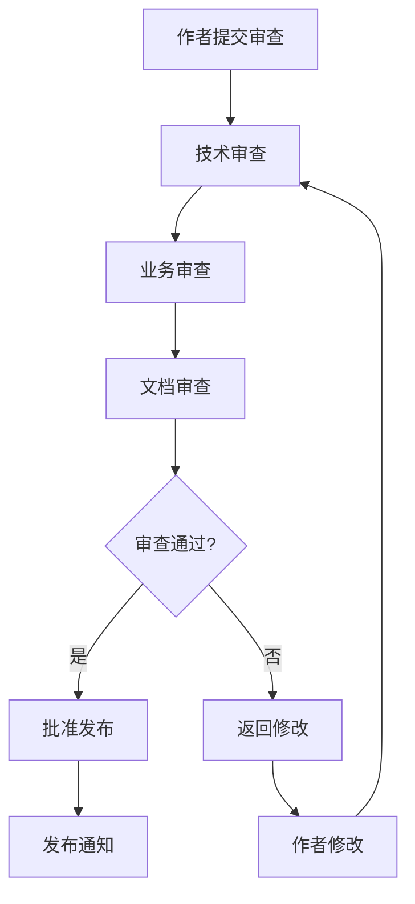
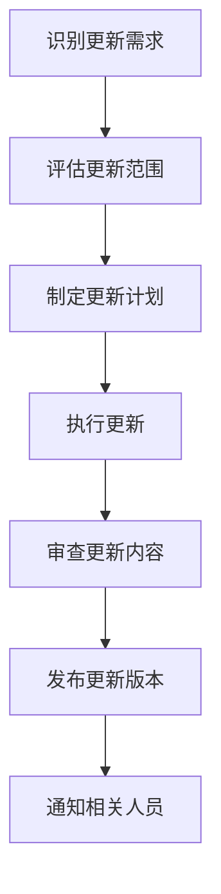
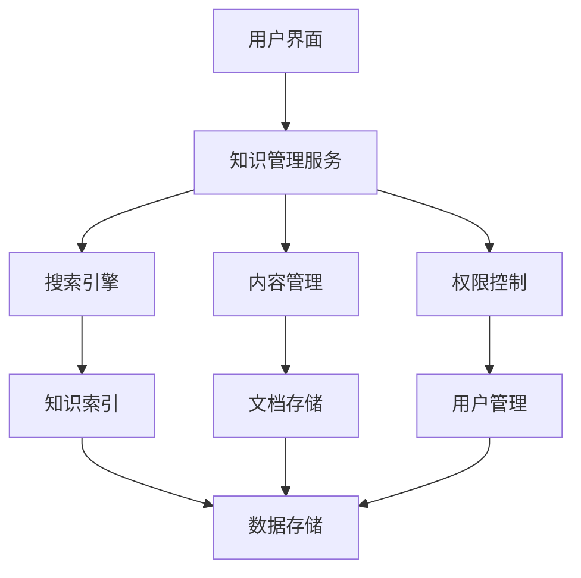

# Law OA Go 知识管理框架

**版本**: v2.1.0
**更新日期**: 2025-09-30
**维护团队**: 知识管理团队

---

## 📋 概述

本文档定义了Law OA Go项目的知识管理框架，包括知识分类体系、管理流程、存储结构、访问控制和持续改进机制。目标是建立系统化的知识管理体系，提高团队知识共享和利用效率。

---

## 🎯 知识管理目标

### 核心目标
- **知识沉淀**: 确保项目经验和技术积累得到有效保存
- **知识共享**: 促进团队成员之间的知识交流和共享
- **知识应用**: 提高知识的实际应用价值和效率
- **知识创新**: 鼓励基于现有知识的创新和改进
- **知识传承**: 确保关键知识不会因人员流动而丢失

### 成功指标
- **知识库完整性**: > 95% 的技术决策和经验被记录
- **知识更新频率**: 每月新增 > 10 篇有价值的知识文档
- **知识使用率**: > 80% 的团队成员定期使用知识库
- **知识满意度**: 用户满意度 > 4.5/5.0
- **知识贡献度**: > 60% 的团队成员贡献知识内容

---

## 📚 知识分类体系

### 1. 技术知识

#### 1.1 架构设计
- **系统架构**: 整体架构设计和技术选型
- **设计模式**: 常用的设计模式和应用场景
- **技术决策记录 (ADR)**: 重要的技术决策记录
- **架构演进**: 系统架构的演进历史和规划

#### 1.2 开发规范
- **编码标准**: Go、TypeScript等语言的编码规范
- **代码审查**: 代码审查标准和流程
- **测试规范**: 单元测试、集成测试规范
- **文档标准**: 技术文档编写规范

#### 1.3 最佳实践
- **性能优化**: 数据库、缓存、并发等优化经验
- **安全实践**: 安全编码和防护措施
- **DevOps实践**: CI/CD、部署、监控等实践
- **故障处理**: 常见故障的处理经验

### 2. 业务知识

#### 2.1 领域知识
- **法律业务**: 律师事务所业务流程和术语
- **用户场景**: 典型用户使用场景和需求
- **业务规则**: 核心业务规则和逻辑
- **合规要求**: 行业合规要求和法规

#### 2.2 产品知识
- **功能特性**: 系统功能特性和使用方法
- **用户指南**: 各类用户的操作指南
- **配置管理**: 系统配置和参数说明
- **集成方案**: 第三方系统集成方案

### 3. 项目管理

#### 3.1 流程规范
- **开发流程**: 需求分析、设计、开发、测试流程
- **发布流程**: 版本发布和部署流程
- **变更管理**: 需求变更和代码变更管理
- **质量保证**: 质量检查和控制流程

#### 3.2 团队协作
- **沟通机制**: 团队内部和跨团队沟通机制
- **会议管理**: 各类会议的组织和管理
- **协作工具**: 协作工具的使用规范
- **知识分享**: 知识分享活动和机制

### 4. 运维知识

#### 4.1 系统运维
- **部署指南**: 系统部署和环境配置
- **监控告警**: 系统监控和告警配置
- **故障排查**: 常见故障的排查方法
- **性能调优**: 系统性能优化经验

#### 4.2 安全运维
- **安全配置**: 系统安全配置指南
- **漏洞修复**: 安全漏洞修复流程
- **应急响应**: 安全事件应急响应
- **合规审计**: 安全合规审计要求

---

## 🗂️ 知识存储结构

### 目录结构设计
```
docs/
├── knowledge-base/           # 知识库
│   ├── technical/           # 技术知识
│   │   ├── architecture/    # 架构设计
│   │   ├── development/     # 开发规范
│   │   ├── best-practices/  # 最佳实践
│   │   └── security/        # 安全知识
│   ├── business/            # 业务知识
│   │   ├── domain/          # 领域知识
│   │   ├── products/        # 产品知识
│   │   └── user-guides/     # 用户指南
│   ├── project-management/  # 项目管理
│   │   ├── processes/       # 流程规范
│   │   ├── collaboration/   # 团队协作
│   │   └── quality/         # 质量管理
│   └── operations/         # 运维知识
│       ├── deployment/      # 部署指南
│       ├── monitoring/      # 监控告警
│       ├── troubleshooting/ # 故障排查
│       └── security/        # 安全运维
├── technical-documentation/  # 技术文档
├── best-practices/         # 最佳实践
├── developer-handbook/     # 开发者手册
└── knowledge-management/   # 知识管理
```

### 文件命名规范

#### 知识文档命名
```
格式: [类别]-[子类别]-[主题].md

示例:
- technical-architecture-system-design.md
- best-practices-performance-optimization.md
- business-domain-legal-workflow.md
- operations-deployment-docker-setup.md
```

#### 模板文件命名
```
格式: template-[类别].md

示例:
- template-architecture-decision.md
- template-best-practice.md
- template-lesson-learned.md
- template-troubleshooting.md
```

### 元数据标准

每个知识文档应包含以下元数据：

```markdown
---
title: "文档标题"
category: "文档分类"
subcategory: "子分类"
tags: ["标签1", "标签2", "标签3"]
author: "作者"
created: "YYYY-MM-DD"
updated: "YYYY-MM-DD"
version: "文档版本"
status: "draft|review|published|deprecated"
reviewers: ["审查者1", "审查者2"]
related: ["相关文档1.md", "相关文档2.md"]
---
```

---

## 🔄 知识管理流程

### 1. 知识创建流程

#### 1.1 知识识别


#### 知识价值评估标准
- **独特性**: 知识是否独特且有价值
- **复用性**: 知识是否可以被多次复用
- **时效性**: 知识是否具有长期价值
- **完整性**: 知识是否完整和准确
- **可操作性**: 知识是否具有实际指导意义

#### 1.2 知识编写
```markdown
# 知识文档编写流程

1. 选择合适的模板
2. 填写文档内容和结构
3. 添加代码示例和图表
4. 进行自我审查和修改
5. 提交审查和反馈
6. 根据反馈进行修改
7. 最终发布和归档
```

### 2. 知识审查流程

#### 2.1 审查角色
- **作者**: 知识文档的创建者
- **技术审查者**: 相关技术领域的专家
- **业务审查者**: 相关业务领域的专家
- **文档审查者**: 文档质量和格式专家
- **最终批准者**: 知识管理负责人

#### 2.2 审查标准
```markdown
## 内容质量
- [ ] 内容准确，没有错误信息
- [ ] 内容完整，覆盖所有关键点
- [ ] 内容实用，具有指导意义
- [ ] 内容时效，信息保持最新

## 结构和格式
- [ ] 结构清晰，逻辑合理
- [ ] 格式规范，符合模板要求
- [ ] 语言准确，表达清楚
- [ ] 示例丰富，便于理解

## 可维护性
- [ ] 元数据完整，便于检索
- [ ] 版本管理规范
- [ ] 相关文档链接正确
- [ ] 更新责任明确
```

#### 2.3 审查流程


### 3. 知识发布流程

#### 3.1 发布准备
- [ ] 完成所有审查环节
- [ ] 修正所有审查意见
- [ ] 确定发布版本号
- [ ] 准备发布说明

#### 3.2 发布执行
```bash
# 发布命令示例
./scripts/publish-knowledge.sh \
  --file technical-architecture-system-design.md \
  --version v1.0.0 \
  --category architecture \
  --author "技术团队" \
  --reviewers "架构师A,架构师B"
```

#### 3.3 发布后工作
- 发送发布通知邮件
- 更新知识库索引
- 在团队会议上介绍新知识
- 收集用户反馈

### 4. 知识维护流程

#### 4.1 定期审查
- **月度审查**: 检查文档的时效性和准确性
- **季度审查**: 评估文档的使用价值和用户反馈
- **年度审查**: 全面评估知识库的完整性和有效性

#### 4.2 更新流程


#### 4.3 退役流程
当知识文档不再适用时，需要进行退役处理：

```markdown
## 退役条件
- 内容过时，不再适用
- 被新的知识文档替代
- 业务场景发生变化
- 技术方案已被淘汰

## 退役流程
1. 标记文档为deprecated状态
2. 添加替代文档链接
3. 保留3个月后删除
4. 记录退役原因和时间
```

---

## 🔐 访问控制管理

### 1. 权限分级

#### 1.1 知识访问权限
- **公开 (Public)**: 所有团队成员可访问
- **内部 (Internal)**: 特定团队可访问
- **机密 (Confidential)**: 核心团队成员可访问
- **绝密 (Secret)**: 仅限特定人员访问

#### 1.2 操作权限
- **只读 (Read)**: 只能查看知识内容
- **评论 (Comment)**: 可以添加评论和反馈
- **编辑 (Edit)**: 可以编辑知识内容
- **管理 (Admin)**: 可以管理知识库设置

### 2. 权限配置

#### 2.1 基于角色的访问控制 (RBAC)
```yaml
# 角色权限配置
roles:
  - name: "developer"
    permissions:
      - "read:technical:*"
      - "read:business:*"
      - "comment:technical:*"
      - "edit:technical:best-practices"

  - name: "architect"
    permissions:
      - "read:*"
      - "comment:*"
      - "edit:technical:*"
      - "edit:business:*"

  - name: "admin"
    permissions:
      - "*:*"
```

#### 2.2 基于属性的访问控制 (ABAC)
```yaml
# 属性访问控制规则
rules:
  - name: "architecture_documents"
    effect: "allow"
    subjects:
      - role: "architect"
      - role: "tech_lead"
    resources:
      - category: "technical"
      - subcategory: "architecture"
    actions:
      - "read"
      - "edit"
      - "delete"

  - name: "sensitive_operations"
    effect: "allow"
    subjects:
      - department: "security"
      - clearance: "high"
    resources:
      - sensitivity: "confidential"
    actions:
      - "read"
```

### 3. 安全措施

#### 3.1 身份认证
- **单点登录 (SSO)**: 统一身份认证
- **多因素认证 (MFA)**: 敏感操作需要多因素认证
- **会话管理**: 合理的会话超时和刷新机制

#### 3.2 数据保护
- **传输加密**: HTTPS加密传输
- **存储加密**: 敏感数据加密存储
- **访问日志**: 记录所有访问和操作日志
- **数据备份**: 定期备份知识库数据

---

## 📊 知识质量评估

### 1. 质量指标体系

#### 1.1 内容质量指标
```markdown
## 准确性 (Accuracy) - 30%
- 内容无错误
- 信息准确可靠
- 数据来源可信

## 完整性 (Completeness) - 25%
- 覆盖所有关键点
- 信息充分详细
- 示例丰富完整

## 实用性 (Practicality) - 20%
- 具有实际指导意义
- 可操作性强
- 解决实际问题

## 清晰性 (Clarity) - 15%
- 表达清楚明了
- 结构逻辑合理
- 语言通俗易懂

## 时效性 (Timeliness) - 10%
- 信息保持最新
- 及时更新内容
- 反映最新状态
```

#### 1.2 使用效果指标
- **访问量**: 文档的访问次数和频率
- **停留时间**: 用户在文档上的停留时间
- **下载量**: 文档的下载次数
- **分享量**: 文档的分享次数
- **反馈评分**: 用户的评分和反馈

### 2. 评估方法

#### 2.1 自动化评估
```go
// 文档质量自动评估
type DocumentQuality struct {
    WordCount       int    `json:"word_count"`
    SectionCount    int    `json:"section_count"`
    CodeExampleCount int   `json:"code_example_count"`
    ImageCount      int    `json:"image_count"`
    ReadabilityScore float `json:"readability_score"`
    LastUpdated     time.Time `json:"last_updated"`
}

func EvaluateDocumentQuality(doc *Document) *QualityScore {
    score := &QualityScore{}

    // 基础分数
    score.BaseScore = calculateBaseScore(doc)

    // 内容丰富度
    score.RichnessScore = calculateRichnessScore(doc)

    // 时效性分数
    score.TimelinessScore = calculateTimelinessScore(doc)

    // 用户反馈分数
    score.FeedbackScore = calculateFeedbackScore(doc)

    // 综合分数
    score.TotalScore = score.BaseScore*0.3 +
                      score.RichnessScore*0.25 +
                      score.TimelinessScore*0.2 +
                      score.FeedbackScore*0.25

    return score
}
```

#### 2.2 人工评估
- **专家评审**: 邀请领域专家进行评审
- **用户调研**: 通过问卷和访谈收集用户反馈
- **同行评议**: 组织同行进行评议
- **使用测试**: 实际使用场景测试

### 3. 持续改进

#### 3.1 反馈收集
```markdown
## 反馈渠道
- 在线反馈表单
- 定期用户调研
- 团队会议讨论
- 一对一访谈

## 反馈内容
- 内容准确性
- 实用性评价
- 改进建议
- 新增需求
```

#### 3.2 改进措施
- **内容更新**: 根据反馈及时更新内容
- **结构优化**: 优化文档结构和组织
- **功能增强**: 增加新的功能和特性
- **用户体验**: 改善用户使用体验

---

## 🔍 知识检索系统

### 1. 搜索功能

#### 1.1 全文搜索
- **关键词搜索**: 支持关键词和短语搜索
- **语义搜索**: 基于语义的智能搜索
- **模糊搜索**: 支持模糊匹配和纠错
- **高级搜索**: 支持复杂的搜索条件

#### 1.2 分类浏览
- **分类导航**: 按分类层次浏览
- **标签云**: 基于标签的可视化浏览
- **时间线**: 按时间顺序浏览
- **热度排行**: 按访问热度排序

#### 1.3 推荐系统
- **相关推荐**: 基于内容的相关推荐
- **个性化推荐**: 基于用户行为的个性化推荐
- **热门推荐**: 基于访问热度的推荐
- **最新推荐**: 最新发布的知识推荐

### 2. 检索优化

#### 2.1 索引优化
```go
// 知识索引结构
type KnowledgeIndex struct {
    ID          string                 `json:"id"`
    Title       string                 `json:"title"`
    Content     string                 `json:"content"`
    Category    string                 `json:"category"`
    Tags        []string               `json:"tags"`
    Keywords    []string               `json:"keywords"`
    CreatedAt   time.Time              `json:"created_at"`
    UpdatedAt   time.Time              `json:"updated_at"`
    Metadata    map[string]interface{} `json:"metadata"`
}

// 建立索引
func BuildIndex(docs []*Document) (*SearchIndex, error) {
    index := bleve.NewIndexMapping()

    // 定义字段映射
    docMapping := bleve.NewDocumentMapping()
    docMapping.AddFieldMappingsAt("title", bleve.NewTextFieldMapping())
    docMapping.AddFieldMappingsAt("content", bleve.NewTextFieldMapping())
    docMapping.AddFieldMappingsAt("tags", bleve.NewTextFieldMapping())

    index.AddDocumentMapping("knowledge", docMapping)

    // 创建索引
    searchIndex, err := bleve.New("knowledge.bleve", index)
    if err != nil {
        return nil, err
    }

    // 添加文档到索引
    for _, doc := range docs {
        indexDoc := map[string]interface{}{
            "title":   doc.Title,
            "content": doc.Content,
            "tags":    strings.Join(doc.Tags, " "),
        }
        searchIndex.Index(doc.ID, indexDoc)
    }

    return &SearchIndex{Index: searchIndex}, nil
}
```

#### 2.2 搜索优化
- **搜索建议**: 提供搜索建议和自动完成
- **搜索历史**: 记录用户搜索历史
- **搜索统计**: 统计搜索行为和效果
- **结果排序**: 优化搜索结果的排序算法

---

## 📈 知识管理系统

### 1. 系统架构

#### 1.1 整体架构


#### 1.2 技术栈
- **前端**: React + TypeScript
- **后端**: Go + Gin
- **搜索引擎**: Elasticsearch / Bleve
- **数据库**: PostgreSQL / MySQL
- **缓存**: Redis
- **存储**: 文件系统 / 对象存储

### 2. 功能模块

#### 2.1 内容管理
- **文档编辑**: 在线编辑器，支持Markdown
- **版本控制**: Git风格的版本控制
- **协作编辑**: 多人协作编辑功能
- **模板管理**: 文档模板管理

#### 2.2 用户管理
- **用户认证**: 用户注册和登录
- **权限管理**: 基于角色的权限管理
- **用户画像**: 用户行为分析
- **个性化**: 个性化推荐和设置

#### 2.3 统计分析
- **使用统计**: 访问量、下载量等统计
- **用户行为**: 用户行为路径分析
- **内容分析**: 内容质量和热度分析
- **趋势分析**: 知识趋势和需求分析

### 3. 集成接口

#### 3.1 API接口
```go
// 知识管理API
type KnowledgeAPI struct {
    service *KnowledgeService
}

// 获取知识列表
func (api *KnowledgeAPI) GetKnowledgeList(c *gin.Context) {
    category := c.Query("category")
    tags := c.QueryArray("tags")
    page := c.GetInt("page", 1)
    size := c.GetInt("size", 20)

    result, err := api.service.GetKnowledgeList(category, tags, page, size)
    if err != nil {
        c.JSON(500, gin.H{"error": err.Error()})
        return
    }

    c.JSON(200, result)
}

// 搜索知识
func (api *KnowledgeAPI) SearchKnowledge(c *gin.Context) {
    query := c.Query("q")
    category := c.Query("category")

    result, err := api.service.SearchKnowledge(query, category)
    if err != nil {
        c.JSON(500, gin.H{"error": err.Error()})
        return
    }

    c.JSON(200, result)
}
```

#### 3.2 第三方集成
- **Git集成**: 与Git仓库集成，支持版本控制
- **CI/CD集成**: 与CI/CD流水线集成
- **通知系统**: 与邮件、钉钉等通知系统集成
- **数据分析**: 与数据分析平台集成

---

## 🎯 成功指标和KPI

### 1. 知识库指标

#### 1.1 内容指标
- **文档数量**: 知识库中文档总数
- **文档分类**: 分类数量和分布
- **更新频率**: 平均文档更新频率
- **覆盖范围**: 知识覆盖的业务范围

#### 1.2 质量指标
- **文档质量评分**: 平均质量评分
- **用户满意度**: 用户满意度评分
- **专家评审通过率**: 专家评审通过的比例
- **内容准确率**: 内容准确性的百分比

### 2. 使用指标

#### 2.1 访问指标
- **日活跃用户**: 每日活跃用户数
- **页面浏览量**: 每日页面浏览量
- **平均停留时间**: 用户平均停留时间
- **跳出率**: 用户跳出率

#### 2.2 互动指标
- **文档评论数**: 用户评论数量
- **文档分享数**: 文档分享次数
- **文档下载数**: 文档下载次数
- **反馈提交数**: 用户反馈数量

### 3. 效果指标

#### 3.1 效率提升
- **问题解决时间**: 平均问题解决时间
- **知识查找时间**: 平均知识查找时间
- **重复问题减少**: 重复问题的减少比例
- **培训时间减少**: 新员工培训时间减少

#### 3.2 创新贡献
- **新想法数量**: 基于知识库的新想法数量
- **改进建议**: 基于知识库的改进建议
- **专利申请**: 基于知识库的专利申请
- **技术突破**: 基于知识库的技术突破

---

## 🚀 未来发展计划

### 短期计划（3-6个月）

#### 1. 系统完善
- 完善知识管理系统的功能
- 优化搜索和推荐算法
- 增强用户体验和界面
- 建立完善的权限管理体系

#### 2. 内容建设
- 完善现有知识分类体系
- 补充缺失的知识内容
- 建立标准化模板库
- 提高知识文档质量

#### 3. 流程优化
- 简化知识创建和发布流程
- 建立自动化审查机制
- 优化知识更新和维护流程
- 建立有效的反馈机制

### 中期计划（6-12个月）

#### 1. 智能化升级
- 引入AI辅助知识创建
- 实现智能知识推荐
- 建立知识图谱系统
- 开发智能问答系统

#### 2. 平台化发展
- 建立开放的知识平台
- 支持多团队知识管理
- 实现跨团队知识共享
- 建立知识生态系统

#### 3. 移动化支持
- 开发移动端应用
- 支持离线知识访问
- 实现移动端知识编辑
- 优化移动端用户体验

### 长期计划（1-2年）

#### 1. 生态化发展
- 建立行业知识联盟
- 开放API和SDK
- 支持第三方集成
- 建立知识服务市场

#### 2. 国际化支持
- 支持多语言知识管理
- 建立国际化知识体系
- 支持跨地域团队协作
- 建立全球知识网络

#### 3. 前沿技术应用
- 应用区块链技术保证知识可信
- 使用AR/VR技术增强知识体验
- 应用量子计算加速知识处理
- 建立知识元宇宙

---

## 📞 联系和支持

### 知识管理团队
- **知识管理负责人**: km@law-oa.com
- **技术支持**: km-tech@law-oa.com
- **内容审核**: km-content@law-oa.com
- **用户支持**: km-support@law-oa.com

### 培训和咨询
- **知识管理培训**: 每月第一个周三
- **系统使用培训**: 每周定期举行
- **一对一咨询**: 预约制咨询服务
- **在线帮助**: 7x24小时在线帮助

### 反馈和建议
- **意见反馈**: km-feedback@law-oa.com
- **改进建议**: km-suggestion@law-oa.com
- **问题报告**: km-issue@law-oa.com
- **功能需求**: km-feature@law-oa.com

---

**文档版本**: v2.1.0
**最后更新**: 2025-09-30
**下次审查**: 2025-12-30
**维护团队**: 知识管理团队