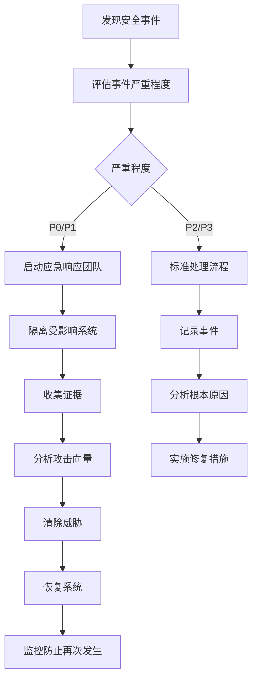

# 安全运维指南

## 概述

本指南提供法律事务所自动化系统的安全运维最佳实践。涵盖身份认证、访问控制、数据保护、网络安全、安全监控和应急响应等方面，确保系统安全性和合规性。

## 安全架构

### 1. 安全层次模型

```
┌─────────────────────────────────────────────────────────────┐
│                    应用层安全                                │
│  ┌─────────────┐ ┌─────────────┐ ┌─────────────┐            │
│  │  身份认证   │ │  访问控制   │ │  数据保护   │            │
│  └─────────────┘ └─────────────┘ └─────────────┘            │
├─────────────────────────────────────────────────────────────┤
│                    网络层安全                                │
│  ┌─────────────┐ ┌─────────────┐ ┌─────────────┐            │
│  │  网络隔离   │ │  流量加密   │ │  入侵检测   │            │
│  └─────────────┘ └─────────────┘ └─────────────┘            │
├─────────────────────────────────────────────────────────────┤
│                    基础设施安全                              │
│  ┌─────────────┐ ┌─────────────┐ ┌─────────────┐            │
│  │  主机安全   │ │  数据库安全 │ │  备份安全   │            │
│  └─────────────┘ └─────────────┘ └─────────────┘            │
└─────────────────────────────────────────────────────────────┘
```

### 2. 安全策略

#### 核心安全原则

1. **最小权限原则**: 用户和系统只拥有完成其功能所需的最小权限
2. **纵深防御**: 多层次安全防护，单一层面失效不影响整体安全
3. **安全默认**: 系统默认配置应该是安全的
4. **零信任**: 不信任任何网络或用户，始终验证
5. **审计可追溯**: 所有关键操作都应记录并可追溯

#### 合规要求

- **数据保护法规**: GDPR、CCPA等数据保护法规
- **行业标准**: ISO 27001、SOC 2 Type II
- **法律合规**: 法律行业特定的数据安全和保密要求
- **内部安全策略**: 公司内部的安全政策和标准

## 身份认证和访问控制

### 1. 认证机制

#### JWT认证实现

```go
// JWT配置
type JWTConfig struct {
    SecretKey      string        `yaml:"secret_key"`
    Issuer         string        `yaml:"issuer"`
    Audience       string        `yaml:"audience"`
    TokenTTL       time.Duration `yaml:"token_ttl"`
    RefreshTTL     time.Duration `yaml:"refresh_ttl"`
    SigningMethod  string        `yaml:"signing_method"`
}

// JWT服务
type JWTService struct {
    config *JWTConfig
}

func (s *JWTService) GenerateToken(user *User) (string, error) {
    claims := jwt.MapClaims{
        "user_id":  user.ID,
        "email":    user.Email,
        "role":     user.Role,
        "iat":      time.Now().Unix(),
        "exp":      time.Now().Add(s.config.TokenTTL).Unix(),
        "iss":      s.config.Issuer,
        "aud":      s.config.Audience,
    }
    
    token := jwt.NewWithClaims(jwt.GetSigningMethod(s.config.SigningMethod), claims)
    return token.SignedString([]byte(s.config.SecretKey))
}

func (s *JWTService) ValidateToken(tokenString string) (*jwt.MapClaims, error) {
    token, err := jwt.Parse(tokenString, func(token *jwt.Token) (interface{}, error) {
        if token.Method.Alg() != s.config.SigningMethod {
            return nil, fmt.Errorf("unexpected signing method: %v", token.Header["alg"])
        }
        return []byte(s.config.SecretKey), nil
    })
    
    if err != nil {
        return nil, err
    }
    
    if claims, ok := token.Claims.(jwt.MapClaims); ok && token.Valid {
        return &claims, nil
    }
    
    return nil, fmt.Errorf("invalid token")
}
```

#### 多因素认证

```go
// TOTP多因素认证
type MFAService struct {
    issuer string
}

func (s *MFAService) GenerateSecret(userEmail string) (string, string, error) {
    key, err := totp.Generate(totp.GenerateOpts{
        Issuer:      s.issuer,
        AccountName: userEmail,
    })
    
    if err != nil {
        return "", "", err
    }
    
    return key.Secret(), key.URL(), nil
}

func (s *MFAService) ValidateToken(secret, token string) bool {
    return totp.Validate(token, secret)
}

// MFA中间件
func MFARequired() gin.HandlerFunc {
    return func(c *gin.Context) {
        user := c.MustGet("user").(*User)
        
        if !user.MFAEnabled {
            c.AbortWithStatusJSON(403, gin.H{"error": "MFA required"})
            return
        }
        
        mfaToken := c.GetHeader("X-MFA-Token")
        if mfaToken == "" {
            c.AbortWithStatusJSON(401, gin.H{"error": "MFA token required"})
            return
        }
        
        if !mfaService.ValidateToken(user.MFASecret, mfaToken) {
            c.AbortWithStatusJSON(401, gin.H{"error": "Invalid MFA token"})
            return
        }
        
        c.Next()
    }
}
```

### 2. 访问控制

#### RBAC实现

```go
// 角色定义
type Role string

const (
    RoleAdmin     Role = "admin"
    RoleLawyer    Role = "lawyer"
    RoleParalegal Role = "paralegal"
    RoleClient    Role = "client"
)

// 权限定义
type Permission string

const (
    PermissionReadCases    Permission = "cases:read"
    PermissionWriteCases   Permission = "cases:write"
    PermissionDeleteCases  Permission = "cases:delete"
    PermissionReadClients  Permission = "clients:read"
    PermissionWriteClients Permission = "clients:write"
    PermissionReadUsers    Permission = "users:read"
    PermissionWriteUsers   Permission = "users:write"
)

// 权限映射
var rolePermissions = map[Role][]Permission{
    RoleAdmin: {
        PermissionReadCases, PermissionWriteCases, PermissionDeleteCases,
        PermissionReadClients, PermissionWriteClients,
        PermissionReadUsers, PermissionWriteUsers,
    },
    RoleLawyer: {
        PermissionReadCases, PermissionWriteCases,
        PermissionReadClients, PermissionWriteClients,
        PermissionReadUsers,
    },
    RoleParalegal: {
        PermissionReadCases, PermissionWriteCases,
        PermissionReadClients,
    },
    RoleClient: {
        PermissionReadCases, PermissionReadClients,
    },
}

// 权限检查中间件
func RequirePermission(permission Permission) gin.HandlerFunc {
    return func(c *gin.Context) {
        user := c.MustGet("user").(*User)
        
        // 检查用户是否有所需权限
        if !hasPermission(user.Role, permission) {
            c.AbortWithStatusJSON(403, gin.H{
                "error":   "insufficient permissions",
                "required": permission,
                "user_role": user.Role,
            })
            return
        }
        
        c.Next()
    }
}

func hasPermission(role Role, permission Permission) bool {
    permissions, exists := rolePermissions[role]
    if !exists {
        return false
    }
    
    for _, p := range permissions {
        if p == permission {
            return true
        }
    }
    
    return false
}
```

#### 数据级访问控制

```go
// 行级安全检查
func CheckCaseAccess() gin.HandlerFunc {
    return func(c *gin.Context) {
        user := c.MustGet("user").(*User)
        caseID := c.Param("id")
        
        // 管理员可以访问所有案件
        if user.Role == RoleAdmin {
            c.Next()
            return
        }
        
        // 检查用户是否有权限访问该案件
        var caseAssignment CaseAssignment
        if err := db.Where("case_id = ? AND user_id = ?", caseID, user.ID).First(&caseAssignment).Error; err != nil {
            c.AbortWithStatusJSON(403, gin.H{"error": "access denied to case"})
            return
        }
        
        c.Next()
    }
}

// 字段级权限控制
func FilterSensitiveFields() gin.HandlerFunc {
    return func(c *gin.Context) {
        user := c.MustGet("user").(*User)
        
        // 在响应写入前进行字段过滤
        c.Writer = &responseFilterWriter{
            ResponseWriter: c.Writer,
            user:          user,
        }
        
        c.Next()
    }
}

type responseFilterWriter struct {
    gin.ResponseWriter
    user *User
}

func (w *responseFilterWriter) Write(data []byte) (int, error) {
    var response map[string]interface{}
    if err := json.Unmarshal(data, &response); err == nil {
        // 根据用户角色过滤敏感字段
        if w.user.Role != RoleAdmin {
            if data, ok := response["data"].(map[string]interface{}); ok {
                removeSensitiveFields(data, w.user.Role)
            }
            
            filteredData, err := json.Marshal(response)
            if err != nil {
                return 0, err
            }
            return w.ResponseWriter.Write(filteredData)
        }
    }
    
    return w.ResponseWriter.Write(data)
}

func removeSensitiveFields(data map[string]interface{}, role Role) {
    sensitiveFields := map[Role][]string{
        RoleClient:    {"fee_amount", "internal_notes", "strategy"},
        RoleParalegal: {"fee_amount", "internal_notes"},
    }
    
    if fields, exists := sensitiveFields[role]; exists {
        for _, field := range fields {
            delete(data, field)
        }
    }
}
```

## 数据保护

### 1. 数据加密

#### 传输加密

```go
// TLS配置
func SetupTLSConfig() *tls.Config {
    return &tls.Config{
        MinVersion: tls.VersionTLS12,
        CurvePreferences: []tls.CurveID{
            tls.CurveP256,
            tls.X25519,
        },
        CipherSuites: []uint16{
            tls.TLS_ECDHE_ECDSA_WITH_AES_256_GCM_SHA384,
            tls.TLS_ECDHE_RSA_WITH_AES_256_GCM_SHA384,
            tls.TLS_ECDHE_ECDSA_WITH_CHACHA20_POLY1305,
            tls.TLS_ECDHE_RSA_WITH_CHACHA20_POLY1305,
        },
    }
}

// 强制HTTPS中间件
func ForceHTTPS() gin.HandlerFunc {
    return func(c *gin.Context) {
        if c.Request.TLS == nil {
            // 检查X-Forwarded-Proto头（用于反向代理）
            if c.GetHeader("X-Forwarded-Proto") != "https" {
                target := "https://" + c.Request.Host + c.Request.URL.Path
                if c.Request.URL.RawQuery != "" {
                    target += "?" + c.Request.URL.RawQuery
                }
                c.Redirect(http.StatusMovedPermanently, target)
                return
            }
        }
        c.Next()
    }
}
```

#### 存储加密

```go
// 数据库加密服务
type EncryptionService struct {
    key []byte
}

func NewEncryptionService(key string) *EncryptionService {
    // 确保密钥长度为32字节（AES-256）
    if len(key) < 32 {
        key = key + strings.Repeat("=", 32-len(key))
    }
    return &EncryptionService{key: []byte(key[:32])}
}

func (e *EncryptionService) Encrypt(plaintext string) (string, error) {
    block, err := aes.NewCipher(e.key)
    if err != nil {
        return "", err
    }
    
    gcm, err := cipher.NewGCM(block)
    if err != nil {
        return "", err
    }
    
    nonce := make([]byte, gcm.NonceSize())
    if _, err = io.ReadFull(rand.Reader, nonce); err != nil {
        return "", err
    }
    
    ciphertext := gcm.Seal(nonce, nonce, []byte(plaintext), nil)
    return base64.StdEncoding.EncodeToString(ciphertext), nil
}

func (e *EncryptionService) Decrypt(ciphertext string) (string, error) {
    data, err := base64.StdEncoding.DecodeString(ciphertext)
    if err != nil {
        return "", err
    }
    
    block, err := aes.NewCipher(e.key)
    if err != nil {
        return "", err
    }
    
    gcm, err := cipher.NewGCM(block)
    if err != nil {
        return "", err
    }
    
    nonceSize := gcm.NonceSize()
    if len(data) < nonceSize {
        return "", fmt.Errorf("ciphertext too short")
    }
    
    nonce, ciphertext := data[:nonceSize], data[nonceSize:]
    plaintext, err := gcm.Open(nil, nonce, ciphertext, nil)
    if err != nil {
        return "", err
    }
    
    return string(plaintext), nil
}

// 敏感数据模型
type Case struct {
    ID          uint    `gorm:"primaryKey"`
    Title       string  `gorm:"size:255"`
    Description string  `gorm:"type:text"`
    ClientID    uint
    
    // 敏感字段加密存储
    FeeAmount   string  `gorm:"size:500"`  // 加密存储
    InternalNotes string `gorm:"type:text"` // 加密存储
    
    CreatedAt   time.Time
    UpdatedAt   time.Time
}

// 模型钩子：自动加密/解密
func (c *Case) BeforeSave(tx *gorm.DB) error {
    if c.FeeAmount != "" {
        encrypted, err := encryptionService.Encrypt(c.FeeAmount)
        if err != nil {
            return err
        }
        c.FeeAmount = encrypted
    }
    
    if c.InternalNotes != "" {
        encrypted, err := encryptionService.Encrypt(c.InternalNotes)
        if err != nil {
            return err
        }
        c.InternalNotes = encrypted
    }
    
    return nil
}

func (c *Case) AfterFind(tx *gorm.DB) error {
    if c.FeeAmount != "" {
        decrypted, err := encryptionService.Decrypt(c.FeeAmount)
        if err == nil {
            c.FeeAmount = decrypted
        }
    }
    
    if c.InternalNotes != "" {
        decrypted, err := encryptionService.Decrypt(c.InternalNotes)
        if err == nil {
            c.InternalNotes = decrypted
        }
    }
    
    return nil
}
```

### 2. 数据脱敏

```go
// 数据脱敏服务
type DataMaskingService struct{}

func (s *DataMaskingService) MaskEmail(email string) string {
    parts := strings.Split(email, "@")
    if len(parts) != 2 {
        return "***"
    }
    
    username := parts[0]
    domain := parts[1]
    
    // 保留前2个字符，其余用*替换
    if len(username) > 2 {
        maskedUsername := username[:2] + strings.Repeat("*", len(username)-2)
        return maskedUsername + "@" + domain
    }
    
    return strings.Repeat("*", len(username)) + "@" + domain
}

func (s *DataMaskingService) MaskPhone(phone string) string {
    // 保留前3位和后4位
    if len(phone) >= 7 {
        return phone[:3] + strings.Repeat("*", len(phone)-7) + phone[len(phone)-4:]
    }
    return strings.Repeat("*", len(phone))
}

func (s *DataMaskingService) MaskIDNumber(id string) string {
    // 保留前1位和后4位
    if len(id) >= 5 {
        return id[:1] + strings.Repeat("*", len(id)-5) + id[len(id)-4:]
    }
    return strings.Repeat("*", len(id))
}

// 脱敏中间件
func DataMaskingMiddleware() gin.HandlerFunc {
    return func(c *gin.Context) {
        user := c.MustGet("user").(*User)
        
        // 只有管理员可以看到完整数据
        if user.Role != RoleAdmin {
            c.Writer = &dataMaskingWriter{
                ResponseWriter: c.Writer,
                maskingService: NewDataMaskingService(),
            }
        }
        
        c.Next()
    }
}

type dataMaskingWriter struct {
    gin.ResponseWriter
    maskingService *DataMaskingService
}

func (w *dataMaskingWriter) Write(data []byte) (int, error) {
    var response map[string]interface{}
    if err := json.Unmarshal(data, &response); err == nil {
        if data, ok := response["data"]; ok {
            switch v := data.(type) {
            case map[string]interface{}:
                w.maskData(v)
            case []interface{}:
                for _, item := range v {
                    if itemMap, ok := item.(map[string]interface{}); ok {
                        w.maskData(itemMap)
                    }
                }
            }
            
            maskedData, err := json.Marshal(response)
            if err != nil {
                return 0, err
            }
            return w.ResponseWriter.Write(maskedData)
        }
    }
    
    return w.ResponseWriter.Write(data)
}

func (w *dataMaskingWriter) maskData(data map[string]interface{}) {
    // 脱敏邮箱
    if email, ok := data["email"].(string); ok && email != "" {
        data["email"] = w.maskingService.MaskEmail(email)
    }
    
    // 脱敏电话
    if phone, ok := data["phone"].(string); ok && phone != "" {
        data["phone"] = w.maskingService.MaskPhone(phone)
    }
    
    // 脱敏身份证号
    if idNumber, ok := data["id_number"].(string); ok && idNumber != "" {
        data["id_number"] = w.maskingService.MaskIDNumber(idNumber)
    }
}
```

## 网络安全

### 1. 网络隔离

#### 防火墙配置

```yaml
# iptables配置
*filter
:INPUT DROP [0:0]
:FORWARD DROP [0:0]
:OUTPUT ACCEPT [0:0]

# 允许本地回环
-A INPUT -i lo -j ACCEPT
-A OUTPUT -o lo -j ACCEPT

# 允许已建立的连接
-A INPUT -m state --state ESTABLISHED,RELATED -j ACCEPT

# 允许SSH（仅限管理IP）
-A INPUT -p tcp -s 192.168.1.0/24 --dport 22 -j ACCEPT

# 允许HTTP/HTTPS
-A INPUT -p tcp --dport 80 -j ACCEPT
-A INPUT -p tcp --dport 443 -j ACCEPT

# 允许数据库连接（仅限应用服务器）
-A INPUT -p tcp -s 192.168.1.100 --dport 5432 -j ACCEPT

# 允许Redis连接（仅限应用服务器）
-A INPUT -p tcp -s 192.168.1.100 --dport 6379 -j ACCEPT

# 允许监控端口（仅限监控系统）
-A INPUT -p tcp -s 192.168.1.200 --dport 9100 -j ACCEPT

# 记录被拒绝的连接
-A INPUT -m limit --limit 5/min -j LOG --log-prefix "iptables denied: "

COMMIT
```

#### 网络分段

```yaml
# 网络分段配置
network_segments:
  dmz:
    name: "DMZ Network"
    subnet: "192.168.1.0/24"
    purpose: "Web服务器和负载均衡器"
    firewall_rules:
      - allow: ["80", "443"]
        from: "any"
    
  application:
    name: "Application Network"
    subnet: "192.168.2.0/24"
    purpose: "应用服务器"
    firewall_rules:
      - allow: ["8080", "8443"]
        from: ["dmz"]
    
  database:
    name: "Database Network"
    subnet: "192.168.3.0/24"
    purpose: "数据库服务器"
    firewall_rules:
      - allow: ["5432"]
        from: ["application"]
    
  management:
    name: "Management Network"
    subnet: "192.168.4.0/24"
    purpose: "管理和监控"
    firewall_rules:
      - allow: ["22"]
        from: ["vpn"]
      - allow: ["9100", "9090"]
        from: ["application"]
```

### 2. DDoS防护

```go
// 限流中间件
func RateLimitMiddleware() gin.HandlerFunc {
    store := memory.NewStore(10 * time.Second)  // 10秒窗口
    limiter := limiter.New(store, limiter.Rate{
        Period: 10 * time.Second,
        Limit:  100,  // 每10秒100个请求
    })
    
    return func(c *gin.Context) {
        key := c.ClientIP()
        if userID := c.GetString("user_id"); userID != "" {
            key = "user:" + userID
        }
        
        context := limiter.Init(c)
        limit, remaining, reset := limiter.Take(context, key)
        
        c.Header("X-Rate-Limit-Limit", strconv.FormatInt(limit.Limit, 10))
        c.Header("X-Rate-Limit-Remaining", strconv.FormatInt(remaining, 10))
        c.Header("X-Rate-Limit-Reset", strconv.FormatInt(reset, 10))
        
        if remaining <= 0 {
            c.AbortWithStatusJSON(429, gin.H{
                "error": "rate limit exceeded",
                "reset": reset,
            })
            return
        }
        
        c.Next()
    }
}

// IP白名单中间件
func IPWhitelistMiddleware(allowedIPs []string) gin.HandlerFunc {
    ipSet := make(map[string]bool)
    for _, ip := range allowedIPs {
        ipSet[ip] = true
    }
    
    return func(c *gin.Context) {
        clientIP := c.ClientIP()
        
        // 检查是否在白名单中
        if !ipSet[clientIP] {
            c.AbortWithStatusJSON(403, gin.H{"error": "IP not allowed"})
            return
        }
        
        c.Next()
    }
}
```

### 3. 安全头设置

```go
// 安全头中间件
func SecurityHeadersMiddleware() gin.HandlerFunc {
    return func(c *gin.Context) {
        // 内容安全策略
        c.Header("Content-Security-Policy", 
            "default-src 'self'; " +
            "script-src 'self' 'unsafe-inline' 'unsafe-eval'; " +
            "style-src 'self' 'unsafe-inline'; " +
            "img-src 'self' data: https:; " +
            "font-src 'self'; " +
            "connect-src 'self'; " +
            "frame-ancestors 'none'; " +
            "form-action 'self';")
        
        // 严格传输安全
        c.Header("Strict-Transport-Security", "max-age=31536000; includeSubDomains; preload")
        
        // XSS保护
        c.Header("X-XSS-Protection", "1; mode=block")
        
        // 内容类型选项
        c.Header("X-Content-Type-Options", "nosniff")
        
        // 帧选项
        c.Header("X-Frame-Options", "DENY")
        
        // 引用策略
        c.Header("Referrer-Policy", "strict-origin-when-cross-origin")
        
        // 权限策略
        c.Header("Permissions-Policy", 
            "camera=(), " +
            "microphone=(), " +
            "geolocation=(), " +
            "payment=(), " +
            "usb=(), " +
            "accelerometer=(), " +
            "gyroscope=()")
        
        c.Next()
    }
}
```

## 安全监控

### 1. 安全事件监控

```go
// 安全事件类型
type SecurityEventType string

const (
    EventLoginSuccess    SecurityEventType = "login_success"
    EventLoginFailed     SecurityEventType = "login_failed"
    EventPasswordChange  SecurityEventType = "password_change"
    EventPrivilegeChange SecurityEventType = "privilege_change"
    EventDataAccess      SecurityEventType = "data_access"
    EventDataExport      SecurityEventType = "data_export"
    EventSuspiciousIP    SecurityEventType = "suspicious_ip"
)

// 安全事件记录
type SecurityEvent struct {
    ID          uint             `gorm:"primaryKey"`
    EventType   SecurityEventType `gorm:"size:50"`
    UserID      *uint            `gorm:"index"`
    IPAddress   string           `gorm:"size:45;index"`
    UserAgent   string           `gorm:"size:500"`
    Description string           `gorm:"type:text"`
    Metadata    string           `gorm:"type:text"`  // JSON格式的额外信息
    Severity    string           `gorm:"size:20"`    // low, medium, high, critical
    CreatedAt   time.Time
}

// 安全监控服务
type SecurityMonitor struct {
    db *gorm.DB
}

func (sm *SecurityMonitor) LogEvent(event SecurityEvent) error {
    return sm.db.Create(&event).Error
}

func (sm *SecurityMonitor) CheckSuspiciousActivity(userID uint, ipAddress string) {
    // 检查登录失败次数
    var failedLogins int64
    sm.db.Model(&SecurityEvent{}).
        Where("user_id = ? AND ip_address = ? AND event_type = ? AND created_at > ?", 
              userID, ipAddress, EventLoginFailed, time.Now().Add(-time.Hour)).
        Count(&failedLogins)
    
    if failedLogins > 5 {
        sm.LogEvent(SecurityEvent{
            EventType:   EventSuspiciousIP,
            UserID:      &userID,
            IPAddress:   ipAddress,
            Description: "Multiple failed login attempts",
            Severity:    "high",
        })
    }
}

// 安全监控中间件
func SecurityMonitorMiddleware() gin.HandlerFunc {
    return func(c *gin.Context) {
        start := time.Now()
        
        c.Next()
        
        // 记录API访问
        if c.Writer.Status() >= 400 {
            securityMonitor.LogEvent(SecurityEvent{
                EventType:   "api_error",
                IPAddress:   c.ClientIP(),
                UserAgent:   c.Request.UserAgent(),
                Description: fmt.Sprintf("%s %s returned %d", c.Request.Method, c.Request.URL.Path, c.Writer.Status()),
                Severity:    "medium",
            })
        }
        
        // 记录敏感操作
        if strings.Contains(c.Request.URL.Path, "/admin/") || 
           strings.Contains(c.Request.URL.Path, "/users/") ||
           strings.Contains(c.Request.URL.Path, "/export/") {
            userID := c.GetUint("user_id")
            securityMonitor.LogEvent(SecurityEvent{
                EventType:   EventDataAccess,
                UserID:      &userID,
                IPAddress:   c.ClientIP(),
                UserAgent:   c.Request.UserAgent(),
                Description: fmt.Sprintf("Sensitive operation: %s %s", c.Request.Method, c.Request.URL.Path),
                Severity:    "medium",
            })
        }
    }
}
```

### 2. 入侵检测

```go
// 异常检测服务
type AnomalyDetector struct {
    baseline map[string]float64
}

func (ad *AnomalyDetector) DetectAnomalies(currentMetrics map[string]float64) []string {
    var anomalies []string
    
    for metric, value := range currentMetrics {
        if baseline, exists := ad.baseline[metric]; exists {
            deviation := math.Abs(value-baseline) / baseline
            
            if deviation > 0.5 { // 50% deviation
                anomalies = append(anomalies, 
                    fmt.Sprintf("Anomaly detected in %s: current=%.2f, baseline=%.2f, deviation=%.2f%%", 
                        metric, value, baseline, deviation*100))
            }
        }
    }
    
    return anomalies
}

// 恶意请求检测
func MaliciousRequestDetector() gin.HandlerFunc {
    return func(c *gin.Context) {
        // 检查SQL注入
        if containsSQLInjection(c.Request.URL.RawQuery) ||
           containsSQLInjection(c.PostForm("query")) {
            securityMonitor.LogEvent(SecurityEvent{
                EventType:   "sql_injection_attempt",
                IPAddress:   c.ClientIP(),
                UserAgent:   c.Request.UserAgent(),
                Description: "SQL injection attempt detected",
                Severity:    "high",
            })
            c.AbortWithStatusJSON(403, gin.H{"error": "malicious request detected"})
            return
        }
        
        // 检查XSS攻击
        if containsXSS(c.Request.URL.RawQuery) ||
           containsXSS(c.PostForm("comment")) {
            securityMonitor.LogEvent(SecurityEvent{
                EventType:   "xss_attempt",
                IPAddress:   c.ClientIP(),
                UserAgent:   c.Request.UserAgent(),
                Description: "XSS attempt detected",
                Severity:    "high",
            })
            c.AbortWithStatusJSON(403, gin.H{"error": "malicious request detected"})
            return
        }
        
        // 检查路径遍历
        if containsPathTraversal(c.Request.URL.Path) {
            securityMonitor.LogEvent(SecurityEvent{
                EventType:   "path_traversal_attempt",
                IPAddress:   c.ClientIP(),
                UserAgent:   c.Request.UserAgent(),
                Description: "Path traversal attempt detected",
                Severity:    "high",
            })
            c.AbortWithStatusJSON(403, gin.H{"error": "malicious request detected"})
            return
        }
        
        c.Next()
    }
}

func containsSQLInjection(input string) bool {
    sqlPatterns := []string{
        "(?i)(union|select|insert|update|delete|drop|create|alter|exec|execute)",
        "(?i)(or|and)\\s+\\d+\\s*=\\s*\\d+",
        "(?i)(;|--|//|/\\*|\\*/|#)",
        "(?i)(xp_|sp_|exec\\s*\\()",
    }
    
    for _, pattern := range sqlPatterns {
        if matched, _ := regexp.MatchString(pattern, input); matched {
            return true
        }
    }
    return false
}

func containsXSS(input string) bool {
    xssPatterns := []string{
        "<script[^>]*>.*?</script>",
        "javascript:",
        "on(load|click|mouseover|submit)=",
        "<iframe[^>]*>",
        "eval\\(",
        "document\\.",
    }
    
    for _, pattern := range xssPatterns {
        if matched, _ := regexp.MatchString(pattern, input); matched {
            return true
        }
    }
    return false
}

func containsPathTraversal(input string) bool {
    pathPatterns := []string{
        "\\.\\.",
        "~",
        "/etc/",
        "/usr/",
        "\\windows\\",
        "\\.\\.",
        "%2e%2e",
    }
    
    for _, pattern := range pathPatterns {
        if strings.Contains(input, pattern) {
            return true
        }
    }
    return false
}
```

## 备份和恢复

### 1. 数据库备份

```bash
#!/bin/bash
# 数据库备份脚本

DB_HOST="localhost"
DB_PORT="5432"
DB_NAME="lawoffice_db"
DB_USER="lawoffice"
BACKUP_DIR="/backup/database"
DATE=$(date +%Y%m%d_%H%M%S)
BACKUP_FILE="${BACKUP_DIR}/lawoffice_${DATE}.sql"
COMPRESSED_FILE="${BACKUP_FILE}.gz"

# 创建备份目录
mkdir -p ${BACKUP_DIR}

# 创建备份
pg_dump -h ${DB_HOST} -p ${DB_PORT} -U ${DB_USER} -d ${DB_NAME} > ${BACKUP_FILE}

# 压缩备份
gzip ${BACKUP_FILE}

# 保留最近30天的备份
find ${BACKUP_DIR} -name "lawoffice_*.sql.gz" -mtime +30 -delete

# 记录备份状态
if [ $? -eq 0 ]; then
    echo "Backup successful: ${COMPRESSED_FILE}" >> ${BACKUP_DIR}/backup.log
else
    echo "Backup failed: ${DATE}" >> ${BACKUP_DIR}/backup.log
    exit 1
fi
```

### 2. 文件备份

```bash
#!/bin/bash
# 文件备份脚本

SOURCE_DIR="/opt/law-office-api"
BACKUP_DIR="/backup/files"
DATE=$(date +%Y%m%d_%H%M%S)
BACKUP_FILE="${BACKUP_DIR}/law-office-files_${DATE}.tar.gz"

# 创建备份目录
mkdir -p ${BACKUP_DIR}

# 创建文件备份
tar -czf ${BACKUP_FILE} \
    --exclude=node_modules \
    --exclude=logs \
    --exclude=temp \
    --exclude=.git \
    ${SOURCE_DIR}

# 保留最近7天的备份
find ${BACKUP_DIR} -name "law-office-files_*.tar.gz" -mtime +7 -delete

# 记录备份状态
if [ $? -eq 0 ]; then
    echo "Files backup successful: ${BACKUP_FILE}" >> ${BACKUP_DIR}/backup.log
else
    echo "Files backup failed: ${DATE}" >> ${BACKUP_DIR}/backup.log
    exit 1
fi
```

### 3. 备份验证

```go
// 备份验证服务
type BackupValidator struct {
    backupDir string
}

func (bv *BackupValidator) ValidateBackups() error {
    // 检查最近的备份
    files, err := os.ReadDir(bv.backupDir)
    if err != nil {
        return err
    }
    
    var latestBackup string
    var latestTime time.Time
    
    for _, file := range files {
        if strings.HasSuffix(file.Name(), ".sql.gz") {
            info, err := file.Info()
            if err != nil {
                continue
            }
            
            if info.ModTime().After(latestTime) {
                latestTime = info.ModTime()
                latestBackup = file.Name()
            }
        }
    }
    
    if latestBackup == "" {
        return fmt.Errorf("no backup files found")
    }
    
    // 检查备份时间（不能超过24小时）
    if time.Since(latestTime) > 24*time.Hour {
        return fmt.Errorf("latest backup is too old: %s", latestBackup)
    }
    
    // 验证备份文件完整性
    backupPath := filepath.Join(bv.backupDir, latestBackup)
    return bv.validateBackupFile(backupPath)
}

func (bv *BackupValidator) validateBackupFile(filePath string) error {
    file, err := os.Open(filePath)
    if err != nil {
        return err
    }
    defer file.Close()
    
    // 检查文件大小
    stat, err := file.Stat()
    if err != nil {
        return err
    }
    
    if stat.Size() < 1024 { // 至少1KB
        return fmt.Errorf("backup file too small: %d bytes", stat.Size())
    }
    
    // 检查文件内容（gzip头）
    buf := make([]byte, 2)
    _, err = file.Read(buf)
    if err != nil {
        return err
    }
    
    if buf[0] != 0x1f || buf[1] != 0x8b {
        return fmt.Errorf("invalid gzip file format")
    }
    
    return nil
}
```

## 应急响应

### 1. 安全事件响应流程



### 2. 事件响应模板

```markdown
# 安全事件报告

## 基本信息
- **事件ID**: SEC-2024-001
- **发现时间**: 2024-01-15 14:30:00
- **报告时间**: 2024-01-15 14:35:00
- **事件类型**: 数据泄露
- **严重程度**: P1 (严重)

## 事件描述
- **事件概要**: 发现未授权访问用户数据
- **影响范围**: 影响约1000个用户账户
- **业务影响**: 客户数据可能泄露

## 时间线
- **14:30**: 自动监控系统检测异常访问模式
- **14:32**: 安全团队介入调查
- **14:35**: 确认数据泄露
- **14:40**: 启动应急响应流程
- **14:45**: 隔离受影响系统

## 根本原因分析
- **直接原因**: API密钥泄露
- **技术原因**: 缺乏API访问监控
- **管理原因**: 安全审计不到位

## 应对措施
### 立即措施
- [x] 撤销泄露的API密钥
- [x] 隔离受影响系统
- [x] 重置所有用户密码
- [x] 启用额外身份验证

### 中期措施
- [ ] 实施API访问监控
- [ ] 加强密钥管理
- [ ] 进行安全培训

### 长期措施
- [ ] 建立安全开发生命周期
- [ ] 定期安全审计
- [ ] 建立安全事件响应机制

## 后续监控
- 持续监控异常访问
- 定期安全评估
- 建立安全指标体系
```

### 3. 应急响应脚本

```bash
#!/bin/bash
# 安全事件应急响应脚本

EVENT_TYPE=$1
SEVERITY=$2
DESCRIPTION=$3

# 日志文件
LOG_FILE="/var/log/security/emergency-response.log"
TIMESTAMP=$(date +"%Y-%m-%d %H:%M:%S")

# 记录事件
echo "[$TIMESTAMP] Security Event: $EVENT_TYPE (Severity: $SEVERITY) - $DESCRIPTION" >> $LOG_FILE

# 根据事件类型执行相应措施
case $EVENT_TYPE in
    "unauthorized_access")
        # 撤销所有活动会话
        redis-cli FLUSHDB
        
        # 停止应用服务
        systemctl stop law-office-api
        
        # 通知安全团队
        curl -X POST "$WEBHOOK_URL" \
             -H "Content-Type: application/json" \
             -d "{\"type\":\"security_alert\",\"severity\":\"$SEVERITY\",\"message\":\"$DESCRIPTION\"}"
        ;;
    
    "data_breach")
        # 立即数据库备份
        /scripts/backup-database.sh emergency
        
        # 隔离数据库
        iptables -A INPUT -p tcp --dport 5432 -j DROP
        
        # 通知相关方
        send_security_alert "Data breach detected" "$DESCRIPTION"
        ;;
    
    "malware_detected")
        # 隔离受感染主机
        iptables -A INPUT -s $AFFECTED_IP -j DROP
        iptables -A OUTPUT -d $AFFECTED_IP -j DROP
        
        # 停止相关服务
        systemctl stop law-office-api@$AFFECTED_IP
        ;;
    
    *)
        echo "Unknown event type: $EVENT_TYPE"
        exit 1
        ;;
esac

# 生成事件报告
generate_incident_report "$EVENT_TYPE" "$SEVERITY" "$DESCRIPTION"

echo "Emergency response completed for event: $EVENT_TYPE"
```

## 安全审计和合规

### 1. 安全审计检查清单

```yaml
# 安全审计检查清单
security_audit_checklist:
  identity_and_access:
    - "Review user access rights"
    - "Check for orphaned accounts"
    - "Verify password policies"
    - "Review privilege escalation"
    - "Audit MFA enrollment"
  
  data_protection:
    - "Verify data encryption status"
    - "Check for data leakage"
    - "Review backup procedures"
    - "Audit data retention policies"
    - "Verify compliance with regulations"
  
  network_security:
    - "Review firewall rules"
    - "Check for open ports"
    - "Verify network segmentation"
    - "Audit VPN access"
    - "Review intrusion detection logs"
  
  application_security:
    - "Review code for vulnerabilities"
    - "Check dependency vulnerabilities"
    - "Verify security headers"
    - "Audit authentication mechanisms"
    - "Review input validation"
  
  infrastructure_security:
    - "Review server hardening"
    - "Check for missing patches"
    - "Audit administrative access"
    - "Review monitoring systems"
    - "Verify backup integrity"
```

### 2. 合规检查脚本

```go
// 合规检查服务
type ComplianceChecker struct {
    db *gorm.DB
}

func (cc *ComplianceChecker) RunComplianceCheck() (*ComplianceReport, error) {
    report := &ComplianceReport{
        Timestamp: time.Now(),
        Checks:    make(map[string]ComplianceCheck),
    }
    
    // 检查数据加密
    report.Checks["data_encryption"] = cc.checkDataEncryption()
    
    // 检查访问控制
    report.Checks["access_control"] = cc.checkAccessControl()
    
    // 检查审计日志
    report.Checks["audit_logs"] = cc.checkAuditLogs()
    
    // 检查备份策略
    report.Checks["backup_strategy"] = cc.checkBackupStrategy()
    
    // 计算总体合规性
    report.OverallScore = cc.calculateComplianceScore(report.Checks)
    
    return report, nil
}

func (cc *ComplianceChecker) checkDataEncryption() ComplianceCheck {
    check := ComplianceCheck{
        Name:        "Data Encryption",
        Description: "Verify sensitive data is properly encrypted",
        Status:      "PASSED",
        Details:     []string{},
    }
    
    // 检查TLS配置
    if !cc.isTLSEnabled() {
        check.Status = "FAILED"
        check.Details = append(check.Details, "TLS not enabled")
    }
    
    // 检查数据库加密
    if !cc.isDatabaseEncryptionEnabled() {
        check.Status = "FAILED"
        check.Details = append(check.Details, "Database encryption not enabled")
    }
    
    return check
}

func (cc *ComplianceChecker) checkAccessControl() ComplianceCheck {
    check := ComplianceCheck{
        Name:        "Access Control",
        Description: "Verify proper access controls are in place",
        Status:      "PASSED",
        Details:     []string{},
    }
    
    // 检查MFA覆盖率
    mfaCoverage := cc.getMFACoverage()
    if mfaCoverage < 0.9 { // 90% coverage required
        check.Status = "FAILED"
        check.Details = append(check.Details, fmt.Sprintf("MFA coverage too low: %.2f%%", mfaCoverage*100))
    }
    
    // 检查权限分离
    if !cc.isPrivilegeSeparationEnabled() {
        check.Status = "FAILED"
        check.Details = append(check.Details, "Privilege separation not implemented")
    }
    
    return check
}

func (cc *ComplianceChecker) checkAuditLogs() ComplianceCheck {
    check := ComplianceCheck{
        Name:        "Audit Logs",
        Description: "Verify audit logging is enabled and working",
        Status:      "PASSED",
        Details:     []string{},
    }
    
    // 检查日志记录
    if !cc.isAuditLoggingEnabled() {
        check.Status = "FAILED"
        check.Details = append(check.Details, "Audit logging not enabled")
    }
    
    // 检查日志完整性
    if !cc.isLogIntegrityVerified() {
        check.Status = "FAILED"
        check.Details = append(check.Details, "Log integrity verification failed")
    }
    
    return check
}

func (cc *ComplianceChecker) checkBackupStrategy() ComplianceCheck {
    check := ComplianceCheck{
        Name:        "Backup Strategy",
        Description: "Verify backup procedures are working",
        Status:      "PASSED",
        Details:     []string{},
    }
    
    // 检查最近备份
    if !cc.isRecentBackupAvailable() {
        check.Status = "FAILED"
        check.Details = append(check.Details, "No recent backup available")
    }
    
    // 检查备份测试
    if !cc.isBackupTestSuccessful() {
        check.Status = "FAILED"
        check.Details = append(check.Details, "Backup test failed")
    }
    
    return check
}
```

## 安全培训

### 1. 培训计划

```yaml
# 安全培训计划
security_training_program:
  developers:
    - "Secure Coding Practices"
    - "OWASP Top 10"
    - "API Security"
    - "Database Security"
    - "Cryptography Basics"
  
  operations:
    - "System Hardening"
    - "Network Security"
    - "Incident Response"
    - "Monitoring and Alerting"
    - "Backup and Recovery"
  
  management:
    - "Security Governance"
    - "Risk Management"
    - "Compliance Requirements"
    - "Security Metrics"
    - "Security Budgeting"
  
  all_staff:
    - "Security Awareness"
    - "Phishing Prevention"
    - "Password Security"
    - "Data Protection"
    - "Social Engineering"
```

### 2. 培训评估

```go
// 培训评估服务
type TrainingAssessment struct {
    db *gorm.DB
}

func (ta *TrainingAssessment) AssessTrainingEffectiveness() (*TrainingReport, error) {
    report := &TrainingReport{
        Timestamp: time.Now(),
        Metrics:   make(map[string]float64),
    }
    
    // 评估安全意识
    report.Metrics["security_awareness"] = ta.assessSecurityAwareness()
    
    // 评估安全事件响应
    report.Metrics["incident_response"] = ta.assessIncidentResponse()
    
    // 评估合规性
    report.Metrics["compliance_score"] = ta.assessCompliance()
    
    // 评估培训覆盖率
    report.Metrics["training_coverage"] = ta.assessTrainingCoverage()
    
    // 计算总体效果
    report.OverallEffectiveness = ta.calculateOverallEffectiveness(report.Metrics)
    
    return report, nil
}

func (ta *TrainingAssessment) assessSecurityAwareness() float64 {
    // 检查钓鱼测试结果
    phishingResults := ta.getPhishingTestResults()
    
    // 检查安全政策遵守情况
    policyCompliance := ta.getPolicyCompliance()
    
    // 检查安全报告数量
    securityReports := ta.getSecurityReportsCount()
    
    return (phishingResults + policyCompliance + securityReports) / 3.0
}
```

## 总结

本安全运维指南提供了全面的安全策略和最佳实践，涵盖身份认证、访问控制、数据保护、网络安全、安全监控和应急响应等方面。通过实施这些措施，可以显著提高法律事务所自动化系统的安全性和合规性。

关键要点：
- 建立多层次的深度防御体系
- 实施严格的身份认证和访问控制
- 保护敏感数据的完整性和机密性
- 建立完整的安全监控和审计体系
- 制定详细的应急响应计划
- 定期进行安全评估和培训

通过持续改进和维护安全措施，可以确保系统符合法律行业的安全要求和合规标准。