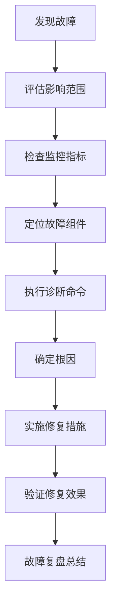

# 故障排除手册

## 概述

本手册提供法律事务所自动化系统的常见故障诊断和解决方案。帮助运维人员快速定位和解决系统问题，减少故障恢复时间。

## 故障分类

### 按严重程度分类

1. **紧急故障 (P0)**: 系统完全不可用，影响所有用户
2. **严重故障 (P1)**: 核心功能不可用，影响大部分用户
3. **重要故障 (P2)**: 部分功能不可用，影响部分用户
4. **一般故障 (P3)**: 非核心功能问题，影响有限

### 按组件分类

1. **应用层故障**: API服务、业务逻辑错误
2. **数据层故障**: 数据库连接、查询性能问题
3. **缓存层故障**: Redis连接、缓存策略问题
4. **基础设施故障**: 服务器、网络、存储问题

## 通用故障排除流程

### 1. 故障响应流程



### 2. 故障检查清单

#### 第一时间检查 (5分钟内)

- [ ] 确认故障现象和影响范围
- [ ] 检查系统健康状态 (`/health`)
- [ ] 查看告警信息和监控指标
- [ ] 检查最近的部署和配置变更
- [ ] 确认是否为已知问题

#### 详细诊断 (15分钟内)

- [ ] 检查应用日志和错误信息
- [ ] 验证各组件连接状态
- [ ] 检查资源使用情况 (CPU、内存、磁盘)
- [ ] 测试关键功能端点
- [ ] 检查网络连接和延迟

## 常见故障及解决方案

### 1. 应用启动失败

#### 故障现象

```bash
# 应用无法启动
$ ./law-office-api
panic: database connection failed

# 或者
$ ./law-office-api
Error: failed to load configuration
```

#### 可能原因

1. **配置文件错误或缺失**
2. **数据库连接失败**
3. **端口被占用**
4. **依赖服务未启动**
5. **权限问题**

#### 诊断步骤

```bash
# 1. 检查配置文件
ls -la config/
cat config/config.yaml

# 2. 检查数据库连接
nc -zv database-host 5432
pg_isready -h database-host -p 5432

# 3. 检查端口占用
netstat -tulpn | grep :8080
lsof -i :8080

# 4. 检查日志
tail -f logs/application.log
journalctl -u law-office-api -f
```

#### 解决方案

```bash
# 1. 修复配置文件
cp config/config.yaml.example config/config.yaml
vim config/config.yaml

# 2. 等待数据库启动或修复连接
systemctl start postgresql
# 或
docker start law-office-db

# 3. 更改端口或终止占用进程
kill -9 <PID>
# 或修改配置中的端口

# 4. 启动依赖服务
systemctl start redis
systemctl start elasticsearch

# 5. 修复权限
chown -R appuser:appuser /opt/law-office-api
chmod +x law-office-api
```

### 2. 数据库连接问题

#### 故障现象

```json
// API返回错误
{
  "error": "database connection failed",
  "message": "failed to connect to database"
}

// 或健康检查失败
{
  "status": "unhealthy",
  "components": {
    "database": {
      "status": "unhealthy",
      "error": "connection refused"
    }
  }
}
```

#### 诊断步骤

```bash
# 1. 检查数据库服务状态
systemctl status postgresql
pg_isready

# 2. 测试数据库连接
psql -h localhost -U lawoffice -d lawoffice_db

# 3. 检查连接池状态
curl http://localhost:8080/metrics | grep database

# 4. 检查数据库日志
tail -f /var/log/postgresql/postgresql-*.log

# 5. 检查网络连接
telnet database-host 5432
nc -zv database-host 5432
```

#### 解决方案

```bash
# 1. 重启数据库服务
systemctl restart postgresql

# 2. 调整数据库配置
# max_connections = 100
# shared_buffers = 256MB

# 3. 检查磁盘空间
df -h
du -sh /var/lib/postgresql/*

# 4. 修复连接字符串
# 检查 config.yaml 中的数据库配置
database:
  host: localhost
  port: 5432
  user: lawoffice
  password: your_password
  dbname: lawoffice_db
  ssl_mode: disable
  max_connections: 25
  max_idle_connections: 5
  connection_lifetime: 5m
```

### 3. 缓存服务故障

#### 故障现象

```json
// API响应变慢
{
  "error": "cache service unavailable",
  "duration_ms": 5000
}

// 或缓存命中率下降
curl http://localhost:8080/metrics | grep cache
```

#### 诊断步骤

```bash
# 1. 检查Redis服务状态
systemctl status redis
redis-cli ping

# 2. 检查Redis内存使用
redis-cli info memory
redis-cli info stats

# 3. 测试缓存操作
redis-cli set test_key test_value
redis-cli get test_key

# 4. 检查应用缓存配置
curl http://localhost:8080/api/v1/health/detailed | jq '.components.cache'
```

#### 解决方案

```bash
# 1. 重启Redis服务
systemctl restart redis

# 2. 清理缓存内存
redis-cli FLUSHDB
# 或
redis-cli FLUSHALL

# 3. 调整Redis配置
# maxmemory 512mb
# maxmemory-policy allkeys-lru

# 4. 优化缓存策略
# 在应用配置中调整TTL和缓存大小
cache:
  ttl: 5m
  max_size: 1000
  cleanup_interval: 1m
```

### 4. API响应缓慢

#### 故障现象

```json
// API响应时间长
{
  "data": {...},
  "duration_ms": 2000
}

// 或监控显示高延迟
curl http://localhost:8080/metrics | grep http_request_duration
```

#### 诊断步骤

```bash
# 1. 检查系统资源使用
top
htop
free -h
df -h

# 2. 检查应用性能
curl -w "@curl-format.txt" -o /dev/null -s http://localhost:8080/api/v1/cases

# 3. 检查数据库查询性能
# 启用查询日志
ALTER DATABASE lawoffice_db SET log_statement = 'all';

# 4. 检查网络延迟
ping localhost
ping database-host

# 5. 检查并发连接数
curl http://localhost:8080/metrics | grep http_requests_in_progress
```

#### 解决方案

```bash
# 1. 优化数据库查询
# 添加索引
CREATE INDEX idx_cases_status ON cases(status);
CREATE INDEX idx_cases_created_at ON cases(created_at);

# 2. 调整应用配置
# 增加工作进程数
GOMAXPROCS=4

# 3. 优化缓存策略
# 增加缓存命中率
# 调整缓存TTL

# 4. 水平扩展
# 增加应用实例数量
```

### 5. 内存泄漏

#### 故障现象

```bash
# 内存使用率持续增长
$ top
PID USER     PR  NI    VIRT    RES    SHR S  %CPU %MEM     TIME+ COMMAND
1234 appuser  20   0  1024m   900m   100m R  95.0 45.0   2:30.45 law-office-api

# 应用频繁被OOM杀死
$ dmesg | grep -i oom-killer
```

#### 诊断步骤

```bash
# 1. 检查内存使用情况
ps aux | grep law-office-api
cat /proc/<PID>/status
cat /proc/<PID>/maps

# 2. 生成内存profile
curl http://localhost:8080/debug/pprof/heap > heap.prof

# 3. 分析goroutine
curl http://localhost:8080/debug/pprof/goroutine > goroutine.prof

# 4. 检查GC日志
GODEBUG=gctrace=1 ./law-office-api
```

#### 解决方案

```bash
# 1. 重启应用
systemctl restart law-office-api

# 2. 调整内存限制
# 在systemd服务文件中设置
[Service]
LimitMEMLOCK=infinity
MemoryMax=1G

# 3. 优化代码
# 检查是否有未关闭的连接
# 检查是否有内存泄漏的goroutine

# 4. 增加swap空间
fallocate -l 2G /swapfile
chmod 600 /swapfile
mkswap /swapfile
swapon /swapfile
```

### 6. 磁盘空间不足

#### 故障现象

```bash
# 磁盘空间告警
$ df -h
Filesystem      Size  Used Avail Use% Mounted on
/dev/sda1        50G   48G   2G  96% /

# 应用写入失败
$ tail -f logs/application.log
ERROR: no space left on device
```

#### 诊断步骤

```bash
# 1. 检查磁盘使用情况
df -h
du -sh /* | sort -hr
du -sh /var/log/* | sort -hr

# 2. 检查大文件
find / -type f -size +100M -exec ls -lh {} \;

# 3. 检查inode使用
df -i

# 4. 检查日志轮转配置
ls -la /etc/logrotate.d/
cat /etc/logrotate.d/law-office-api
```

#### 解决方案

```bash
# 1. 清理日志文件
rm /var/log/law-office-api/*.log.*
# 或
logrotate -f /etc/logrotate.d/law-office-api

# 2. 清理临时文件
rm -rf /tmp/*
rm -rf /var/tmp/*

# 3. 清理数据库日志
# PostgreSQL
vacuumdb -d lawoffice_db --full

# 4. 扩展磁盘空间
# 联系系统管理员扩展磁盘
```

## 网络问题故障排除

### 1. 网络连接失败

#### 故障现象

```bash
# 连接超时
$ curl http://localhost:8080/health
curl: (28) Connection timed out

# 连接被拒绝
$ curl http://localhost:8080/health
curl: (7) Failed to connect to localhost port 8080: Connection refused
```

#### 诊断步骤

```bash
# 1. 检查端口监听
netstat -tulpn | grep :8080
ss -tulpn | grep :8080

# 2. 检查防火墙规则
iptables -L -n
ufw status

# 3. 检查网络连接
ping localhost
telnet localhost 8080

# 4. 检查应用状态
systemctl status law-office-api
ps aux | grep law-office-api
```

#### 解决方案

```bash
# 1. 启动应用
systemctl start law-office-api

# 2. 修复防火墙规则
ufw allow 8080
# 或
iptables -A INPUT -p tcp --dport 8080 -j ACCEPT

# 3. 检查网络配置
# 确保网络接口配置正确
ip addr show
```

### 2. 负载均衡问题

#### 故障现象

```bash
# 部分实例不可达
$ curl http://lb-host/health
{"status": "healthy"}

$ curl http://backend-host-1/health
curl: (7) Failed to connect to backend-host-1 port 8080: Connection refused
```

#### 诊断步骤

```bash
# 1. 检查负载均衡器状态
# Nginx
nginx -t
systemctl status nginx

# 2. 检查后端服务器状态
curl http://backend-host-1/health
curl http://backend-host-2/health

# 3. 检查负载均衡器配置
cat /etc/nginx/nginx.conf
cat /etc/nginx/conf.d/law-office-api.conf

# 4. 检查健康检查配置
# 在负载均衡器配置中查看健康检查路径和间隔
```

#### 解决方案

```bash
# 1. 重启负载均衡器
systemctl restart nginx

# 2. 修复后端服务器
# 启动失败的后端实例
systemctl start law-office-api@backend-host-1

# 3. 调整健康检查配置
# nginx 配置示例
upstream law_office_api {
    server backend-host-1:8080;
    server backend-host-2:8080;
    health_check interval=30s fails=3 passes=2;
}
```

## 安全问题故障排除

### 1. 认证失败

#### 故障现象

```json
// JWT认证失败
{
  "error": "invalid token",
  "message": "token is expired"
}

// 或登录失败
{
  "error": "authentication failed",
  "message": "invalid credentials"
}
```

#### 诊断步骤

```bash
# 1. 检查JWT密钥配置
grep JWT_SECRET config/config.yaml

# 2. 检查token格式
echo "your_jwt_token" | jq -R 'split(".") | .[0], .[1] | @base64d' .

# 3. 检查时间同步
date
timedatectl status

# 4. 检查用户数据库
psql -h localhost -U lawoffice -d lawoffice_db -c "SELECT * FROM users WHERE email = 'user@example.com';"
```

#### 解决方案

```bash
# 1. 重新生成JWT密钥
openssl rand -hex 32
# 更新配置文件中的JWT_SECRET

# 2. 修复时间同步
systemctl start ntpd
# 或
ntpdate pool.ntp.org

# 3. 重置用户密码
# 在数据库中更新用户密码
```

### 2. 权限问题

#### 故障现象

```json
// 权限不足
{
  "error": "permission denied",
  "message": "insufficient privileges"
}

// 或访问被拒绝
{
  "error": "access denied",
  "message": "unauthorized access"
}
```

#### 诊断步骤

```bash
# 1. 检查用户角色和权限
psql -h localhost -U lawoffice -d lawoffice_db -c "SELECT * FROM user_roles WHERE user_id = 'user_id';"

# 2. 检查RBAC配置
grep -r "rbac" config/

# 3. 检查中间件配置
grep -A 10 "RBACMiddleware" internal/middleware/
```

#### 解决方案

```bash
# 1. 更新用户权限
# 在数据库中更新用户角色和权限

# 2. 修复RBAC配置
# 确保权限映射正确

# 3. 重启应用
systemctl restart law-office-api
```

## 性能问题故障排除

### 1. 数据库性能问题

#### 故障现象

```bash
# 慢查询日志
LOG:  duration: 5000.123 ms  statement: SELECT * FROM cases WHERE ...

# 或连接池耗尽
curl http://localhost:8080/metrics | grep database_connections
```

#### 诊断步骤

```bash
# 1. 检查慢查询
psql -h localhost -U lawoffice -d lawoffice_db -c "SELECT query, mean_time, calls FROM pg_stat_statements ORDER BY mean_time DESC LIMIT 10;"

# 2. 检查索引使用情况
psql -h localhost -U lawoffice -d lawoffice_db -c "SELECT * FROM pg_stat_user_indexes;"

# 3. 检查表统计信息
psql -h localhost -U lawoffice -d lawoffice_db -c "ANALYZE cases;"
psql -h localhost -U lawoffice -d lawoffice_db -c "SELECT * FROM pg_stats WHERE tablename = 'cases';"

# 4. 检查锁等待
psql -h localhost -U lawoffice -d lawoffice_db -c "SELECT * FROM pg_locks WHERE granted = false;"
```

#### 解决方案

```bash
# 1. 优化慢查询
# 添加适当的索引
CREATE INDEX CONCURRENTLY idx_cases_status_created_at ON cases(status, created_at);

# 2. 调整数据库配置
# PostgreSQL配置
shared_buffers = 256MB
effective_cache_size = 1GB
work_mem = 4MB

# 3. 重启数据库
systemctl restart postgresql

# 4. 连接池优化
# 在应用配置中调整连接池大小
database:
  max_connections: 25
  max_idle_connections: 5
  connection_lifetime: 5m
```

### 2. 缓存性能问题

#### 故障现象

```bash
# 缓存命中率低
curl http://localhost:8080/metrics | grep cache_hit_ratio

# 或缓存过期频繁
curl http://localhost:8080/metrics | grep cache_operations_duration_seconds
```

#### 诊断步骤

```bash
# 1. 检查Redis性能
redis-cli info stats
redis-cli info keypace

# 2. 检查缓存键分布
redis-cli --scan --pattern "*" | head -20

# 3. 检查内存使用
redis-cli info memory

# 4. 检查慢日志
redis-cli SLOWLOG GET 10
```

#### 解决方案

```bash
# 1. 优化缓存策略
# 调整TTL
# 增加缓存预热

# 2. 调整Redis配置
maxmemory 1gb
maxmemory-policy allkeys-lru

# 3. 重启Redis
systemctl restart redis

# 4. 实施多级缓存
# L1缓存 + L2缓存
```

## 日志分析

### 1. 关键日志模式

#### 错误日志模式

```bash
# 查看错误日志
grep "ERROR" logs/application.log | tail -20

# 查看特定错误
grep "database connection failed" logs/application.log

# 查看超时错误
grep "timeout" logs/application.log
```

#### 性能日志模式

```bash
# 查看慢请求
grep "duration_ms.*[0-9]{4}" logs/application.log

# 查看高频错误
grep "ERROR" logs/application.log | cut -d' ' -f5- | sort | uniq -c | sort -nr
```

### 2. 日志分析工具

#### ELK Stack配置

```yaml
# logstash配置
input {
  file {
    path => "/var/log/law-office-api/*.log"
    start_position => "beginning"
    codec => "json"
  }
}

filter {
  if [level] == "ERROR" {
    # 对错误日志进行特殊处理
    grok {
      match => { "message" => "%{TIMESTAMP_ISO8601:timestamp} %{LOGLEVEL:level} %{GREEDYDATA:details}" }
    }
  }
}

output {
  elasticsearch {
    hosts => ["localhost:9200"]
    index => "law-office-logs-%{+YYYY.MM.dd}"
  }
}
```

#### Prometheus + Grafana监控

```yaml
# Prometheus告警规则
groups:
- name: law-office-api
  rules:
  - alert: HighErrorRate
    expr: rate(http_requests_total{status=~"5.."}[5m]) > 0.1
    for: 5m
    labels:
      severity: critical
    annotations:
      summary: "High error rate detected"
```

## 故障恢复策略

### 1. 自动恢复机制

#### 健康检查自动重启

```yaml
# systemd服务配置
[Unit]
Description=Law Office API
After=network.target

[Service]
Type=simple
User=appuser
ExecStart=/opt/law-office-api/law-office-api
Restart=always
RestartSec=10
Environment=GIN_MODE=release

[Install]
WantedBy=multi-user.target
```

#### 数据库连接重试

```go
// 数据库连接重试逻辑
func connectWithRetry(dsn string, maxRetries int) (*gorm.DB, error) {
    var err error
    var db *gorm.DB
    
    for i := 0; i < maxRetries; i++ {
        db, err = gorm.Open(postgres.Open(dsn), &gorm.Config{})
        if err == nil {
            return db, nil
        }
        
        log.Printf("Database connection attempt %d failed: %v", i+1, err)
        time.Sleep(time.Duration(i+1) * time.Second)
    }
    
    return nil, fmt.Errorf("failed to connect after %d attempts: %v", maxRetries, err)
}
```

### 2. 手动恢复步骤

#### 应用重启流程

```bash
# 1. 检查当前状态
systemctl status law-office-api

# 2. 停止服务
systemctl stop law-office-api

# 3. 检查端口释放
netstat -tulpn | grep :8080

# 4. 启动服务
systemctl start law-office-api

# 5. 验证服务
curl http://localhost:8080/health
```

#### 数据库恢复流程

```bash
# 1. 检查数据库状态
systemctl status postgresql

# 2. 停止数据库
systemctl stop postgresql

# 3. 检查数据完整性
pg_controldata /var/lib/postgresql/12/main/

# 4. 启动数据库
systemctl start postgresql

# 5. 验证连接
psql -h localhost -U lawoffice -d lawoffice_db -c "SELECT 1;"
```

## 故障预防措施

### 1. 监控和告警

#### 关键指标监控

```yaml
# 监控配置
metrics:
  - name: http_requests_total
    type: counter
    description: Total HTTP requests
    
  - name: http_request_duration_seconds
    type: histogram
    description: HTTP request duration
    
  - name: database_connections_active
    type: gauge
    description: Active database connections
    
  - name: cache_hit_ratio
    type: gauge
    description: Cache hit ratio
```

#### 告警阈值设置

```yaml
# 告警规则
alerts:
  - name: HighErrorRate
    condition: rate(http_requests_total{status=~"5.."}[5m]) > 0.05
    duration: 5m
    severity: warning
    
  - name: HighResponseTime
    condition: histogram_quantile(0.95, rate(http_request_duration_seconds_bucket[5m])) > 1
    duration: 5m
    severity: warning
    
  - name: DatabaseConnectionsHigh
    condition: database_connections_active / database_connections_max > 0.8
    duration: 2m
    severity: critical
```

### 2. 定期维护

#### 数据库维护

```bash
# 每日维护
0 2 * * * /usr/bin/vacuumdb -d lawoffice_db --analyze

# 每周维护
0 3 * * 0 /usr/bin/reindexdb -d lawoffice_db

# 每月维护
0 4 1 * * /usr/bin/pg_dump lawoffice_db | gzip > /backup/lawoffice_db_$(date +\%Y\%m\%d).sql.gz
```

#### 应用维护

```bash
# 日志轮转
/var/log/law-office-api/*.log {
    daily
    missingok
    rotate 30
    compress
    delaycompress
    notifempty
    create 644 appuser appuser
}

# 临时文件清理
0 1 * * * /usr/bin/find /tmp -name "law-office-*" -type f -mtime +1 -delete
```

## 故障复盘模板

### 1. 故障报告模板

```markdown
# 故障报告

## 基本信息
- **故障时间**: YYYY-MM-DD HH:MM:SS
- **故障时长**: X小时Y分钟
- **影响范围**: 描述受影响的用户和功能
- **严重程度**: P0/P1/P2/P3

## 故障现象
- 用户反馈的问题
- 系统表现出的异常行为
- 监控指标的变化

## 根因分析
- 直接原因
- 根本原因
- 触发条件

## 解决措施
- 临时解决方案
- 永久解决方案
- 实施时间

## 影响评估
- 业务影响
- 用户影响
- 财务影响

## 预防措施
- 技术改进
- 流程改进
- 培训需求

## 经验教训
- 可以改进的地方
- 需要注意的事项
```

### 2. 故障处理checklist

```markdown
## 故障处理checklist

### 初期响应 (0-15分钟)
- [ ] 确认故障现象
- [ ] 评估影响范围
- [ ] 启动应急响应流程
- [ ] 通知相关人员

### 诊断阶段 (15-60分钟)
- [ ] 收集相关日志
- [ ] 分析监控数据
- [ ] 定位故障组件
- [ ] 确定故障原因

### 解决阶段 (60分钟-4小时)
- [ ] 实施临时解决方案
- [ ] 验证修复效果
- [ ] 恢复正常服务
- [ ] 通知用户恢复

### 复盘阶段 (4小时-3天)
- [ ] 编写故障报告
- [ ] 分析根本原因
- [ ] 制定预防措施
- [ ] 更新相关文档
```

## 紧急联系信息

### 技术团队

- **技术负责人**: [姓名] - [电话] - [邮箱]
- **运维负责人**: [姓名] - [电话] - [邮箱]
- **数据库管理员**: [姓名] - [电话] - [邮箱]

### 业务团队

- **产品负责人**: [姓名] - [电话] - [邮箱]
- **客服负责人**: [姓名] - [电话] - [邮箱]

### 外部支持

- **云服务提供商**: [联系方式]
- **第三方服务**: [联系方式]
- **安全团队**: [联系方式]

---

**注意**: 本手册需要定期更新和维护，确保所有信息的准确性和时效性。