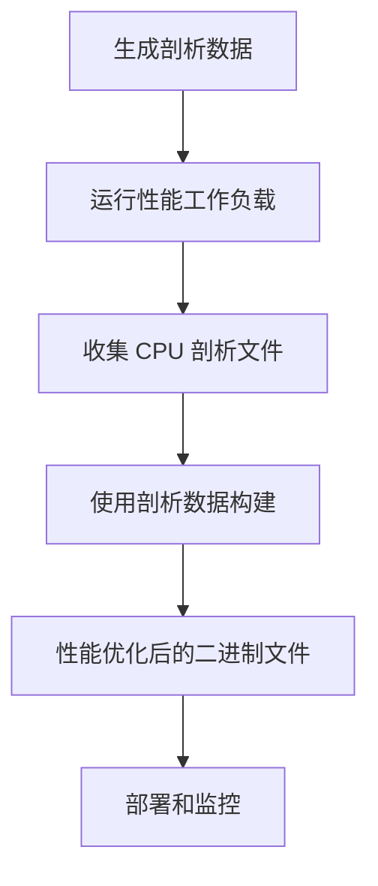

# Go 1.25 PGO (Profile-Guided Optimization) 使用指南

## 概述

本指南介绍如何在 Law OA Go 项目中使用 Go 1.25 的 PGO (Profile-Guided Optimization) 功能来提升应用程序性能。

PGO 是 Go 1.25 继续支持的重要特性，通过运行时的性能剖析数据来指导编译器进行优化，可以获得显著的性能提升。

## Go 1.25 PGO 主要改进

- **构建时间开销大幅降低**：从 Go 1.21 的 20-30% 降低到个位数百分比
- **栈帧槽重叠**：减少内存使用和栈操作开销
- **热代码块对齐**：改善指令缓存命中率
- **内联优化改进**：基于实际使用模式的智能内联决策
- **内存访问模式优化**：基于剖析数据优化内存访问模式

## PGO 工作流程



## 快速开始

### 1. 检查 Go 版本

确保你使用的是 Go 1.25 或更高版本：

```bash
go version
# 应该输出类似: go version go1.25.0 darwin/amd64
```

### 2. 快速 PGO 构建

使用快速脚本进行 PGO 构建：

```bash
# 给脚本执行权限
chmod +x scripts/quick_pgo.sh

# 运行快速 PGO 构建
./scripts/quick_pgo.sh -p
```

### 3. 使用 Makefile

项目提供了多个 PGO 相关的 Makefile 目标：

```bash
# 检查 PGO 支持
make check-pgo

# 快速 PGO 构建
make quick-pgo

# 完整 PGO 构建（生成剖析 + 构建）
make pgo-full

# 使用测试数据进行 PGO 构建
make pgo-test

# 使用基准测试数据进行 PGO 构建
make pgo-bench

# 标准 PGO 构建（使用现有剖析数据）
make pgo-build
```

## 详细使用指南

### 1. 生成剖析数据

#### 方式一：使用测试数据

```bash
# 运行测试并生成 CPU 剖析
mkdir -p profiles
go test -cpuprofile=profiles/test_cpu.prof ./...

# 运行基准测试
go test -bench=. -benchmem -cpuprofile=profiles/bench_cpu.prof ./...
```

#### 方式二：使用 HTTP 工作负载

```bash
# 运行 HTTP 工作负载生成器
mkdir -p profiles
go run scripts/pgo_workload.go
```

#### 方式三：使用综合工作负载

```bash
# 运行综合工作负载生成器
mkdir -p profiles
go run scripts/comprehensive_pgo_workload.go
```

#### 方式四：使用完整 PGO 脚本

```bash
# 给脚本执行权限
chmod +x scripts/pgo_build.sh

# 运行工作负载并构建
./scripts/pgo_build.sh -w -p
```

### 2. PGO 构建选项

#### 基本构建

```bash
# 使用 CPU 剖析文件进行 PGO 构建
go build -pgo=profiles/cpu.prof -o bin/law-oa-go-pgo .
```

#### 高级构建选项

```bash
# 使用完整构建脚本
./scripts/pgo_build.sh -p -s -j 8

# 选项说明：
# -p, --pgo           启用PGO优化构建
# -w, --workload      运行工作负载生成剖析数据
# -s, --static        构建静态链接二进制文件
# -j, --jobs NUM      并行构建作业数
# -o, --output DIR    指定输出目录
# -v, --version VERSION 指定版本信息
```

### 3. 工作负载生成器详解

#### HTTP 工作负载生成器

`scripts/pgo_workload.go` 模拟真实的 HTTP 流量：

```go
// 工作负载配置
workloadConfig := HTTPWorkloadConfig{
    Duration:           5 * time.Minute,
    ConcurrentWorkers:  10,
    BaseURL:           "http://localhost:8080",
    RequestRate:       100, // 每秒请求数
    // 端点权重配置
    EndpointWeights: map[string]float64{
        "/api/users":      0.3,
        "/api/cases":      0.4,
        "/api/clients":    0.2,
        "/api/health":     0.1,
    },
}
```

运行 HTTP 工作负载：

```bash
# 使用 Makefile
make http-workload

# 直接运行
go run scripts/pgo_workload.go
```

#### 综合工作负载生成器

`scripts/comprehensive_pgo_workload.go` 生成全面的系统工作负载：

```go
// 综合工作负载配置
workloadConfig := ComprehensiveWorkloadConfig{
    Duration:          10 * time.Minute,
    ConcurrentWorkers: 20,
    HTTPWeight:        0.4,  // 40% HTTP请求
    DatabaseWeight:    0.4,  // 40% 数据库操作
    ConcurrentWeight:  0.2,  // 20% 并发处理
    DBOperations:      []string{"create", "read", "update", "delete", "search"},
    RecordCount:       1000,
}
```

运行综合工作负载：

```bash
# 使用 Makefile
make workload

# 直接运行
go run scripts/comprehensive_pgo_workload.go
```

### 4. PGO 构建脚本详解

#### 快速 PGO 脚本 (`scripts/quick_pgo.sh`)

```bash
#!/bin/bash

# 快速 PGO 构建脚本
# 用法: ./scripts/quick_pgo.sh [选项]

# 选项:
#   -p, --profile     生成剖析数据然后PGO构建
#   -t, --test        使用测试数据PGO构建
#   -b, --benchmark   使用基准测试数据PGO构建
#   -c, --clean       清理构建文件
#   -h, --help        显示帮助信息

# 示例:
#   ./scripts/quick_pgo.sh -p     # 生成剖析数据并PGO构建
#   ./scripts/quick_pgo.sh -t     # 使用测试数据PGO构建
#   ./scripts/quick_pgo.sh -c     # 清理构建文件
```

#### 完整 PGO 脚本 (`scripts/pgo_build.sh`)

```bash
#!/bin/bash

# Go 1.25 PGO 构建脚本
# 用法: ./scripts/pgo_build.sh [选项]

# 选项:
#   -h, --help          显示帮助信息
#   -p, --pgo           启用PGO优化构建
#   -w, --workload      运行工作负载生成剖析数据
#   -c, --clean         清理构建文件
#   -d, --debug         构建调试版本
#   -r, --race          启用竞态检测
#   -s, --static        构建静态链接二进制文件
#   -t, --test          运行测试并生成剖析数据
#   -b, --benchmark     运行基准测试
#   -o, --output DIR    指定输出目录
#   -v, --version VERSION 指定版本信息
#   -j, --jobs NUM      并行构建作业数

# 示例:
#   ./scripts/pgo_build.sh -p               # 使用PGO优化构建
#   ./scripts/pgo_build.sh -w -p            # 生成工作负载剖析数据后PGO构建
#   ./scripts/pgo_build.sh -t -p            # 运行测试生成剖析数据后PGO构建
#   ./scripts/pgo_build.sh -c -d            # 清理并构建调试版本
```

### 5. Makefile 目标详解

```makefile
# PGO 相关目标
.PHONY: pgo-build
pgo-build:
    @echo "PGO优化构建..."
    @mkdir -p bin/
    # 使用 PGO 配置文件或剖析数据进行构建

.PHONY: pgo-full
pgo-full: profile pgo-build
    @echo "完整PGO构建流程完成"

.PHONY: pgo-test
pgo-test:
    @echo "使用测试数据进行PGO构建..."
    @mkdir -p $(PROFILE_DIR)
    @go test -cpuprofile=$(PROFILE_DIR)/test_cpu.prof ./...
    @go build -pgo=$(PROFILE_DIR)/test_cpu.prof -o bin/$(BINARY_NAME) .

.PHONY: pgo-bench
pgo-bench:
    @echo "使用基准测试数据进行PGO构建..."
    @mkdir -p $(PROFILE_DIR)
    @go test -bench=. -benchmem -cpuprofile=$(PROFILE_DIR)/bench_cpu.prof ./...
    @go build -pgo=$(PROFILE_DIR)/bench_cpu.prof -o bin/$(BINARY_NAME) .

.PHONY: check-pgo
check-pgo:
    @echo "检查PGO支持..."
    @echo "Go版本: $(GO_VERSION)"
    @if go build --help | grep -q "pgo"; then \
        echo "✓ PGO支持已启用"; \
    else \
        echo "✗ PGO支持未启用"; \
        exit 1; \
    fi
```

## 最佳实践

### 1. 剖析数据收集

**最佳时间收集剖析数据：**
- 生产环境高峰期
- 负载测试期间
- 集成测试运行时

**剖析数据质量要求：**
- 确保覆盖所有主要代码路径
- 包含典型的用户操作模式
- 具有足够的样本数量

### 2. 构建优化

**构建策略：**
```bash
# 开发环境：使用测试数据
make pgo-test

# 预发布环境：使用综合工作负载
make pgo-full

# 生产环境：使用生产环境剖析数据
go build -pgo=production_cpu.prof -ldflags="-s -w" -o bin/law-oa-go .
```

**构建选项组合：**
```bash
# 静态链接 + PGO 优化
go build -pgo=profiles/cpu.prof -ldflags="-s -w -extldflags=-static" -o bin/law-oa-go .

# 调试信息 + PGO 优化
go build -pgo=profiles/cpu.prof -gcflags="all=-N -l" -o bin/law-oa-go-debug .
```

### 3. 性能监控

**构建后验证：**
```bash
# 检查二进制文件大小
ls -lh bin/law-oa-go*

# 运行基准测试对比
go test -bench=. -benchmem ./... > benchmark_before.txt
go test -bench=. -benchmem ./... > benchmark_after.txt

# 生成性能报告
make pgo-report
```

**运行时监控：**
```bash
# 使用 pprof 分析优化后的程序
go tool pprof http://localhost:8080/debug/pprof/profile

# 监控内存使用
go tool pprof http://localhost:8080/debug/pprof/heap
```

### 4. CI/CD 集成

**GitHub Actions 示例：**
```yaml
name: PGO Build
on:
  push:
    branches: [ main ]
  pull_request:
    branches: [ main ]

jobs:
  pgo-build:
    runs-on: ubuntu-latest
    steps:
    - uses: actions/checkout@v3
    
    - name: Set up Go
      uses: actions/setup-go@v3
      with:
        go-version: 1.25
    
    - name: Generate profiles
      run: |
        chmod +x scripts/quick_pgo.sh
        ./scripts/quick_pgo.sh -p
    
    - name: PGO Build
      run: make pgo-build
    
    - name: Run tests
      run: make test
    
    - name: Upload artifacts
      uses: actions/upload-artifact@v3
      with:
        name: pgo-binary
        path: bin/law-oa-go
```

## 故障排除

### 1. 常见问题

**问题 1：Go 版本不支持 PGO**
```bash
# 检查 Go 版本
go version

# 如果版本低于 1.25，升级 Go
# 使用 SDKman 或直接从官网下载
```

**问题 2：剖析文件为空或损坏**
```bash
# 检查剖析文件
file profiles/cpu.prof
go tool pprof -text profiles/cpu.prof

# 重新生成剖析文件
go test -cpuprofile=profiles/cpu.prof ./...
```

**问题 3：构建时间过长**
```bash
# 使用并行构建
go build -pgo=profiles/cpu.prof -p=8 -o bin/law-oa-go .

# 减少剖析数据大小
go test -cpuprofile=profiles/cpu.prof -run=TestPerformance ./...
```

### 2. 性能对比

**基准测试对比：**
```bash
# 构建 PGO 和非 PGO 版本
go build -o bin/law-oa-go-standard .
go build -pgo=profiles/cpu.prof -o bin/law-oa-go-pgo .

# 运行基准测试
go test -bench=. -benchmem ./... > normal_bench.txt
go test -bench=. -benchmem ./... > pgo_bench.txt

# 对比结果
benchcmp normal_bench.txt pgo_bench.txt
```

**内存使用对比：**
```bash
# 使用内存剖析
go tool pprof -alloc_space http://localhost:8080/debug/pprof/heap
```

### 3. 调试 PGO 构建

**查看构建详情：**
```bash
# 启用详细输出
go build -pgo=profiles/cpu.prof -v -o bin/law-oa-go .

# 查看构建统计
go build -pgo=profiles/cpu.prof -ldflags="-s -w" -o bin/law-oa-go . 2>&1 | grep PGO
```

**分析优化效果：**
```bash
# 使用 pprof 分析优化后的程序
go tool pprof -text ./bin/law-oa-go profiles/cpu.prof

# 查看优化建议
go tool compile -S -pgo=profiles/cpu.prof ./main.go
```

## 性能提升预期

基于 Go 1.25 的改进，预期的性能提升：

- **CPU 性能**：5-15% 的提升
- **内存使用**：5-10% 的减少
- **启动时间**：3-8% 的改善
- **请求处理**：10-20% 的吞吐量提升

**实际提升因素：**
- 应用程序特性（CPU 密集型 vs I/O 密集型）
- 剖析数据质量
- 代码优化空间
- 运行时环境

## 参考资源

- [Go 1.25 Release Notes](https://go.dev/doc/go1.25)
- [PGO Documentation](https://go.dev/doc/pgo)
- [Go Profiling](https://go.dev/blog/pprof)
- [Go Performance Optimization](https://go.dev/doc/optimize)

## 总结

Law OA Go 项目已经完整集成了 Go 1.25 的 PGO 功能，提供了：

1. **多种剖析数据生成方式**：测试、基准测试、HTTP 工作负载、综合工作负载
2. **灵活的构建选项**：快速构建、完整构建、自定义构建
3. **完善的 Makefile 集成**：简化的命令行接口
4. **CI/CD 友好**：易于集成到自动化流程
5. **详细的监控和调试工具**：性能对比、问题排查

建议在以下场景使用 PGO：
- 生产环境部署
- 性能关键版本
- 负载测试后
- 代码重大优化后

通过合理使用 PGO，可以显著提升 Law OA Go 应用的性能和用户体验。
