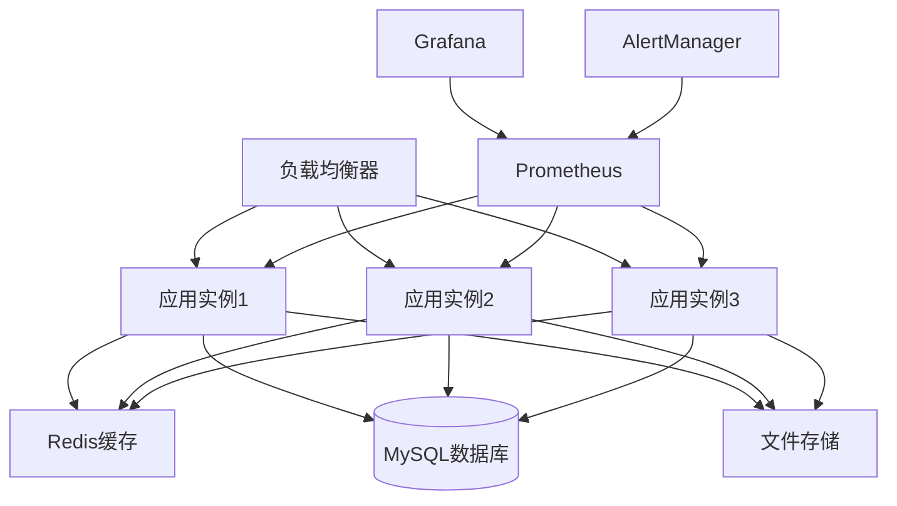

# Law OA Go 部署指南

**版本**: v2.1.0
**更新日期**: 2025-09-30
**适用环境**: 生产环境、测试环境、开发环境

---

## 📋 概述

本文档提供了Law OA Go系统的完整部署指南，包括环境准备、依赖安装、配置管理、部署流程和运维监控。

---

## 🏗️ 系统架构

### 部署架构图



### 技术栈要求

- **应用服务**: Go 1.23+
- **数据库**: MySQL 8.0+ 或 PostgreSQL 13+
- **缓存**: Redis 6.0+
- **代理**: Nginx 1.20+
- **监控**: Prometheus + Grafana
- **容器**: Docker 20.10+ / Docker Compose 2.0+

---

## 🔧 环境准备

### 系统要求

#### 最低配置
- **CPU**: 2核心
- **内存**: 4GB
- **存储**: 50GB SSD
- **网络**: 100Mbps

#### 推荐配置
- **CPU**: 4核心
- **内存**: 8GB
- **存储**: 100GB SSD
- **网络**: 1Gbps

#### 生产环境配置
- **CPU**: 8核心
- **内存**: 16GB
- **存储**: 200GB SSD
- **网络**: 10Gbps

### 操作系统

支持以下操作系统：
- **Ubuntu**: 20.04 LTS / 22.04 LTS
- **CentOS**: 8.x / 9.x
- **RHEL**: 8.x / 9.x
- **Debian**: 11 / 12

---

## 📦 依赖安装

### Go环境安装

```bash
# 下载Go 1.23
wget https://go.dev/dl/go1.23.0.linux-amd64.tar.gz

# 解压安装
sudo tar -C /usr/local -xzf go1.23.0.linux-amd64.tar.gz

# 配置环境变量
echo 'export PATH=$PATH:/usr/local/go/bin' >> ~/.bashrc
echo 'export GOPATH=$HOME/go' >> ~/.bashrc
echo 'export PATH=$PATH:$GOPATH/bin' >> ~/.bashrc
source ~/.bashrc

# 验证安装
go version
```

### 数据库安装

#### MySQL 8.0

```bash
# Ubuntu/Debian
sudo apt update
sudo apt install -y mysql-server mysql-client

# CentOS/RHEL
sudo yum install -y mysql-server mysql-client

# 启动服务
sudo systemctl start mysql
sudo systemctl enable mysql

# 安全配置
sudo mysql_secure_installation

# 创建数据库
mysql -u root -p
CREATE DATABASE law_oa CHARACTER SET utf8mb4 COLLATE utf8mb4_unicode_ci;
CREATE USER 'law_oa'@'%' IDENTIFIED BY 'strong_password';
GRANT ALL PRIVILEGES ON law_oa.* TO 'law_oa'@'%';
FLUSH PRIVILEGES;
```

#### Redis安装

```bash
# Ubuntu/Debian
sudo apt install -y redis-server

# CentOS/RHEL
sudo yum install -y redis

# 启动服务
sudo systemctl start redis
sudo systemctl enable redis

# 配置Redis
sudo nano /etc/redis/redis.conf
# 修改以下配置
maxmemory 256mb
maxmemory-policy allkeys-lru
save 900 1
save 300 10
save 60 10000
```

### Nginx安装

```bash
# Ubuntu/Debian
sudo apt install -y nginx

# CentOS/RHEL
sudo yum install -y nginx

# 启动服务
sudo systemctl start nginx
sudo systemctl enable nginx
```

---

## ⚙️ 应用配置

### 1. 克隆代码

```bash
# 克隆项目
git clone https://github.com/your-org/law-oa-go.git
cd law-oa-go

# 切换到稳定版本
git checkout v2.1.0
```

### 2. 配置文件

创建生产环境配置文件：

```yaml
# config/production.yaml
app:
  name: "Law OA Go"
  version: "2.1.0"
  env: "production"
  port: 8080
  debug: false

database:
  host: "localhost"
  port: 3306
  name: "law_oa"
  username: "law_oa"
  password: "strong_password"
  charset: "utf8mb4"
  parse_time: true
  loc: "Local"
  max_open_conns: 100
  max_idle_conns: 10
  conn_max_lifetime: "1h"
  conn_max_idle_time: "10m"

redis:
  host: "localhost"
  port: 6379
  password: ""
  db: 0
  pool_size: 10

jwt:
  secret: "your-super-secret-jwt-key-change-this-in-production"
  expiry: "24h"
  refresh_expiry: "168h"

logging:
  level: "info"
  format: "json"
  output: "stdout"
  file_path: "/var/log/law-oa/app.log"
  max_size: 100
  max_age: 30
  max_backups: 10

security:
  cors_origins:
    - "https://yourdomain.com"
  cors_methods:
    - "GET"
    - "POST"
    - "PUT"
    - "DELETE"
    - "OPTIONS"
  cors_headers:
    - "Content-Type"
    - "Authorization"
  rate_limit:
    rps: 100
    burst: 200

upload:
  max_size: 10485760  # 10MB
  allowed_types:
    - "image/jpeg"
    - "image/png"
    - "application/pdf"
    - "application/msword"
    - "application/vnd.openxmlformats-officedocument.wordprocessingml.document"
  storage_path: "/var/lib/law-oa/uploads"

monitoring:
  enabled: true
  prometheus:
    enabled: true
    path: "/metrics"
  health_check:
    enabled: true
    path: "/health"
  pprof:
    enabled: false
    path: "/debug/pprof"
```

### 3. 环境变量

```bash
# .env.production
APP_ENV=production
APP_PORT=8080

# 数据库配置
DB_HOST=localhost
DB_PORT=3306
DB_NAME=law_oa
DB_USER=law_oa
DB_PASSWORD=strong_password

# Redis配置
REDIS_HOST=localhost
REDIS_PORT=6379
REDIS_PASSWORD=

# JWT配置
JWT_SECRET=your-super-secret-jwt-key-change-this-in-production
JWT_EXPIRY=24h
JWT_REFRESH_EXPIRY=168h

# 日志配置
LOG_LEVEL=info
LOG_FORMAT=json
LOG_OUTPUT=file
LOG_FILE_PATH=/var/log/law-oa/app.log

# 安全配置
CORS_ORIGINS=https://yourdomain.com
RATE_LIMIT_RPS=100
RATE_LIMIT_BURST=200

# 文件上传配置
UPLOAD_MAX_SIZE=10485760
UPLOAD_STORAGE_PATH=/var/lib/law-oa/uploads

# 监控配置
MONITORING_ENABLED=true
PROMETHEUS_ENABLED=true
HEALTH_CHECK_ENABLED=true
```

---

## 🚀 部署流程

### 1. 构建应用

```bash
# 安装依赖
go mod download

# 运行测试
go test ./...

# 构建二进制文件
CGO_ENABLED=0 GOOS=linux GOARCH=amd64 go build \
    -ldflags="-w -s -X main.version=2.1.0 -X main.buildTime=$(date -u +%Y-%m-%dT%H:%M:%SZ)" \
    -o bin/law-oa-server cmd/server/main.go

# 验证构建
./bin/law-oa-server --version
```

### 2. 数据库迁移

```bash
# 运行数据库迁移
./bin/law-oa-server migrate up \
    --config config/production.yaml

# 或使用专门的迁移工具
./bin/law-oa-server migrate \
    --config config/production.yaml \
    --direction up
```

### 3. 创建系统服务

创建systemd服务文件：

```ini
# /etc/systemd/system/law-oa.service
[Unit]
Description=Law OA Go Server
After=network.target mysql.service redis.service
Wants=mysql.service redis.service

[Service]
Type=simple
User=law-oa
Group=law-oa
WorkingDirectory=/opt/law-oa
ExecStart=/opt/law-oa/bin/law-oa-server --config config/production.yaml
ExecReload=/bin/kill -HUP $MAINPID
Restart=always
RestartSec=5
StandardOutput=journal
StandardError=journal
SyslogIdentifier=law-oa

# 环境变量
Environment=APP_ENV=production
EnvironmentFile=/opt/law-oa/.env.production

# 安全设置
NoNewPrivileges=true
PrivateTmp=true
ProtectSystem=strict
ProtectHome=true
ReadWritePaths=/var/lib/law-oa /var/log/law-oa /var/tmp

[Install]
WantedBy=multi-user.target
```

创建用户和目录：

```bash
# 创建用户
sudo useradd -r -s /bin/false law-oa

# 创建目录结构
sudo mkdir -p /opt/law-oa/{bin,config,logs,uploads}
sudo mkdir -p /var/lib/law-oa/uploads
sudo mkdir -p /var/log/law-oa

# 复制文件
sudo cp bin/law-oa-server /opt/law-oa/bin/
sudo cp config/production.yaml /opt/law-oa/config/
sudo cp .env.production /opt/law-oa/

# 设置权限
sudo chown -R law-oa:law-oa /opt/law-oa
sudo chown -R law-oa:law-oa /var/lib/law-oa
sudo chown -R law-oa:law-oa /var/log/law-oa
sudo chmod +x /opt/law-oa/bin/law-oa-server
```

启动服务：

```bash
# 重新加载systemd
sudo systemctl daemon-reload

# 启动服务
sudo systemctl start law-oa
sudo systemctl enable law-oa

# 检查状态
sudo systemctl status law-oa
```

### 4. Nginx配置

```nginx
# /etc/nginx/sites-available/law-oa
server {
    listen 80;
    server_name yourdomain.com www.yourdomain.com;
    return 301 https://$server_name$request_uri;
}

server {
    listen 443 ssl http2;
    server_name yourdomain.com www.yourdomain.com;

    # SSL配置
    ssl_certificate /etc/ssl/certs/yourdomain.com.crt;
    ssl_certificate_key /etc/ssl/private/yourdomain.com.key;
    ssl_protocols TLSv1.2 TLSv1.3;
    ssl_ciphers ECDHE-RSA-AES256-GCM-SHA512:DHE-RSA-AES256-GCM-SHA512:ECDHE-RSA-AES256-GCM-SHA384:DHE-RSA-AES256-GCM-SHA384;
    ssl_prefer_server_ciphers off;
    ssl_session_cache shared:SSL:10m;
    ssl_session_timeout 10m;

    # 安全头
    add_header X-Frame-Options DENY;
    add_header X-Content-Type-Options nosniff;
    add_header X-XSS-Protection "1; mode=block";
    add_header Strict-Transport-Security "max-age=31536000; includeSubDomains" always;

    # 日志
    access_log /var/log/nginx/law-oa-access.log;
    error_log /var/log/nginx/law-oa-error.log;

    # 限制请求大小
    client_max_body_size 10M;

    # 上游服务器
    upstream law_oa_backend {
        least_conn;
        server 127.0.0.1:8080 max_fails=3 fail_timeout=30s;
        # 如果有多个实例，添加更多服务器
        # server 127.0.0.1:8081 max_fails=3 fail_timeout=30s;
        # server 127.0.0.1:8082 max_fails=3 fail_timeout=30s;
    }

    # API代理
    location /api/ {
        proxy_pass http://law_oa_backend;
        proxy_set_header Host $host;
        proxy_set_header X-Real-IP $remote_addr;
        proxy_set_header X-Forwarded-For $proxy_add_x_forwarded_for;
        proxy_set_header X-Forwarded-Proto $scheme;
        proxy_set_header X-Forwarded-Host $host;
        proxy_set_header X-Forwarded-Port $server_port;

        # 超时设置
        proxy_connect_timeout 30s;
        proxy_send_timeout 30s;
        proxy_read_timeout 30s;

        # 缓冲设置
        proxy_buffering on;
        proxy_buffer_size 4k;
        proxy_buffers 8 4k;
        proxy_busy_buffers_size 8k;
    }

    # 健康检查
    location /health {
        proxy_pass http://law_oa_backend;
        access_log off;
    }

    # 静态文件
    location /uploads/ {
        alias /var/lib/law-oa/uploads/;
        expires 1y;
        add_header Cache-Control "public, immutable";
        add_header X-Content-Type-Options nosniff;
    }

    # 禁止访问敏感文件
    location ~ /\. {
        deny all;
        access_log off;
        log_not_found off;
    }

    location ~ \.(env|log|conf)$ {
        deny all;
        access_log off;
        log_not_found off;
    }
}
```

启用站点：

```bash
# 创建软链接
sudo ln -s /etc/nginx/sites-available/law-oa /etc/nginx/sites-enabled/

# 测试配置
sudo nginx -t

# 重新加载配置
sudo systemctl reload nginx
```

---

## 🐳 Docker部署

### 1. Dockerfile

```dockerfile
# 多阶段构建
FROM golang:1.23-alpine AS builder

# 设置工作目录
WORKDIR /app

# 安装依赖
RUN apk add --no-cache git ca-certificates tzdata

# 复制go mod文件
COPY go.mod go.sum ./

# 下载依赖
RUN go mod download

# 复制源代码
COPY . .

# 构建应用
RUN CGO_ENABLED=0 GOOS=linux GOARCH=amd64 go build \
    -ldflags="-w -s -X main.version=2.1.0 -X main.buildTime=$(date -u +%Y-%m-%dT%H:%M:%SZ)" \
    -o law-oa-server cmd/server/main.go

# 运行阶段
FROM alpine:latest

# 安装必要的包
RUN apk --no-cache add ca-certificates tzdata

# 创建用户
RUN addgroup -g 1001 -S law-oa && \
    adduser -u 1001 -S law-oa -G law-oa

# 设置工作目录
WORKDIR /app

# 复制二进制文件
COPY --from=builder /app/law-oa-server .

# 复制配置文件
COPY --from=builder /app/config/production.yaml ./config/

# 创建必要的目录
RUN mkdir -p logs uploads && \
    chown -R law-oa:law-oa /app

# 切换用户
USER law-oa

# 暴露端口
EXPOSE 8080

# 健康检查
HEALTHCHECK --interval=30s --timeout=10s --start-period=60s --retries=3 \
    CMD wget --no-verbose --tries=1 --spider http://localhost:8080/health || exit 1

# 启动应用
CMD ["./law-oa-server", "--config", "config/production.yaml"]
```

### 2. Docker Compose

```yaml
# docker-compose.yml
version: '3.8'

services:
  app:
    build: .
    ports:
      - "8080:8080"
    environment:
      - APP_ENV=production
      - DB_HOST=mysql
      - REDIS_HOST=redis
    depends_on:
      mysql:
        condition: service_healthy
      redis:
        condition: service_healthy
    volumes:
      - uploads:/app/uploads
      - logs:/app/logs
    restart: unless-stopped
    networks:
      - law-oa-network

  mysql:
    image: mysql:8.0
    environment:
      - MYSQL_ROOT_PASSWORD=rootpassword
      - MYSQL_DATABASE=law_oa
      - MYSQL_USER=law_oa
      - MYSQL_PASSWORD=law_oa_password
    ports:
      - "3306:3306"
    volumes:
      - mysql_data:/var/lib/mysql
      - ./migrations:/docker-entrypoint-initdb.d
    restart: unless-stopped
    networks:
      - law-oa-network
    healthcheck:
      test: ["CMD", "mysqladmin", "ping", "-h", "localhost"]
      timeout: 20s
      retries: 10

  redis:
    image: redis:7-alpine
    ports:
      - "6379:6379"
    volumes:
      - redis_data:/data
      - ./redis.conf:/usr/local/etc/redis/redis.conf
    command: redis-server /usr/local/etc/redis/redis.conf
    restart: unless-stopped
    networks:
      - law-oa-network
    healthcheck:
      test: ["CMD", "redis-cli", "ping"]
      timeout: 10s
      retries: 5

  nginx:
    image: nginx:alpine
    ports:
      - "80:80"
      - "443:443"
    volumes:
      - ./nginx/nginx.conf:/etc/nginx/nginx.conf
      - ./nginx/ssl:/etc/ssl/certs
      - uploads:/var/lib/law-oa/uploads
    depends_on:
      - app
    restart: unless-stopped
    networks:
      - law-oa-network

  prometheus:
    image: prom/prometheus:latest
    ports:
      - "9090:9090"
    volumes:
      - ./monitoring/prometheus.yml:/etc/prometheus/prometheus.yml
      - prometheus_data:/prometheus
    command:
      - '--config.file=/etc/prometheus/prometheus.yml'
      - '--storage.tsdb.path=/prometheus'
      - '--web.console.libraries=/etc/prometheus/console_libraries'
      - '--web.console.templates=/etc/prometheus/consoles'
      - '--storage.tsdb.retention.time=200h'
      - '--web.enable-lifecycle'
    restart: unless-stopped
    networks:
      - law-oa-network

  grafana:
    image: grafana/grafana:latest
    ports:
      - "3000:3000"
    environment:
      - GF_SECURITY_ADMIN_PASSWORD=admin
    volumes:
      - grafana_data:/var/lib/grafana
      - ./monitoring/grafana:/etc/grafana/provisioning
    restart: unless-stopped
    networks:
      - law-oa-network

volumes:
  mysql_data:
  redis_data:
  uploads:
  logs:
  prometheus_data:
  grafana_data:

networks:
  law-oa-network:
    driver: bridge
```

### 3. 部署命令

```bash
# 构建和启动所有服务
docker-compose up -d

# 查看服务状态
docker-compose ps

# 查看日志
docker-compose logs -f app

# 停止服务
docker-compose down

# 重启特定服务
docker-compose restart app
```

---

## 📊 监控和日志

### 1. Prometheus配置

```yaml
# monitoring/prometheus.yml
global:
  scrape_interval: 15s
  evaluation_interval: 15s

rule_files:
  - "rules/*.yml"

scrape_configs:
  - job_name: 'law-oa-app'
    static_configs:
      - targets: ['app:8080']
    metrics_path: '/metrics'
    scrape_interval: 15s

  - job_name: 'nginx'
    static_configs:
      - targets: ['nginx:9113']

  - job_name: 'mysql'
    static_configs:
      - targets: ['mysql-exporter:9104']

  - job_name: 'redis'
    static_configs:
      - targets: ['redis-exporter:9121']

alerting:
  alertmanagers:
    - static_configs:
        - targets:
          - alertmanager:9093
```

### 2. 告警规则

```yaml
# monitoring/rules/alerts.yml
groups:
  - name: law-oa-alerts
    rules:
      - alert: ServiceDown
        expr: up == 0
        for: 1m
        labels:
          severity: critical
        annotations:
          summary: "Service {{ $labels.job }} is down"
          description: "Service {{ $labels.job }} has been down for more than 1 minute."

      - alert: HighErrorRate
        expr: rate(http_requests_total{status=~"5.."}[5m]) > 0.1
        for: 5m
        labels:
          severity: warning
        annotations:
          summary: "High error rate detected"
          description: "Error rate is {{ $value }} errors per second."

      - alert: HighResponseTime
        expr: histogram_quantile(0.95, rate(http_request_duration_seconds_bucket[5m])) > 1
        for: 5m
        labels:
          severity: warning
        annotations:
          summary: "High response time detected"
          description: "95th percentile response time is {{ $value }} seconds."

      - alert: DatabaseConnectionsHigh
        expr: mysql_global_status_threads_connected / mysql_global_variables_max_connections > 0.8
        for: 5m
        labels:
          severity: warning
        annotations:
          summary: "Database connections high"
          description: "Database connection usage is {{ $value | humanizePercentage }}."
```

---

## 🔒 安全配置

### 1. 防火墙设置

```bash
# Ubuntu/Debian (UFW)
sudo ufw enable
sudo ufw allow ssh
sudo ufw allow 80/tcp
sudo ufw allow 443/tcp
sudo ufw deny 3306/tcp  # 禁止外部访问数据库
sudo ufw deny 6379/tcp  # 禁止外部访问Redis

# CentOS/RHEL (firewalld)
sudo firewall-cmd --permanent --add-service=ssh
sudo firewall-cmd --permanent --add-service=http
sudo firewall-cmd --permanent --add-service=https
sudo firewall-cmd --reload
```

### 2. SSL证书配置

```bash
# 使用Let's Encrypt
sudo apt install certbot python3-certbot-nginx

# 获取证书
sudo certbot --nginx -d yourdomain.com -d www.yourdomain.com

# 自动续期
sudo crontab -e
# 添加以下行
0 12 * * * /usr/bin/certbot renew --quiet
```

### 3. 安全加固

```bash
# 禁用root SSH登录
sudo nano /etc/ssh/sshd_config
# PermitRootLogin no

# 配置fail2ban
sudo apt install fail2ban
sudo systemctl enable fail2ban
sudo systemctl start fail2ban

# 系统更新
sudo apt update && sudo apt upgrade -y
```

---

## 🔄 备份和恢复

### 1. 数据库备份

```bash
#!/bin/bash
# backup.sh

# 配置
BACKUP_DIR="/backup/mysql"
DATE=$(date +%Y%m%d_%H%M%S)
DB_NAME="law_oa"
DB_USER="law_oa"
DB_PASS="law_oa_password"

# 创建备份目录
mkdir -p $BACKUP_DIR

# 全量备份
mysqldump -u $DB_USER -p$DB_PASS \
    --single-transaction \
    --routines \
    --triggers \
    --all-databases > $BACKUP_DIR/full_backup_$DATE.sql

# 压缩备份
gzip $BACKUP_DIR/full_backup_$DATE.sql

# 删除7天前的备份
find $BACKUP_DIR -name "*.gz" -mtime +7 -delete

echo "Backup completed: $BACKUP_DIR/full_backup_$DATE.sql.gz"
```

### 2. 应用备份

```bash
#!/bin/bash
# app_backup.sh

BACKUP_DIR="/backup/app"
DATE=$(date +%Y%m%d_%H%M%S)
APP_DIR="/opt/law-oa"

# 创建备份目录
mkdir -p $BACKUP_DIR

# 备份应用文件
tar -czf $BACKUP_DIR/app_backup_$DATE.tar.gz \
    -C /opt law-oa \
    --exclude=law-oa/logs \
    --exclude=law-oa/uploads

# 备份配置文件
cp /etc/nginx/sites-available/law-oa $BACKUP_DIR/nginx_config_$DATE
cp /etc/systemd/system/law-oa.service $BACKUP_DIR/systemd_config_$DATE

echo "Application backup completed: $BACKUP_DIR/app_backup_$DATE.tar.gz"
```

### 3. 自动备份配置

```bash
# 添加到crontab
sudo crontab -e

# 每天凌晨2点进行数据库备份
0 2 * * * /opt/law-oa/scripts/backup.sh

# 每周日凌晨3点进行应用备份
0 3 * * 0 /opt/law-oa/scripts/app_backup.sh
```

---

## 🔧 故障排除

### 常见问题

#### 1. 服务无法启动

```bash
# 查看服务状态
sudo systemctl status law-oa

# 查看日志
sudo journalctl -u law-oa -f

# 检查配置文件
sudo -u law-oa /opt/law-oa/bin/law-oa-server --config /opt/law-oa/config/production.yaml --check
```

#### 2. 数据库连接失败

```bash
# 检查数据库服务
sudo systemctl status mysql

# 测试连接
mysql -u law_oa -p -h localhost

# 检查网络
telnet localhost 3306
```

#### 3. Redis连接失败

```bash
# 检查Redis服务
sudo systemctl status redis

# 测试连接
redis-cli ping

# 检查配置
redis-cli config get "*"
```

#### 4. Nginx配置错误

```bash
# 测试配置
sudo nginx -t

# 查看错误日志
sudo tail -f /var/log/nginx/error.log

# 重新加载配置
sudo systemctl reload nginx
```

### 性能调优

#### 1. 数据库优化

```sql
-- 查看慢查询
SHOW VARIABLES LIKE 'slow_query_log';
SHOW VARIABLES LIKE 'long_query_time';

-- 分析查询性能
EXPLAIN SELECT * FROM cases WHERE status = 'active';

-- 优化配置
SET GLOBAL innodb_buffer_pool_size = 1G;
SET GLOBAL innodb_log_file_size = 256M;
SET GLOBAL max_connections = 200;
```

#### 2. Redis优化

```bash
# 查看Redis信息
redis-cli info memory
redis-cli info stats

# 优化配置
redis-cli config set maxmemory 256mb
redis-cli config set maxmemory-policy allkeys-lru
```

---

## 📞 技术支持

### 联系方式

- **技术支持**: support@law-oa.com
- **运维团队**: ops@law-oa.com
- **安全团队**: security@law-oa.com

### 紧急联系

- **24小时值班电话**: +86-xxx-xxxx-xxxx
- **紧急响应群**: 企业微信群

### 文档资源

- **API文档**: https://docs.law-oa.com/api
- **运维手册**: https://docs.law-oa.com/operations
- **故障处理**: https://docs.law-oa.com/troubleshooting

---

**文档版本**: v2.1.0
**最后更新**: 2025-09-30
**下次审查**: 2025-12-30
**维护团队**: DevOps团队